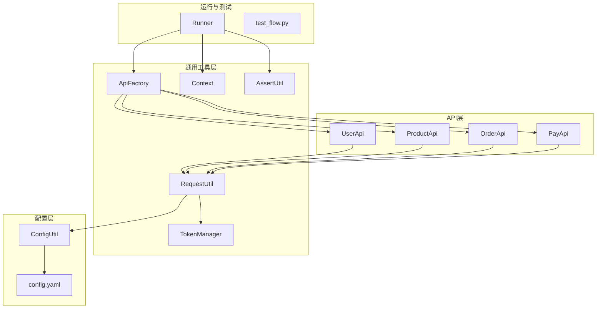
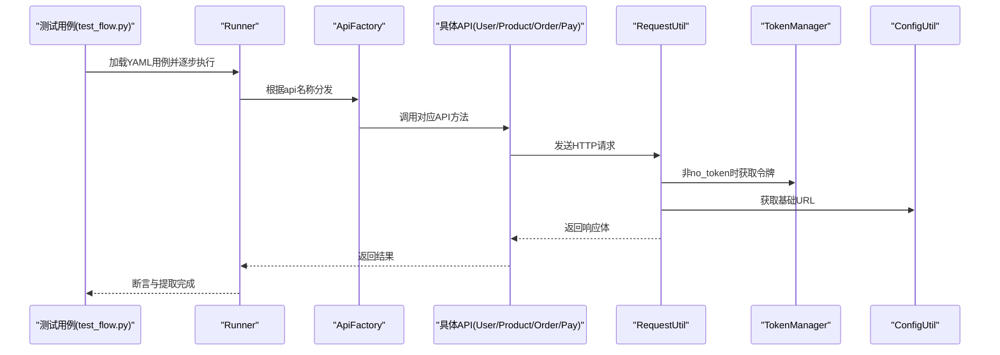
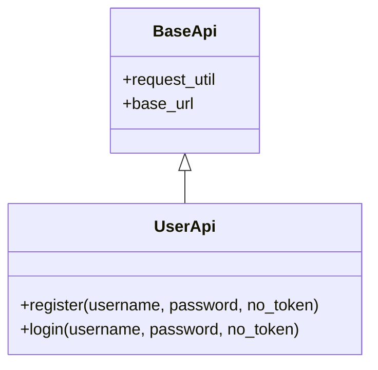
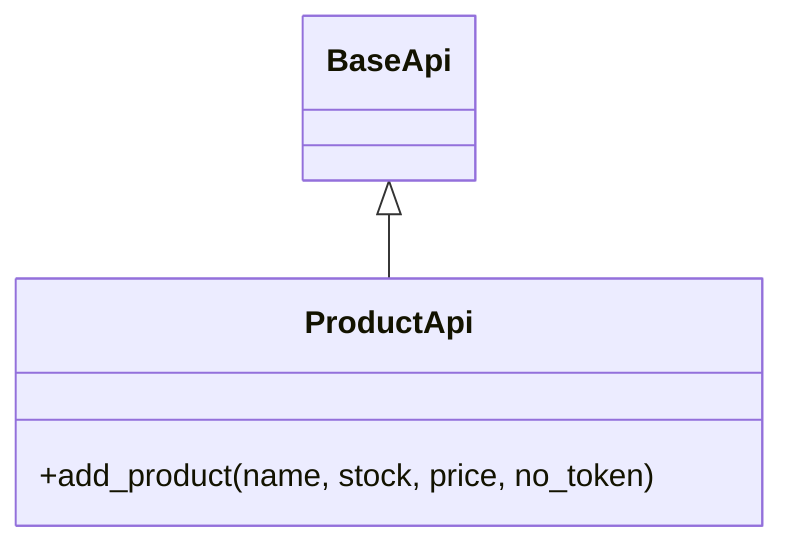
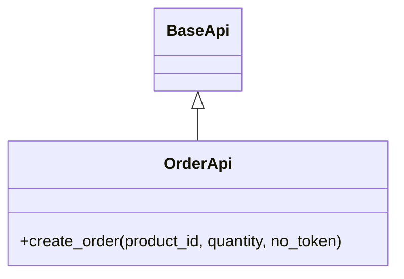
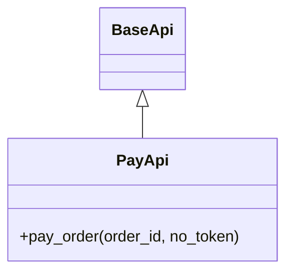
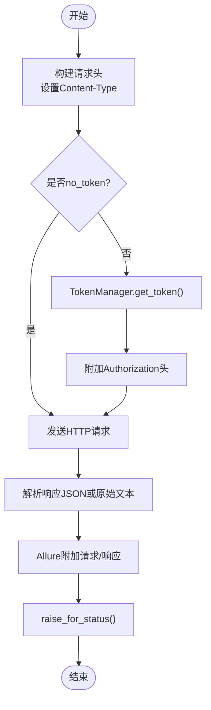
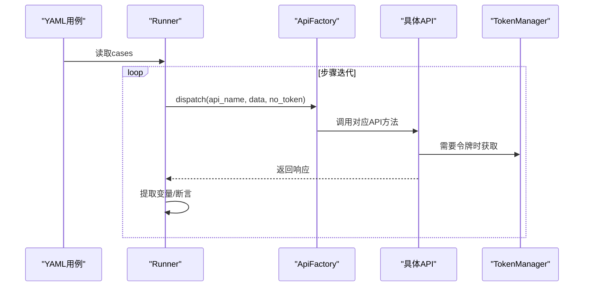
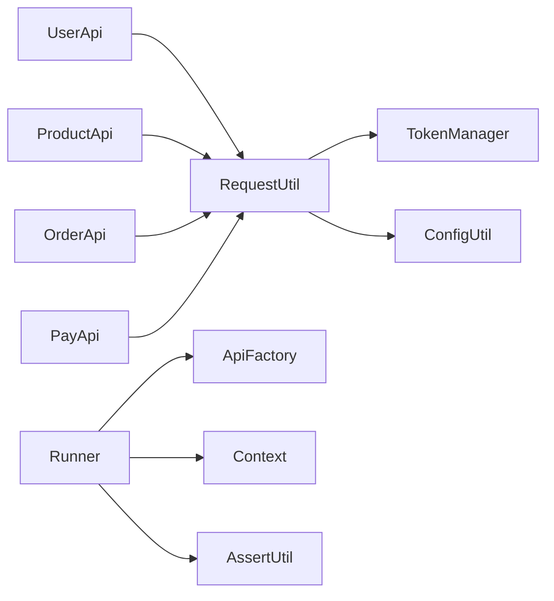

# API模块详解

<cite>
**本文引用的文件**
- [api/base_api.py](file://api/base_api.py)
- [api/user_api.py](file://api/user_api.py)
- [api/product_api.py](file://api/product_api.py)
- [api/order_api.py](file://api/order_api.py)
- [api/pay_api.py](file://api/pay_api.py)
- [common/request_util.py](file://common/request_util.py)
- [common/api_factory.py](file://common/api_factory.py)
- [common/auth.py](file://common/auth.py)
- [common/token_manager.py](file://common/token_manager.py)
- [common/runner.py](file://common/runner.py)
- [common/assert_util.py](file://common/assert_util.py)
- [common/context.py](file://common/context.py)
- [config/config_util.py](file://config/config_util.py)
- [config/config.yaml](file://config/config.yaml)
- [testcase/test_flow.py](file://testcase/test_flow.py)
- [requirements.txt](file://requirements.txt)
</cite>

## 目录
1. [简介](#简介)
2. [项目结构](#项目结构)
3. [核心组件](#核心组件)
4. [架构总览](#架构总览)
5. [详细组件分析](#详细组件分析)
6. [依赖关系分析](#依赖关系分析)
7. [性能考虑](#性能考虑)
8. [故障排查指南](#故障排查指南)
9. [结论](#结论)
10. [附录](#附录)

## 简介
本文件系统性梳理并说明本仓库中四个核心API模块：用户管理、商品管理、订单处理与支付处理。文档覆盖各模块的RESTful接口规范（HTTP方法、URL模式、请求/响应格式）、认证机制、参数校验、错误处理策略、模块间协作流程以及最佳实践。同时给出基于YAML驱动的端到端用例执行流程，帮助读者快速上手并正确使用。

## 项目结构
该工程采用按功能域分层的组织方式：
- api：封装各业务API的客户端调用类
- common：通用工具与运行框架（请求、断言、上下文、调度等）
- config：配置加载与环境变量覆盖
- testcase：基于YAML的端到端用例入口
- 其他：依赖声明、Mock服务、测试配置等

图表来源
- [api/user_api.py:8-22](file://api/user_api.py#L8-L22)
- [api/product_api.py:8-15](file://api/product_api.py#L8-L15)
- [api/order_api.py:8-15](file://api/order_api.py#L8-L15)
- [api/pay_api.py:8-15](file://api/pay_api.py#L8-L15)
- [common/request_util.py:13-65](file://common/request_util.py#L13-L65)
- [common/api_factory.py:12-27](file://common/api_factory.py#L12-L27)
- [common/token_manager.py:8-37](file://common/token_manager.py#L8-L37)
- [common/context.py:6-24](file://common/context.py#L6-L24)
- [common/assert_util.py:6-14](file://common/assert_util.py#L6-L14)
- [config/config_util.py:14-49](file://config/config_util.py#L14-L49)
- [config/config.yaml:1-10](file://config/config.yaml#L1-L10)
- [common/runner.py:15-44](file://common/runner.py#L15-L44)
- [testcase/test_flow.py:9-16](file://testcase/test_flow.py#L9-L16)

章节来源
- [api/base_api.py:7-11](file://api/base_api.py#L7-L11)
- [config/config.yaml:1-10](file://config/config.yaml#L1-L10)

## 核心组件
- BaseApi：统一注入请求工具与基础URL，为各业务API提供公共能力
- UserApi：注册、登录
- ProductApi：新增商品
- OrderApi：创建订单
- PayApi：支付订单
- RequestUtil：封装HTTP发送逻辑、鉴权头拼装、超时与Allure附件
- ApiFactory：API名称到实现函数的映射与分发
- TokenManager：线程安全的令牌缓存与自动拉取
- Runner：YAML用例执行引擎，支持提取、断言、上下文传递
- AssertUtil：递归断言子集匹配
- Context：键值对上下文存储
- ConfigUtil：配置加载、默认用户、数据库路径、基础URL覆盖

章节来源
- [api/base_api.py:7-11](file://api/base_api.py#L7-L11)
- [api/user_api.py:8-22](file://api/user_api.py#L8-L22)
- [api/product_api.py:8-15](file://api/product_api.py#L8-L15)
- [api/order_api.py:8-15](file://api/order_api.py#L8-L15)
- [api/pay_api.py:8-15](file://api/pay_api.py#L8-L15)
- [common/request_util.py:13-65](file://common/request_util.py#L13-L65)
- [common/api_factory.py:12-27](file://common/api_factory.py#L12-L27)
- [common/token_manager.py:8-37](file://common/token_manager.py#L8-L37)
- [common/runner.py:15-44](file://common/runner.py#L15-L44)
- [common/assert_util.py:6-14](file://common/assert_util.py#L6-L14)
- [common/context.py:6-24](file://common/context.py#L6-L24)
- [config/config_util.py:14-49](file://config/config_util.py#L14-L49)

## 架构总览
下图展示从用例到具体API调用的完整链路，以及认证与配置的关键交互点。

图表来源
- [testcase/test_flow.py:9-16](file://testcase/test_flow.py#L9-L16)
- [common/runner.py:15-44](file://common/runner.py#L15-L44)
- [common/api_factory.py:21-27](file://common/api_factory.py#L21-L27)
- [api/user_api.py:9-21](file://api/user_api.py#L9-L21)
- [api/product_api.py:9-14](file://api/product_api.py#L9-L14)
- [api/order_api.py:9-14](file://api/order_api.py#L9-L14)
- [api/pay_api.py:9-14](file://api/pay_api.py#L9-L14)
- [common/request_util.py:18-58](file://common/request_util.py#L18-L58)
- [common/token_manager.py:27-37](file://common/token_manager.py#L27-L37)
- [config/config_util.py:27-31](file://config/config_util.py#L27-L31)

## 详细组件分析

### 用户管理模块(UserApi)
- 功能概述
  - 注册：向后端提交用户名与密码，返回令牌或结果对象
  - 登录：凭凭据换取令牌
- 接口规范
  - 注册
    - 方法：POST
    - 路径：/api/register
    - 请求体字段：username, password
    - 认证：可通过no_token控制是否携带令牌
  - 登录
    - 方法：POST
    - 路径：/api/login
    - 请求体字段：username, password
    - 认证：可通过no_token控制是否携带令牌
- 使用建议
  - 首次使用建议no_token=True，避免未登录时携带无效令牌
  - 成功后可从响应中提取token并交由TokenManager缓存，后续调用自动带令牌
- 错误处理
  - 通过底层RequestUtil统一抛出HTTP状态异常
  - 建议在Runner中进行断言与提取，确保流程健壮

图表来源
- [api/base_api.py:7-11](file://api/base_api.py#L7-L11)
- [api/user_api.py:8-22](file://api/user_api.py#L8-L22)

章节来源
- [api/user_api.py:9-21](file://api/user_api.py#L9-L21)
- [common/request_util.py:18-58](file://common/request_util.py#L18-L58)
- [common/token_manager.py:27-37](file://common/token_manager.py#L27-L37)

### 商品管理模块(ProductApi)
- 功能概述
  - 新增商品：提交名称、库存与单价
- 接口规范
  - 新增商品
    - 方法：POST
    - 路径：/api/products
    - 请求体字段：name, stock, price
    - 认证：可通过no_token控制是否携带令牌
- 参数校验
  - 建议在上游校验类型与范围（如stock非负、price正数），并在Runner中断言关键字段存在
- 最佳实践
  - 若需要后续下单，建议记录返回的商品ID以便跨步骤引用

图表来源
- [api/base_api.py:7-11](file://api/base_api.py#L7-L11)
- [api/product_api.py:8-15](file://api/product_api.py#L8-L15)

章节来源
- [api/product_api.py:9-14](file://api/product_api.py#L9-L14)
- [common/request_util.py:18-58](file://common/request_util.py#L18-L58)

### 订单处理模块(OrderApi)
- 功能概述
  - 创建订单：指定商品ID与购买数量
- 接口规范
  - 创建订单
    - 方法：POST
    - 路径：/api/orders
    - 请求体字段：product_id, quantity
    - 认证：可通过no_token控制是否携带令牌
- 参数校验
  - 建议校验quantity为正整数；若商品不存在或库存不足，应由后端返回明确错误码
- 最佳实践
  - 在Runner中提取order_id并传入支付流程

图表来源
- [api/base_api.py:7-11](file://api/base_api.py#L7-L11)
- [api/order_api.py:8-15](file://api/order_api.py#L8-L15)

章节来源
- [api/order_api.py:9-14](file://api/order_api.py#L9-L14)
- [common/request_util.py:18-58](file://common/request_util.py#L18-L58)

### 支付处理模块(PayApi)
- 功能概述
  - 支付订单：提交待支付的订单ID
- 接口规范
  - 支付订单
    - 方法：POST
    - 路径：/api/pay
    - 请求体字段：order_id
    - 认证：可通过no_token控制是否携带令牌
- 参数校验
  - 建议校验order_id为正整数；若订单状态不允许支付，应由后端返回明确错误码
- 最佳实践
  - 在Runner中断言支付成功标志位或状态码

图表来源
- [api/base_api.py:7-11](file://api/base_api.py#L7-L11)
- [api/pay_api.py:8-15](file://api/pay_api.py#L8-L15)

章节来源
- [api/pay_api.py:9-14](file://api/pay_api.py#L9-L14)
- [common/request_util.py:18-58](file://common/request_util.py#L18-L58)

### 请求与认证机制(RequestUtil 与 TokenManager)
- 请求发送
  - 统一封装GET/POST与通用send方法
  - 自动拼接基础URL与Content-Type头
  - 可选no_token：为False时自动附加Authorization: Bearer <token>
  - 超时30秒，失败时抛出HTTP异常
  - 使用Allure附加请求与响应JSON
- 令牌管理
  - TokenManager线程安全缓存令牌
  - 支持注册登录回调以自动拉取最新令牌
  - 未注册回调且无缓存时抛出运行时错误
- 默认用户与配置
  - ConfigUtil提供默认用户名/密码与基础URL
  - 支持通过环境变量覆盖基础URL

图表来源
- [common/request_util.py:18-58](file://common/request_util.py#L18-L58)
- [common/token_manager.py:27-37](file://common/token_manager.py#L27-L37)
- [config/config_util.py:27-31](file://config/config_util.py#L27-L31)

章节来源
- [common/request_util.py:13-65](file://common/request_util.py#L13-L65)
- [common/token_manager.py:8-37](file://common/token_manager.py#L8-L37)
- [config/config_util.py:27-31](file://config/config_util.py#L27-L31)

### API分发与用例执行
- ApiFactory
  - 将字符串api名称映射到具体API方法
  - 支持user.register、user.login、product.add_product、order.create_order、pay.pay_order
- Runner
  - 解析YAML用例中的steps
  - 替换占位符、提取变量、设置TokenManager、断言结果
  - 通过dispatch调用具体API
- 测试入口
  - test_flow.py加载flow.yaml并逐条执行

图表来源
- [common/api_factory.py:12-27](file://common/api_factory.py#L12-L27)
- [common/runner.py:15-44](file://common/runner.py#L15-L44)
- [testcase/test_flow.py:9-16](file://testcase/test_flow.py#L9-L16)

章节来源
- [common/api_factory.py:12-27](file://common/api_factory.py#L12-L27)
- [common/runner.py:15-44](file://common/runner.py#L15-L44)
- [testcase/test_flow.py:9-16](file://testcase/test_flow.py#L9-L16)

## 依赖关系分析
- 模块内聚与耦合
  - 各API类仅依赖BaseApi与RequestUtil，内聚高、耦合低
  - RequestUtil依赖TokenManager与ConfigUtil，形成清晰的基础设施层
  - Runner依赖ApiFactory、Context、AssertUtil，作为编排层
- 外部依赖
  - requests、PyYAML、allure-pytest、pytest等

图表来源
- [api/user_api.py:8-22](file://api/user_api.py#L8-L22)
- [api/product_api.py:8-15](file://api/product_api.py#L8-L15)
- [api/order_api.py:8-15](file://api/order_api.py#L8-L15)
- [api/pay_api.py:8-15](file://api/pay_api.py#L8-L15)
- [common/request_util.py:9-16](file://common/request_util.py#L9-L16)
- [common/api_factory.py:5-8](file://common/api_factory.py#L5-L8)
- [common/runner.py:7-12](file://common/runner.py#L7-L12)

章节来源
- [requirements.txt:1-6](file://requirements.txt#L1-L6)

## 性能考虑
- 连接复用：RequestUtil使用requests.Session，减少TCP握手开销
- 超时控制：统一30秒超时，避免长时间阻塞
- 并发安全：TokenManager使用锁保护令牌缓存，适合多线程场景
- 日志与追踪：Allure附件便于定位问题，建议在CI中保留附件

## 故障排查指南
- 常见错误与定位
  - 4xx/5xx：查看Allure附件中的请求与响应，确认URL、头信息与请求体
  - 401/403：检查no_token参数与TokenManager是否已设置有效令牌
  - 未知API名称：检查YAML中api字段是否与ApiFactory注册项一致
  - 缺失键断言：使用AssertUtil的递归断言定位缺失字段
- 参数校验建议
  - 在Runner前置步骤中校验必填字段与类型
  - 对数值型字段设定合理边界（如quantity>0、price>0）

章节来源
- [common/request_util.py:40-58](file://common/request_util.py#L40-L58)
- [common/assert_util.py:6-14](file://common/assert_util.py#L6-L14)
- [common/api_factory.py:21-27](file://common/api_factory.py#L21-L27)

## 结论
本API模块以简洁的类层次与通用工具为基础，提供了清晰的RESTful接口抽象与稳定的执行框架。通过YAML驱动的用例体系，能够高效地串联用户、商品、订单与支付全流程。建议在实际落地中强化前置校验与断言策略，结合Allure与日志做好可观测性建设。

## 附录
- 配置项说明
  - base.url：后端基础URL，默认本地回环地址，可通过环境变量覆盖
  - database.path：数据库文件相对路径，绝对化处理
  - user.username/password：默认管理员账户，用于自动化登录
- 环境变量
  - API_BASE_URL：覆盖基础URL
- 依赖版本
  - pytest、requests、PyYAML、allure-pytest、Flask

章节来源
- [config/config_util.py:22-49](file://config/config_util.py#L22-L49)
- [config/config.yaml:1-10](file://config/config.yaml#L1-L10)
- [requirements.txt:1-6](file://requirements.txt#L1-L6)