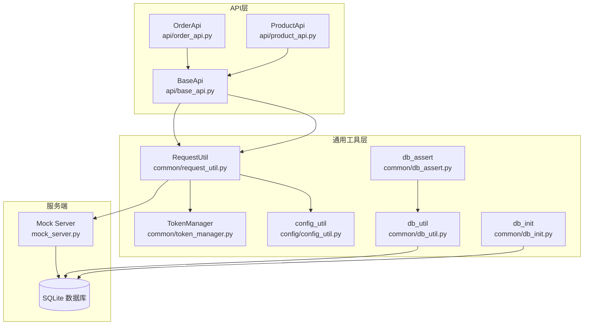
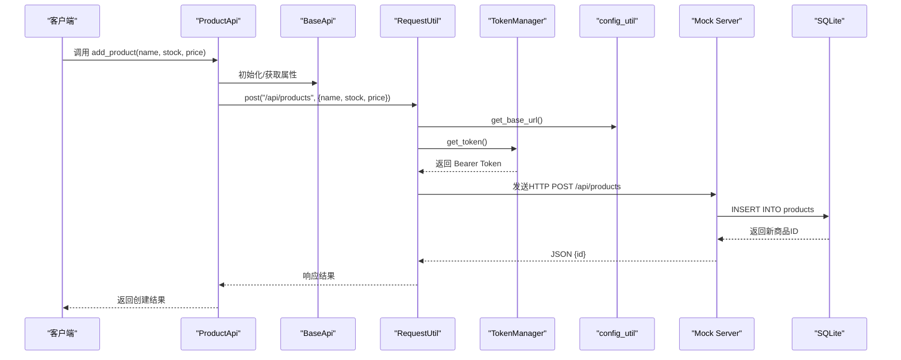
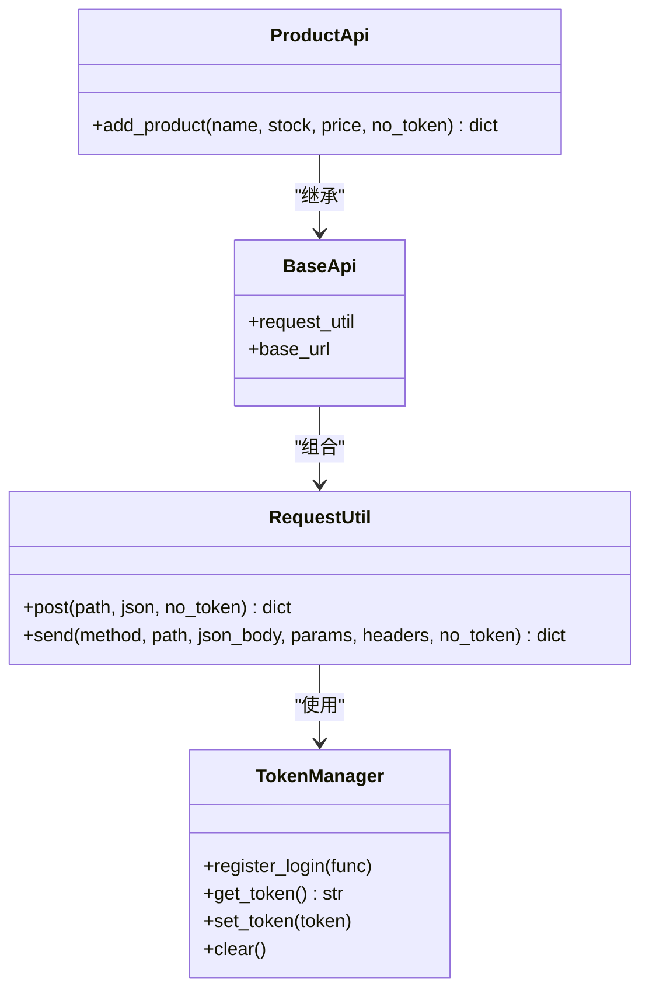
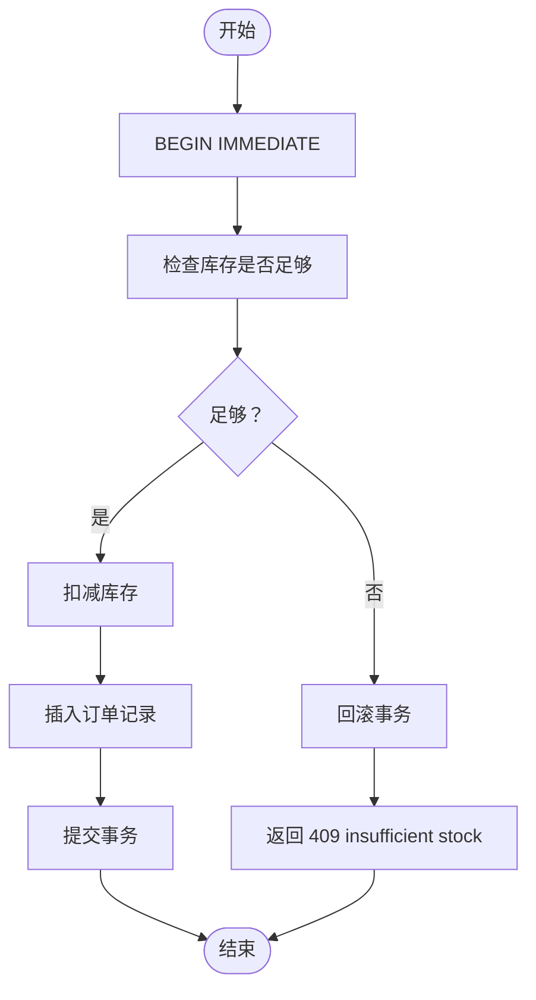
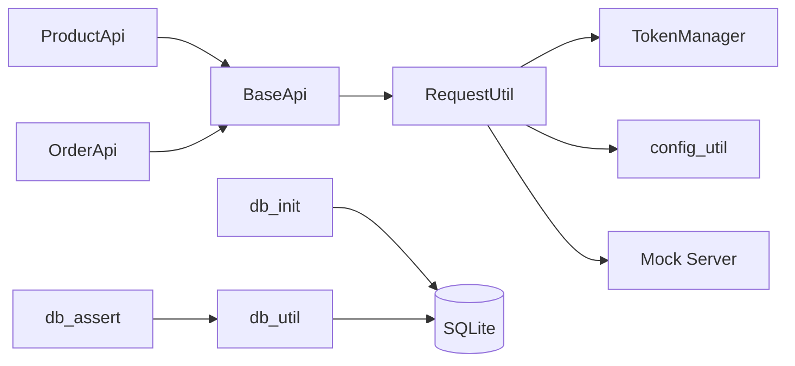
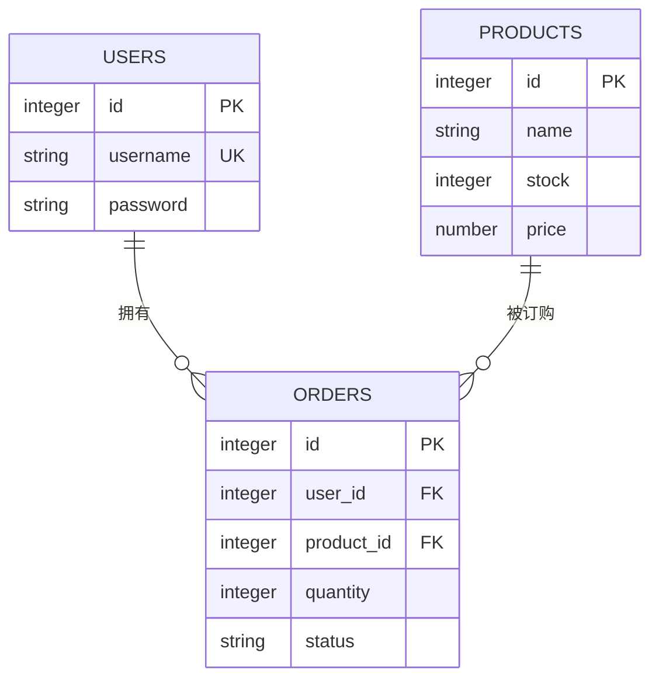

# 商品管理API

<cite>
**本文引用的文件**
- [api/product_api.py](file://api/product_api.py)
- [api/base_api.py](file://api/base_api.py)
- [common/request_util.py](file://common/request_util.py)
- [common/token_manager.py](file://common/token_manager.py)
- [config/config_util.py](file://config/config_util.py)
- [mock_server.py](file://mock_server.py)
- [common/db_init.py](file://common/db_init.py)
- [common/db_util.py](file://common/db_util.py)
- [common/db_assert.py](file://common/db_assert.py)
- [testcase/test_oversell.py](file://testcase/test_oversell.py)
- [config/config.yaml](file://config/config.yaml)
</cite>

## 目录
1. [简介](#简介)
2. [项目结构](#项目结构)
3. [核心组件](#核心组件)
4. [架构总览](#架构总览)
5. [详细组件分析](#详细组件分析)
6. [依赖分析](#依赖分析)
7. [性能考虑](#性能考虑)
8. [故障排查指南](#故障排查指南)
9. [结论](#结论)
10. [附录](#附录)

## 简介
本文件面向商品管理API的使用者与维护者，系统性阐述商品CRUD能力的实现与最佳实践，重点覆盖以下方面：
- 商品API的RESTful接口规范与行为约定
- 商品添加、查询、下单与库存扣减的完整流程
- 基于ProductApi类的使用方式与示例路径
- 库存控制策略与并发安全机制
- 数据验证规则、价格管理与业务约束
- 配置与数据库初始化、断言辅助工具

## 项目结构
该项目采用分层与按功能模块组织的结构：
- api层：封装各领域API（如商品、订单、支付、用户），统一继承自BaseApi，便于复用请求与认证能力
- common层：通用工具（请求、鉴权、数据库、断言、运行器等）
- config层：配置加载与环境变量覆盖
- mock_server：本地模拟服务，提供商品、订单、用户、支付等接口及数据库
- testcase：集成测试样例，验证并发下单与库存一致性

图表来源
- [api/product_api.py:1-15](file://api/product_api.py#L1-L15)
- [api/base_api.py:1-11](file://api/base_api.py#L1-L11)
- [common/request_util.py:1-66](file://common/request_util.py#L1-L66)
- [common/token_manager.py:1-38](file://common/token_manager.py#L1-L38)
- [config/config_util.py:1-112](file://config/config_util.py#L1-L112)
- [mock_server.py:188-321](file://mock_server.py#L188-L321)
- [common/db_init.py:1-78](file://common/db_init.py#L1-L78)
- [common/db_util.py:1-35](file://common/db_util.py#L1-L35)
- [common/db_assert.py:1-17](file://common/db_assert.py#L1-L17)

章节来源
- [api/product_api.py:1-15](file://api/product_api.py#L1-L15)
- [api/base_api.py:1-11](file://api/base_api.py#L1-L11)
- [common/request_util.py:1-66](file://common/request_util.py#L1-L66)
- [common/token_manager.py:1-38](file://common/token_manager.py#L1-L38)
- [config/config_util.py:1-112](file://config/config_util.py#L1-L112)
- [mock_server.py:188-321](file://mock_server.py#L188-L321)
- [common/db_init.py:1-78](file://common/db_init.py#L1-L78)
- [common/db_util.py:1-35](file://common/db_util.py#L1-L35)
- [common/db_assert.py:1-17](file://common/db_assert.py#L1-L17)

## 核心组件
- ProductApi：提供商品创建接口，内部通过BaseApi与RequestUtil完成HTTP请求与认证头注入
- BaseApi：统一持有RequestUtil与基础URL，屏蔽具体网络细节
- RequestUtil：封装HTTP发送逻辑、自动拼接base_url、注入Authorization头、记录请求/响应到Allure附件、抛出HTTP错误
- TokenManager：线程安全的令牌管理器，支持注册登录函数、缓存与刷新令牌
- config_util：集中式配置加载，支持环境变量覆盖（如API_BASE_URL、超时、重试、日志级别、数据库路径、默认用户）
- mock_server：提供商品、订单、用户、支付等接口，内置SQLite数据库与事务保障库存扣减一致性
- db_init/db_util/db_assert：数据库初始化、通用查询/执行与断言辅助

章节来源
- [api/product_api.py:8-15](file://api/product_api.py#L8-L15)
- [api/base_api.py:7-11](file://api/base_api.py#L7-L11)
- [common/request_util.py:13-66](file://common/request_util.py#L13-L66)
- [common/token_manager.py:8-38](file://common/token_manager.py#L8-L38)
- [config/config_util.py:64-112](file://config/config_util.py#L64-L112)
- [mock_server.py:188-321](file://mock_server.py#L188-L321)
- [common/db_init.py:8-78](file://common/db_init.py#L8-L78)
- [common/db_util.py:9-35](file://common/db_util.py#L9-L35)
- [common/db_assert.py:6-17](file://common/db_assert.py#L6-L17)

## 架构总览
下图展示了从客户端发起商品创建请求，到服务端处理与数据库交互的全链路。

图表来源
- [api/product_api.py:9-14](file://api/product_api.py#L9-L14)
- [api/base_api.py:8-11](file://api/base_api.py#L8-L11)
- [common/request_util.py:18-58](file://common/request_util.py#L18-L58)
- [common/token_manager.py:28-37](file://common/token_manager.py#L28-L37)
- [config/config_util.py:64-68](file://config/config_util.py#L64-L68)
- [mock_server.py:205-219](file://mock_server.py#L205-L219)

## 详细组件分析

### 商品API接口规范
- 商品列表查询
  - 方法：GET
  - 路径：/api/products
  - 请求参数：无
  - 响应字段：数组，元素包含id、name、stock、price
  - 示例路径：[mock_server.py:190-203](file://mock_server.py#L190-L203)
- 单个商品详情
  - 当前仓库未提供单独的商品详情GET接口；可通过商品列表遍历或在服务端扩展
  - 若需要，请参考商品列表接口的返回结构进行定位
- 商品创建
  - 方法：POST
  - 路径：/api/products
  - 请求体字段：name（字符串）、stock（整数）、price（数值）
  - 成功响应：JSON包含新建商品id
  - 示例路径：[api/product_api.py:9-14](file://api/product_api.py#L9-L14)，[mock_server.py:205-219](file://mock_server.py#L205-L219)
- 下单接口（与库存强关联）
  - 方法：POST
  - 路径：/api/orders
  - 请求体字段：product_id（整数）、quantity（整数，默认1）
  - 业务语义：原子性扣减库存并创建订单
  - 失败场景：库存不足返回409与错误信息
  - 示例路径：[api/order_api.py:9-14](file://api/order_api.py#L9-L14)，[mock_server.py:263-289](file://mock_server.py#L263-L289)

章节来源
- [api/product_api.py:9-14](file://api/product_api.py#L9-L14)
- [api/order_api.py:9-14](file://api/order_api.py#L9-L14)
- [mock_server.py:190-219](file://mock_server.py#L190-L219)
- [mock_server.py:263-289](file://mock_server.py#L263-L289)

### ProductApi 类与使用示例
- 类职责
  - 封装商品创建请求，复用BaseApi提供的RequestUtil与基础URL
  - 支持no_token开关以跳过Authorization头（用于无需鉴权的场景）
- 使用要点
  - 通过add_product传入名称、库存、单价
  - 返回值为服务端响应的JSON对象（包含id等字段）
- 示例路径
  - [api/product_api.py:8-15](file://api/product_api.py#L8-L15)

图表来源
- [api/base_api.py:7-11](file://api/base_api.py#L7-L11)
- [api/product_api.py:8-15](file://api/product_api.py#L8-L15)
- [common/request_util.py:13-66](file://common/request_util.py#L13-L66)
- [common/token_manager.py:8-38](file://common/token_manager.py#L8-L38)

章节来源
- [api/product_api.py:8-15](file://api/product_api.py#L8-L15)
- [api/base_api.py:7-11](file://api/base_api.py#L7-L11)
- [common/request_util.py:13-66](file://common/request_util.py#L13-L66)
- [common/token_manager.py:8-38](file://common/token_manager.py#L8-L38)

### 库存控制与并发安全
- 服务端策略
  - 使用BEGIN IMMEDIATE开启排他锁，确保同一时刻只有一个事务能修改库存
  - 先检查stock>=quantity，再执行扣减，若不满足则回滚并返回409
  - 成功后写入订单记录，提交事务
- 并发测试
  - 测试用例通过线程池并发触发下单，验证最终库存不超卖且成功订单数不超过剩余库存
- 断言工具
  - 提供断言库存最小值与读取当前库存的方法，便于测试与校验

图表来源
- [mock_server.py:269-289](file://mock_server.py#L269-L289)
- [testcase/test_oversell.py:13-40](file://testcase/test_oversell.py#L13-L40)
- [common/db_assert.py:6-17](file://common/db_assert.py#L6-L17)

章节来源
- [mock_server.py:269-289](file://mock_server.py#L269-L289)
- [testcase/test_oversell.py:13-40](file://testcase/test_oversell.py#L13-L40)
- [common/db_assert.py:6-17](file://common/db_assert.py#L6-L17)

### 数据验证与业务规则
- 商品创建
  - 必填字段：name、stock、price
  - stock必须为非负整数；price必须为数值
  - 服务端会将请求体转换为字符串/整数/浮点数后入库
- 下单
  - product_id必须存在；quantity默认1
  - 库存不足时拒绝下单并返回409
- 数据库约束
  - products表：id主键、name必填、stock非负、price非负
  - orders表：quantity必填、status默认created
- 验证与断言
  - 可通过db_assert读取与断言库存，确保业务一致性

章节来源
- [mock_server.py:205-219](file://mock_server.py#L205-L219)
- [mock_server.py:263-289](file://mock_server.py#L263-L289)
- [common/db_init.py:20-33](file://common/db_init.py#L20-L33)
- [common/db_assert.py:6-17](file://common/db_assert.py#L6-L17)

### 配置与数据库初始化
- 配置项
  - base.url：服务端基础地址（默认http://127.0.0.1:5000）
  - database.path：SQLite文件相对路径（默认test.db）
  - user.username/password：默认用户凭据
- 环境变量覆盖
  - API_BASE_URL、API_REQUEST_TIMEOUT、API_REQUEST_RETRIES、LOG_LEVEL
- 数据库初始化
  - 自动创建users、products、orders三张表
  - 插入演示数据（幂等）

章节来源
- [config/config_util.py:64-112](file://config/config_util.py#L64-L112)
- [config/config.yaml:1-10](file://config/config.yaml#L1-L10)
- [common/db_init.py:8-78](file://common/db_init.py#L8-L78)

## 依赖分析
- 组件耦合
  - ProductApi与OrderApi均依赖BaseApi，后者聚合RequestUtil，形成清晰的层次
  - RequestUtil依赖TokenManager与config_util，负责HTTP与认证
  - mock_server直接依赖SQLite与Flask，提供REST接口
- 外部依赖
  - requests（Session）、sqlite3（内置）、Flask（模拟服务）
- 循环依赖
  - 未发现循环导入；模块间为单向依赖

图表来源
- [api/product_api.py:8-15](file://api/product_api.py#L8-L15)
- [api/order_api.py:8-15](file://api/order_api.py#L8-L15)
- [api/base_api.py:7-11](file://api/base_api.py#L7-L11)
- [common/request_util.py:13-66](file://common/request_util.py#L13-L66)
- [common/token_manager.py:8-38](file://common/token_manager.py#L8-L38)
- [config/config_util.py:64-112](file://config/config_util.py#L64-L112)
- [mock_server.py:188-321](file://mock_server.py#L188-L321)
- [common/db_init.py:8-78](file://common/db_init.py#L8-L78)
- [common/db_util.py:9-35](file://common/db_util.py#L9-L35)
- [common/db_assert.py:6-17](file://common/db_assert.py#L6-L17)

## 性能考虑
- 连接与事务
  - 服务端使用BEGIN IMMEDIATE，避免长时间持有共享锁导致的死锁风险
  - 事务内仅执行必要SQL，减少锁持有时间
- 并发模型
  - 测试用例使用线程池并发下单，建议在高并发场景下评估数据库连接池与线程数上限
- 网络与序列化
  - RequestUtil统一注入Content-Type与Authorization头，减少重复逻辑
  - Allure附件记录请求/响应，便于问题定位但会增加IO开销，建议在调试阶段启用

## 故障排查指南
- 401 未授权
  - 确认已登录并获取有效token，请求头中包含Authorization: Bearer <token>
  - 参考路径：[mock_server.py:21-29](file://mock_server.py#L21-L29)，[common/token_manager.py:28-37](file://common/token_manager.py#L28-L37)
- 409 库存不足
  - 下单数量超过剩余库存；请先补货或降低购买数量
  - 参考路径：[mock_server.py:275-277](file://mock_server.py#L275-L277)
- 404 订单不存在（支付接口）
  - 支付请求中的order_id无效；请确认订单已创建
  - 参考路径：[mock_server.py:309-312](file://mock_server.py#L309-L312)
- 数据库异常
  - 使用db_util执行SQL失败时，检查表结构与字段类型
  - 参考路径：[common/db_init.py:20-33](file://common/db_init.py#L20-L33)，[common/db_util.py:28-35](file://common/db_util.py#L28-L35)
- 并发超卖
  - 若出现超卖，检查事务隔离级别与锁策略；可参考测试用例验证
  - 参考路径：[testcase/test_oversell.py:13-40](file://testcase/test_oversell.py#L13-L40)

章节来源
- [mock_server.py:21-29](file://mock_server.py#L21-L29)
- [mock_server.py:275-277](file://mock_server.py#L275-L277)
- [mock_server.py:309-312](file://mock_server.py#L309-L312)
- [common/db_init.py:20-33](file://common/db_init.py#L20-L33)
- [common/db_util.py:28-35](file://common/db_util.py#L28-L35)
- [testcase/test_oversell.py:13-40](file://testcase/test_oversell.py#L13-L40)

## 结论
本项目通过简洁的API层与通用工具层，提供了稳定可靠的商品管理能力。商品创建与下单流程在服务端通过事务与锁保障了库存一致性，配合并发测试验证了系统的健壮性。建议在生产环境中结合数据库连接池、限流与监控进一步提升稳定性与可观测性。

## 附录
- 如何使用ProductApi进行商品操作
  - 创建商品：调用add_product(name, stock, price)，返回包含id的JSON
  - 示例路径：[api/product_api.py:9-14](file://api/product_api.py#L9-L14)
- 配置与启动
  - 修改config.yaml或通过环境变量覆盖基础URL与数据库路径
  - 启动mock_server后即可访问商品与订单接口
  - 示例路径：[config/config.yaml:1-10](file://config/config.yaml#L1-10)，[mock_server.py:318-321](file://mock_server.py#L318-L321)
- 数据模型概览
  - users：id、username、password
  - products：id、name、stock、price
  - orders：id、user_id、product_id、quantity、status

图表来源
- [common/db_init.py:14-33](file://common/db_init.py#L14-L33)