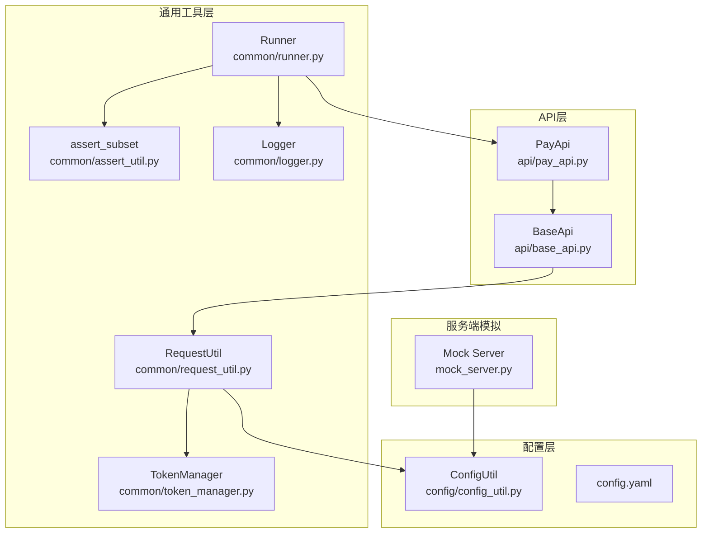
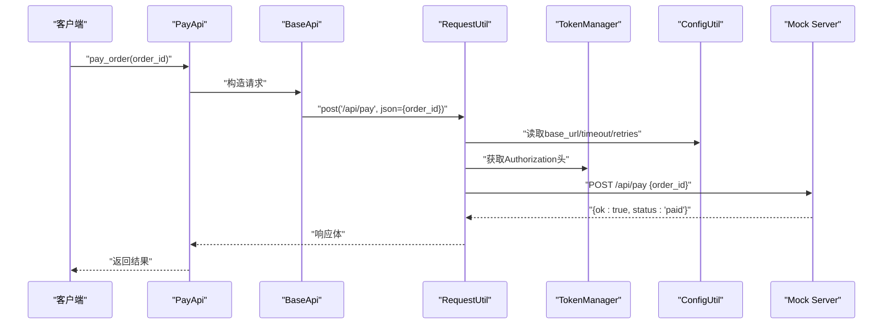
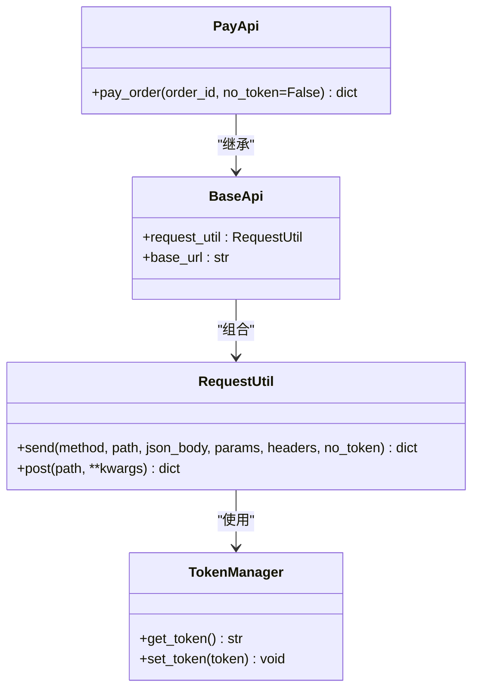
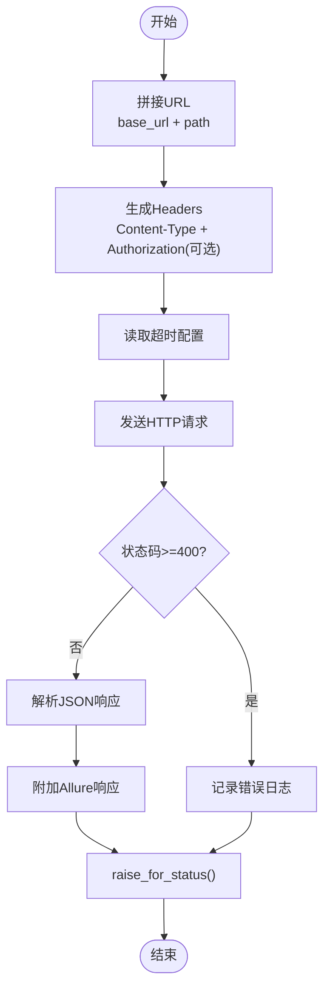
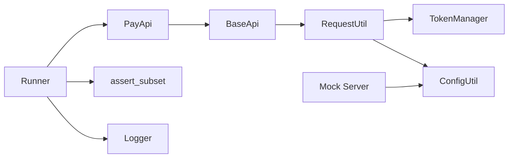

# 支付处理API

<cite>
**本文档引用的文件**
- [pay_api.py](file://api/pay_api.py)
- [base_api.py](file://api/base_api.py)
- [request_util.py](file://common/request_util.py)
- [config_util.py](file://config/config_util.py)
- [config.yaml](file://config/config.yaml)
- [mock_server.py](file://mock_server.py)
- [token_manager.py](file://common/token_manager.py)
- [assert_util.py](file://common/assert_util.py)
- [runner.py](file://common/runner.py)
- [api_factory.py](file://common/api_factory.py)
- [yaml_util.py](file://common/yaml_util.py)
- [flow.yaml](file://data/flow.yaml)
- [pay.json](file://config/schemas/pay.json)
- [logger.py](file://common/logger.py)
</cite>

## 目录
1. [简介](#简介)
2. [项目结构](#项目结构)
3. [核心组件](#核心组件)
4. [架构总览](#架构总览)
5. [详细组件分析](#详细组件分析)
6. [依赖关系分析](#依赖关系分析)
7. [性能考虑](#性能考虑)
8. [故障排查指南](#故障排查指南)
9. [结论](#结论)
10. [附录](#附录)

## 简介
本文件面向支付处理API的使用者与维护者，系统化阐述支付流程管理的实现细节，涵盖支付发起、状态查询与支付结果处理等能力。文档基于仓库中的真实实现，重点说明RESTful接口规范、数据校验、安全认证、异常处理与重试机制，并通过序列图与流程图直观展示调用链路与状态流转。

## 项目结构
该工程采用按职责分层的组织方式：
- api 层：封装各领域API的客户端，如支付、订单、产品、用户等
- common 层：通用工具与基础设施，如请求封装、断言、上下文、运行器、Token管理、日志等
- config 层：配置加载与环境变量覆盖
- mock_server：本地模拟服务端，提供支付接口与数据库支持
- data：测试编排数据（YAML）

图表来源
- [pay_api.py:1-15](file://api/pay_api.py#L1-L15)
- [base_api.py:1-11](file://api/base_api.py#L1-L11)
- [request_util.py:1-117](file://common/request_util.py#L1-L117)
- [token_manager.py:1-38](file://common/token_manager.py#L1-L38)
- [config_util.py:1-112](file://config/config_util.py#L1-L112)
- [config.yaml:1-10](file://config/config.yaml#L1-L10)
- [mock_server.py:1-322](file://mock_server.py#L1-L322)
- [runner.py:1-117](file://common/runner.py#L1-L117)
- [assert_util.py:1-15](file://common/assert_util.py#L1-L15)
- [logger.py:1-74](file://common/logger.py#L1-L74)

章节来源
- [pay_api.py:1-15](file://api/pay_api.py#L1-L15)
- [base_api.py:1-11](file://api/base_api.py#L1-L11)
- [request_util.py:1-117](file://common/request_util.py#L1-L117)
- [config_util.py:1-112](file://config/config_util.py#L1-L112)
- [config.yaml:1-10](file://config/config.yaml#L1-L10)
- [mock_server.py:1-322](file://mock_server.py#L1-L322)
- [runner.py:1-117](file://common/runner.py#L1-L117)
- [assert_util.py:1-15](file://common/assert_util.py#L1-L15)
- [logger.py:1-74](file://common/logger.py#L1-L74)

## 核心组件
- PayApi：支付API客户端，提供支付下单能力
- BaseApi：API基类，统一注入请求工具与基础URL
- RequestUtil：HTTP请求封装，内置重试、超时、日志与断言附件
- TokenManager：全局Token缓存与懒加载
- ConfigUtil：配置加载与环境变量覆盖
- Mock Server：本地服务端，提供支付接口与数据库支撑
- Runner：测试编排引擎，负责步骤执行、提取、断言与软断言汇总

章节来源
- [pay_api.py:8-15](file://api/pay_api.py#L8-L15)
- [base_api.py:7-11](file://api/base_api.py#L7-L11)
- [request_util.py:29-117](file://common/request_util.py#L29-L117)
- [token_manager.py:8-38](file://common/token_manager.py#L8-L38)
- [config_util.py:64-84](file://config/config_util.py#L64-L84)
- [mock_server.py:292-316](file://mock_server.py#L292-L316)
- [runner.py:29-62](file://common/runner.py#L29-L62)

## 架构总览
支付API的调用路径从客户端到服务端，贯穿请求封装、认证、业务处理与响应返回。下图展示了典型支付流程的端到端交互：

图表来源
- [pay_api.py:9-14](file://api/pay_api.py#L9-L14)
- [base_api.py:8-11](file://api/base_api.py#L8-L11)
- [request_util.py:71-117](file://common/request_util.py#L71-L117)
- [token_manager.py:28-37](file://common/token_manager.py#L28-L37)
- [config_util.py:64-84](file://config/config_util.py#L64-L84)
- [mock_server.py:292-316](file://mock_server.py#L292-L316)

## 详细组件分析

### 支付API接口规范
- 接口路径：/api/pay
- 方法：POST
- 认证：需要 Bearer Token（Authorization 头）
- 请求体字段：
  - order_id：整数类型，目标订单编号
- 成功响应字段：
  - ok：布尔类型，表示操作是否成功
  - status：字符串类型，支付状态（例如 paid）
- 错误场景：
  - 未授权：缺少或无效的Token
  - 订单不存在：order_id 对应记录不存在
  - 库存不足：在订单创建阶段可能触发（由服务端逻辑决定）

章节来源
- [mock_server.py:292-316](file://mock_server.py#L292-L316)
- [pay_api.py:9-14](file://api/pay_api.py#L9-L14)
- [request_util.py:48-55](file://common/request_util.py#L48-L55)
- [config.yaml:1-10](file://config/config.yaml#L1-L10)

### PayApi 类与调用流程
PayApi 继承自 BaseApi，通过 RequestUtil 的 post 方法向 /api/pay 发起支付请求。其 pay_order 方法仅接收 order_id 并封装为JSON发送。

图表来源
- [pay_api.py:8-15](file://api/pay_api.py#L8-L15)
- [base_api.py:7-11](file://api/base_api.py#L7-L11)
- [request_util.py:29-117](file://common/request_util.py#L29-L117)
- [token_manager.py:8-38](file://common/token_manager.py#L8-L38)

章节来源
- [pay_api.py:8-15](file://api/pay_api.py#L8-L15)
- [base_api.py:7-11](file://api/base_api.py#L7-L11)
- [request_util.py:71-117](file://common/request_util.py#L71-L117)

### 请求与重试机制
RequestUtil 提供统一的HTTP发送逻辑，具备以下特性：
- 自动拼接 base_url 与相对路径
- 默认 Content-Type: application/json
- 可选择性附加 Authorization 头（Bearer Token）
- 内置超时控制与指数退避重试策略（针对特定状态码）
- 日志记录与Allure请求/响应附件
- 异常包装为 ApiRequestError

图表来源
- [request_util.py:71-117](file://common/request_util.py#L71-L117)
- [config_util.py:71-84](file://config/config_util.py#L71-L84)

章节来源
- [request_util.py:29-117](file://common/request_util.py#L29-L117)
- [config_util.py:64-84](file://config/config_util.py#L64-L84)

### 认证与Token管理
- Token来源于 TokenManager，支持注册登录函数以懒加载获取
- 若未显式设置 no_token，则自动在请求头添加 Authorization: Bearer <token>
- 日志中会对Authorization头进行掩码处理，避免敏感信息泄露

章节来源
- [token_manager.py:8-38](file://common/token_manager.py#L8-L38)
- [request_util.py:48-55](file://common/request_util.py#L48-L55)
- [logger.py:18-38](file://common/logger.py#L18-L38)

### 数据验证与断言
- 运行器支持对响应进行断言与Schema校验
- 断言工具支持嵌套键的子集匹配，便于只校验关心字段
- Schema定义位于 config/schemas/pay.json，约束响应必须包含 ok 字段

章节来源
- [runner.py:51-62](file://common/runner.py#L51-L62)
- [assert_util.py:6-15](file://common/assert_util.py#L6-L15)
- [pay.json:1-11](file://config/schemas/pay.json#L1-L11)

### 测试编排与支付流程
- flow.yaml 定义了完整的电商支付流程：注册、登录、创建商品、创建订单、支付
- Runner 会按步骤执行，支持变量提取（extract）、断言（assert）、Schema校验与软断言
- 支付步骤断言 status 为 paid，确保状态同步正确

章节来源
- [flow.yaml:1-41](file://data/flow.yaml#L1-L41)
- [runner.py:29-62](file://common/runner.py#L29-L62)
- [api_factory.py:12-18](file://common/api_factory.py#L12-L18)

## 依赖关系分析
- PayApi 依赖 BaseApi 注入的 RequestUtil
- RequestUtil 依赖 TokenManager 获取Token、ConfigUtil 读取配置、Logger 输出日志
- Runner 作为编排入口，调度各API并执行断言与提取
- Mock Server 提供 /api/pay 接口与数据库支撑，用于本地联调

图表来源
- [pay_api.py:8-15](file://api/pay_api.py#L8-L15)
- [base_api.py:8-11](file://api/base_api.py#L8-L11)
- [request_util.py:29-117](file://common/request_util.py#L29-L117)
- [token_manager.py:8-38](file://common/token_manager.py#L8-L38)
- [config_util.py:64-84](file://config/config_util.py#L64-L84)
- [runner.py:29-62](file://common/runner.py#L29-L62)
- [assert_util.py:6-15](file://common/assert_util.py#L6-L15)
- [logger.py:41-74](file://common/logger.py#L41-L74)
- [mock_server.py:292-316](file://mock_server.py#L292-L316)

章节来源
- [pay_api.py:8-15](file://api/pay_api.py#L8-L15)
- [base_api.py:7-11](file://api/base_api.py#L7-L11)
- [request_util.py:29-117](file://common/request_util.py#L29-L117)
- [token_manager.py:8-38](file://common/token_manager.py#L8-L38)
- [config_util.py:64-84](file://config/config_util.py#L64-L84)
- [runner.py:29-62](file://common/runner.py#L29-L62)
- [assert_util.py:6-15](file://common/assert_util.py#L6-L15)
- [logger.py:41-74](file://common/logger.py#L41-L74)
- [mock_server.py:292-316](file://mock_server.py#L292-L316)

## 性能考虑
- 重试策略：当启用重试时，对429、500、502、503、504等状态码进行指数退避重试，提升网络抖动下的稳定性
- 超时控制：统一从配置读取超时时间，避免请求悬挂
- 日志与附件：Allure附件会增加IO开销，建议在调试阶段开启，生产环境谨慎使用
- Token缓存：TokenManager 使用线程锁保护，减少重复登录带来的额外开销

章节来源
- [request_util.py:35-46](file://common/request_util.py#L35-L46)
- [config_util.py:71-76](file://config/config_util.py#L71-L76)
- [logger.py:62-70](file://common/logger.py#L62-L70)
- [token_manager.py:8-38](file://common/token_manager.py#L8-L38)

## 故障排查指南
- 未授权错误（401）
  - 检查是否已登录并成功获取Token
  - 确认请求头中 Authorization: Bearer <token> 是否正确
- 订单不存在（404）
  - 确认 order_id 是否有效且存在
- 库存不足（409）
  - 在订单创建阶段即应检查库存，避免进入支付阶段
- 请求异常（RequestException）
  - 查看日志中的错误信息与堆栈
  - 检查网络连通性与服务端状态
- 响应非JSON
  - 当服务端返回非JSON时，底层会捕获并记录原始文本，便于定位问题

章节来源
- [request_util.py:94-109](file://common/request_util.py#L94-L109)
- [logger.py:18-38](file://common/logger.py#L18-L38)
- [mock_server.py:275-277](file://mock_server.py#L275-L277)
- [mock_server.py:304-315](file://mock_server.py#L304-L315)

## 结论
本支付处理API以简洁的客户端封装与完善的基础设施配合，提供了稳定可靠的支付调用能力。通过统一的请求封装、Token管理、配置加载与日志输出，结合Mock服务与测试编排，能够快速完成端到端验证。建议在生产环境中结合更严格的风控与加密策略，进一步增强安全性与可观测性。

## 附录

### RESTful接口清单（支付）
- 路径：/api/pay
- 方法：POST
- 认证：是（Bearer Token）
- 请求体：
  - order_id：整数，订单编号
- 响应体：
  - ok：布尔，操作是否成功
  - status：字符串，支付状态（如 paid）

章节来源
- [mock_server.py:292-316](file://mock_server.py#L292-L316)
- [pay_api.py:9-14](file://api/pay_api.py#L9-L14)

### 使用示例（PayApi）
- 创建支付对象并调用支付方法，传入 order_id 即可发起支付
- 若需要禁用自动Token注入，可设置 no_token=True

章节来源
- [pay_api.py:9-14](file://api/pay_api.py#L9-L14)

### 最佳实践
- 数据验证：使用断言工具与Schema共同保障响应一致性
- 安全加密：确保传输通道使用HTTPS；Token在日志中被掩码处理
- 风控检查：在订单创建阶段进行库存与用户权限校验
- 异常重试：根据业务重要性合理配置重试次数与超时时间
- 状态同步：支付完成后校验状态字段，确保与期望一致

章节来源
- [assert_util.py:6-15](file://common/assert_util.py#L6-L15)
- [pay.json:1-11](file://config/schemas/pay.json#L1-L11)
- [logger.py:18-38](file://common/logger.py#L18-L38)
- [request_util.py:35-46](file://common/request_util.py#L35-L46)
- [flow.yaml:35-41](file://data/flow.yaml#L35-L41)