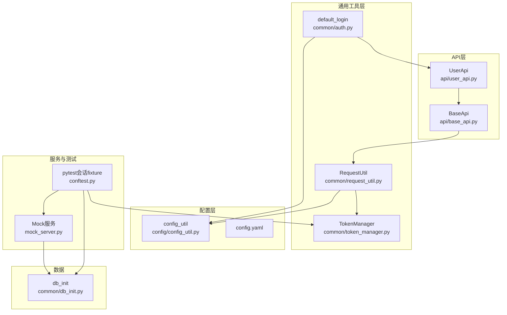
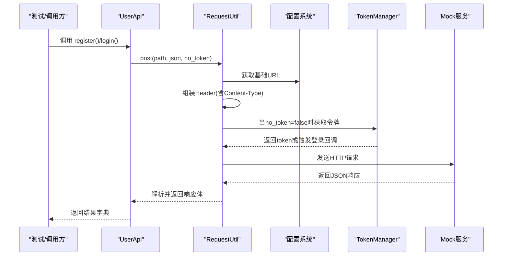
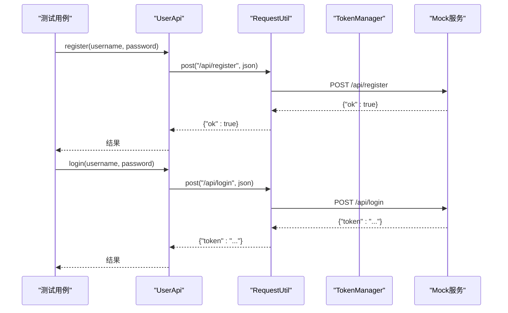
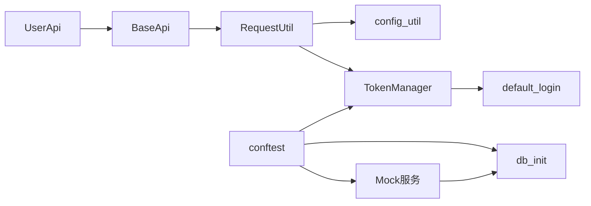

# 用户管理API

<cite>
**本文引用的文件**
- [api/user_api.py](file://api/user_api.py)
- [common/request_util.py](file://common/request_util.py)
- [api/base_api.py](file://api/base_api.py)
- [common/auth.py](file://common/auth.py)
- [common/token_manager.py](file://common/token_manager.py)
- [config/config_util.py](file://config/config_util.py)
- [config/config.yaml](file://config/config.yaml)
- [mock_server.py](file://mock_server.py)
- [conftest.py](file://conftest.py)
- [data/flow.yaml](file://data/flow.yaml)
- [common/db_init.py](file://common/db_init.py)
</cite>

## 目录
1. [简介](#简介)
2. [项目结构](#项目结构)
3. [核心组件](#核心组件)
4. [架构总览](#架构总览)
5. [详细组件分析](#详细组件分析)
6. [依赖分析](#依赖分析)
7. [性能考虑](#性能考虑)
8. [故障排查指南](#故障排查指南)
9. [结论](#结论)
10. [附录](#附录)

## 简介
本文件面向用户管理API，系统性说明用户注册与登录两大核心能力的实现方式与使用方法。内容覆盖：
- RESTful接口规范：注册与登录的HTTP方法、URL模式、请求参数、响应格式与错误处理
- 客户端封装：UserApi类的使用方式与典型调用流程
- 认证机制与令牌管理：基于Bearer Token的鉴权策略与TokenManager的线程安全管理
- 数据验证与安全：服务端输入校验、客户端请求构造与安全最佳实践
- 测试与集成：通过pytest会话级fixture自动启动Mock服务并完成默认登录

## 项目结构
该项目采用分层组织方式：
- api层：对外暴露业务API封装（如UserApi）
- common层：通用工具（请求封装、认证、令牌管理、数据库初始化等）
- config层：配置加载与环境变量覆盖
- mock_server：本地Mock服务，提供注册/登录等接口与数据库支持
- pytest集成：通过conftest在测试会话启动时初始化数据库、启动服务并注册默认登录

图表来源
- [api/user_api.py:1-22](file://api/user_api.py#L1-L22)
- [api/base_api.py:1-11](file://api/base_api.py#L1-L11)
- [common/request_util.py:1-66](file://common/request_util.py#L1-L66)
- [common/token_manager.py:1-38](file://common/token_manager.py#L1-L38)
- [common/auth.py:1-12](file://common/auth.py#L1-L12)
- [config/config_util.py:1-50](file://config/config_util.py#L1-L50)
- [config/config.yaml:1-10](file://config/config.yaml#L1-L10)
- [mock_server.py:1-200](file://mock_server.py#L1-L200)
- [conftest.py:1-50](file://conftest.py#L1-L50)
- [common/db_init.py:1-78](file://common/db_init.py#L1-L78)

章节来源
- [api/user_api.py:1-22](file://api/user_api.py#L1-L22)
- [api/base_api.py:1-11](file://api/base_api.py#L1-L11)
- [common/request_util.py:1-66](file://common/request_util.py#L1-L66)
- [common/token_manager.py:1-38](file://common/token_manager.py#L1-L38)
- [common/auth.py:1-12](file://common/auth.py#L1-L12)
- [config/config_util.py:1-50](file://config/config_util.py#L1-L50)
- [config/config.yaml:1-10](file://config/config.yaml#L1-L10)
- [mock_server.py:1-200](file://mock_server.py#L1-L200)
- [conftest.py:1-50](file://conftest.py#L1-L50)
- [common/db_init.py:1-78](file://common/db_init.py#L1-L78)

## 核心组件
- UserApi：封装用户注册与登录两个REST端点，内部通过RequestUtil发送HTTP请求
- RequestUtil：统一请求发送逻辑，负责组装URL、设置Header（含Authorization）、记录Allure附件、解析响应
- TokenManager：全局单例式令牌管理器，支持注册登录回调、线程安全缓存、清空与获取令牌
- default_login：默认登录函数，从配置读取用户名/密码并调用UserApi.login获取token
- BaseApi：所有API基类，持有RequestUtil实例与基础URL
- 配置系统：config_util从config.yaml加载基础URL、数据库路径与默认用户信息，支持环境变量覆盖
- Mock服务：提供/api/register与/api/login端点，内置SQLite数据库与令牌映射表

章节来源
- [api/user_api.py:8-22](file://api/user_api.py#L8-L22)
- [common/request_util.py:13-66](file://common/request_util.py#L13-L66)
- [common/token_manager.py:8-38](file://common/token_manager.py#L8-L38)
- [common/auth.py:7-11](file://common/auth.py#L7-L11)
- [api/base_api.py:7-11](file://api/base_api.py#L7-L11)
- [config/config_util.py:27-49](file://config/config_util.py#L27-L49)
- [config/config.yaml:1-10](file://config/config.yaml#L1-L10)
- [mock_server.py:132-185](file://mock_server.py#L132-L185)

## 架构总览
下图展示了从客户端到Mock服务的完整调用链路，以及令牌在请求头中的传递方式。

图表来源
- [api/user_api.py:9-21](file://api/user_api.py#L9-L21)
- [common/request_util.py:18-58](file://common/request_util.py#L18-L58)
- [config/config_util.py:27-31](file://config/config_util.py#L27-L31)
- [common/token_manager.py:28-37](file://common/token_manager.py#L28-L37)
- [mock_server.py:132-185](file://mock_server.py#L132-L185)

## 详细组件分析

### UserApi：用户注册与登录
- 注册接口
  - 方法：POST
  - URL：/api/register
  - 请求体：包含username与password字段
  - 响应：成功返回{"ok": true}；若用户名已存在则返回{"ok": true, "exists": true}
  - 错误：缺少必要字段时返回{"error": "invalid"}并返回400
- 登录接口
  - 方法：POST
  - URL：/api/login
  - 请求体：包含username与password字段
  - 响应：成功返回{"token": "<uuid>"}
  - 错误：凭据不匹配返回{"error": "auth failed"}并返回401

使用要点
- UserApi继承自BaseApi，内部通过RequestUtil.post发起请求
- register与login均支持no_token参数，默认为True，表示本次请求不自动附加Authorization头
- 若需要后续接口携带令牌，请在调用login后使用TokenManager.get_token()获取并缓存token

章节来源
- [api/user_api.py:9-21](file://api/user_api.py#L9-L21)
- [mock_server.py:132-185](file://mock_server.py#L132-L185)

### RequestUtil：请求发送与响应解析
- URL拼接：若path不是绝对URL，则以配置的基础URL拼接
- Header生成：默认Content-Type为application/json；当no_token为False时，自动从TokenManager获取token并添加Authorization: Bearer <token>
- 请求发送：使用requests.Session，记录请求与响应到Allure附件
- 响应解析：优先尝试JSON解析，失败时回退为原始文本；最终统一返回字典格式

章节来源
- [common/request_util.py:18-58](file://common/request_util.py#L18-L58)
- [config/config_util.py:27-31](file://config/config_util.py#L27-L31)

### TokenManager：令牌管理
- 单例式设计：类方法提供注册登录回调、设置/清空/获取令牌
- 线程安全：使用Lock保护令牌状态
- 登录回调：若未显式设置token且未注册登录回调，获取时会抛出异常
- 缓存策略：首次获取时若未缓存则调用登录回调并写入缓存

章节来源
- [common/token_manager.py:8-38](file://common/token_manager.py#L8-L38)

### default_login：默认登录流程
- 从配置读取默认用户名/密码
- 实例化UserApi并调用login
- 返回token字符串供外部使用

章节来源
- [common/auth.py:7-11](file://common/auth.py#L7-L11)
- [config/config_util.py:43-49](file://config/config_util.py#L43-L49)

### BaseApi：API基类
- 初始化RequestUtil与基础URL（末尾去除斜杠）
- 为子类提供统一的请求入口

章节来源
- [api/base_api.py:7-11](file://api/base_api.py#L7-L11)

### 配置系统：config_util与config.yaml
- 基础URL：优先读取环境变量API_BASE_URL，否则读取config.yaml中的base.url，默认http://127.0.0.1:5000
- 数据库路径：读取config.yaml中database.path，支持相对路径，最终转为绝对路径
- 默认用户：读取config.yaml中user.username与user.password，用于默认登录

章节来源
- [config/config_util.py:27-49](file://config/config_util.py#L27-L49)
- [config/config.yaml:1-10](file://config/config.yaml#L1-L10)

### Mock服务：注册/登录与鉴权
- 注册：接收POST JSON，校验必填字段；插入用户并处理唯一约束冲突（返回exists）
- 登录：校验凭据，成功生成UUID作为token并保存映射，返回token
- 鉴权：/_auth_username从Authorization头提取Bearer token并查询映射，不存在则401

章节来源
- [mock_server.py:132-185](file://mock_server.py#L132-L185)
- [mock_server.py:21-29](file://mock_server.py#L21-L29)

### 测试与集成：pytest会话级fixture
- 初始化数据库：删除旧文件、创建表结构、插入演示数据
- 启动Mock服务：在127.0.0.1:5000启动Flask服务
- 注册默认登录：将default_login注册为TokenManager的登录回调，清空缓存并预取一次token

章节来源
- [conftest.py:16-49](file://conftest.py#L16-L49)

### 典型调用序列：注册与登录

图表来源
- [api/user_api.py:9-21](file://api/user_api.py#L9-L21)
- [common/request_util.py:37-58](file://common/request_util.py#L37-L58)
- [mock_server.py:132-185](file://mock_server.py#L132-L185)

## 依赖分析
- UserApi依赖BaseApi与RequestUtil
- RequestUtil依赖config_util与TokenManager
- TokenManager依赖common.auth的default_login作为登录回调
- conftest在会话开始时初始化数据库、启动Mock服务并注册TokenManager登录回调
- mock_server依赖common.db_init进行数据库初始化

图表来源
- [api/user_api.py:5-6](file://api/user_api.py#L5-L6)
- [api/base_api.py:3-4](file://api/base_api.py#L3-L4)
- [common/request_util.py:9-10](file://common/request_util.py#L9-L10)
- [common/token_manager.py:14-15](file://common/token_manager.py#L14-L15)
- [common/auth.py:3-4](file://common/auth.py#L3-L4)
- [conftest.py:35-44](file://conftest.py#L35-L44)
- [common/db_init.py:8-38](file://common/db_init.py#L8-L38)
- [mock_server.py:10-11](file://mock_server.py#L10-L11)

章节来源
- [api/user_api.py:5-6](file://api/user_api.py#L5-L6)
- [api/base_api.py:3-4](file://api/base_api.py#L3-L4)
- [common/request_util.py:9-10](file://common/request_util.py#L9-L10)
- [common/token_manager.py:14-15](file://common/token_manager.py#L14-L15)
- [common/auth.py:3-4](file://common/auth.py#L3-L4)
- [conftest.py:35-44](file://conftest.py#L35-L44)
- [common/db_init.py:8-38](file://common/db_init.py#L8-L38)
- [mock_server.py:10-11](file://mock_server.py#L10-L11)

## 性能考虑
- 连接复用：RequestUtil使用requests.Session，减少TCP连接开销
- 超时控制：请求设置超时时间，避免阻塞
- 线程安全：TokenManager使用锁保护令牌缓存，适合并发场景
- 数据库：Mock服务使用SQLite，I/O受限于磁盘性能；生产环境建议使用高性能数据库并开启连接池

## 故障排查指南
- 无法获取令牌
  - 现象：TokenManager.get_token抛出“未注册登录回调”异常
  - 处理：确保在测试会话中已通过conftest注册default_login
  - 参考：[conftest.py:42-44](file://conftest.py#L42-L44)
- 401未授权
  - 现象：服务端返回401或{"error": "auth failed"}
  - 处理：确认登录成功并获取token；检查Authorization头是否为Bearer <token>
  - 参考：[mock_server.py:21-29](file://mock_server.py#L21-L29)，[common/request_util.py:22-25](file://common/request_util.py#L22-L25)
- 请求参数缺失
  - 现象：注册/登录返回{"error": "invalid"}并返回400
  - 处理：确保请求体包含username与password
  - 参考：[mock_server.py:146-147](file://mock_server.py#L146-L147)
- 基础URL错误
  - 现象：请求地址拼接异常
  - 处理：检查环境变量API_BASE_URL或config.yaml中的base.url
  - 参考：[config/config_util.py:30](file://config/config_util.py#L30)，[config/config.yaml:2](file://config/config.yaml#L2)

章节来源
- [conftest.py:42-44](file://conftest.py#L42-L44)
- [common/request_util.py:22-25](file://common/request_util.py#L22-L25)
- [mock_server.py:21-29](file://mock_server.py#L21-L29)
- [mock_server.py:146-147](file://mock_server.py#L146-L147)
- [config/config_util.py:30](file://config/config_util.py#L30)
- [config/config.yaml:2](file://config/config.yaml#L2)

## 结论
本项目提供了简洁而完整的用户管理API客户端封装与Mock服务，结合TokenManager实现了可扩展的令牌管理机制。通过pytest会话级fixture，测试环境得以自动初始化并完成默认登录，便于编写端到端流程用例。建议在生产环境中强化密码加密、引入HTTPS、完善令牌刷新与撤销机制，并对输入参数增加更严格的校验与限流策略。

## 附录

### RESTful接口规范

- 注册接口
  - 方法：POST
  - URL：/api/register
  - 请求体字段
    - username: string，必填
    - password: string，必填
  - 成功响应
    - {"ok": true}
    - {"ok": true, "exists": true}（用户名已存在）
  - 错误响应
    - {"error": "invalid"}（缺少字段），HTTP 400

- 登录接口
  - 方法：POST
  - URL：/api/login
  - 请求体字段
    - username: string，必填
    - password: string，必填
  - 成功响应
    - {"token": "<uuid>"}
  - 错误响应
    - {"error": "auth failed"}，HTTP 401

- 鉴权机制
  - 成功登录后，后续请求在Header中携带Authorization: Bearer <token>
  - 服务端通过Bearer token查询映射并校验有效性

章节来源
- [mock_server.py:132-185](file://mock_server.py#L132-L185)
- [common/request_util.py:18-25](file://common/request_util.py#L18-L25)

### 使用示例与最佳实践

- 使用UserApi进行用户操作
  - 注册：调用UserApi.register(username, password, no_token=True)
  - 登录：调用UserApi.login(username, password, no_token=True)
  - 参考：[api/user_api.py:9-21](file://api/user_api.py#L9-L21)，[data/flow.yaml:4-18](file://data/flow.yaml#L4-L18)

- 认证与令牌管理
  - 在需要鉴权的请求中，将no_token设为False，RequestUtil会自动从TokenManager获取并附加Authorization头
  - 参考：[common/request_util.py:22-25](file://common/request_util.py#L22-L25)，[common/token_manager.py:28-37](file://common/token_manager.py#L28-L37)

- 安全考虑与最佳实践
  - 生产环境必须启用HTTPS
  - 密码应进行哈希存储，不应明文保存
  - 对令牌设置合理有效期与刷新策略
  - 对输入参数进行严格校验与长度限制
  - 参考：[common/db_init.py:14-18](file://common/db_init.py#L14-L18)

- 集成测试参考
  - 会话启动时自动初始化数据库、启动Mock服务并预取token
  - 参考：[conftest.py:16-49](file://conftest.py#L16-L49)