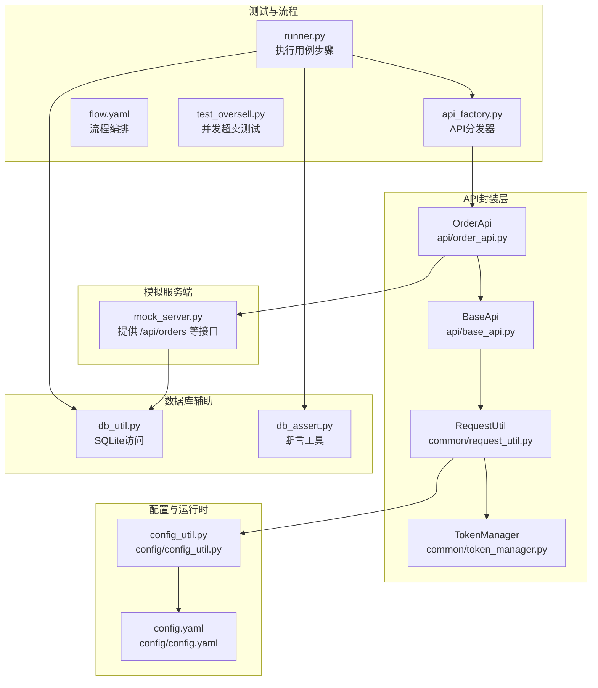
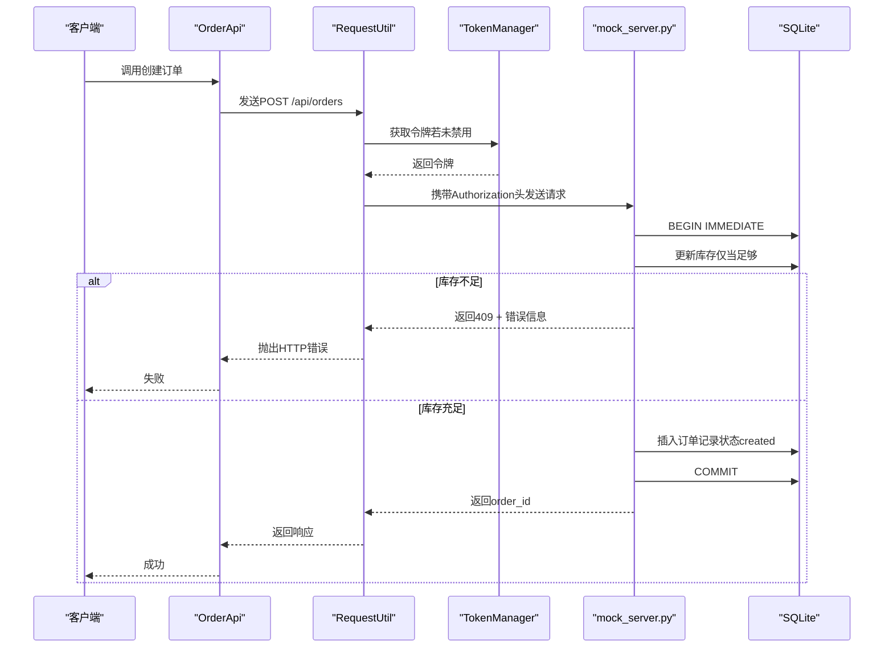
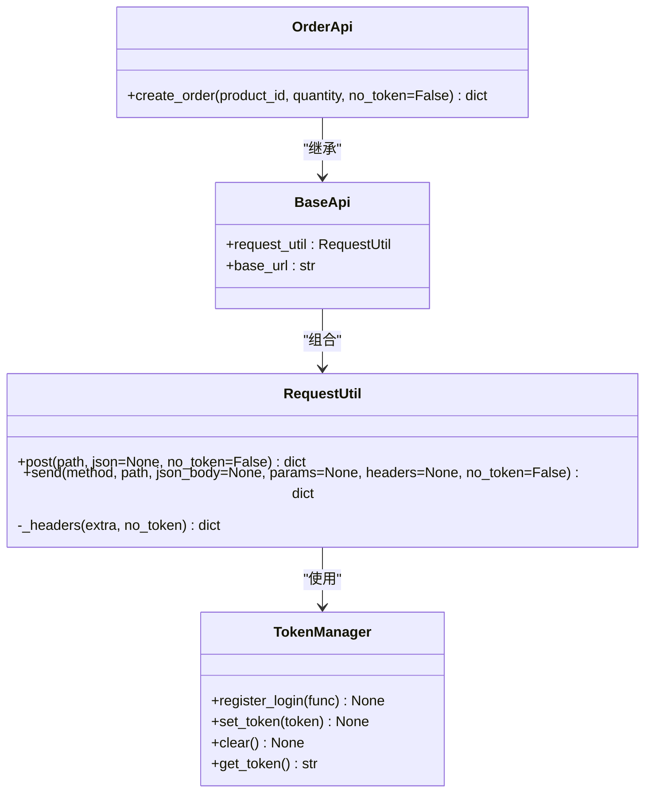
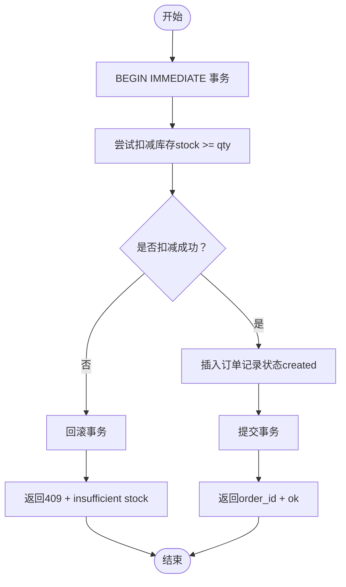
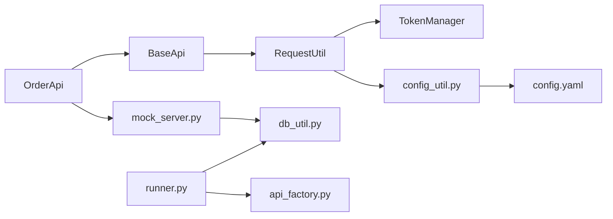

# 订单处理API

<cite>
**本文引用的文件**
- [api/order_api.py](file://api/order_api.py)
- [api/base_api.py](file://api/base_api.py)
- [common/request_util.py](file://common/request_util.py)
- [common/token_manager.py](file://common/token_manager.py)
- [config/config_util.py](file://config/config_util.py)
- [config/config.yaml](file://config/config.yaml)
- [mock_server.py](file://mock_server.py)
- [common/db_util.py](file://common/db_util.py)
- [common/db_assert.py](file://common/db_assert.py)
- [common/runner.py](file://common/runner.py)
- [common/api_factory.py](file://common/api_factory.py)
- [data/flow.yaml](file://data/flow.yaml)
- [testcase/test_oversell.py](file://testcase/test_oversell.py)
</cite>

## 目录
1. [简介](#简介)
2. [项目结构](#项目结构)
3. [核心组件](#核心组件)
4. [架构总览](#架构总览)
5. [详细组件分析](#详细组件分析)
6. [依赖分析](#依赖分析)
7. [性能考虑](#性能考虑)
8. [故障排查指南](#故障排查指南)
9. [结论](#结论)
10. [附录](#附录)

## 简介
本文件面向“订单处理API”的使用者与维护者，系统化阐述订单生命周期管理的实现细节，包括订单创建、查询、状态变更与并发控制。文档基于仓库中的真实代码与测试用例，给出RESTful接口规范、状态流转机制、并发控制策略、库存扣减与事务处理要点，并提供最佳实践建议。

## 项目结构
该工程采用分层与按功能模块组织的结构：API封装层负责对外暴露REST接口；通用工具层提供请求发送、认证令牌、配置加载、数据库访问与断言等能力；模拟服务端提供订单、支付、用户、商品等接口的实现；测试用例与流程编排用于验证业务流与并发场景。

图表来源
- [api/order_api.py:1-15](file://api/order_api.py#L1-L15)
- [api/base_api.py:1-11](file://api/base_api.py#L1-L11)
- [common/request_util.py:1-66](file://common/request_util.py#L1-L66)
- [common/token_manager.py:1-38](file://common/token_manager.py#L1-L38)
- [config/config_util.py:1-112](file://config/config_util.py#L1-L112)
- [config/config.yaml:1-10](file://config/config.yaml#L1-L10)
- [mock_server.py:232-321](file://mock_server.py#L232-L321)
- [common/runner.py:1-45](file://common/runner.py#L1-L45)
- [common/api_factory.py:1-27](file://common/api_factory.py#L1-L27)
- [data/flow.yaml:1-41](file://data/flow.yaml#L1-L41)
- [testcase/test_oversell.py:1-40](file://testcase/test_oversell.py#L1-L40)
- [common/db_util.py:1-35](file://common/db_util.py#L1-L35)
- [common/db_assert.py:1-17](file://common/db_assert.py#L1-L17)

章节来源
- [api/order_api.py:1-15](file://api/order_api.py#L1-L15)
- [api/base_api.py:1-11](file://api/base_api.py#L1-L11)
- [common/request_util.py:1-66](file://common/request_util.py#L1-L66)
- [common/token_manager.py:1-38](file://common/token_manager.py#L1-L38)
- [config/config_util.py:1-112](file://config/config_util.py#L1-L112)
- [config/config.yaml:1-10](file://config/config.yaml#L1-L10)
- [mock_server.py:232-321](file://mock_server.py#L232-L321)
- [common/runner.py:1-45](file://common/runner.py#L1-L45)
- [common/api_factory.py:1-27](file://common/api_factory.py#L1-L27)
- [data/flow.yaml:1-41](file://data/flow.yaml#L1-L41)
- [testcase/test_oversell.py:1-40](file://testcase/test_oversell.py#L1-L40)
- [common/db_util.py:1-35](file://common/db_util.py#L1-L35)
- [common/db_assert.py:1-17](file://common/db_assert.py#L1-L17)

## 核心组件
- OrderApi：封装订单相关API调用，当前提供创建订单的能力。
- BaseApi：统一注入请求工具与基础URL，屏蔽具体实现细节。
- RequestUtil：封装HTTP请求发送逻辑，支持自动拼接基础URL、动态头信息、请求/响应Allure附件、错误处理等。
- TokenManager：线程安全的令牌管理器，支持注册登录函数、设置/清除令牌、并发安全获取。
- 配置系统：通过config_util加载config.yaml及环境覆盖，提供基础URL、数据库路径、默认用户等。
- 模拟服务端：实现订单列表查询、订单创建（含库存校验与事务）、支付状态更新等接口。
- 数据库工具：SQLite访问封装，提供单行查询、多行查询与执行提交。
- 断言工具：用于流程编排中的响应断言与提取。
- 流程编排与API分发：通过api_factory集中注册API步骤，runner按步骤执行并注入上下文。

章节来源
- [api/order_api.py:8-15](file://api/order_api.py#L8-L15)
- [api/base_api.py:7-11](file://api/base_api.py#L7-L11)
- [common/request_util.py:13-66](file://common/request_util.py#L13-L66)
- [common/token_manager.py:8-38](file://common/token_manager.py#L8-L38)
- [config/config_util.py:64-112](file://config/config_util.py#L64-L112)
- [mock_server.py:232-321](file://mock_server.py#L232-L321)
- [common/db_util.py:9-35](file://common/db_util.py#L9-L35)
- [common/assert_util.py:6-15](file://common/assert_util.py#L6-L15)
- [common/api_factory.py:12-27](file://common/api_factory.py#L12-L27)
- [common/runner.py:15-45](file://common/runner.py#L15-L45)

## 架构总览
下图展示了从客户端到服务端的关键交互路径，以及并发控制与事务处理在服务端的落地方式。

图表来源
- [api/order_api.py:9-14](file://api/order_api.py#L9-L14)
- [common/request_util.py:18-58](file://common/request_util.py#L18-L58)
- [common/token_manager.py:28-37](file://common/token_manager.py#L28-L37)
- [mock_server.py:269-289](file://mock_server.py#L269-L289)

## 详细组件分析

### 订单API类与调用链
- OrderApi.create_order：封装POST /api/orders，传入product_id与quantity，返回响应字典。
- BaseApi：持有RequestUtil实例与基础URL，确保所有子API共享一致的请求行为。
- RequestUtil：负责构造URL、拼接Authorization头、发送请求、记录Allure附件、抛出HTTP错误。

图表来源
- [api/order_api.py:8-15](file://api/order_api.py#L8-L15)
- [api/base_api.py:7-11](file://api/base_api.py#L7-L11)
- [common/request_util.py:13-66](file://common/request_util.py#L13-L66)
- [common/token_manager.py:8-38](file://common/token_manager.py#L8-L38)

章节来源
- [api/order_api.py:8-15](file://api/order_api.py#L8-L15)
- [api/base_api.py:7-11](file://api/base_api.py#L7-L11)
- [common/request_util.py:13-66](file://common/request_util.py#L13-L66)
- [common/token_manager.py:8-38](file://common/token_manager.py#L8-L38)

### 订单创建接口规范
- 接口路径：/api/orders
- 方法：POST
- 请求头：
  - Content-Type: application/json
  - Authorization: Bearer <token>（除非显式禁用）
- 请求体字段：
  - product_id: 整数，目标商品ID
  - quantity: 整数，购买数量（默认1）
- 响应：
  - 成功：返回order_id与ok标志
  - 库存不足：返回409与错误信息
  - 其他错误：由服务端抛出HTTP错误

并发与事务要点（服务端实现）：
- 使用BEGIN IMMEDIATE开启事务，避免写冲突。
- 先尝试以“stock >= qty”条件更新库存，若影响行数不为1则回滚并报错。
- 库存扣减成功后插入订单记录，状态初始化为created，随后提交事务。

章节来源
- [mock_server.py:232-289](file://mock_server.py#L232-L289)
- [common/request_util.py:18-58](file://common/request_util.py#L18-L58)

### 订单列表查询接口规范
- 接口路径：/api/orders
- 方法：GET
- 响应字段：
  - id: 订单ID
  - user_id: 用户ID
  - username: 用户名
  - product_id: 商品ID
  - product_name: 商品名称
  - quantity: 数量
  - status: 订单状态（如created）

章节来源
- [mock_server.py:234-262](file://mock_server.py#L234-L262)

### 支付状态更新接口规范
- 接口路径：/api/pay
- 方法：POST
- 请求头：
  - Authorization: Bearer <token>
- 请求体字段：
  - order_id: 整数，待支付订单ID
- 响应：
  - 成功：返回ok与当前状态（如paid）
  - 未找到：返回404与错误信息

章节来源
- [mock_server.py:292-315](file://mock_server.py#L292-L315)

### 并发控制与库存扣减流程
以下流程图展示了服务端在创建订单时的并发控制与事务处理：

图表来源
- [mock_server.py:269-289](file://mock_server.py#L269-L289)

章节来源
- [mock_server.py:269-289](file://mock_server.py#L269-L289)
- [testcase/test_oversell.py:13-40](file://testcase/test_oversell.py#L13-L40)

### 订单状态流转机制
- 创建订单：状态初始为created。
- 支付完成：将状态更新为paid。
- 取消/退款：可在服务端扩展，当前仓库未提供取消接口。

章节来源
- [mock_server.py:279-281](file://mock_server.py#L279-L281)
- [mock_server.py:308-312](file://mock_server.py#L308-L312)

### 订单数据验证与异常处理
- 请求体验证：服务端会解析JSON并转换类型（如product_id、quantity），若缺失或类型不符将触发错误。
- 认证校验：Authorization头必须为Bearer token，否则401。
- 库存校验：仅当库存充足时才允许创建订单，否则409。
- 事务一致性：使用BEGIN IMMEDIATE保证原子性，失败即回滚。
- 客户端错误：RequestUtil在非JSON响应时捕获异常并记录原始文本，同时抛出HTTP错误。

章节来源
- [mock_server.py:263-289](file://mock_server.py#L263-L289)
- [common/request_util.py:47-58](file://common/request_util.py#L47-L58)

### 使用示例：如何使用OrderApi进行订单操作
- 创建订单：调用OrderApi.create_order(product_id, quantity, no_token=False)，返回响应字典。
- 在流程编排中：可通过api_factory注册的“order.create_order”步骤，结合flow.yaml与runner执行完整业务流。

章节来源
- [api/order_api.py:9-14](file://api/order_api.py#L9-L14)
- [common/api_factory.py:16](file://common/api_factory.py#L16)
- [data/flow.yaml:28-33](file://data/flow.yaml#L28-L33)
- [common/runner.py:30-31](file://common/runner.py#L30-L31)

## 依赖分析
- 组件耦合：
  - OrderApi依赖BaseApi，BaseApi依赖RequestUtil与配置系统。
  - RequestUtil依赖TokenManager与配置系统，用于动态生成请求头与URL。
  - 测试与流程编排依赖api_factory与runner，形成可扩展的步骤执行框架。
- 外部依赖：
  - SQLite：作为本地存储，提供事务与并发控制的基础能力。
  - Flask：作为模拟服务端，承载订单、支付等接口。
  - requests：用于HTTP请求发送。
  - allure：用于请求/响应附件记录。

图表来源
- [api/order_api.py:8-15](file://api/order_api.py#L8-L15)
- [api/base_api.py:7-11](file://api/base_api.py#L7-L11)
- [common/request_util.py:13-66](file://common/request_util.py#L13-L66)
- [common/token_manager.py:8-38](file://common/token_manager.py#L8-L38)
- [config/config_util.py:64-112](file://config/config_util.py#L64-L112)
- [config/config.yaml:1-10](file://config/config.yaml#L1-10)
- [mock_server.py:232-321](file://mock_server.py#L232-L321)
- [common/db_util.py:9-35](file://common/db_util.py#L9-L35)
- [common/runner.py:15-45](file://common/runner.py#L15-L45)
- [common/api_factory.py:12-27](file://common/api_factory.py#L12-L27)

章节来源
- [api/order_api.py:8-15](file://api/order_api.py#L8-L15)
- [api/base_api.py:7-11](file://api/base_api.py#L7-L11)
- [common/request_util.py:13-66](file://common/request_util.py#L13-L66)
- [common/token_manager.py:8-38](file://common/token_manager.py#L8-L38)
- [config/config_util.py:64-112](file://config/config_util.py#L64-L112)
- [config/config.yaml:1-10](file://config/config.yaml#L1-10)
- [mock_server.py:232-321](file://mock_server.py#L232-L321)
- [common/db_util.py:9-35](file://common/db_util.py#L9-L35)
- [common/runner.py:15-45](file://common/runner.py#L15-L45)
- [common/api_factory.py:12-27](file://common/api_factory.py#L12-L27)

## 性能考虑
- 连接池与会话：RequestUtil使用requests.Session复用连接，减少TCP握手开销。
- 并发与锁：TokenManager使用线程锁保护令牌缓存，避免竞态。
- 事务粒度：服务端在创建订单时使用BEGIN IMMEDIATE，尽量缩短事务持续时间，降低锁竞争。
- 超卖防护：通过“库存>=数量”的条件更新与行计数判断，避免超卖。
- 日志与监控：Allure附件记录请求/响应，便于问题定位与性能分析。

## 故障排查指南
- 401未授权：检查Authorization头是否为Bearer token，确认已登录并成功获取token。
- 409库存不足：检查商品库存与下单数量，确保库存充足。
- 404订单不存在：确认order_id有效且属于当前用户。
- HTTP错误抛出：RequestUtil在非2xx时raise_for_status，注意捕获并记录响应体。
- 并发超卖：参考test_oversell.py，使用高并发场景验证库存一致性。

章节来源
- [common/request_util.py:47-58](file://common/request_util.py#L47-L58)
- [mock_server.py:275-277](file://mock_server.py#L275-L277)
- [testcase/test_oversell.py:13-40](file://testcase/test_oversell.py#L13-L40)

## 结论
本项目通过清晰的分层设计与严格的并发控制，在本地模拟环境中实现了订单创建、查询与支付状态更新的完整流程。OrderApi提供了简洁的调用入口，配合RequestUtil与TokenManager，能够满足大多数集成测试与自动化流程的需求。建议在生产环境中进一步完善取消/退款等状态变更接口，并引入更完善的日志与监控体系。

## 附录

### RESTful接口清单
- GET /api/orders
  - 功能：查询订单列表
  - 响应字段：id, user_id, username, product_id, product_name, quantity, status
- POST /api/orders
  - 功能：创建订单
  - 请求体：product_id, quantity
  - 成功响应：order_id, ok
  - 失败响应：409 + insufficient stock 或其他HTTP错误
- POST /api/pay
  - 功能：支付订单
  - 请求体：order_id
  - 成功响应：ok, status
  - 失败响应：404 + not found 或其他HTTP错误

章节来源
- [mock_server.py:234-262](file://mock_server.py#L234-L262)
- [mock_server.py:265-289](file://mock_server.py#L265-L289)
- [mock_server.py:294-315](file://mock_server.py#L294-L315)