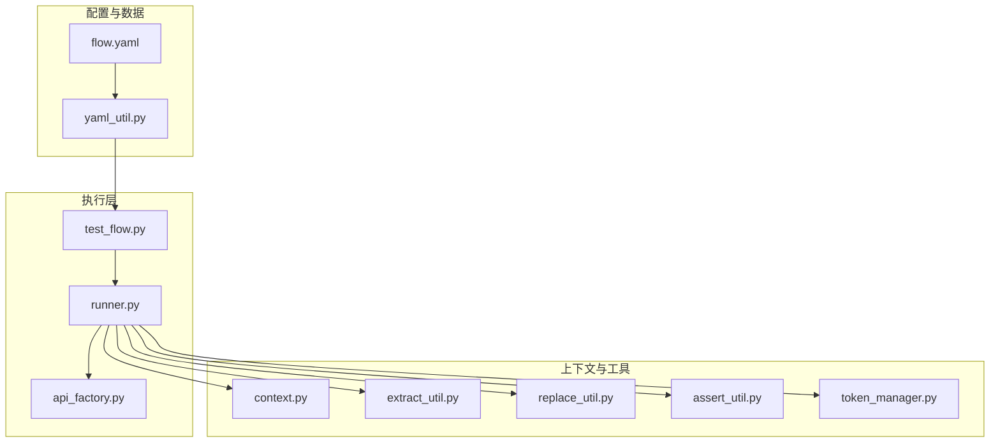
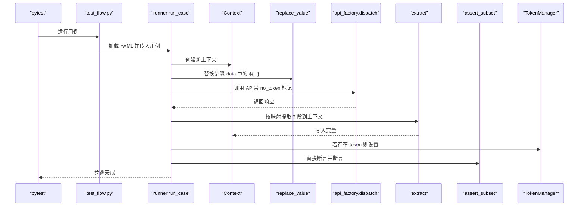
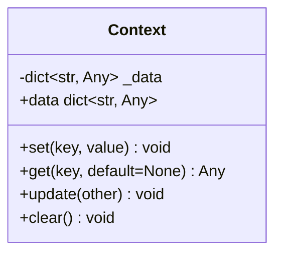
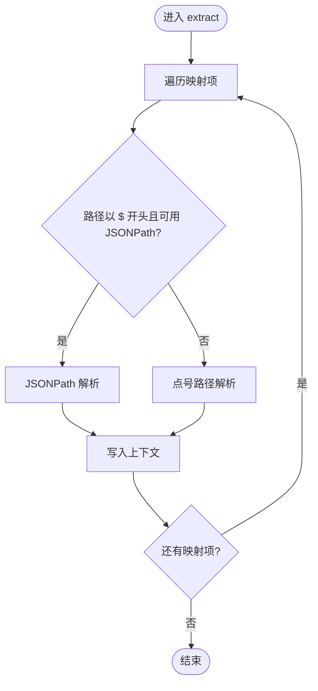
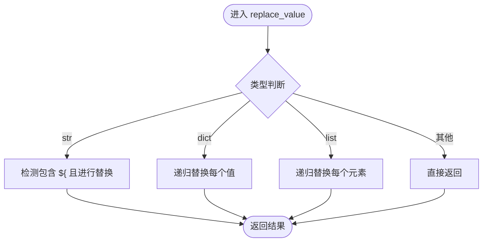
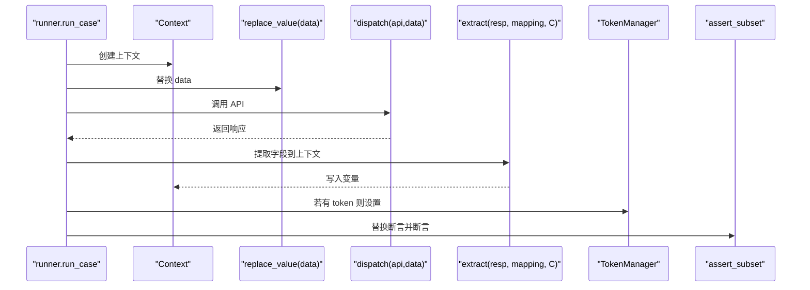
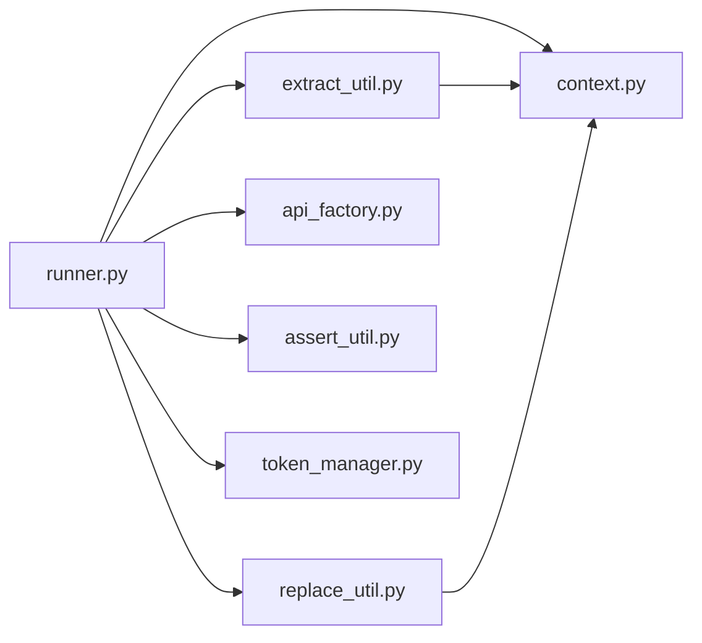

# 上下文管理

<cite>
**本文档引用的文件**
- [context.py](file://common/context.py)
- [extract_util.py](file://common/extract_util.py)
- [replace_util.py](file://common/replace_util.py)
- [runner.py](file://common/runner.py)
- [yaml_util.py](file://common/yaml_util.py)
- [flow.yaml](file://data/flow.yaml)
- [test_flow.py](file://testcase/test_flow.py)
- [token_manager.py](file://common/token_manager.py)
- [api_factory.py](file://common/api_factory.py)
- [assert_util.py](file://common/assert_util.py)
- [conftest.py](file://conftest.py)
</cite>

## 目录
1. [简介](#简介)
2. [项目结构](#项目结构)
3. [核心组件](#核心组件)
4. [架构总览](#架构总览)
5. [详细组件分析](#详细组件分析)
6. [依赖分析](#依赖分析)
7. [性能考虑](#性能考虑)
8. [故障排查指南](#故障排查指南)
9. [结论](#结论)
10. [附录](#附录)

## 简介
本文件系统性阐述上下文变量管理系统的设计与实现，覆盖参数提取、变量替换与状态管理机制；详解 extract_util 的参数提取能力与 replace_util 的变量替换算法；说明上下文变量在测试流程中的传递与作用域管理；给出 YAML 测试步骤中使用上下文变量的具体示例；并提供变量生命周期管理与内存优化策略建议。

## 项目结构
该系统围绕“上下文”展开，关键模块如下：
- 上下文容器：用于存储键值对，支持设置、读取、批量更新与清理
- 参数提取：从响应对象中按路径提取字段，并写入上下文
- 变量替换：在字符串、字典、列表等结构中解析占位符并替换为上下文值
- 执行器：按步骤执行 API 调用，串联提取与断言
- 配置加载：从 YAML 文件加载测试用例
- 断言工具：递归断言期望子集
- 令牌管理：全局线程安全的令牌注册与缓存

图表来源
- [flow.yaml:1-41](file://data/flow.yaml#L1-L41)
- [yaml_util.py:11-15](file://common/yaml_util.py#L11-L15)
- [test_flow.py:9-16](file://testcase/test_flow.py#L9-L16)
- [runner.py:15-45](file://common/runner.py#L15-L45)
- [api_factory.py:21-28](file://common/api_factory.py#L21-L28)
- [context.py:6-25](file://common/context.py#L6-L25)
- [extract_util.py:43-50](file://common/extract_util.py#L43-L50)
- [replace_util.py:22-32](file://common/replace_util.py#L22-L32)
- [assert_util.py:6-15](file://common/assert_util.py#L6-L15)
- [token_manager.py:8-38](file://common/token_manager.py#L8-L38)

章节来源
- [flow.yaml:1-41](file://data/flow.yaml#L1-L41)
- [yaml_util.py:11-15](file://common/yaml_util.py#L11-L15)
- [test_flow.py:9-16](file://testcase/test_flow.py#L9-L16)
- [runner.py:15-45](file://common/runner.py#L15-L45)
- [api_factory.py:21-28](file://common/api_factory.py#L21-L28)

## 核心组件
- Context：轻量级字典包装器，提供 set/get/update/clear/data 访问接口，作为上下文变量的唯一载体
- extract：从响应对象按路径提取字段，支持点号路径与 JSONPath（可选），写入上下文
- replace_value：递归替换任意结构中的占位符 ${key}，支持字符串、字典、列表
- runner：按步骤执行 API 调用，负责上下文的创建、替换、提取与断言
- yaml_util：统一加载 YAML 数据，供测试用例驱动
- assert_subset：深度断言响应是否包含期望子集
- TokenManager：全局线程安全令牌管理，自动登录与缓存

章节来源
- [context.py:6-25](file://common/context.py#L6-L25)
- [extract_util.py:43-50](file://common/extract_util.py#L43-L50)
- [replace_util.py:22-32](file://common/replace_util.py#L22-L32)
- [runner.py:15-45](file://common/runner.py#L15-L45)
- [yaml_util.py:11-15](file://common/yaml_util.py#L11-L15)
- [assert_util.py:6-15](file://common/assert_util.py#L6-L15)
- [token_manager.py:8-38](file://common/token_manager.py#L8-L38)

## 架构总览
上下文管理贯穿“加载用例 → 解析替换 → 执行 API → 提取变量 → 断言结果”的完整链路。每条测试步骤在独立的上下文中运行，确保变量作用域隔离；跨步骤通过上下文共享变量，形成端到端流程。

图表来源
- [test_flow.py:14-16](file://testcase/test_flow.py#L14-L16)
- [runner.py:15-45](file://common/runner.py#L15-L45)
- [replace_util.py:22-32](file://common/replace_util.py#L22-L32)
- [api_factory.py:21-28](file://common/api_factory.py#L21-L28)
- [extract_util.py:43-50](file://common/extract_util.py#L43-L50)
- [assert_util.py:6-15](file://common/assert_util.py#L6-L15)
- [token_manager.py:18-37](file://common/token_manager.py#L18-L37)

## 详细组件分析

### Context 上下文容器
- 设计要点
  - 单一职责：封装字典，提供最小 API 集合
  - 不暴露内部结构：通过 data 属性返回副本，避免外部修改
  - 作用域边界：每个步骤拥有独立 Context 实例，避免变量泄漏
- 复杂度
  - set/get/update/clear 均为 O(1) 字典操作
- 错误处理
  - get 支持默认值，避免 KeyError
- 性能影响
  - 小对象字典，内存开销极低；频繁读写成本可忽略

图表来源
- [context.py:6-25](file://common/context.py#L6-L25)

章节来源
- [context.py:6-25](file://common/context.py#L6-L25)

### extract_util 参数提取
- 功能概述
  - 将响应对象中的字段按路径映射写入上下文
  - 支持两种路径风格：
    - 点号路径：如 data.id、user.profile.name
    - JSONPath：以 $ 开头，如 $..id，需安装 jsonpath-ng 扩展
- 算法流程
  - 对每个映射项，调用内部路径解析函数
  - 若路径以 $ 开头且可用 JSONPath，则走 JSONPath 分支
  - 否则逐段解析点号路径，遇到 None 或非 dict 结构则返回 None
  - 将提取结果写入上下文
- 复杂度
  - 点号路径：O(p)，p 为路径段数
  - JSONPath：取决于表达式复杂度与匹配数量
- 错误处理
  - 未安装 JSONPath 时降级为不支持 $ 开头路径
  - 无匹配或类型不兼容时返回 None
- 使用场景
  - 从登录响应提取 token
  - 从创建资源响应提取 id
  - 从列表中提取多个匹配项

图表来源
- [extract_util.py:43-50](file://common/extract_util.py#L43-L50)
- [extract_util.py:14-29](file://common/extract_util.py#L14-L29)
- [extract_util.py:32-40](file://common/extract_util.py#L32-L40)

章节来源
- [extract_util.py:43-50](file://common/extract_util.py#L43-L50)
- [extract_util.py:14-29](file://common/extract_util.py#L14-L29)
- [extract_util.py:32-40](file://common/extract_util.py#L32-L40)

### replace_util 变量替换
- 功能概述
  - 在字符串中识别 ${key} 占位符并替换为上下文值
  - 递归处理字典与列表，保持结构不变
- 算法流程
  - 字符串：编译正则匹配 ${key}，逐个替换
  - 字典：递归替换每个值
  - 列表：递归替换每个元素
  - 其他类型：原样返回
- 错误处理
  - 若上下文中不存在对应 key，抛出 KeyError
- 复杂度
  - 字符串替换：O(n)（n 为字符串长度）
  - 结构递归：O(N)（N 为节点总数）

图表来源
- [replace_util.py:22-32](file://common/replace_util.py#L22-L32)
- [replace_util.py:11-19](file://common/replace_util.py#L11-L19)

章节来源
- [replace_util.py:22-32](file://common/replace_util.py#L22-L32)
- [replace_util.py:11-19](file://common/replace_util.py#L11-L19)

### runner 执行器与上下文传递
- 生命周期
  - 每个用例创建一个独立 Context
  - 每个步骤在该 Context 中执行，步骤间变量不共享
- 关键流程
  - 替换步骤 data 中的 ${...}
  - 调用 API 并接收响应
  - 若存在 extract 映射，提取字段写入上下文
  - 若提取到 token，更新 TokenManager
  - 替换断言并执行断言
- 错误处理
  - 缺少 api 字段时报错
  - extract 必须为字典类型
  - 变量缺失时替换阶段抛错

图表来源
- [runner.py:15-45](file://common/runner.py#L15-L45)
- [replace_util.py:22-32](file://common/replace_util.py#L22-L32)
- [api_factory.py:21-28](file://common/api_factory.py#L21-L28)
- [extract_util.py:43-50](file://common/extract_util.py#L43-L50)
- [token_manager.py:18-37](file://common/token_manager.py#L18-L37)
- [assert_util.py:6-15](file://common/assert_util.py#L6-L15)

章节来源
- [runner.py:15-45](file://common/runner.py#L15-L45)

### YAML 测试步骤中的上下文变量使用
- 示例说明
  - 在 data 中使用 ${product_id} 引用上一步提取的变量
  - 在断言中使用 ${order_id} 引用上一步提取的变量
  - 通过 extract 将 token 写入上下文，后续步骤可直接使用
- 作用域
  - 每个步骤拥有独立上下文，变量仅在当前步骤有效
  - 跨步骤变量通过上下文传递，形成端到端流程

章节来源
- [flow.yaml:17-18](file://data/flow.yaml#L17-L18)
- [flow.yaml:25-26](file://data/flow.yaml#L25-L26)
- [flow.yaml:30-31](file://data/flow.yaml#L30-L31)
- [flow.yaml:37-38](file://data/flow.yaml#L37-L38)

## 依赖分析
- 组件耦合
  - runner 依赖 replace_util、extract_util、api_factory、assert_util、token_manager、context
  - extract_util 依赖 context
  - replace_util 依赖 context
  - api_factory 与具体 API 实现解耦
- 外部依赖
  - JSONPath 可选依赖，未安装时 extract 仍可工作但不支持 $ 开头路径
- 循环依赖
  - 无循环依赖，模块职责清晰

图表来源
- [runner.py:15-45](file://common/runner.py#L15-L45)
- [replace_util.py:22-32](file://common/replace_util.py#L22-L32)
- [extract_util.py:43-50](file://common/extract_util.py#L43-L50)
- [api_factory.py:21-28](file://common/api_factory.py#L21-L28)
- [assert_util.py:6-15](file://common/assert_util.py#L6-L15)
- [token_manager.py:8-38](file://common/token_manager.py#L8-L38)
- [context.py:6-25](file://common/context.py#L6-L25)

章节来源
- [runner.py:15-45](file://common/runner.py#L15-L45)
- [replace_util.py:22-32](file://common/replace_util.py#L22-L32)
- [extract_util.py:43-50](file://common/extract_util.py#L43-L50)
- [api_factory.py:21-28](file://common/api_factory.py#L21-L28)
- [assert_util.py:6-15](file://common/assert_util.py#L6-L15)
- [token_manager.py:8-38](file://common/token_manager.py#L8-L38)
- [context.py:6-25](file://common/context.py#L6-L25)

## 性能考虑
- 字符串替换
  - replace_value 对字符串使用正则替换，建议避免在超大字符串中频繁替换
  - 可通过减少不必要的 ${...} 占位符降低开销
- 结构递归
  - 对深层嵌套结构，递归替换会增加调用栈；建议控制数据层级
- JSONPath
  - JSONPath 表达式越复杂，匹配成本越高；仅在必要时使用
- 上下文大小
  - Context 为小字典，内存占用极低；但过多变量会增加序列化/日志输出成本
- 线程安全
  - TokenManager 使用锁保护，避免并发问题；在高并发场景下注意锁竞争

## 故障排查指南
- 缺少上下文变量导致替换失败
  - 现象：替换字符串时报 KeyError
  - 排查：确认前序步骤已正确提取变量；检查 extract 映射是否正确
- JSONPath 不生效
  - 现象：以 $ 开头的路径无效
  - 排查：确认已安装 jsonpath-ng；否则改用点号路径
- 断言失败
  - 现象：断言报错提示缺少键或值不匹配
  - 排查：使用 replace_value 替换断言后再断言；核对期望结构
- 令牌未设置
  - 现象：后续步骤鉴权失败
  - 排查：确认 extract 中包含 token；确认 TokenManager 已注册登录函数

章节来源
- [replace_util.py:11-19](file://common/replace_util.py#L11-L19)
- [extract_util.py:32-40](file://common/extract_util.py#L32-L40)
- [assert_util.py:6-15](file://common/assert_util.py#L6-L15)
- [token_manager.py:18-37](file://common/token_manager.py#L18-L37)

## 结论
上下文变量管理系统以 Context 为核心，结合 replace_value 的递归替换与 extract 的灵活提取，实现了测试流程中变量的可靠传递与作用域隔离。通过 YAML 驱动的步骤化执行，系统具备良好的可维护性与扩展性。建议在实际使用中遵循变量命名规范、合理拆分步骤、避免过度复杂的 JSONPath 表达式，并在高并发场景下关注 TokenManager 的锁竞争。

## 附录

### 使用示例：YAML 测试步骤中的上下文变量
- 在 data 中引用变量
  - 示例：使用 ${product_id} 作为请求参数
- 在断言中引用变量
  - 示例：断言响应中包含 ${order_id}
- 提取变量
  - 示例：从响应中提取 token 与 id，并写入上下文

章节来源
- [flow.yaml:17-18](file://data/flow.yaml#L17-L18)
- [flow.yaml:25-26](file://data/flow.yaml#L25-L26)
- [flow.yaml:30-31](file://data/flow.yaml#L30-L31)
- [flow.yaml:37-38](file://data/flow.yaml#L37-L38)

### 变量生命周期与内存优化策略
- 生命周期
  - 每个步骤创建独立 Context，步骤结束后变量随上下文销毁
  - 跨步骤变量通过 extract 显式传递
- 内存优化
  - 控制上下文变量数量，避免冗余字段
  - 对大型响应只提取必要字段
  - 避免在断言中构造过深嵌套结构
  - 减少不必要的 ${...} 占位符