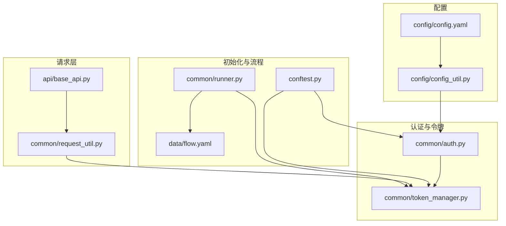
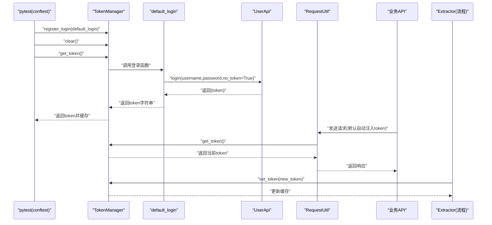
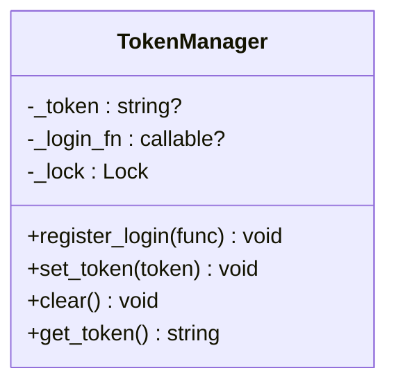
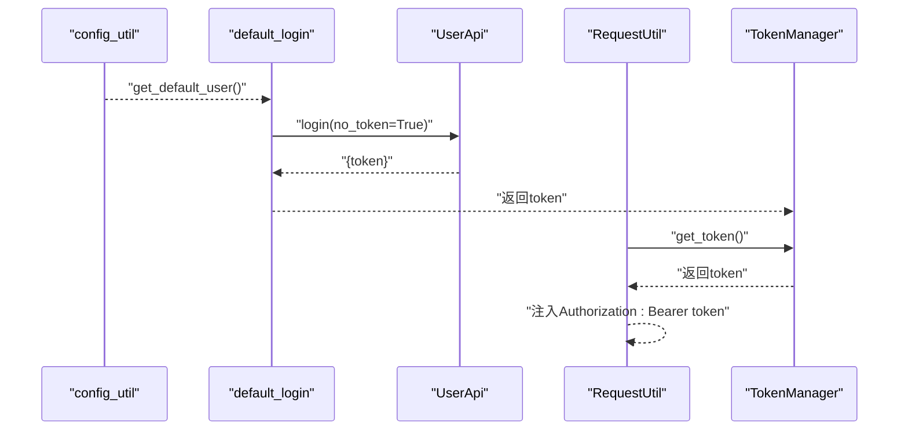
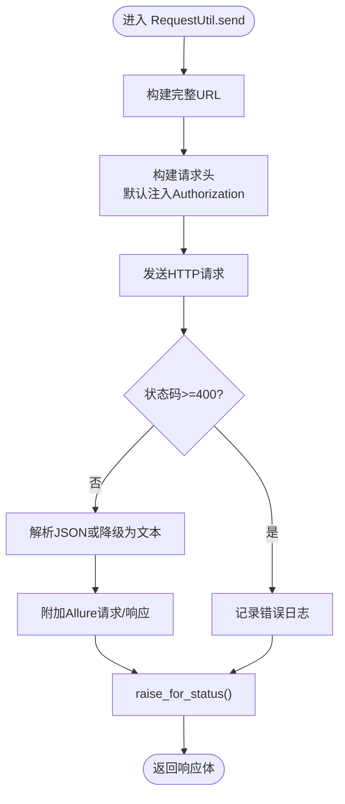
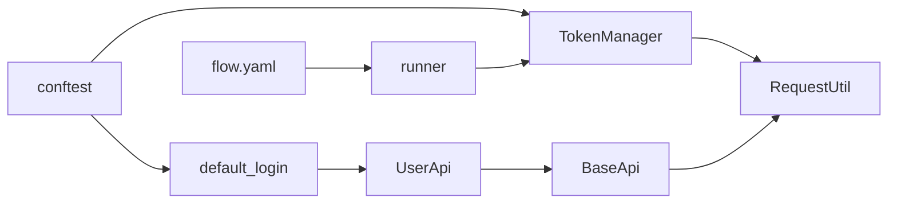

# 令牌管理

<cite>
**本文引用的文件**
- [token_manager.py](file://common/token_manager.py)
- [auth.py](file://common/auth.py)
- [request_util.py](file://common/request_util.py)
- [config_util.py](file://config/config_util.py)
- [config.yaml](file://config/config.yaml)
- [conftest.py](file://conftest.py)
- [base_api.py](file://api/base_api.py)
- [user_api.py](file://api/user_api.py)
- [runner.py](file://common/runner.py)
- [flow.yaml](file://data/flow.yaml)
</cite>

## 目录
1. [简介](#简介)
2. [项目结构](#项目结构)
3. [核心组件](#核心组件)
4. [架构总览](#架构总览)
5. [详细组件分析](#详细组件分析)
6. [依赖分析](#依赖分析)
7. [性能考虑](#性能考虑)
8. [故障排查指南](#故障排查指南)
9. [结论](#结论)
10. [附录](#附录)

## 简介
本文件聚焦于令牌管理子系统，系统性阐述 TokenManager 的线程安全设计与实现机制，包括令牌生成、缓存与自动刷新策略；详解 auth 模块的认证流程与令牌验证机制；说明多线程环境下令牌管理的挑战与解决方案；给出令牌使用示例与最佳实践；涵盖过期处理、错误重试与性能优化策略；并解释与 RequestUtil 的集成方式及自动注入机制。

## 项目结构
围绕令牌管理的关键文件组织如下：
- 认证与令牌管理：common/auth.py、common/token_manager.py
- 请求封装与自动注入：common/request_util.py、api/base_api.py
- 配置与默认用户：config/config_util.py、config/config.yaml
- 初始化与自动登录：conftest.py
- 流程执行与令牌更新：common/runner.py、data/flow.yaml

图表来源
- [config.yaml:1-10](file://config/config.yaml#L1-L10)
- [config_util.py:105-112](file://config/config_util.py#L105-L112)
- [auth.py:7-11](file://common/auth.py#L7-L11)
- [token_manager.py:8-37](file://common/token_manager.py#L8-L37)
- [base_api.py:7-11](file://api/base_api.py#L7-L11)
- [request_util.py:29-117](file://common/request_util.py#L29-L117)
- [conftest.py:37-48](file://conftest.py#L37-L48)
- [runner.py:47-49](file://common/runner.py#L47-L49)
- [flow.yaml:12-18](file://data/flow.yaml#L12-L18)

章节来源
- [config.yaml:1-10](file://config/config.yaml#L1-L10)
- [config_util.py:105-112](file://config/config_util.py#L105-L112)
- [auth.py:7-11](file://common/auth.py#L7-L11)
- [token_manager.py:8-37](file://common/token_manager.py#L8-L37)
- [base_api.py:7-11](file://api/base_api.py#L7-L11)
- [request_util.py:29-117](file://common/request_util.py#L29-L117)
- [conftest.py:37-48](file://conftest.py#L37-L48)
- [runner.py:47-49](file://common/runner.py#L47-L49)
- [flow.yaml:12-18](file://data/flow.yaml#L12-L18)

## 核心组件
- TokenManager：全局单例式的令牌管理器，提供注册登录函数、设置/清除令牌、获取令牌等方法。通过类级锁保证线程安全。
- default_login：默认登录函数，读取配置中的默认用户凭据，调用 UserApi 登录并返回 token。
- RequestUtil：统一请求入口，内部持有 requests.Session，默认自动注入 Authorization: Bearer token（除非显式 no_token=True）。
- BaseApi：API 基类，每个具体 API 类继承该基类以获得统一的 RequestUtil 实例与 base_url。
- conftest：pytest 会话级初始化，注册登录函数、清理旧令牌、预取一次令牌，确保后续测试可用。
- runner：流程执行器，从响应中提取 token 并通过 TokenManager.set_token 更新缓存。

章节来源
- [token_manager.py:8-37](file://common/token_manager.py#L8-L37)
- [auth.py:7-11](file://common/auth.py#L7-L11)
- [request_util.py:29-117](file://common/request_util.py#L29-L117)
- [base_api.py:7-11](file://api/base_api.py#L7-L11)
- [conftest.py:37-48](file://conftest.py#L37-L48)
- [runner.py:47-49](file://common/runner.py#L47-L49)

## 架构总览
下图展示令牌管理在系统中的位置与交互关系：初始化阶段注册登录函数并预取令牌；请求阶段由 RequestUtil 自动注入令牌；流程执行阶段可从响应中提取新 token 并更新缓存。

图表来源
- [conftest.py:37-48](file://conftest.py#L37-L48)
- [auth.py:7-11](file://common/auth.py#L7-L11)
- [user_api.py:16-21](file://api/user_api.py#L16-L21)
- [request_util.py:48-55](file://common/request_util.py#L48-L55)
- [runner.py:47-49](file://common/runner.py#L47-L49)

## 详细组件分析

### TokenManager 线程安全设计与实现
- 设计要点
  - 类级状态：类变量保存当前 token 与登录函数，避免实例化带来的状态分散。
  - 类级锁：所有读写操作均包裹类级锁，确保多线程并发安全。
  - 惰性加载：首次访问时才触发登录函数获取 token，并缓存到类变量中。
  - 显式控制：提供 clear/set_token 接口，允许外部在流程中主动更新缓存。
- 关键方法
  - register_login(func)：注册登录函数，供惰性加载时调用。
  - set_token(token)：设置缓存的 token（可为 None 清空）。
  - clear()：清空缓存，强制下次访问时重新登录。
  - get_token()：获取当前 token；若未缓存且未注册登录函数则抛出异常。
- 复杂度与性能
  - 所有操作均为 O(1)，加锁粒度小，适合高并发场景。
  - 通过缓存减少重复登录开销，降低网络与认证成本。
- 错误处理
  - 未注册登录函数时，get_token 抛出明确异常，便于定位配置问题。

图表来源
- [token_manager.py:8-37](file://common/token_manager.py#L8-L37)

章节来源
- [token_manager.py:8-37](file://common/token_manager.py#L8-L37)

### 认证流程与令牌验证机制
- 默认登录流程
  - 从配置读取默认用户凭据。
  - 通过 UserApi.login 发起登录请求（no_token=True，避免循环注入）。
  - 返回响应中的 token 字段作为字符串。
- 令牌验证
  - RequestUtil 在发送请求时自动从 TokenManager 获取 token，并注入 Authorization: Bearer token。
  - 若 no_token=True，则跳过注入，适用于登录/注册等无需认证的接口。
- 配置来源
  - 默认用户来自 config/config.yaml 中的 user 节点，经 config_util.get_default_user 提供。

图表来源
- [config_util.py:105-112](file://config/config_util.py#L105-L112)
- [auth.py:7-11](file://common/auth.py#L7-L11)
- [user_api.py:16-21](file://api/user_api.py#L16-L21)
- [request_util.py:48-55](file://common/request_util.py#L48-L55)
- [token_manager.py:28-37](file://common/token_manager.py#L28-L37)

章节来源
- [auth.py:7-11](file://common/auth.py#L7-L11)
- [config_util.py:105-112](file://config/config_util.py#L105-L112)
- [user_api.py:16-21](file://api/user_api.py#L16-L21)
- [request_util.py:48-55](file://common/request_util.py#L48-L55)

### 与 RequestUtil 的集成与自动注入机制
- 自动注入
  - RequestUtil._headers 在 no_token=False 时，调用 TokenManager.get_token 并设置 Authorization: Bearer token。
- 会话与重试
  - RequestUtil 持有 requests.Session，并根据配置启用 urllib3.Retry 策略，提升稳定性。
- 异常与日志
  - 统一捕获请求异常并抛出自定义 ApiRequestError；对非 JSON 响应进行降级处理；记录请求/响应日志。
- 便捷方法
  - 提供 send/get/post 等高层封装，简化调用。

图表来源
- [request_util.py:71-117](file://common/request_util.py#L71-L117)

章节来源
- [request_util.py:29-117](file://common/request_util.py#L29-L117)

### 多线程环境下的挑战与解决方案
- 挑战
  - 多线程并发访问令牌缓存，可能出现竞态条件导致脏读或丢失更新。
  - 登录函数可能昂贵，频繁重复调用会增加延迟与负载。
- 解决方案
  - 使用类级锁保护所有读写路径，确保原子性与可见性。
  - 通过缓存减少重复登录，结合 clear/set_token 主动刷新。
  - 在初始化阶段预取一次 token，降低首次访问延迟。
- 最佳实践
  - 将登录函数设计为幂等且快速；避免在其中执行耗时操作。
  - 对于长生命周期任务，建议在关键节点主动调用 TokenManager.clear 触发刷新。

章节来源
- [token_manager.py:18-37](file://common/token_manager.py#L18-L37)
- [conftest.py:37-48](file://conftest.py#L37-L48)

### 令牌使用示例与最佳实践
- 示例一：登录后提取 token 并更新缓存
  - 在流程中先执行登录，再使用 extract 将 token 写入上下文，随后由 runner 调用 TokenManager.set_token 更新缓存。
- 示例二：自动注入 Bearer Token
  - 业务 API 调用时无需手动设置 Authorization，RequestUtil 会自动注入。
- 示例三：跳过注入（如登录/注册）
  - 通过 no_token=True 显式禁用自动注入。
- 最佳实践
  - 在流程开始前完成初始化与预取，确保后续请求可用。
  - 对于需要刷新 token 的场景，使用 clear 触发重新登录，再 set_token 写回。
  - 对于高并发场景，尽量减少登录频率，充分利用缓存。

章节来源
- [flow.yaml:12-18](file://data/flow.yaml#L12-L18)
- [runner.py:47-49](file://common/runner.py#L47-L49)
- [request_util.py:48-55](file://common/request_util.py#L48-L55)
- [user_api.py:16-21](file://api/user_api.py#L16-L21)

### 过期处理、错误重试与性能优化
- 过期处理
  - 当前实现未内置 token 过期检测与自动刷新。建议在 get_token 中加入过期判断，若过期则调用 clear 刷新。
  - 或在业务层捕获 401/403 后主动 clear 并重试。
- 错误重试
  - RequestUtil 已通过 urllib3.Retry 配置了指数退避与重试策略，针对 429/5xx 场景提升鲁棒性。
- 性能优化
  - 缓存 token，避免重复登录。
  - 合理设置请求超时与重试次数，平衡可靠性与吞吐。
  - 将登录函数设计为轻量、幂等，避免在其中执行复杂逻辑。

章节来源
- [request_util.py:35-46](file://common/request_util.py#L35-L46)
- [token_manager.py:28-37](file://common/token_manager.py#L28-L37)

## 依赖分析
- 组件耦合
  - TokenManager 与 RequestUtil 通过 get_token 强耦合，但仅在请求头构建阶段发生交互。
  - default_login 依赖 UserApi 与 config_util，形成认证链路。
  - BaseApi 依赖 RequestUtil，统一各 API 的请求行为。
- 外部依赖
  - requests.Session、urllib3.Retry、Allure 附件。
  - 配置系统提供 base_url、超时、重试次数与默认用户。

图表来源
- [token_manager.py:28-37](file://common/token_manager.py#L28-L37)
- [request_util.py:48-55](file://common/request_util.py#L48-L55)
- [auth.py:7-11](file://common/auth.py#L7-L11)
- [user_api.py:16-21](file://api/user_api.py#L16-L21)
- [base_api.py:7-11](file://api/base_api.py#L7-L11)
- [conftest.py:37-48](file://conftest.py#L37-L48)
- [runner.py:47-49](file://common/runner.py#L47-L49)
- [flow.yaml:12-18](file://data/flow.yaml#L12-L18)

章节来源
- [token_manager.py:28-37](file://common/token_manager.py#L28-L37)
- [request_util.py:48-55](file://common/request_util.py#L48-L55)
- [auth.py:7-11](file://common/auth.py#L7-L11)
- [user_api.py:16-21](file://api/user_api.py#L16-L21)
- [base_api.py:7-11](file://api/base_api.py#L7-L11)
- [conftest.py:37-48](file://conftest.py#L37-L48)
- [runner.py:47-49](file://common/runner.py#L47-L49)
- [flow.yaml:12-18](file://data/flow.yaml#L12-L18)

## 性能考虑
- 缓存命中率：通过 TokenManager 缓存 token，显著降低登录频次。
- 并发安全：类级锁确保多线程安全，避免额外同步开销。
- 请求稳定性：启用 Retry 策略，减少瞬时失败对整体流程的影响。
- 配置优化：合理设置超时与重试次数，避免过度等待或频繁重试。

## 故障排查指南
- 症状：调用 get_token 抛出“未注册登录函数”异常
  - 原因：未在初始化阶段调用 register_login。
  - 处理：在 conftest 中注册 default_login 并预取 token。
- 症状：请求被拒绝（401/403）
  - 原因：token 过期或无效。
  - 处理：调用 TokenManager.clear 触发重新登录，再 set_token 写回。
- 症状：请求超时或不稳定
  - 原因：网络波动或服务端压力。
  - 处理：调整重试次数与超时时间；检查服务端健康状态。

章节来源
- [token_manager.py:32-33](file://common/token_manager.py#L32-L33)
- [conftest.py:37-48](file://conftest.py#L37-L48)
- [request_util.py:35-46](file://common/request_util.py#L35-L46)

## 结论
本系统通过 TokenManager 的类级锁与缓存机制实现了线程安全的令牌管理；通过 default_login 与 RequestUtil 的自动注入，简化了认证流程；在初始化阶段完成预取，提升了并发场景下的首帧性能。建议在现有基础上增强 token 过期检测与自动刷新能力，并持续优化登录函数与重试策略，以进一步提升稳定性与可维护性。

## 附录
- 初始化与自动登录流程参考
  - [conftest.py:37-48](file://conftest.py#L37-L48)
- 配置项与默认用户
  - [config.yaml:7-10](file://config/config.yaml#L7-L10)
  - [config_util.py:105-112](file://config/config_util.py#L105-L112)
- 流程用例与令牌提取
  - [flow.yaml:12-18](file://data/flow.yaml#L12-L18)
  - [runner.py:47-49](file://common/runner.py#L47-L49)