# 工具层详解

<cite>
**本文引用的文件**
- [common/request_util.py](file://common/request_util.py)
- [common/token_manager.py](file://common/token_manager.py)
- [common/assert_util.py](file://common/assert_util.py)
- [common/db_assert.py](file://common/db_assert.py)
- [common/db_util.py](file://common/db_util.py)
- [common/context.py](file://common/context.py)
- [common/extract_util.py](file://common/extract_util.py)
- [common/runner.py](file://common/runner.py)
- [common/replace_util.py](file://common/replace_util.py)
- [common/api_factory.py](file://common/api_factory.py)
- [api/base_api.py](file://api/base_api.py)
- [api/user_api.py](file://api/user_api.py)
- [config/config_util.py](file://config/config_util.py)
- [common/yaml_util.py](file://common/yaml_util.py)
- [testcase/test_flow.py](file://testcase/test_flow.py)
</cite>

## 目录
1. [引言](#引言)
2. [项目结构](#项目结构)
3. [核心组件](#核心组件)
4. [架构总览](#架构总览)
5. [详细组件分析](#详细组件分析)
6. [依赖分析](#依赖分析)
7. [性能考虑](#性能考虑)
8. [故障排查指南](#故障排查指南)
9. [结论](#结论)
10. [附录](#附录)

## 引言
本文件聚焦于工具层的技术文档，系统阐述以下核心能力与实现细节：
- HTTP 请求封装：RequestUtil 的统一请求入口、会话复用、自动注入令牌、Allure 报告附件、错误处理与返回体解析。
- 断言工具：assert_subset 的递归断言与路径提示；DBAssert 的数据库断言能力。
- 上下文管理：Context 的键值存储与共享。
- 参数提取：extract 的路径式提取与写入上下文。
- 令牌管理：TokenManager 的线程安全注册/缓存/刷新策略。
- 集成流程：Runner 的用例执行流水线、API 分发器、配置加载与环境变量覆盖。

## 项目结构
工具层位于 common 目录，围绕“请求-上下文-断言-执行”闭环组织，配合 config、api、testcase 等模块协同工作。

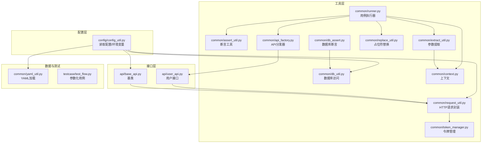

图表来源
- [common/request_util.py:13-66](file://common/request_util.py#L13-L66)
- [common/token_manager.py:8-38](file://common/token_manager.py#L8-L38)
- [common/assert_util.py:6-15](file://common/assert_util.py#L6-L15)
- [common/db_assert.py:6-17](file://common/db_assert.py#L6-L17)
- [common/db_util.py:9-35](file://common/db_util.py#L9-L35)
- [common/context.py:6-25](file://common/context.py#L6-L25)
- [common/extract_util.py:22-28](file://common/extract_util.py#L22-L28)
- [common/replace_util.py:22-32](file://common/replace_util.py#L22-L32)
- [common/api_factory.py:21-28](file://common/api_factory.py#L21-L28)
- [common/runner.py:15-45](file://common/runner.py#L15-L45)
- [api/base_api.py:7-11](file://api/base_api.py#L7-L11)
- [api/user_api.py:8-22](file://api/user_api.py#L8-L22)
- [config/config_util.py:27-50](file://config/config_util.py#L27-L50)
- [common/yaml_util.py:11-15](file://common/yaml_util.py#L11-L15)
- [testcase/test_flow.py:14-17](file://testcase/test_flow.py#L14-L17)

章节来源
- [common/request_util.py:13-66](file://common/request_util.py#L13-L66)
- [common/token_manager.py:8-38](file://common/token_manager.py#L8-L38)
- [common/assert_util.py:6-15](file://common/assert_util.py#L6-L15)
- [common/db_assert.py:6-17](file://common/db_assert.py#L6-L17)
- [common/db_util.py:9-35](file://common/db_util.py#L9-L35)
- [common/context.py:6-25](file://common/context.py#L6-L25)
- [common/extract_util.py:22-28](file://common/extract_util.py#L22-L28)
- [common/replace_util.py:22-32](file://common/replace_util.py#L22-L32)
- [common/api_factory.py:21-28](file://common/api_factory.py#L21-L28)
- [common/runner.py:15-45](file://common/runner.py#L15-L45)
- [api/base_api.py:7-11](file://api/base_api.py#L7-L11)
- [api/user_api.py:8-22](file://api/user_api.py#L8-L22)
- [config/config_util.py:27-50](file://config/config_util.py#L27-L50)
- [common/yaml_util.py:11-15](file://common/yaml_util.py#L11-L15)
- [testcase/test_flow.py:14-17](file://testcase/test_flow.py#L14-L17)

## 核心组件
- RequestUtil：统一 HTTP 请求入口，支持 GET/POST 快捷方法、URL 自动拼接、JSON 头部、超时控制、Allure 请求/响应附件、状态码异常抛出与非 JSON 响应兜底。
- TokenManager：全局单例令牌管理，支持注册登录回调、线程安全缓存、按需拉取与刷新、清理。
- assert_subset：递归断言工具，支持嵌套字典断言与路径定位，便于结构化断言。
- DBAssert：基于 SQLite 的断言函数，提供库存断言与查询辅助。
- Context：轻量上下文容器，用于跨步骤传递数据。
- extract：根据路径表达式从响应中提取字段并写入上下文。
- replace：字符串与结构化数据中的占位符替换（${key}）。
- Runner：用例执行器，串联数据准备、API 调用、提取、断言与令牌更新。
- API 分发器：将字符串 API 名映射到具体实现，统一透传 no_token 等参数。
- 配置工具：读取 YAML 配置、环境变量覆盖、数据库路径解析。

章节来源
- [common/request_util.py:13-66](file://common/request_util.py#L13-L66)
- [common/token_manager.py:8-38](file://common/token_manager.py#L8-L38)
- [common/assert_util.py:6-15](file://common/assert_util.py#L6-L15)
- [common/db_assert.py:6-17](file://common/db_assert.py#L6-L17)
- [common/context.py:6-25](file://common/context.py#L6-L25)
- [common/extract_util.py:22-28](file://common/extract_util.py#L22-L28)
- [common/replace_util.py:22-32](file://common/replace_util.py#L22-L32)
- [common/runner.py:15-45](file://common/runner.py#L15-L45)
- [common/api_factory.py:21-28](file://common/api_factory.py#L21-L28)
- [config/config_util.py:27-50](file://config/config_util.py#L27-L50)

## 架构总览
工具层通过“请求-上下文-断言-执行”的流水线完成端到端测试编排。Runner 作为编排中枢，调用 API 分发器选择具体接口实现，接口实现依赖 RequestUtil 发起 HTTP 请求，并在需要时从 TokenManager 获取或设置令牌。extract 将关键字段写入 Context，供后续步骤使用；replace 在发送请求前对数据进行占位符替换；断言阶段使用 assert_subset 或 DBAssert 进行结果校验。

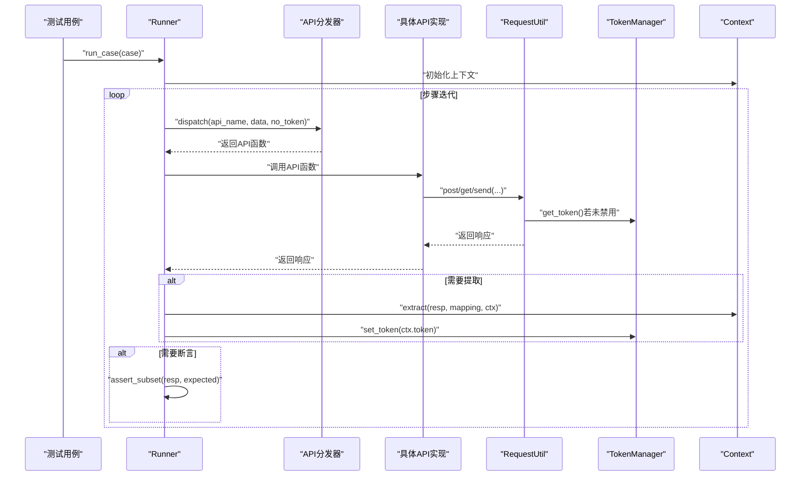

图表来源
- [common/runner.py:15-45](file://common/runner.py#L15-L45)
- [common/api_factory.py:21-28](file://common/api_factory.py#L21-L28)
- [api/user_api.py:8-22](file://api/user_api.py#L8-L22)
- [common/request_util.py:27-66](file://common/request_util.py#L27-L66)
- [common/token_manager.py:28-38](file://common/token_manager.py#L28-L38)
- [common/extract_util.py:22-28](file://common/extract_util.py#L22-L28)
- [common/assert_util.py:6-15](file://common/assert_util.py#L6-L15)

## 详细组件分析

### RequestUtil：HTTP 请求封装
- 会话复用与基础地址：构造 Session 并从配置工具读取 base_url，自动去除尾部斜杠，支持绝对/相对路径。
- 请求头策略：默认 Content-Type 为 application/json；可合并额外头部；当 no_token 为 False 时自动从 TokenManager 获取令牌并注入 Authorization。
- 统一发送逻辑：send 支持 method、path、json、params、headers、no_token；自动记录 Allure 请求/响应附件；超时 30 秒；非 JSON 响应兜底为原始文本；raise_for_status 抛出状态码异常；返回标准化字典。
- 快捷方法：get/post 对 send 的薄封装，post 自动将 json 映射为 json_body。
- 与 TokenManager 的耦合：在 _headers 中按需调用 TokenManager.get_token，确保每次请求携带最新令牌。

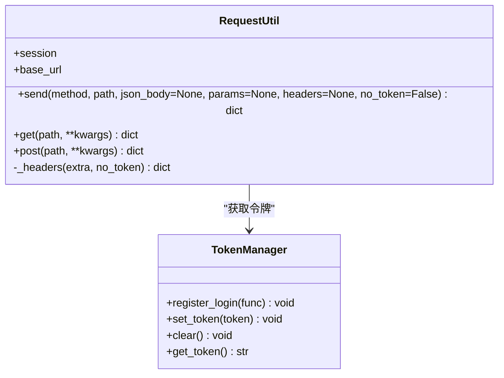

图表来源
- [common/request_util.py:13-66](file://common/request_util.py#L13-L66)
- [common/token_manager.py:8-38](file://common/token_manager.py#L8-L38)

章节来源
- [common/request_util.py:13-66](file://common/request_util.py#L13-L66)
- [config/config_util.py:27-31](file://config/config_util.py#L27-L31)

### TokenManager：线程安全令牌管理
- 单例与锁：使用类变量保存令牌与登录回调，使用 Lock 保证并发安全；set_token/clear/get_token 均在锁内操作。
- 注册登录回调：register_login 接受一个无参函数，用于首次拉取或刷新令牌。
- 拉取策略：get_token 先检查缓存，若无则调用注册的登录函数获取新令牌并写回缓存；若未注册则抛出运行时错误。
- 使用建议：在测试启动阶段注册登录回调，随后通过 set_token 手动注入或在 Runner 中根据提取的 token 更新缓存。

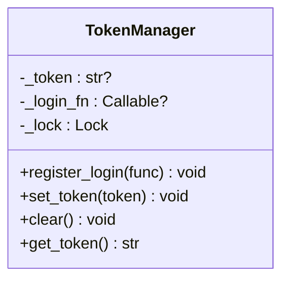

图表来源
- [common/token_manager.py:8-38](file://common/token_manager.py#L8-L38)

章节来源
- [common/token_manager.py:8-38](file://common/token_manager.py#L8-L38)

### 断言工具：assert_subset 与 DBAssert
- assert_subset：递归断言期望子集是否出现在实际响应中，支持嵌套字典；断言失败时输出带路径的详细信息，便于定位问题。
- DBAssert：基于 db_util 查询产品库存并断言最小阈值；提供 get_product_stock 辅助查询当前库存值。

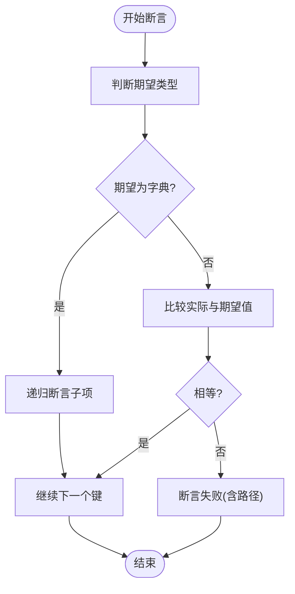

图表来源
- [common/assert_util.py:6-15](file://common/assert_util.py#L6-L15)
- [common/db_assert.py:6-17](file://common/db_assert.py#L6-L17)
- [common/db_util.py:9-16](file://common/db_util.py#L9-L16)

章节来源
- [common/assert_util.py:6-15](file://common/assert_util.py#L6-L15)
- [common/db_assert.py:6-17](file://common/db_assert.py#L6-L17)
- [common/db_util.py:9-16](file://common/db_util.py#L9-L16)

### 上下文管理：Context
- 提供 set/get/update/clear/data 属性，作为跨步骤共享数据的载体。
- Runner 在每步执行后将提取的 token 写入 Context，并在必要时调用 TokenManager.set_token 更新全局令牌缓存。

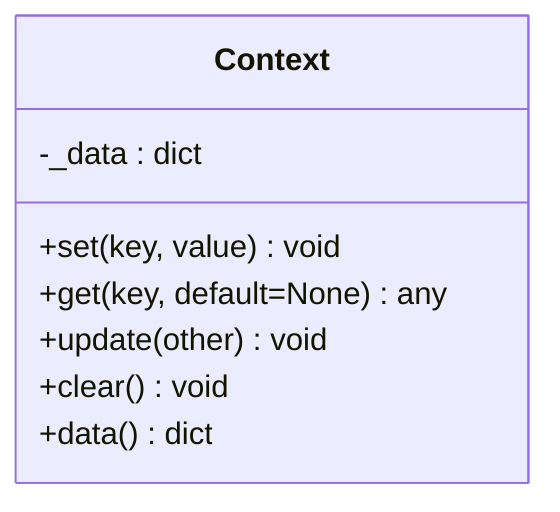

图表来源
- [common/context.py:6-25](file://common/context.py#L6-L25)

章节来源
- [common/context.py:6-25](file://common/context.py#L6-L25)
- [common/runner.py:33-41](file://common/runner.py#L33-L41)

### 参数提取：extract
- 支持点号路径（如 data.id）从响应中提取字段，写入 Context。
- 与 Runner 的 extract 步骤配合，实现“响应 → 上下文 → 下一步请求”的数据流转。

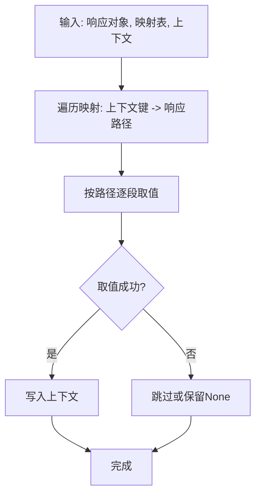

图表来源
- [common/extract_util.py:22-28](file://common/extract_util.py#L22-L28)
- [common/extract_util.py:8-19](file://common/extract_util.py#L8-L19)

章节来源
- [common/extract_util.py:22-28](file://common/extract_util.py#L22-L28)

### 参数替换：replace
- 支持字符串、字典、列表的递归替换，使用正则匹配 ${key} 形式的占位符。
- 在 Runner 中先对原始数据进行替换，再调用 API 分发器执行请求。

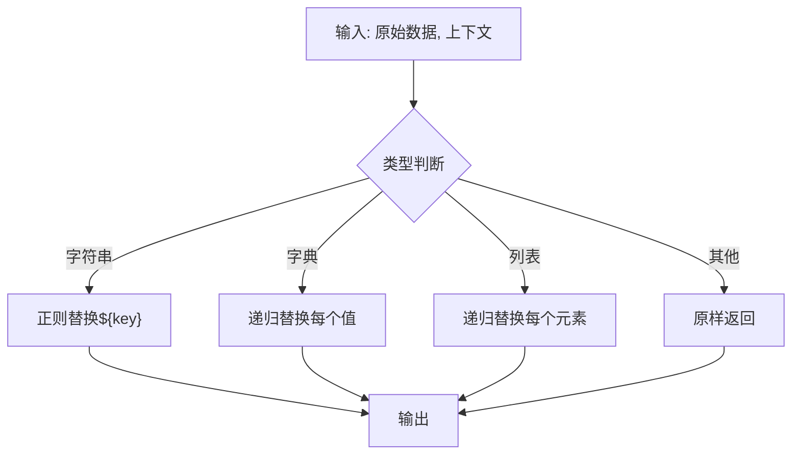

图表来源
- [common/replace_util.py:22-32](file://common/replace_util.py#L22-L32)

章节来源
- [common/replace_util.py:22-32](file://common/replace_util.py#L22-L32)

### API 分发器：dispatch
- 将字符串 API 名映射到具体实现函数，统一透传 no_token 等参数。
- 若 API 名未注册，抛出未知错误。

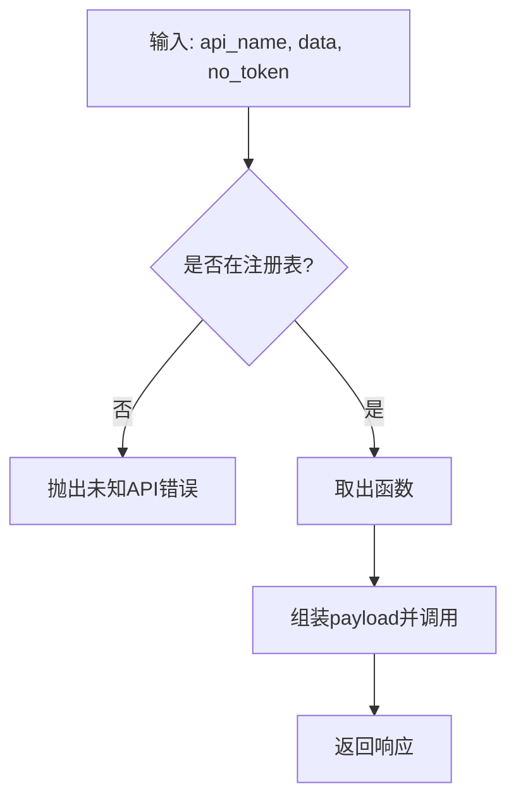

图表来源
- [common/api_factory.py:21-28](file://common/api_factory.py#L21-L28)

章节来源
- [common/api_factory.py:21-28](file://common/api_factory.py#L21-L28)

### Runner：用例执行器
- 初始化上下文，按步骤顺序执行：
  - 数据替换：对原始数据进行占位符替换。
  - API 调用：通过分发器选择具体实现。
  - 提取：将响应中的关键字段写入上下文，并在检测到 token 时更新 TokenManager。
  - 断言：对响应与期望进行结构化断言。
- 支持禁用令牌：step 可设置 no_token 控制是否注入 Authorization。

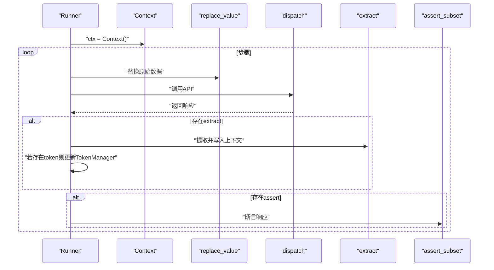

图表来源
- [common/runner.py:15-45](file://common/runner.py#L15-L45)
- [common/replace_util.py:22-32](file://common/replace_util.py#L22-L32)
- [common/api_factory.py:21-28](file://common/api_factory.py#L21-L28)
- [common/extract_util.py:22-28](file://common/extract_util.py#L22-L28)
- [common/assert_util.py:6-15](file://common/assert_util.py#L6-L15)

章节来源
- [common/runner.py:15-45](file://common/runner.py#L15-L45)

### 接口层：BaseApi 与具体 API
- BaseApi：为各业务 API 提供统一的 RequestUtil 实例与 base_url。
- UserApi：示例接口，使用 RequestUtil 发送注册/登录请求，默认禁用令牌（no_token=True）。

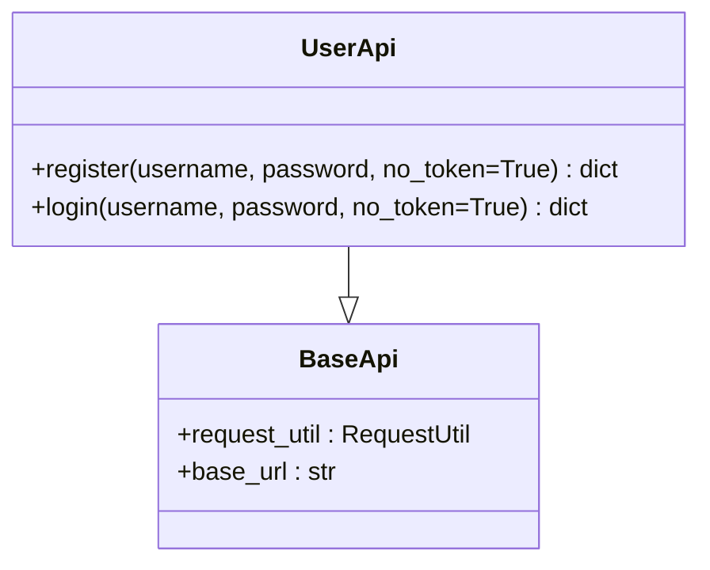

图表来源
- [api/base_api.py:7-11](file://api/base_api.py#L7-L11)
- [api/user_api.py:8-22](file://api/user_api.py#L8-L22)

章节来源
- [api/base_api.py:7-11](file://api/base_api.py#L7-L11)
- [api/user_api.py:8-22](file://api/user_api.py#L8-L22)

### 配置与数据加载
- config_util：读取 YAML 配置，支持环境变量覆盖 base url 与数据库路径；提供默认用户信息。
- yaml_util：加载 data 目录下的 YAML 文件，供 Runner 参数化用例使用。
- 测试入口：test_flow.py 通过参数化加载 flow.yaml 并逐条执行。

章节来源
- [config/config_util.py:27-50](file://config/config_util.py#L27-L50)
- [common/yaml_util.py:11-15](file://common/yaml_util.py#L11-L15)
- [testcase/test_flow.py:14-17](file://testcase/test_flow.py#L14-L17)

## 依赖分析
- RequestUtil 依赖 TokenManager 与配置工具；在 _headers 中按需注入 Authorization。
- Runner 依赖 API 分发器、上下文、提取器、断言工具与替换工具；负责编排执行流程。
- DBAssert 依赖 db_util；db_util 依赖配置工具以解析数据库路径。
- BaseApi 依赖 RequestUtil 与配置工具；具体 API（如 UserApi）继承 BaseApi 并使用 RequestUtil 发起请求。

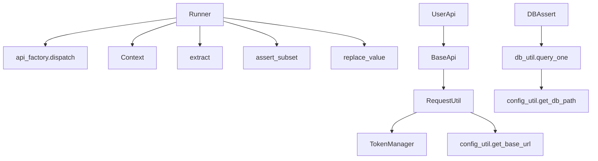

图表来源
- [common/request_util.py:13-66](file://common/request_util.py#L13-L66)
- [common/token_manager.py:8-38](file://common/token_manager.py#L8-L38)
- [common/runner.py:15-45](file://common/runner.py#L15-L45)
- [common/api_factory.py:21-28](file://common/api_factory.py#L21-L28)
- [common/db_assert.py:6-17](file://common/db_assert.py#L6-L17)
- [common/db_util.py:9-35](file://common/db_util.py#L9-L35)
- [api/base_api.py:7-11](file://api/base_api.py#L7-L11)
- [api/user_api.py:8-22](file://api/user_api.py#L8-L22)
- [config/config_util.py:27-50](file://config/config_util.py#L27-L50)

章节来源
- [common/request_util.py:13-66](file://common/request_util.py#L13-L66)
- [common/token_manager.py:8-38](file://common/token_manager.py#L8-L38)
- [common/runner.py:15-45](file://common/runner.py#L15-L45)
- [common/api_factory.py:21-28](file://common/api_factory.py#L21-L28)
- [common/db_assert.py:6-17](file://common/db_assert.py#L6-L17)
- [common/db_util.py:9-35](file://common/db_util.py#L9-L35)
- [api/base_api.py:7-11](file://api/base_api.py#L7-L11)
- [api/user_api.py:8-22](file://api/user_api.py#L8-L22)
- [config/config_util.py:27-50](file://config/config_util.py#L27-L50)

## 性能考虑
- 会话复用：RequestUtil 使用 requests.Session，减少 TCP/TLS 重复握手开销。
- 超时控制：固定 30 秒超时，避免长时间阻塞；可根据场景调整。
- Allure 附件：请求/响应 JSON 附件便于调试，但大量用例可能增加报告体积，建议在失败时开启。
- 线程安全：TokenManager 使用锁保护令牌缓存，避免并发竞争；建议在高并发场景下尽量减少频繁刷新。
- 数据库访问：db_util 每次查询/执行均新建连接并在 finally 中关闭，避免连接泄漏；批量操作可考虑复用连接或事务。

## 故障排查指南
- 401/403 未授权：确认 TokenManager 是否已注册登录回调并成功获取令牌；检查 no_token 设置。
- 未知 API 名：检查 api_factory 的注册表是否包含对应字符串；确认大小写与命名一致。
- 缺失上下文键：replace 报错提示缺少上下文键，检查 extract 是否正确写入以及步骤顺序。
- 断言失败：assert_subset 输出带路径的差异信息；优先检查期望结构与响应结构是否一致。
- 数据库断言：DBAssert 依赖 SQLite；确认数据库路径与表结构；查询失败时检查 SQL 与参数绑定。
- 超时/网络异常：检查 base_url 与网络连通性；适当增大超时或重试。

章节来源
- [common/request_util.py:37-58](file://common/request_util.py#L37-L58)
- [common/runner.py:24-26](file://common/runner.py#L24-L26)
- [common/replace_util.py:11-18](file://common/replace_util.py#L11-L18)
- [common/assert_util.py:6-15](file://common/assert_util.py#L6-L15)
- [common/db_assert.py:6-10](file://common/db_assert.py#L6-L10)
- [common/db_util.py:9-16](file://common/db_util.py#L9-L16)

## 结论
工具层通过 RequestUtil、TokenManager、Context、extract、replace、Runner、DBAssert 等组件形成清晰的职责边界与协作关系，既满足通用 HTTP 请求与断言需求，又提供灵活的数据流编排与令牌管理能力。结合 API 分发器与配置工具，可快速扩展新的业务接口与断言场景。

## 附录

### 使用示例与集成方法
- 注册登录回调并设置初始令牌
  - 在测试启动阶段调用 TokenManager.register_login，随后在提取到 token 后调用 TokenManager.set_token。
- 在 Runner 中使用 extract 与断言
  - 在步骤中配置 extract 映射，将 token 写入上下文；在 assert 中使用期望结构进行断言。
- 自定义断言
  - 可参考 assert_subset 的递归断言思路，编写针对特定业务的断言函数，例如库存断言、金额断言等。
- 集成新 API
  - 在 api_factory 中注册新 API 名称与实现；在具体 API 类中复用 BaseApi 的 RequestUtil。

章节来源
- [common/runner.py:33-44](file://common/runner.py#L33-L44)
- [common/assert_util.py:6-15](file://common/assert_util.py#L6-L15)
- [common/api_factory.py:12-18](file://common/api_factory.py#L12-L18)
- [api/base_api.py:7-11](file://api/base_api.py#L7-L11)

### 自定义断言开发指南与最佳实践
- 设计原则
  - 保持断言函数单一职责，专注于特定领域（如库存、金额、状态码）。
  - 提供明确的错误信息，包含期望值、实际值与上下文路径。
  - 对外部依赖（如数据库）进行最小化封装，便于替换与测试。
- 实现建议
  - 参考 DBAssert 的结构：查询 → 断言 → 抛出明确错误。
  - 对复杂结构断言，可借鉴 assert_subset 的递归思想，支持嵌套路径。
  - 在 Runner 中通过步骤的 assert 字段传入期望数据，必要时结合 replace 进行动态替换。
- 最佳实践
  - 将断言与业务语义解耦，避免在断言中混入业务逻辑。
  - 对易变的阈值与条件参数，通过配置或上下文注入，避免硬编码。
  - 在 Allure 报告中保留关键断言上下文，便于问题追踪。

章节来源
- [common/db_assert.py:6-17](file://common/db_assert.py#L6-L17)
- [common/assert_util.py:6-15](file://common/assert_util.py#L6-L15)
- [common/runner.py:42-44](file://common/runner.py#L42-L44)