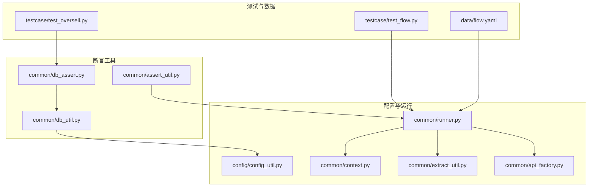
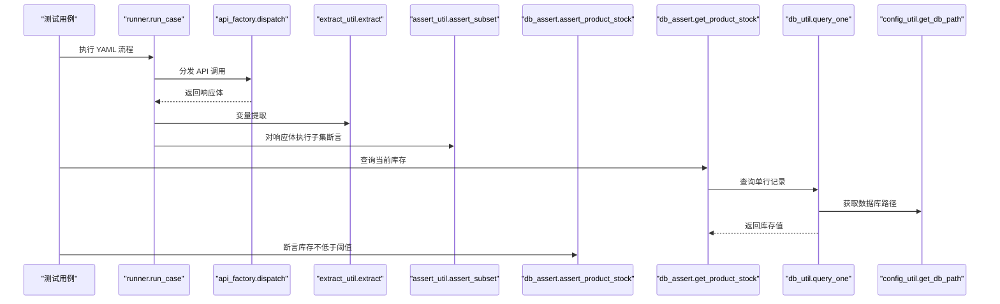
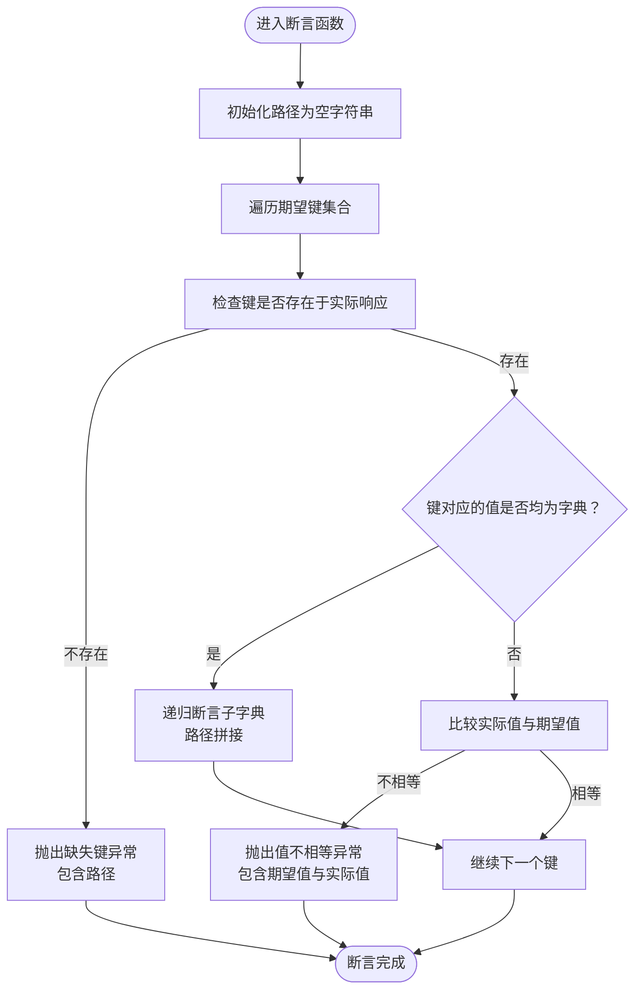
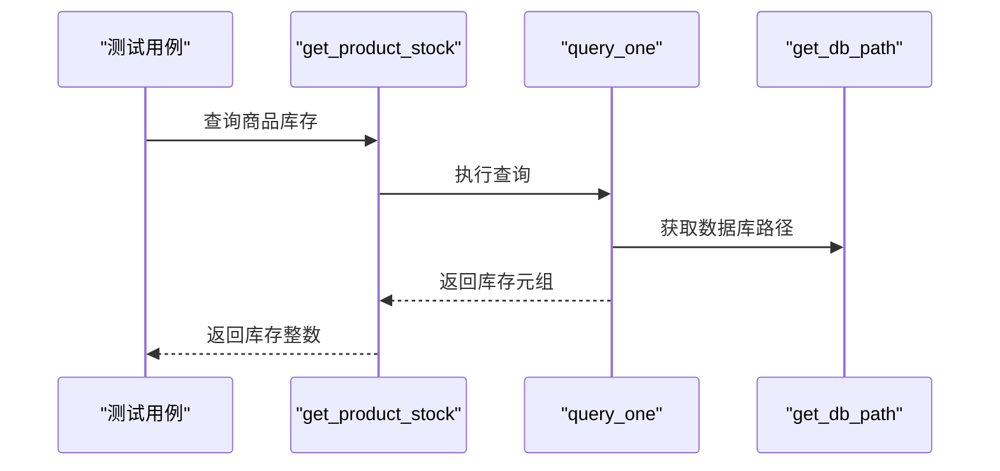
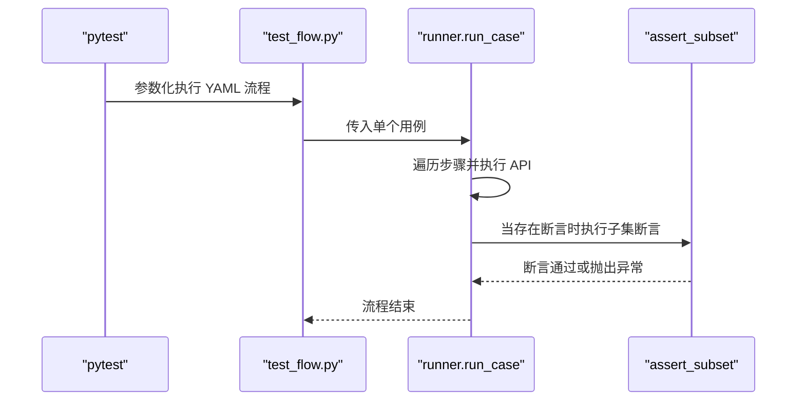
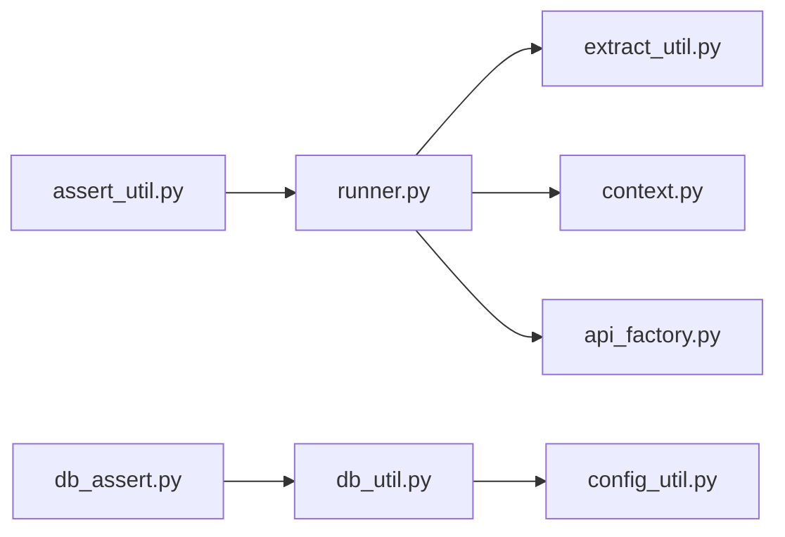

# 断言工具

<cite>
**本文引用的文件**
- [assert_util.py](file://common/assert_util.py)
- [db_assert.py](file://common/db_assert.py)
- [db_util.py](file://common/db_util.py)
- [config_util.py](file://config/config_util.py)
- [runner.py](file://common/runner.py)
- [flow.yaml](file://data/flow.yaml)
- [test_flow.py](file://testcase/test_flow.py)
- [test_oversell.py](file://testcase/test_oversell.py)
- [context.py](file://common/context.py)
- [extract_util.py](file://common/extract_util.py)
- [api_factory.py](file://common/api_factory.py)
</cite>

## 目录
1. [简介](#简介)
2. [项目结构](#项目结构)
3. [核心组件](#核心组件)
4. [架构总览](#架构总览)
5. [详细组件分析](#详细组件分析)
6. [依赖分析](#依赖分析)
7. [性能考虑](#性能考虑)
8. [故障排查指南](#故障排查指南)
9. [结论](#结论)
10. [附录](#附录)

## 简介
本文件系统性梳理断言工具的设计与实现，重点覆盖两类断言能力：
- 数据断言：对响应体进行子集匹配与逐字段断言，支持嵌套结构与路径定位。
- 数据库断言：基于 SQLite 的轻量数据库一致性验证，提供库存等关键指标的断言与查询辅助。

文档同时给出使用方法、错误处理策略、扩展指南以及与 YAML 流程执行的集成方式，帮助读者快速上手并安全扩展。

## 项目结构
断言工具位于 common 子目录，围绕 assert_util（数据断言）与 db_assert（数据库断言）展开，并通过 db_util 提供数据库访问能力，配合 config_util 提供数据库路径解析。YAML 流程执行器 runner 将断言集成到测试流程中，testcase 下的示例展示了并发场景下的库存一致性断言。

图表来源
- [assert_util.py:1-15](file://common/assert_util.py#L1-L15)
- [db_assert.py:1-17](file://common/db_assert.py#L1-L17)
- [db_util.py:1-35](file://common/db_util.py#L1-L35)
- [config_util.py:96-102](file://config/config_util.py#L96-L102)
- [runner.py:1-45](file://common/runner.py#L1-L45)
- [context.py:1-25](file://common/context.py#L1-L25)
- [extract_util.py:1-28](file://common/extract_util.py#L1-L28)
- [api_factory.py:1-28](file://common/api_factory.py#L1-L28)
- [flow.yaml:1-41](file://data/flow.yaml#L1-L41)
- [test_flow.py:1-17](file://testcase/test_flow.py#L1-L17)
- [test_oversell.py:1-40](file://testcase/test_oversell.py#L1-L40)

章节来源
- [assert_util.py:1-15](file://common/assert_util.py#L1-L15)
- [db_assert.py:1-17](file://common/db_assert.py#L1-L17)
- [db_util.py:1-35](file://common/db_util.py#L1-L35)
- [config_util.py:96-102](file://config/config_util.py#L96-L102)
- [runner.py:1-45](file://common/runner.py#L1-L45)
- [flow.yaml:1-41](file://data/flow.yaml#L1-L41)
- [test_flow.py:1-17](file://testcase/test_flow.py#L1-L17)
- [test_oversell.py:1-40](file://testcase/test_oversell.py#L1-L40)

## 核心组件
- 数据断言模块（assert_util）
  - 提供递归子集断言函数，支持嵌套字典的键存在性与值相等性校验，并输出带路径的详细错误信息。
- 数据库断言模块（db_assert）
  - 提供面向业务的关键断言函数（如库存下限断言），并提供查询库存的辅助函数，便于在测试中进行一致性验证。
- 数据库访问工具（db_util）
  - 提供查询单行、查询多行、执行语句的通用封装，统一连接生命周期管理。
- 配置工具（config_util）
  - 解析数据库路径，确保断言工具从正确的数据库文件读取数据。
- 流程执行器（runner）
  - 在 YAML 流程中自动注入断言，将响应体与期望值进行子集断言，支持变量提取与令牌设置。

章节来源
- [assert_util.py:6-14](file://common/assert_util.py#L6-L14)
- [db_assert.py:6-16](file://common/db_assert.py#L6-L16)
- [db_util.py:9-34](file://common/db_util.py#L9-L34)
- [config_util.py:96-102](file://config/config_util.py#L96-L102)
- [runner.py:42-44](file://common/runner.py#L42-L44)

## 架构总览
断言工具的调用链路如下：测试用例通过 runner 执行 YAML 步骤，每步完成后对响应体执行子集断言；并发场景下，测试用例可直接调用 db_assert 的查询函数进行库存一致性验证；db_assert 内部通过 db_util 访问 SQLite 数据库，db_util 依赖 config_util 获取数据库路径。

图表来源
- [runner.py:15-44](file://common/runner.py#L15-L44)
- [api_factory.py:21-27](file://common/api_factory.py#L21-L27)
- [extract_util.py:22-27](file://common/extract_util.py#L22-L27)
- [assert_util.py:6-14](file://common/assert_util.py#L6-L14)
- [db_assert.py:13-16](file://common/db_assert.py#L13-L16)
- [db_util.py:9-16](file://common/db_util.py#L9-L16)
- [config_util.py:96-102](file://config/config_util.py#L96-L102)

## 详细组件分析

### 数据断言：assert_subset
- 功能概述
  - 对实际响应体与期望值进行逐层比对，支持嵌套字典的键存在性与值相等性校验。
  - 自动拼接路径，便于定位断言失败的具体字段。
- 参数与行为
  - 输入：实际响应体、期望值、可选路径前缀。
  - 行为：遍历期望键，若键缺失则报错；若键存在且均为字典则递归断言；否则比较值是否相等。
- 使用场景
  - 在 YAML 流程中对响应体进行子集断言，确保关键字段满足预期。
  - 在复杂响应结构中快速定位差异，提升调试效率。
- 错误处理
  - 缺失键：抛出异常并包含完整路径。
  - 值不相等：抛出异常并包含期望值与实际值。
- 复杂度
  - 时间复杂度：O(N)，N 为期望结构中的键数量。
  - 空间复杂度：O(D)，D 为嵌套深度（递归栈空间）。

图表来源
- [assert_util.py:6-14](file://common/assert_util.py#L6-L14)

章节来源
- [assert_util.py:6-14](file://common/assert_util.py#L6-L14)
- [runner.py:42-44](file://common/runner.py#L42-L44)

### 数据库断言：库存一致性验证
- 功能概述
  - 提供库存断言函数，确保商品库存不低于指定阈值。
  - 提供库存查询函数，返回当前库存值，便于在测试中进行二次断言。
- 参数与行为
  - 库存断言：接收商品 ID 与最小库存阈值，查询数据库后断言。
  - 库存查询：接收商品 ID，返回当前库存整数值。
- 使用场景
  - 并发下单场景：在请求完成后统计成功数，并断言剩余库存与理论值一致。
  - 业务闭环验证：在流程末尾对关键指标进行最终核对。
- 错误处理
  - 商品不存在：断言失败并提示未找到。
  - 库存不足：断言失败并提示库存小于阈值。
- 复杂度
  - 查询单行：O(1)（假设索引命中）。
  - 断言：O(1)。

图表来源
- [db_assert.py:13-16](file://common/db_assert.py#L13-L16)
- [db_util.py:9-16](file://common/db_util.py#L9-L16)
- [config_util.py:96-102](file://config/config_util.py#L96-L102)

章节来源
- [db_assert.py:6-16](file://common/db_assert.py#L6-L16)
- [db_util.py:9-16](file://common/db_util.py#L9-L16)
- [config_util.py:96-102](file://config/config_util.py#L96-L102)
- [test_oversell.py:36-39](file://testcase/test_oversell.py#L36-L39)

### YAML 流程中的断言集成
- 运行器工作流
  - 读取 YAML 步骤，依次分发 API 调用。
  - 支持变量提取与令牌设置。
  - 当步骤包含断言时，对响应体执行子集断言。
- 断言触发点
  - 在 runner 的步骤循环中，当检测到断言键时，替换上下文变量并执行断言。
- 示例数据
  - flow.yaml 定义了用户注册、登录、商品添加、订单创建、支付等步骤，并在支付步骤中对响应体进行断言。

图表来源
- [test_flow.py:14-16](file://testcase/test_flow.py#L14-L16)
- [runner.py:15-44](file://common/runner.py#L15-L44)
- [flow.yaml:35-40](file://data/flow.yaml#L35-L40)

章节来源
- [test_flow.py:1-17](file://testcase/test_flow.py#L1-L17)
- [runner.py:15-44](file://common/runner.py#L15-L44)
- [flow.yaml:1-41](file://data/flow.yaml#L1-L41)

## 依赖分析
- 组件耦合
  - assert_subset 与 runner 强耦合：runner 在执行流程时直接调用断言函数。
  - db_assert 与 db_util 弱耦合：db_assert 通过 db_util 的查询接口访问数据库。
  - db_util 与 config_util 弱耦合：db_util 通过配置工具解析数据库路径。
- 外部依赖
  - SQLite：用于本地测试数据库访问。
  - PyYAML：用于加载 YAML 配置与流程文件。
  - Allure：用于测试步骤标注与报告生成。
- 循环依赖
  - 未发现循环依赖，模块职责清晰。

图表来源
- [assert_util.py:1-15](file://common/assert_util.py#L1-L15)
- [runner.py:1-45](file://common/runner.py#L1-L45)
- [db_assert.py:1-17](file://common/db_assert.py#L1-L17)
- [db_util.py:1-35](file://common/db_util.py#L1-L35)
- [config_util.py:1-112](file://config/config_util.py#L1-L112)
- [extract_util.py:1-28](file://common/extract_util.py#L1-L28)
- [context.py:1-25](file://common/context.py#L1-L25)
- [api_factory.py:1-28](file://common/api_factory.py#L1-L28)

章节来源
- [runner.py:1-45](file://common/runner.py#L1-L45)
- [db_util.py:1-35](file://common/db_util.py#L1-L35)
- [config_util.py:1-112](file://config/config_util.py#L1-L112)

## 性能考虑
- 断言性能
  - assert_subset 为线性扫描，适合中小型响应体；对于大型结构，建议仅断言关键字段。
- 数据库访问
  - db_util 对每次查询都建立与关闭连接，简单可靠但频繁查询会带来连接开销；可在批量断言时复用连接或合并查询。
- 并发场景
  - 并发下单测试中，建议在断言前等待一段时间或引入重试机制，避免读到中间态数据。

## 故障排查指南
- 断言失败
  - 缺失键：检查 YAML 中的断言键是否正确，确认响应体结构与期望一致。
  - 值不相等：核对期望值与响应体的实际值，关注类型差异（如字符串与数字）。
- 数据库断言失败
  - 商品不存在：确认商品 ID 是否正确，或在前置步骤中创建商品。
  - 库存不足：检查并发场景下的库存扣减逻辑，必要时增加重试或锁机制。
- 连接问题
  - 数据库路径错误：检查配置文件中的数据库路径，确保绝对路径或相对路径正确。
- 流程执行问题
  - 变量未提取：确认 extract 映射是否正确，路径是否指向有效字段。
  - API 名称未注册：检查 api_factory 的注册表，确保步骤中的 API 名称存在。

章节来源
- [assert_util.py:6-14](file://common/assert_util.py#L6-L14)
- [db_assert.py:6-16](file://common/db_assert.py#L6-L16)
- [db_util.py:9-16](file://common/db_util.py#L9-L16)
- [config_util.py:96-102](file://config/config_util.py#L96-L102)
- [runner.py:33-44](file://common/runner.py#L33-L44)

## 结论
断言工具以简洁的 API 实现了数据与数据库层面的一致性验证，结合 YAML 流程执行器，能够高效地支撑端到端测试。通过合理的断言策略与错误处理，可以显著提升测试的稳定性与可维护性。建议在复杂场景下扩展更多业务断言函数，并优化数据库访问性能。

## 附录

### 使用示例与最佳实践
- 数据断言
  - 在 YAML 步骤中添加断言键，使用子集断言确保关键字段满足预期。
  - 对于大型响应体，仅断言必要字段，减少断言成本。
- 数据库断言
  - 并发场景下，先查询当前库存，再统计成功数，最后断言剩余库存与理论值一致。
  - 对于关键业务指标，建议在流程末尾追加断言，形成闭环验证。
- 错误处理策略
  - 断言失败时保留原始响应与期望值，便于定位问题。
  - 对数据库断言失败，记录商品 ID 与当前库存，辅助排查。

章节来源
- [flow.yaml:35-40](file://data/flow.yaml#L35-L40)
- [test_oversell.py:36-39](file://testcase/test_oversell.py#L36-L39)
- [runner.py:42-44](file://common/runner.py#L42-L44)

### 自定义断言函数开发指南
- 设计原则
  - 保持断言函数单一职责，专注于特定业务域。
  - 提供明确的错误信息，包含上下文与期望值。
- 开发步骤
  - 在 db_assert 中新增断言函数，内部调用 db_util 的查询接口。
  - 在 runner 或测试用例中调用该断言函数，确保与现有流程兼容。
  - 编写单元测试，覆盖正常与异常分支。
- 扩展建议
  - 对高频断言抽象为通用工具函数，减少重复代码。
  - 对复杂断言引入条件断言与容忍度参数，提升灵活性。

章节来源
- [db_assert.py:1-17](file://common/db_assert.py#L1-L17)
- [db_util.py:9-34](file://common/db_util.py#L9-L34)
- [runner.py:15-44](file://common/runner.py#L15-L44)