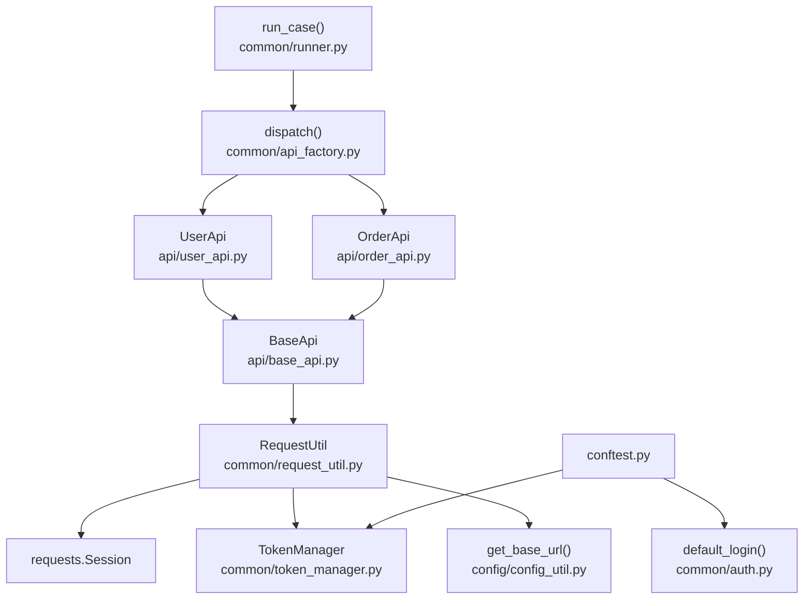
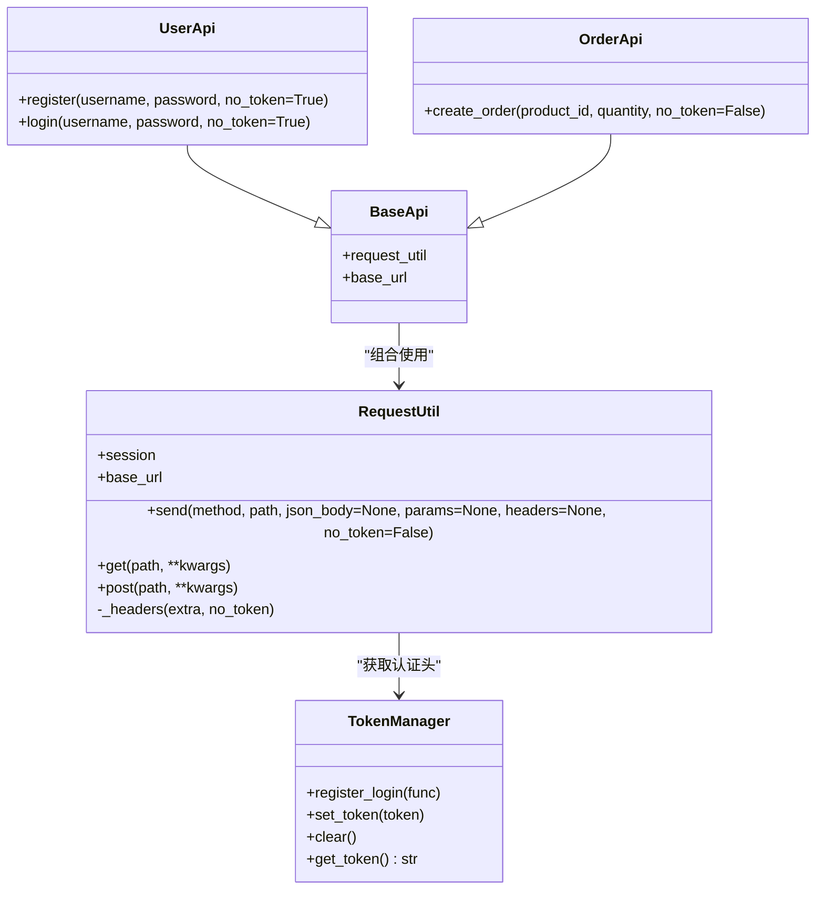
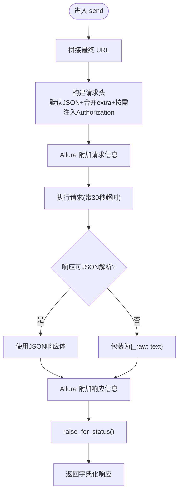
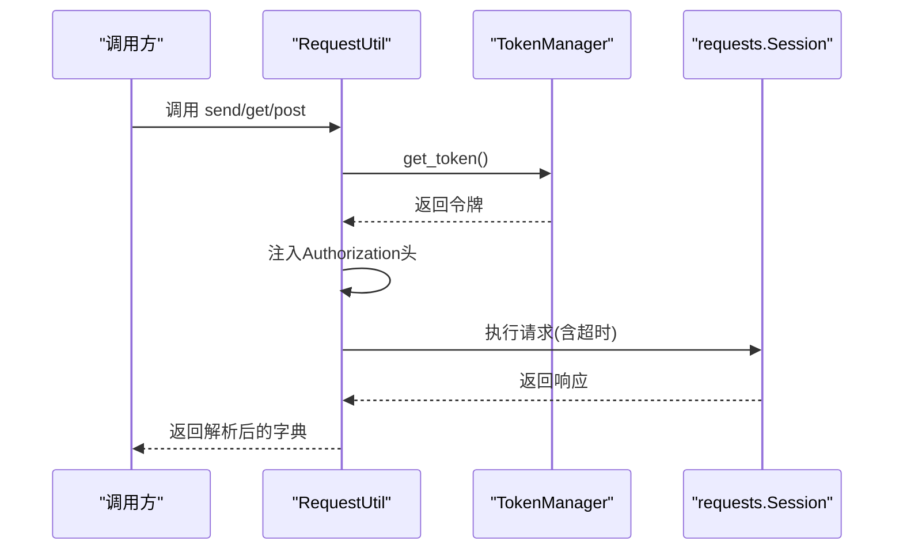
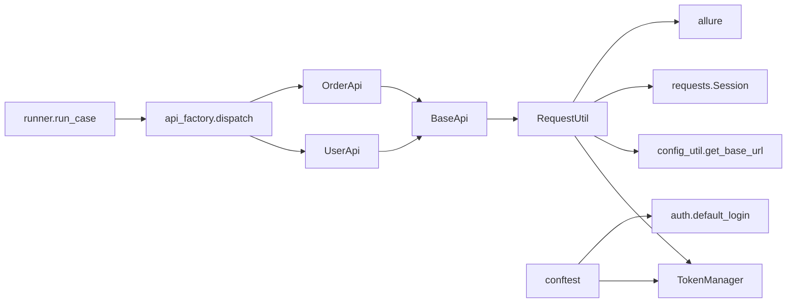

# 请求封装工具

<cite>
**本文引用的文件**
- [common/request_util.py](file://common/request_util.py)
- [common/token_manager.py](file://common/token_manager.py)
- [config/config_util.py](file://config/config_util.py)
- [api/base_api.py](file://api/base_api.py)
- [api/user_api.py](file://api/user_api.py)
- [api/order_api.py](file://api/order_api.py)
- [common/auth.py](file://common/auth.py)
- [conftest.py](file://conftest.py)
- [common/runner.py](file://common/runner.py)
- [common/api_factory.py](file://common/api_factory.py)
- [common/assert_util.py](file://common/assert_util.py)
- [common/context.py](file://common/context.py)
- [common/extract_util.py](file://common/extract_util.py)
- [config/config.yaml](file://config/config.yaml)
- [testcase/test_flow.py](file://testcase/test_flow.py)
</cite>

## 目录
1. [简介](#简介)
2. [项目结构](#项目结构)
3. [核心组件](#核心组件)
4. [架构总览](#架构总览)
5. [详细组件分析](#详细组件分析)
6. [依赖分析](#依赖分析)
7. [性能考虑](#性能考虑)
8. [故障排查指南](#故障排查指南)
9. [结论](#结论)
10. [附录](#附录)

## 简介
本文件面向“请求封装工具”的使用者与维护者，系统化阐述 RequestUtil 类的设计与实现，覆盖以下主题：
- 统一的 HTTP 请求处理机制（方法、URL 拼接、头部构建）
- 会话管理与超时控制
- 认证头自动注入与 TokenManager 协作
- Allure 测试报告集成（请求/响应附件）
- 错误处理与响应解析策略
- 使用示例（GET、POST 等）与最佳实践（超时、解析、异常）

## 项目结构
该模块位于 common/request_util.py，围绕 requests.Session 进行统一封装，并通过 TokenManager 注入认证头，结合 config/config_util.py 提供的基础地址，形成可复用的请求层。

图表来源
- [common/request_util.py:13-66](file://common/request_util.py#L13-L66)
- [common/token_manager.py:8-38](file://common/token_manager.py#L8-L38)
- [config/config_util.py:27-31](file://config/config_util.py#L27-L31)
- [api/base_api.py:7-11](file://api/base_api.py#L7-L11)
- [api/user_api.py:8-22](file://api/user_api.py#L8-L22)
- [api/order_api.py:8-15](file://api/order_api.py#L8-L15)
- [conftest.py:33-44](file://conftest.py#L33-L44)
- [common/auth.py:7-12](file://common/auth.py#L7-L12)
- [common/runner.py:15-45](file://common/runner.py#L15-L45)
- [common/api_factory.py:21-28](file://common/api_factory.py#L21-L28)

章节来源
- [common/request_util.py:13-66](file://common/request_util.py#L13-L66)
- [config/config_util.py:27-31](file://config/config_util.py#L27-L31)

## 核心组件
- RequestUtil：统一 HTTP 请求入口，负责 URL 拼接、头部构造、会话与超时、响应解析与 Allure 附件。
- TokenManager：线程安全的令牌注册、缓存与获取，支持在首次缺失时触发登录回调。
- BaseApi/UserApi/OrderApi：业务 API 层，基于 RequestUtil 封装具体接口。
- 配置与运行时：config/config_util.py 提供基础地址；conftest.py 在会话启动时注册默认登录函数并预取令牌；common/runner.py 与 common/api_factory.py 驱动 YAML 流程执行。

章节来源
- [common/request_util.py:13-66](file://common/request_util.py#L13-L66)
- [common/token_manager.py:8-38](file://common/token_manager.py#L8-L38)
- [api/base_api.py:7-11](file://api/base_api.py#L7-L11)
- [api/user_api.py:8-22](file://api/user_api.py#L8-L22)
- [api/order_api.py:8-15](file://api/order_api.py#L8-L15)
- [config/config_util.py:27-31](file://config/config_util.py#L27-L31)
- [conftest.py:33-44](file://conftest.py#L33-L44)
- [common/runner.py:15-45](file://common/runner.py#L15-L45)
- [common/api_factory.py:21-28](file://common/api_factory.py#L21-L28)

## 架构总览
RequestUtil 作为请求层核心，向上为业务 API 层提供统一能力；向下依赖 TokenManager 获取认证头、依赖 config/config_util.py 获取基础地址；在测试场景中，配合 Allure 输出请求/响应附件，便于问题定位。

图表来源
- [common/request_util.py:13-66](file://common/request_util.py#L13-L66)
- [common/token_manager.py:8-38](file://common/token_manager.py#L8-L38)
- [api/base_api.py:7-11](file://api/base_api.py#L7-L11)
- [api/user_api.py:8-22](file://api/user_api.py#L8-L22)
- [api/order_api.py:8-15](file://api/order_api.py#L8-L15)

## 详细组件分析

### RequestUtil 设计与实现
- 会话管理
  - 使用 requests.Session 维持连接与 Cookie，减少握手开销。
- 基础地址与 URL 拼接
  - 从 config/config_util.get_base_url() 读取基础地址，末尾去除斜杠以避免重复。
  - 若 path 已为绝对 URL 则直接使用；否则拼接为 “{base_url}/{path.lstrip('/')}"。
- 头部信息构建
  - 默认 Content-Type 为 application/json。
  - 支持传入额外 headers 并进行合并。
  - 当 no_token=False（默认）时，自动从 TokenManager 获取令牌并注入 Authorization: Bearer {token}。
- 请求发送与响应解析
  - 调用 session.request(method.upper(), url, json/json_body, params, headers, timeout=30)。
  - 超时固定为 30 秒。
  - 尝试 JSON 解析；若响应为空或非 JSON，则回退为原始文本包装为 {"_raw": text}。
  - 返回值确保为字典格式；若解析结果非字典则包装为 {"_data": ...}。
- Allure 报告集成
  - 发送前附加请求信息（方法、URL、JSON 负载、查询参数）。
  - 发送后附加响应信息（状态码、响应体）。
- 方法别名
  - get/post 提供便捷调用，post 自动将 kwargs 中的 json 提升为 send 的 json_body。

图表来源
- [common/request_util.py:27-58](file://common/request_util.py#L27-L58)

章节来源
- [common/request_util.py:13-66](file://common/request_util.py#L13-L66)

### TokenManager 协作与认证头自动注入
- 注册登录函数
  - 在 pytest 会话启动时，通过 conftest.py 注册 default_login 回调，用于首次获取令牌。
- 令牌缓存与并发安全
  - 内部以锁保护令牌读写，避免多线程竞争。
- 自动注入流程
  - RequestUtil._headers 在 no_token=False 时调用 TokenManager.get_token()，并设置 Authorization 头。
  - 在 YAML 流程执行中，若步骤提取到 token，Runner 会将其写入上下文并通过 TokenManager.set_token() 缓存，后续请求无需再次登录。

图表来源
- [common/request_util.py:18-25](file://common/request_util.py#L18-L25)
- [common/token_manager.py:28-37](file://common/token_manager.py#L28-L37)
- [conftest.py:42-44](file://conftest.py#L42-L44)

章节来源
- [common/token_manager.py:8-38](file://common/token_manager.py#L8-L38)
- [common/request_util.py:18-25](file://common/request_util.py#L18-L25)
- [conftest.py:42-44](file://conftest.py#L42-L44)

### 业务 API 层与调用示例
- BaseApi
  - 初始化 RequestUtil 与 base_url，供子类复用。
- UserApi
  - register/login：默认 no_token=True，用于在未登录状态下完成鉴权流程；成功后由 Runner 将 token 写入上下文并缓存至 TokenManager。
- OrderApi
  - create_order：默认 no_token=False，需要已登录态；RequestUtil 将自动注入 Authorization 头。

章节来源
- [api/base_api.py:7-11](file://api/base_api.py#L7-L11)
- [api/user_api.py:8-22](file://api/user_api.py#L8-L22)
- [api/order_api.py:8-15](file://api/order_api.py#L8-L15)

### Allure 测试报告集成
- 请求阶段
  - 将请求方法、URL、JSON 负载、查询参数以 JSON 附件形式附加到当前 Allure 步骤。
- 响应阶段
  - 将状态码与响应体以 JSON 附件形式附加到当前 Allure 步骤。
- YAML 流程
  - run_case 驱动流程，每个步骤均在独立 Allure 步骤下执行，便于串联查看请求与响应。

章节来源
- [common/request_util.py:40-56](file://common/request_util.py#L40-L56)
- [common/runner.py:15-45](file://common/runner.py#L15-L45)

### 参数处理与错误处理机制
- 参数处理
  - send 接受 method、path、json_body、params、headers、no_token；post 将 kwargs 中的 json 提升为 json_body。
- 错误处理
  - 响应解析失败时回退为原始文本包装；所有请求统一超时；最后调用 raise_for_status() 将非 2xx 状态码转为异常。
- 异常传播
  - 业务层不捕获底层异常，保持错误可见性，便于定位问题。

章节来源
- [common/request_util.py:27-58](file://common/request_util.py#L27-L58)

## 依赖分析
- RequestUtil 依赖
  - TokenManager：获取/缓存令牌
  - config/config_util.get_base_url：获取基础地址
  - requests.Session：实际网络请求
  - allure：请求/响应附件
- 业务层依赖
  - BaseApi 组合 RequestUtil
  - UserApi/OrderApi 通过 BaseApi 使用 RequestUtil
- 运行时依赖
  - conftest.py 注册登录回调并在会话开始时预取令牌
  - runner 与 api_factory 驱动 YAML 流程，提取 token 并写入 TokenManager

图表来源
- [common/request_util.py:9-10](file://common/request_util.py#L9-L10)
- [config/config_util.py:27-31](file://config/config_util.py#L27-L31)
- [api/base_api.py:3-11](file://api/base_api.py#L3-L11)
- [api/user_api.py:5-22](file://api/user_api.py#L5-L22)
- [api/order_api.py:5-15](file://api/order_api.py#L5-L15)
- [conftest.py:10-44](file://conftest.py#L10-L44)
- [common/runner.py:15-45](file://common/runner.py#L15-L45)
- [common/api_factory.py:12-28](file://common/api_factory.py#L12-L28)

章节来源
- [common/request_util.py:9-10](file://common/request_util.py#L9-L10)
- [config/config_util.py:27-31](file://config/config_util.py#L27-L31)
- [api/base_api.py:3-11](file://api/base_api.py#L3-L11)
- [api/user_api.py:5-22](file://api/user_api.py#L5-L22)
- [api/order_api.py:5-15](file://api/order_api.py#L5-L15)
- [conftest.py:10-44](file://conftest.py#L10-L44)
- [common/runner.py:15-45](file://common/runner.py#L15-L45)
- [common/api_factory.py:12-28](file://common/api_factory.py#L12-L28)

## 性能考虑
- 会话复用：使用 requests.Session 可降低 TCP/TLS 握手成本，建议在长生命周期内复用 RequestUtil 实例。
- 超时控制：send 固定 30 秒超时，可根据接口特性在上层封装中调整。
- JSON 解析：优先使用 JSON；对非标准响应采用原始文本兜底，避免解析异常带来的性能损耗。
- 并发安全：TokenManager 使用锁保护令牌缓存，避免多线程竞争导致的重复登录。

## 故障排查指南
- 无法获取令牌
  - 确认 conftest.py 是否已注册 default_login 并在会话启动时调用 TokenManager.get_token()。
  - 检查 TokenManager.get_token() 是否抛出“未注册登录函数”类异常。
- 认证失败
  - 确认 no_token 参数是否正确传递；默认会自动注入 Authorization 头。
  - 检查 YAML 流程中是否在登录后提取 token 并写入上下文，以便后续请求复用。
- 响应解析异常
  - 非 JSON 响应会被包装为 {"_raw": text}；检查服务端 Content-Type 与响应体格式。
- 超时与网络问题
  - send 固定 30 秒超时；如遇慢接口，可在上层封装中调整超时策略。
- Allure 附件缺失
  - 确保在测试步骤中调用了 RequestUtil 的方法，且未被上层 try/except 捕获导致流程提前结束。

章节来源
- [conftest.py:42-44](file://conftest.py#L42-L44)
- [common/token_manager.py:32-37](file://common/token_manager.py#L32-L37)
- [common/request_util.py:40-56](file://common/request_util.py#L40-L56)
- [common/runner.py:38-40](file://common/runner.py#L38-L40)

## 结论
RequestUtil 通过统一的会话管理、URL 拼接、头部构建与 Allure 集成，提供了简洁可靠的请求封装能力。结合 TokenManager 的令牌缓存与并发安全，以及业务 API 层的清晰职责划分，能够满足自动化测试与接口调用的常见需求。建议在实际项目中：
- 明确 no_token 的使用场景，避免不必要的认证头注入。
- 在复杂流程中利用 Runner 与 YAML 驱动，配合提取与断言工具链。
- 对于高延迟接口，考虑在上层封装中增加可配置的超时策略。

## 附录

### 使用示例（路径指引）
- GET 请求
  - 示例路径：[api/user_api.py:16-21](file://api/user_api.py#L16-L21)
  - 调用链：UserApi.login → RequestUtil.get → requests.Session.request
- POST 请求（JSON）
  - 示例路径：[api/user_api.py:9-14](file://api/user_api.py#L9-L14)
  - 调用链：UserApi.register → RequestUtil.post → RequestUtil.send → requests.Session.request
- 带查询参数与自定义头部
  - 示例路径：[common/request_util.py:27-58](file://common/request_util.py#L27-L58)
  - 关键点：send 支持 params 与 headers 参数；_headers 合并 extra 并按需注入 Authorization

### 最佳实践
- 超时处理
  - 当前固定 30 秒；如需调整，可在上层封装中引入可配置项。
- 响应解析
  - 优先使用 JSON；对非 JSON 响应采用 {"_raw": text} 兜底，便于后续处理。
- 异常处理
  - 保持 raise_for_status() 的异常传播，便于定位问题；在上层根据场景选择性捕获。
- 认证头管理
  - 使用 TokenManager 缓存令牌；在 YAML 流程中通过 extract 与 set_token 写入上下文，避免重复登录。