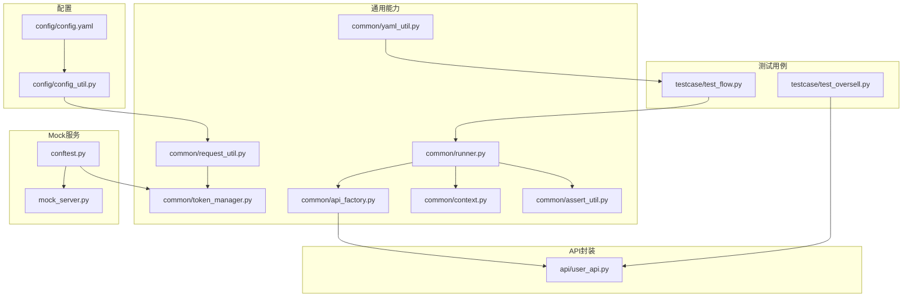
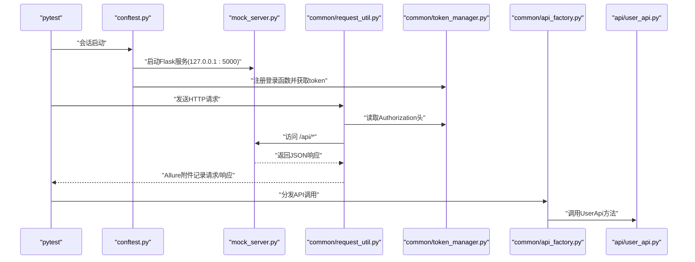
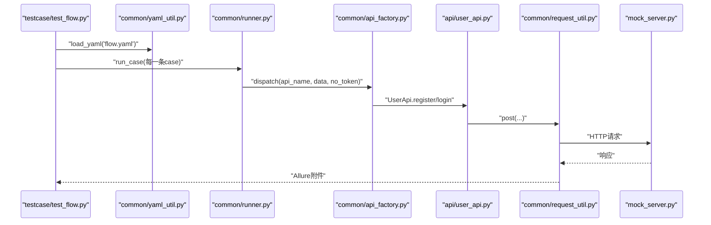
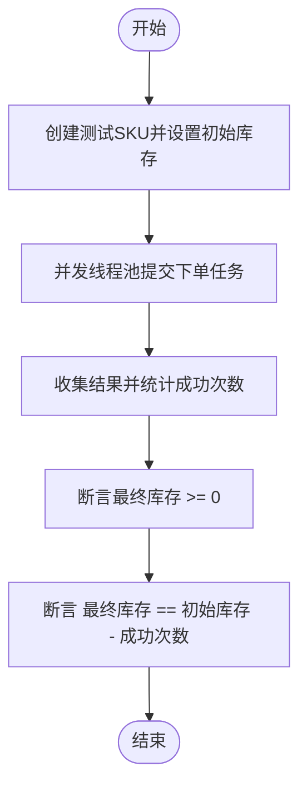
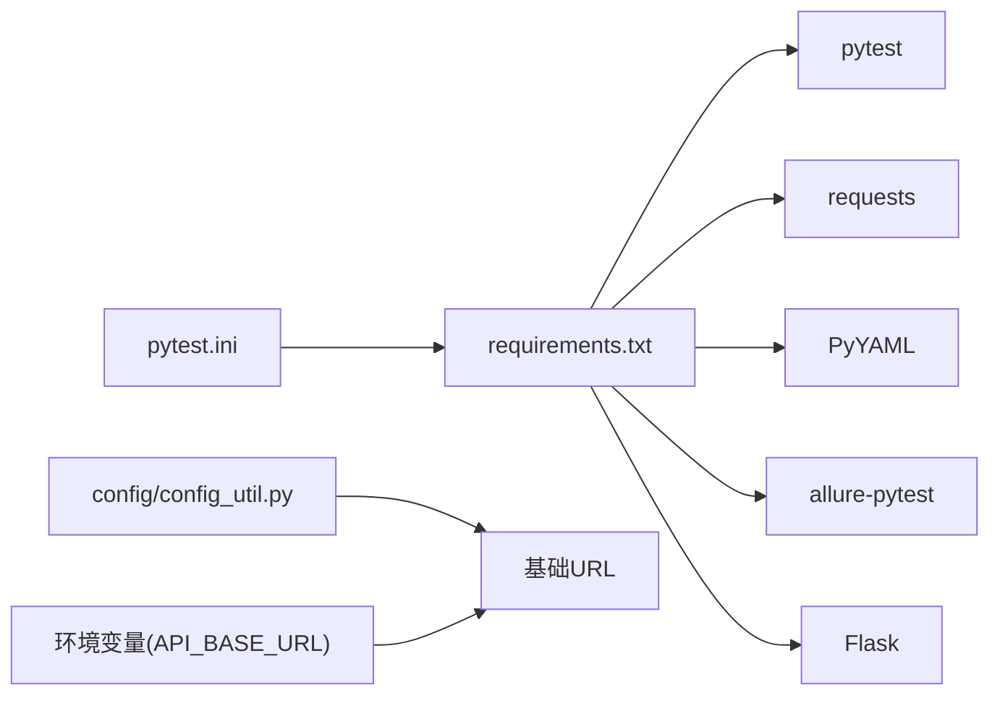

# 快速开始

<cite>
**本文引用的文件**
- [requirements.txt](file://requirements.txt)
- [pytest.ini](file://pytest.ini)
- [config/config.yaml](file://config/config.yaml)
- [config/config_util.py](file://config/config_util.py)
- [mock_server.py](file://mock_server.py)
- [conftest.py](file://conftest.py)
- [common/request_util.py](file://common/request_util.py)
- [common/token_manager.py](file://common/token_manager.py)
- [common/api_factory.py](file://common/api_factory.py)
- [common/runner.py](file://common/runner.py)
- [common/assert_util.py](file://common/assert_util.py)
- [common/yaml_util.py](file://common/yaml_util.py)
- [common/context.py](file://common/context.py)
- [api/user_api.py](file://api/user_api.py)
- [data/flow.yaml](file://data/flow.yaml)
- [testcase/test_flow.py](file://testcase/test_flow.py)
- [testcase/test_oversell.py](file://testcase/test_oversell.py)
</cite>

## 目录
1. [简介](#简介)
2. [项目结构](#项目结构)
3. [核心组件](#核心组件)
4. [架构总览](#架构总览)
5. [详细组件分析](#详细组件分析)
6. [依赖分析](#依赖分析)
7. [性能考虑](#性能考虑)
8. [故障排查指南](#故障排查指南)
9. [结论](#结论)
10. [附录](#附录)

## 简介
本指南面向首次接触该API自动化测试框架的新用户，帮助你在最短时间内完成环境准备、依赖安装、配置与Mock服务启动，并运行第一个测试用例，最终生成并查看测试报告。你将学会：
- Python版本与依赖安装
- 配置文件设置与环境变量覆盖
- 启动内置Mock服务器
- 运行首个测试用例（基于YAML编排）
- 查看测试结果与Allure报告

## 项目结构
该仓库采用“功能分层+配置驱动”的组织方式：测试用例位于testcase目录，API封装在api目录，通用能力在common目录，配置集中在config目录，数据与流程定义在data目录。

图表来源
- [config/config.yaml:1-10](file://config/config.yaml#L1-L10)
- [config/config_util.py:27-31](file://config/config_util.py#L27-L31)
- [common/request_util.py:13-17](file://common/request_util.py#L13-L17)
- [common/token_manager.py:8-11](file://common/token_manager.py#L8-L11)
- [common/api_factory.py:12-18](file://common/api_factory.py#L12-L18)
- [common/runner.py:15-21](file://common/runner.py#L15-L21)
- [common/yaml_util.py:11-14](file://common/yaml_util.py#L11-L14)
- [testcase/test_flow.py:9-16](file://testcase/test_flow.py#L9-L16)
- [testcase/test_oversell.py:13-16](file://testcase/test_oversell.py#L13-L16)
- [mock_server.py:318-322](file://mock_server.py#L318-L322)
- [conftest.py:33-45](file://conftest.py#L33-L45)

章节来源
- [pytest.ini:1-5](file://pytest.ini#L1-L5)
- [config/config.yaml:1-10](file://config/config.yaml#L1-L10)
- [config/config_util.py:27-31](file://config/config_util.py#L27-L31)

## 核心组件
- 请求与认证
  - RequestUtil：统一发送HTTP请求，自动拼接基础URL、注入Authorization头、支持Allure附件记录请求/响应。
  - TokenManager：线程安全的令牌管理器，支持注册登录函数以获取默认token。
- API封装
  - UserApi：封装用户注册/登录接口。
- 流程编排与断言
  - runner：按YAML步骤执行，支持变量替换、提取、断言。
  - assert_util：递归断言字典子集。
  - context：上下文存储，用于步骤间变量传递。
  - yaml_util：加载data目录下的YAML。
- 配置与Mock
  - config_util：读取config.yaml，支持环境变量覆盖基础URL与数据库路径。
  - mock_server：内置Flask Mock服务，默认监听127.0.0.1:5000。
  - conftest：pytest会话级fixture，自动初始化数据库、启动Mock服务、预登录并缓存token。

章节来源
- [common/request_util.py:13-66](file://common/request_util.py#L13-L66)
- [common/token_manager.py:8-38](file://common/token_manager.py#L8-L38)
- [api/user_api.py:8-22](file://api/user_api.py#L8-L22)
- [common/runner.py:15-45](file://common/runner.py#L15-L45)
- [common/assert_util.py:6-15](file://common/assert_util.py#L6-L15)
- [common/context.py:6-25](file://common/context.py#L6-L25)
- [common/yaml_util.py:11-15](file://common/yaml_util.py#L11-L15)
- [config/config_util.py:27-41](file://config/config_util.py#L27-L41)
- [mock_server.py:318-322](file://mock_server.py#L318-L322)
- [conftest.py:16-49](file://conftest.py#L16-L49)

## 架构总览
下图展示了从测试执行到Mock服务的关键交互路径，以及配置与通用组件的作用。

图表来源
- [conftest.py:33-45](file://conftest.py#L33-L45)
- [mock_server.py:43-186](file://mock_server.py#L43-L186)
- [common/request_util.py:27-58](file://common/request_util.py#L27-L58)
- [common/token_manager.py:28-37](file://common/token_manager.py#L28-L37)
- [common/api_factory.py:21-27](file://common/api_factory.py#L21-L27)
- [api/user_api.py:9-21](file://api/user_api.py#L9-L21)

## 详细组件分析

### 组件A：从零开始的完整安装流程
- 步骤1：准备Python环境
  - 建议使用Python 3.9及以上版本（具体以requirements为准）。
- 步骤2：安装依赖
  - 使用pip安装requirements.txt中的包。
- 步骤3：验证pytest配置
  - pytest.ini已配置输出Allure报告目录与测试路径。
- 步骤4：准备数据库与默认用户
  - conftest在会话开始时初始化SQLite数据库并插入默认用户。
- 步骤5：启动Mock服务
  - 可通过conftest自动启动，或直接运行mock_server.py。

章节来源
- [requirements.txt:1-6](file://requirements.txt#L1-L6)
- [pytest.ini:1-5](file://pytest.ini#L1-L5)
- [conftest.py:16-31](file://conftest.py#L16-L31)
- [mock_server.py:318-322](file://mock_server.py#L318-L322)

### 组件B：配置文件设置与环境变量覆盖
- 基础URL
  - 默认值来自config/config.yaml中的base.url。
  - 可通过环境变量API_BASE_URL覆盖。
- 数据库路径
  - 默认相对路径test.db，实际解析为项目根目录下的绝对路径。
- 默认用户
  - 来自config/config.yaml中的user节，供初始化使用。

章节来源
- [config/config.yaml:1-10](file://config/config.yaml#L1-L10)
- [config/config_util.py:27-31](file://config/config_util.py#L27-L31)
- [config/config_util.py:34-41](file://config/config_util.py#L34-L41)
- [config/config_util.py:43-49](file://config/config_util.py#L43-L49)

### 组件C：运行第一个测试用例（基于YAML编排）
- YAML流程定义
  - data/flow.yaml定义了电商“正常路径”场景的多步操作：注册、登录、新增商品、下单、支付。
- 执行入口
  - testcase/test_flow.py加载YAML并逐条执行run_case。
- 关键机制
  - runner按步骤执行，支持变量替换、提取到上下文、断言。
  - api_factory根据字符串映射调用具体API封装类。
  - RequestUtil自动注入Authorization头，Allure记录请求/响应。

图表来源
- [testcase/test_flow.py:9-16](file://testcase/test_flow.py#L9-L16)
- [common/yaml_util.py:11-14](file://common/yaml_util.py#L11-L14)
- [common/runner.py:15-45](file://common/runner.py#L15-L45)
- [common/api_factory.py:21-27](file://common/api_factory.py#L21-L27)
- [api/user_api.py:9-21](file://api/user_api.py#L9-L21)
- [common/request_util.py:27-58](file://common/request_util.py#L27-L58)
- [mock_server.py:132-186](file://mock_server.py#L132-L186)

章节来源
- [data/flow.yaml:1-41](file://data/flow.yaml#L1-L41)
- [testcase/test_flow.py:9-16](file://testcase/test_flow.py#L9-L16)
- [common/runner.py:15-45](file://common/runner.py#L15-L45)
- [common/api_factory.py:12-18](file://common/api_factory.py#L12-L18)
- [common/request_util.py:18-25](file://common/request_util.py#L18-L25)

### 组件D：并发与库存超卖测试
- 场景目标
  - 多线程同时发起下单请求，验证库存扣减的原子性与最终一致性。
- 实现要点
  - 先创建一个SKU并设置初始库存。
  - 使用线程池并发触发下单，统计成功次数。
  - 断言最终库存不小于0且与成功下单数一致。

图表来源
- [testcase/test_oversell.py:13-39](file://testcase/test_oversell.py#L13-L39)

章节来源
- [testcase/test_oversell.py:13-39](file://testcase/test_oversell.py#L13-L39)

### 组件E：Mock服务器与会话级Fixture
- 自动启动
  - conftest在pytest会话开始时启动Flask服务，等待片刻后进行预登录并缓存token。
- 基础URL
  - RequestUtil基于config_util.get_base_url()拼接请求地址，默认指向127.0.0.1:5000。
- 数据初始化
  - mock_server在启动时初始化数据库并写入演示数据。

章节来源
- [conftest.py:33-45](file://conftest.py#L33-L45)
- [mock_server.py:318-322](file://mock_server.py#L318-L322)
- [config/config_util.py:27-31](file://config/config_util.py#L27-L31)

## 依赖分析
- 运行时依赖
  - pytest、requests、PyYAML、allure-pytest、Flask。
- 测试路径与报告
  - pytest.ini指定测试目录与Allure输出目录，便于生成报告。
- 配置与环境变量
  - config_util支持从环境变量覆盖基础URL，便于在CI或不同环境切换。

图表来源
- [pytest.ini:1-5](file://pytest.ini#L1-L5)
- [requirements.txt:1-6](file://requirements.txt#L1-L6)
- [config/config_util.py:27-31](file://config/config_util.py#L27-L31)

章节来源
- [pytest.ini:1-5](file://pytest.ini#L1-L5)
- [requirements.txt:1-6](file://requirements.txt#L1-L6)
- [config/config_util.py:27-31](file://config/config_util.py#L27-L31)

## 性能考虑
- 并发测试
  - 使用线程池并发触发请求时，注意控制并发度，避免对本地Mock服务造成过大压力。
- 超时与重试
  - RequestUtil设置统一超时时间，建议在高负载场景下适当调整。
- 报告生成
  - Allure报告较大时，建议清理旧报告目录或限制保留数量。

## 故障排查指南
- 无法连接Mock服务
  - 确认端口未被占用；检查config/config.yaml中的base.url是否正确；如需覆盖，设置环境变量API_BASE_URL。
- 登录失败或401
  - 确保conftest已执行预登录并缓存token；检查TokenManager是否注册了登录函数。
- YAML步骤报错
  - 确认data/flow.yaml格式正确；检查api名称是否在api_factory注册表中。
- Allure报告为空
  - 确认pytest.ini中--alluredir参数有效；执行pytest后在report目录查看生成的HTML报告。

章节来源
- [config/config.yaml:1-10](file://config/config.yaml#L1-L10)
- [config/config_util.py:27-31](file://config/config_util.py#L27-L31)
- [conftest.py:42-44](file://conftest.py#L42-L44)
- [common/api_factory.py:21-27](file://common/api_factory.py#L21-L27)
- [pytest.ini](file://pytest.ini#L2)

## 结论
通过本快速开始指南，你已经完成了环境准备、依赖安装、配置与Mock服务启动，并成功运行了基于YAML的端到端测试流程。你可以在此基础上扩展更多API封装、编写复杂场景的测试用例，并结合并发测试验证系统在高负载下的稳定性。

## 附录

### A. 从零开始的完整安装步骤
- 安装Python（建议3.9+）
- 安装依赖：pip install -r requirements.txt
- 验证pytest：pytest --version
- 运行测试：pytest testcase/test_flow.py -v
- 生成并查看报告：pytest --alluredir=report && allure serve report

章节来源
- [requirements.txt:1-6](file://requirements.txt#L1-L6)
- [pytest.ini](file://pytest.ini#L2)

### B. 常见问题与解决方案
- 依赖安装失败
  - 清理pip缓存后重试；确保网络可访问PyPI。
- 端口冲突
  - 修改config/config.yaml中的base.url或关闭占用端口的进程。
- 报告无法生成
  - 确认report目录存在且有写权限；使用allure serve查看。

章节来源
- [config/config.yaml:1-10](file://config/config.yaml#L1-L10)
- [pytest.ini](file://pytest.ini#L2)