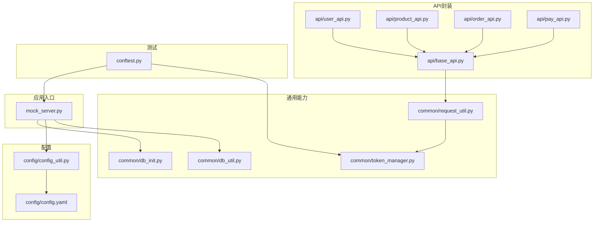
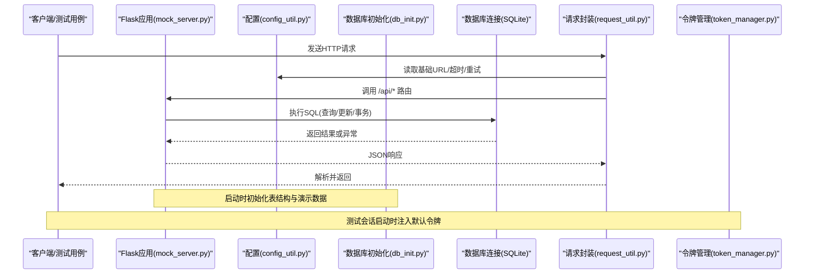
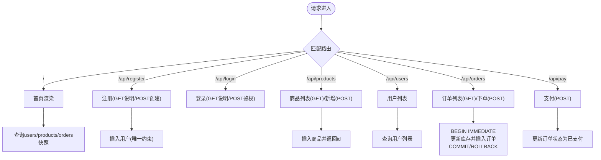
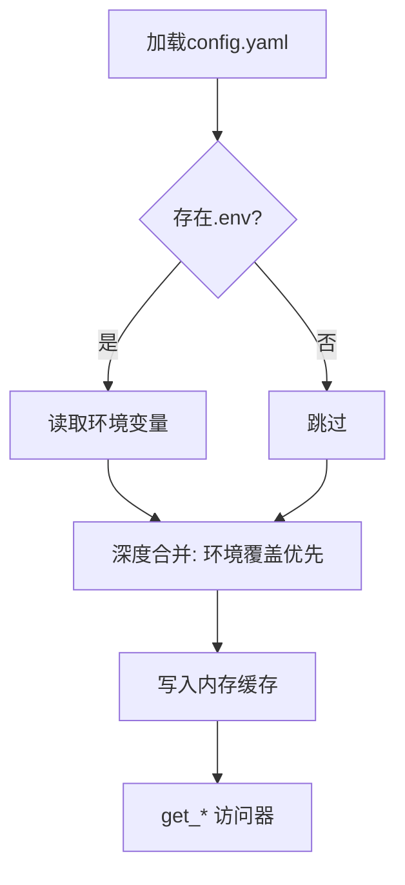
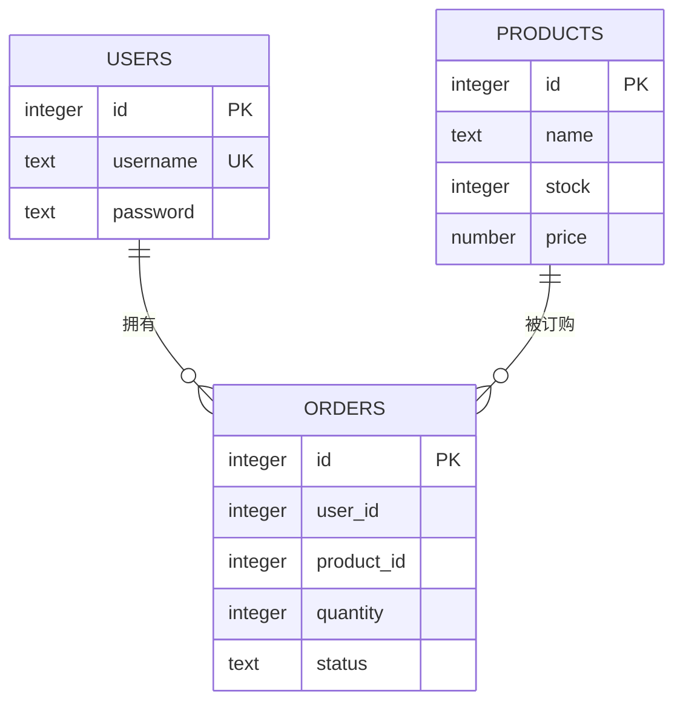
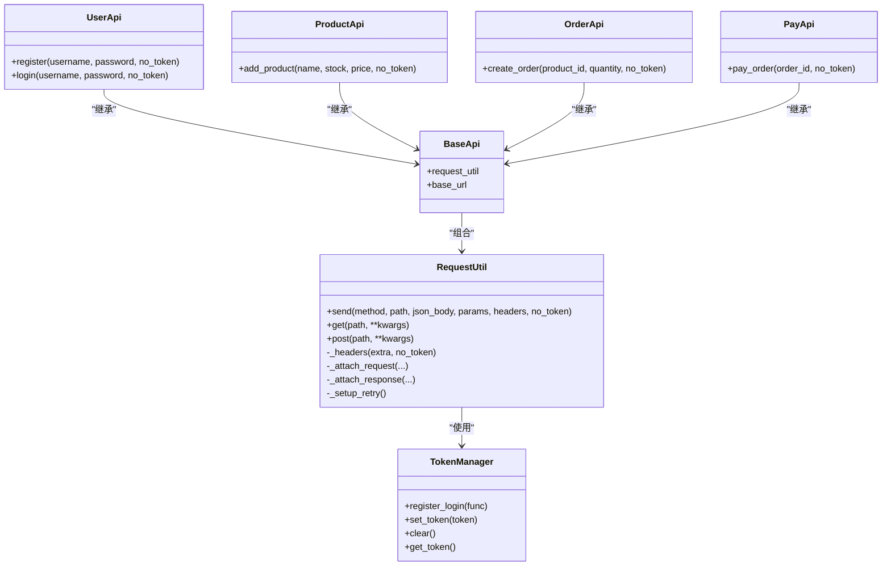
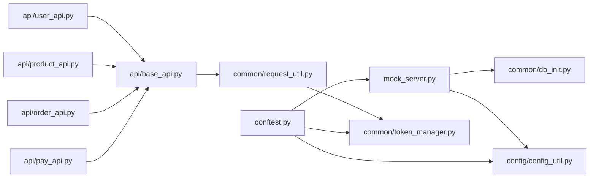

# Mock服务扩展

<cite>
**本文引用的文件**
- [mock_server.py](file://mock_server.py)
- [config_util.py](file://config/config_util.py)
- [db_init.py](file://common/db_init.py)
- [db_util.py](file://common/db_util.py)
- [request_util.py](file://common/request_util.py)
- [token_manager.py](file://common/token_manager.py)
- [base_api.py](file://api/base_api.py)
- [user_api.py](file://api/user_api.py)
- [product_api.py](file://api/product_api.py)
- [order_api.py](file://api/order_api.py)
- [pay_api.py](file://api/pay_api.py)
- [conftest.py](file://conftest.py)
- [config.yaml](file://config/config.yaml)
- [requirements.txt](file://requirements.txt)
</cite>

## 目录
1. [简介](#简介)
2. [项目结构](#项目结构)
3. [核心组件](#核心组件)
4. [架构总览](#架构总览)
5. [详细组件分析](#详细组件分析)
6. [依赖分析](#依赖分析)
7. [性能考虑](#性能考虑)
8. [故障排查指南](#故障排查指南)
9. [结论](#结论)
10. [附录](#附录)

## 简介
本指南面向希望扩展现有Flask Mock服务器的开发者，系统讲解如何在现有基础上新增路由、数据库操作与验证规则，遵循RESTful API设计规范，集成SQLite数据库，处理事务与并发访问，以及统一错误处理、状态码管理与响应格式化。文档同时提供可直接参考的代码片段路径，帮助快速落地复杂业务场景与测试需求。

## 项目结构
该项目采用“按功能域分层”的组织方式：
- 根目录提供Flask应用入口与测试运行配置
- api层封装对外API调用，便于测试与复用
- common层提供通用能力：数据库初始化与工具、请求封装、令牌管理、断言与执行器等
- config层集中管理配置加载与环境变量覆盖
- testcase与pytest配置用于自动化测试与本地服务启动

图表来源
- [mock_server.py:1-322](file://mock_server.py#L1-L322)
- [config_util.py:1-112](file://config/config_util.py#L1-L112)
- [db_init.py:1-78](file://common/db_init.py#L1-L78)
- [db_util.py:1-35](file://common/db_util.py#L1-L35)
- [request_util.py:1-117](file://common/request_util.py#L1-L117)
- [token_manager.py:1-38](file://common/token_manager.py#L1-L38)
- [base_api.py:1-11](file://api/base_api.py#L1-L11)
- [user_api.py:1-22](file://api/user_api.py#L1-L22)
- [product_api.py:1-15](file://api/product_api.py#L1-L15)
- [order_api.py:1-15](file://api/order_api.py#L1-L15)
- [pay_api.py:1-15](file://api/pay_api.py#L1-L15)
- [conftest.py:1-54](file://conftest.py#L1-L54)
- [config.yaml:1-10](file://config/config.yaml#L1-L10)

章节来源
- [mock_server.py:1-322](file://mock_server.py#L1-L322)
- [config_util.py:1-112](file://config/config_util.py#L1-L112)
- [db_init.py:1-78](file://common/db_init.py#L1-L78)
- [db_util.py:1-35](file://common/db_util.py#L1-L35)
- [request_util.py:1-117](file://common/request_util.py#L1-L117)
- [token_manager.py:1-38](file://common/token_manager.py#L1-L38)
- [base_api.py:1-11](file://api/base_api.py#L1-L11)
- [user_api.py:1-22](file://api/user_api.py#L1-L22)
- [product_api.py:1-15](file://api/product_api.py#L1-L15)
- [order_api.py:1-15](file://api/order_api.py#L1-L15)
- [pay_api.py:1-15](file://api/pay_api.py#L1-L15)
- [conftest.py:1-54](file://conftest.py#L1-L54)
- [config.yaml:1-10](file://config/config.yaml#L1-L10)

## 核心组件
- Flask应用与路由
  - 应用入口与全局状态：[mock_server.py:13-14](file://mock_server.py#L13-L14)
  - 数据库连接与认证辅助：[mock_server.py:17-40](file://mock_server.py#L17-L40)
  - 路由定义与业务逻辑：[mock_server.py:43-316](file://mock_server.py#L43-L316)
- 配置系统
  - 配置加载与环境覆盖：[config_util.py:31-52](file://config/config_util.py#L31-L52)
  - 基础URL、超时、重试、数据库路径、默认用户：[config_util.py:64-112](file://config/config_util.py#L64-L112)、[config.yaml:1-10](file://config/config.yaml#L1-L10)
- 数据库初始化与工具
  - 表结构初始化与演示数据：[db_init.py:8-78](file://common/db_init.py#L8-L78)
  - 通用查询/执行工具：[db_util.py:9-35](file://common/db_util.py#L9-L35)
- 请求封装与令牌管理
  - 统一发送请求、重试策略、日志与Allure附件：[request_util.py:29-117](file://common/request_util.py#L29-L117)
  - 并发安全的令牌缓存与登录回调：[token_manager.py:8-38](file://common/token_manager.py#L8-L38)
- API封装层
  - 基类与具体API：[base_api.py:7-11](file://api/base_api.py#L7-L11)、[user_api.py:8-22](file://api/user_api.py#L8-L22)、[product_api.py:8-15](file://api/product_api.py#L8-L15)、[order_api.py:8-15](file://api/order_api.py#L8-L15)、[pay_api.py:8-15](file://api/pay_api.py#L8-L15)

章节来源
- [mock_server.py:13-316](file://mock_server.py#L13-L316)
- [config_util.py:31-112](file://config/config_util.py#L31-L112)
- [config.yaml:1-10](file://config/config.yaml#L1-L10)
- [db_init.py:8-78](file://common/db_init.py#L8-L78)
- [db_util.py:9-35](file://common/db_util.py#L9-L35)
- [request_util.py:29-117](file://common/request_util.py#L29-L117)
- [token_manager.py:8-38](file://common/token_manager.py#L8-L38)
- [base_api.py:7-11](file://api/base_api.py#L7-L11)
- [user_api.py:8-22](file://api/user_api.py#L8-L22)
- [product_api.py:8-15](file://api/product_api.py#L8-L15)
- [order_api.py:8-15](file://api/order_api.py#L8-L15)
- [pay_api.py:8-15](file://api/pay_api.py#L8-L15)

## 架构总览
下图展示了从客户端到Flask路由、数据库与配置系统的交互流程，以及测试阶段的本地服务启动与令牌注入机制。

图表来源
- [mock_server.py:17-316](file://mock_server.py#L17-L316)
- [config_util.py:64-112](file://config/config_util.py#L64-L112)
- [db_init.py:8-78](file://common/db_init.py#L8-L78)
- [request_util.py:29-117](file://common/request_util.py#L29-L117)
- [token_manager.py:8-38](file://common/token_manager.py#L8-L38)

## 详细组件分析

### Flask应用与路由设计
- 入口与全局状态
  - 应用实例与内存令牌表：[mock_server.py:13-14](file://mock_server.py#L13-L14)
  - 连接工厂与线程安全：[mock_server.py:17-18](file://mock_server.py#L17-L18)
- 认证与鉴权
  - Bearer Token校验与用户解析：[mock_server.py:21-40](file://mock_server.py#L21-L40)
- 路由与业务逻辑
  - 首页与数据快照：[mock_server.py:43-129](file://mock_server.py#L43-L129)
  - 注册/登录：[mock_server.py:132-186](file://mock_server.py#L132-L186)
  - 商品增删查：[mock_server.py:188-220](file://mock_server.py#L188-L220)
  - 用户列表：[mock_server.py:222-229](file://mock_server.py#L222-L229)
  - 订单创建与库存扣减（事务）：[mock_server.py:232-289](file://mock_server.py#L232-L289)
  - 支付更新状态：[mock_server.py:292-316](file://mock_server.py#L292-L316)
- 启动流程
  - 初始化数据库与演示数据：[mock_server.py:318-322](file://mock_server.py#L318-L322)

图表来源
- [mock_server.py:43-316](file://mock_server.py#L43-L316)

章节来源
- [mock_server.py:13-316](file://mock_server.py#L13-L316)

### 配置系统与环境覆盖
- 配置加载与合并
  - 递归合并与环境覆盖：[config_util.py:20-52](file://config/config_util.py#L20-L52)
- 关键配置项
  - 基础URL、超时、重试、数据库路径、默认用户：[config_util.py:64-112](file://config/config_util.py#L64-L112)、[config.yaml:1-10](file://config/config.yaml#L1-L10)
- 配置使用
  - 获取数据库路径与基础URL：[mock_server.py:11-11](file://mock_server.py#L11-L11)、[base_api.py:4-10](file://api/base_api.py#L4-L10)

图表来源
- [config_util.py:31-112](file://config/config_util.py#L31-L112)
- [config.yaml:1-10](file://config/config.yaml#L1-L10)

章节来源
- [config_util.py:20-112](file://config/config_util.py#L20-L112)
- [config.yaml:1-10](file://config/config.yaml#L1-L10)
- [base_api.py:4-10](file://api/base_api.py#L4-L10)

### 数据库初始化与工具
- 初始化脚本
  - 创建用户/商品/订单表：[db_init.py:12-35](file://common/db_init.py#L12-L35)
  - 插入演示数据（幂等）：[db_init.py:41-78](file://common/db_init.py#L41-L78)
- 通用工具
  - 单行查询、全部查询、执行并提交：[db_util.py:9-35](file://common/db_util.py#L9-L35)

图表来源
- [db_init.py:12-35](file://common/db_init.py#L12-L35)

章节来源
- [db_init.py:8-78](file://common/db_init.py#L8-L78)
- [db_util.py:9-35](file://common/db_util.py#L9-L35)

### 请求封装与令牌管理
- 请求封装
  - 统一发送、重试策略、日志与Allure附件：[request_util.py:29-117](file://common/request_util.py#L29-L117)
- 令牌管理
  - 登录回调注册、并发安全缓存、首次拉取：[token_manager.py:8-38](file://common/token_manager.py#L8-L38)
- API封装基类
  - 组装基础URL与请求工具：[base_api.py:7-11](file://api/base_api.py#L7-L11)

图表来源
- [request_util.py:29-117](file://common/request_util.py#L29-L117)
- [token_manager.py:8-38](file://common/token_manager.py#L8-L38)
- [base_api.py:7-11](file://api/base_api.py#L7-L11)
- [user_api.py:8-22](file://api/user_api.py#L8-L22)
- [product_api.py:8-15](file://api/product_api.py#L8-L15)
- [order_api.py:8-15](file://api/order_api.py#L8-L15)
- [pay_api.py:8-15](file://api/pay_api.py#L8-L15)

章节来源
- [request_util.py:29-117](file://common/request_util.py#L29-L117)
- [token_manager.py:8-38](file://common/token_manager.py#L8-L38)
- [base_api.py:7-11](file://api/base_api.py#L7-L11)
- [user_api.py:8-22](file://api/user_api.py#L8-L22)
- [product_api.py:8-15](file://api/product_api.py#L8-L15)
- [order_api.py:8-15](file://api/order_api.py#L8-L15)
- [pay_api.py:8-15](file://api/pay_api.py#L8-L15)

### 测试与本地服务
- 会话级启动
  - 清理旧数据库、初始化新表、注入默认用户：[conftest.py:21-34](file://conftest.py#L21-L34)
  - 启动本地Flask服务并注入令牌：[conftest.py:37-53](file://conftest.py#L37-L53)
- 默认登录
  - 使用配置中的默认用户进行登录并缓存token：[conftest.py:46-48](file://conftest.py#L46-L48)

章节来源
- [conftest.py:21-53](file://conftest.py#L21-L53)

## 依赖分析
- 组件耦合
  - mock_server对db_init与config_util强依赖，对request_util间接通过API层使用
  - API层仅依赖BaseApi与RequestUtil，低耦合高内聚
- 外部依赖
  - Flask、requests、PyYAML、allure、python-dotenv、jsonschema等：[requirements.txt:1-10](file://requirements.txt#L1-L10)

图表来源
- [mock_server.py:10-11](file://mock_server.py#L10-L11)
- [config_util.py:1-112](file://config/config_util.py#L1-L112)
- [db_init.py:1-78](file://common/db_init.py#L1-L78)
- [request_util.py:1-117](file://common/request_util.py#L1-L117)
- [token_manager.py:1-38](file://common/token_manager.py#L1-L38)
- [base_api.py:1-11](file://api/base_api.py#L1-L11)
- [user_api.py:1-22](file://api/user_api.py#L1-L22)
- [product_api.py:1-15](file://api/product_api.py#L1-L15)
- [order_api.py:1-15](file://api/order_api.py#L1-L15)
- [pay_api.py:1-15](file://api/pay_api.py#L1-L15)
- [conftest.py:1-54](file://conftest.py#L1-L54)

章节来源
- [requirements.txt:1-10](file://requirements.txt#L1-L10)

## 性能考虑
- 连接与并发
  - SQLite默认单进程写入，建议在高并发场景下评估外部数据库或连接池方案
  - 当前实现未启用线程池，注意避免长事务阻塞
- 事务与一致性
  - 订单创建使用显式BEGIN IMMEDIATE，确保库存扣减与订单插入原子性：[mock_server.py:269-289](file://mock_server.py#L269-L289)
- 网络与重试
  - 请求封装内置指数退避重试策略，减少瞬时网络抖动影响：[request_util.py:35-46](file://common/request_util.py#L35-L46)
- 缓存与令牌
  - TokenManager使用锁保护并发安全，避免重复登录：[token_manager.py:8-38](file://common/token_manager.py#L8-L38)

## 故障排查指南
- 认证失败
  - 检查Authorization头是否为Bearer Token且有效：[mock_server.py:21-29](file://mock_server.py#L21-L29)
  - 确认已通过登录接口获取并缓存token：[conftest.py:46-48](file://conftest.py#L46-L48)
- 数据库问题
  - 确认数据库路径与权限：[config_util.py:96-102](file://config/config_util.py#L96-L102)
  - 初始化表结构与演示数据：[db_init.py:8-78](file://common/db_init.py#L8-L78)
- 请求异常
  - 查看请求封装的日志与Allure附件，定位状态码与响应体：[request_util.py:57-109](file://common/request_util.py#L57-L109)
- 事务回滚
  - 库存不足或订单状态异常会导致回滚，检查返回的错误信息与状态码：[mock_server.py:270-289](file://mock_server.py#L270-L289)

章节来源
- [mock_server.py:21-29](file://mock_server.py#L21-L29)
- [config_util.py:96-102](file://config/config_util.py#L96-L102)
- [db_init.py:8-78](file://common/db_init.py#L8-L78)
- [request_util.py:57-109](file://common/request_util.py#L57-L109)
- [conftest.py:46-48](file://conftest.py#L46-L48)

## 结论
该Mock服务以Flask为核心，结合配置系统、数据库初始化与通用请求封装，提供了清晰的RESTful接口与一致的错误处理机制。通过本文档的扩展指引，开发者可以安全地新增路由、完善数据库CRUD、引入更严格的验证规则，并在测试环境中稳定运行。

## 附录

### 扩展新路由的最佳实践
- 设计原则
  - 使用RESTful命名与方法：GET/POST/PUT/DELETE，明确资源与动作
  - 明确鉴权策略：公开接口与受保护接口分离
  - 统一响应格式：成功返回JSON对象，错误返回带错误码的JSON
- 新增步骤
  - 在API层新增封装类与方法：[base_api.py:7-11](file://api/base_api.py#L7-L11)、[user_api.py:8-22](file://api/user_api.py#L8-L22)、[product_api.py:8-15](file://api/product_api.py#L8-L15)、[order_api.py:8-15](file://api/order_api.py#L8-L15)、[pay_api.py:8-15](file://api/pay_api.py#L8-L15)
  - 在Flask应用中添加路由与业务逻辑：[mock_server.py:43-316](file://mock_server.py#L43-L316)
  - 如涉及数据库，先在db_init中定义表结构，再在db_util中封装查询/执行：[db_init.py:12-35](file://common/db_init.py#L12-L35)、[db_util.py:9-35](file://common/db_util.py#L9-L35)
  - 配置与环境变量：[config_util.py:64-112](file://config/config_util.py#L64-L112)、[config.yaml:1-10](file://config/config.yaml#L1-L10)

### 集成SQLite、事务与并发
- 连接与事务
  - 使用BEGIN IMMEDIATE保证原子性：[mock_server.py:269-289](file://mock_server.py#L269-L289)
  - 异常时回滚，最终提交：[mock_server.py:284-289](file://mock_server.py#L284-L289)
- 并发访问
  - SQLite写入串行化，建议在高并发场景迁移至支持并发的数据库
  - 使用锁保护共享状态（如令牌缓存）：[token_manager.py:8-38](file://common/token_manager.py#L8-L38)

### 错误处理、状态码与响应格式
- 状态码规范
  - 成功：200/201
  - 客户端错误：400/401/404/409
  - 服务端错误：500
- 响应格式
  - 统一使用jsonify返回对象，错误包含错误字段与状态码：[mock_server.py:146-156](file://mock_server.py#L146-L156)、[mock_server.py:181-185](file://mock_server.py#L181-L185)、[mock_server.py:275-277](file://mock_server.py#L275-L277)、[mock_server.py:310-314](file://mock_server.py#L310-L314)
- 请求封装
  - 自动记录请求与响应，异常时抛出带状态码的异常：[request_util.py:18-27](file://common/request_util.py#L18-L27)、[request_util.py:94-109](file://common/request_util.py#L94-L109)

### 示例：新增一个“退款”API
- API封装
  - 在API层新增退款方法：[pay_api.py:8-15](file://api/pay_api.py#L8-L15)作为模板
- Flask路由
  - 添加POST /api/refund，接收order_id并更新状态：[mock_server.py:292-316](file://mock_server.py#L292-L316)为模板
- 数据库
  - 在db_init中扩展表或状态枚举：[db_init.py:12-35](file://common/db_init.py#L12-L35)
- 配置
  - 如需调整超时/重试，修改配置项：[config_util.py:71-84](file://config/config_util.py#L71-L84)、[config.yaml:1-10](file://config/config.yaml#L1-L10)