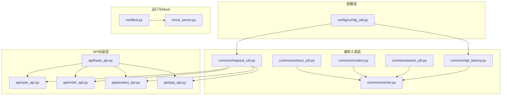
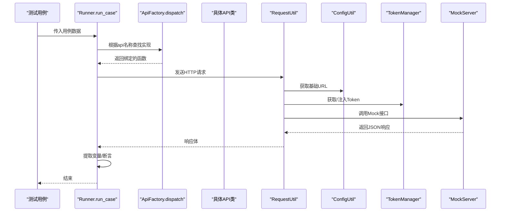
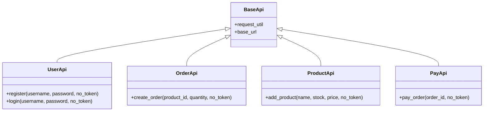
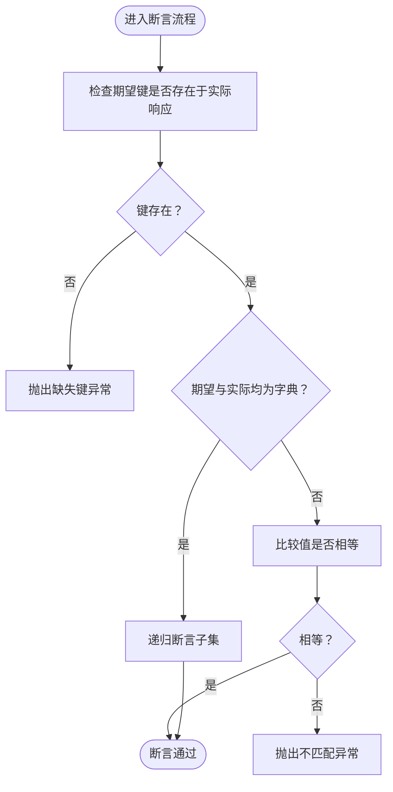
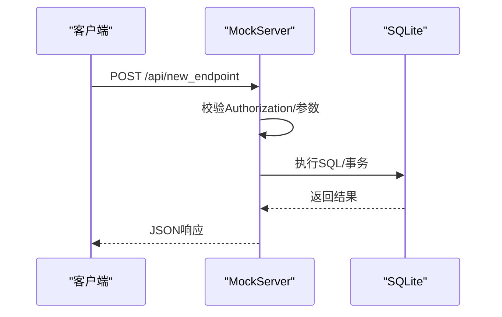
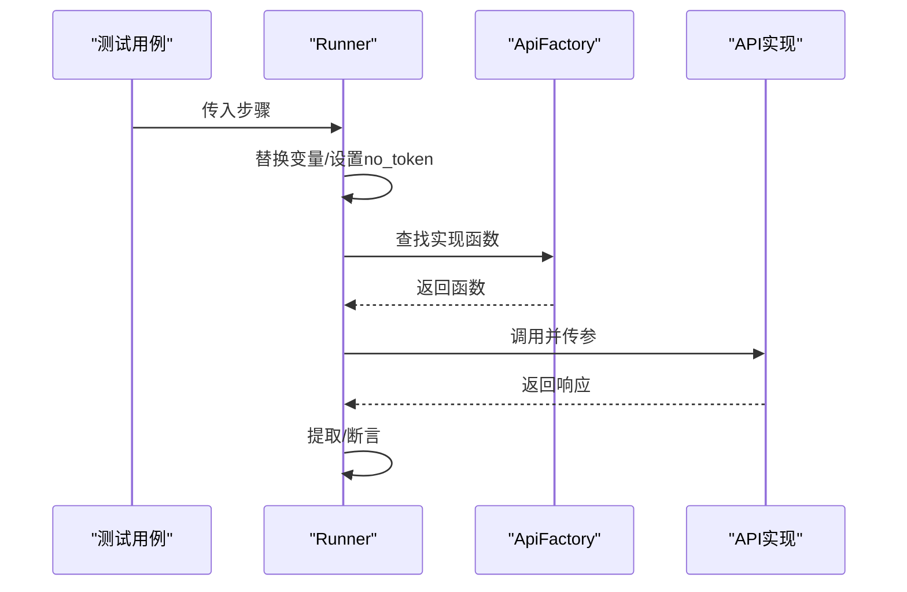
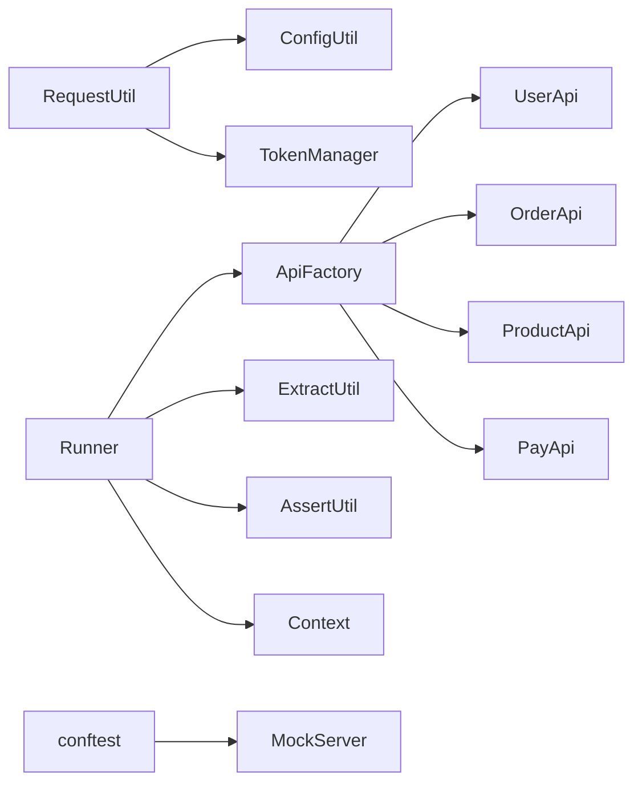

# 扩展开发指南

<cite>
**本文引用的文件**
- [mock_server.py](file://mock_server.py)
- [conftest.py](file://conftest.py)
- [requirements.txt](file://requirements.txt)
- [common/api_factory.py](file://common/api_factory.py)
- [common/runner.py](file://common/runner.py)
- [common/request_util.py](file://common/request_util.py)
- [common/assert_util.py](file://common/assert_util.py)
- [common/extract_util.py](file://common/extract_util.py)
- [common/context.py](file://common/context.py)
- [config/config_util.py](file://config/config_util.py)
- [api/base_api.py](file://api/base_api.py)
- [api/user_api.py](file://api/user_api.py)
- [api/order_api.py](file://api/order_api.py)
- [api/pay_api.py](file://api/pay_api.py)
- [api/product_api.py](file://api/product_api.py)
</cite>

## 目录
1. [简介](#简介)
2. [项目结构](#项目结构)
3. [核心组件](#核心组件)
4. [架构总览](#架构总览)
5. [详细组件分析](#详细组件分析)
6. [依赖分析](#依赖分析)
7. [性能考虑](#性能考虑)
8. [故障排查指南](#故障排查指南)
9. [结论](#结论)
10. [附录](#附录)

## 简介
本指南面向高级开发者与测试工程师，系统讲解如何在现有框架基础上进行扩展开发，包括：
- 新增API模块（新增业务接口）
- 自定义工具类（请求、断言、提取等）
- 扩展Mock服务（新增接口或行为）
- 模块开发规范与API注册流程
- 测试用例编写方法与最佳实践
- 集成第三方服务、自定义断言规则与扩展测试场景
- 框架扩展点与插件机制的深入定制

## 项目结构
该项目采用“按职责分层+按功能分包”的组织方式：
- api：封装具体业务API调用（用户、订单、支付、商品）
- common：通用工具与运行时（请求、断言、提取、上下文、运行器）
- config：配置加载与环境变量覆盖
- mock_server：内置Mock服务（SQLite后端）
- conftest.py：pytest会话级初始化与Mock服务启动
- testcase：测试用例入口

图表来源
- [config/config_util.py:27-31](file://config/config_util.py#L27-L31)
- [common/request_util.py:13-65](file://common/request_util.py#L13-L65)
- [common/api_factory.py:21-27](file://common/api_factory.py#L21-L27)
- [common/runner.py:15-45](file://common/runner.py#L15-L45)
- [api/base_api.py:7-11](file://api/base_api.py#L7-L11)
- [api/user_api.py:8-22](file://api/user_api.py#L8-L22)
- [api/order_api.py:8-15](file://api/order_api.py#L8-L15)
- [api/product_api.py:8-15](file://api/product_api.py#L8-L15)
- [api/pay_api.py:8-15](file://api/pay_api.py#L8-L15)
- [conftest.py:33-48](file://conftest.py#L33-L48)
- [mock_server.py:13-13](file://mock_server.py#L13-L13)

章节来源
- [requirements.txt:1-6](file://requirements.txt#L1-L6)
- [conftest.py:16-50](file://conftest.py#L16-L50)

## 核心组件
- 请求与认证
  - RequestUtil：统一发送HTTP请求、自动注入Authorization头、Allure附件记录
  - TokenManager：会话级Token管理（由conftest注册默认登录）
- 运行器
  - Runner：解析测试用例步骤、替换变量、提取上下文、执行断言
- 工具集
  - ExtractUtil：从响应中按路径提取键值到上下文
  - AssertUtil：递归断言子集（支持嵌套字典）
  - Context：轻量上下文存储
- API工厂
  - ApiFactory：集中注册API名称到实现函数的映射，统一调度
- 配置
  - ConfigUtil：加载YAML配置、支持环境变量覆盖、提供基础URL与数据库路径
- Mock服务
  - MockServer：基于Flask的SQLite后端Mock API（注册/登录/商品/订单/支付）

章节来源
- [common/request_util.py:13-65](file://common/request_util.py#L13-L65)
- [common/runner.py:15-45](file://common/runner.py#L15-L45)
- [common/extract_util.py:22-28](file://common/extract_util.py#L22-L28)
- [common/assert_util.py:6-15](file://common/assert_util.py#L6-L15)
- [common/context.py:6-25](file://common/context.py#L6-L25)
- [common/api_factory.py:21-27](file://common/api_factory.py#L21-L27)
- [config/config_util.py:27-50](file://config/config_util.py#L27-L50)
- [mock_server.py:43-129](file://mock_server.py#L43-L129)

## 架构总览
下图展示从测试用例到Mock服务的关键调用链路与扩展点。

图表来源
- [common/runner.py:15-45](file://common/runner.py#L15-L45)
- [common/api_factory.py:21-27](file://common/api_factory.py#L21-L27)
- [common/request_util.py:27-58](file://common/request_util.py#L27-L58)
- [config/config_util.py:27-31](file://config/config_util.py#L27-L31)
- [conftest.py:33-44](file://conftest.py#L33-L44)
- [mock_server.py:132-156](file://mock_server.py#L132-L156)

## 详细组件分析

### 组件一：新增API模块（以用户注册为例）
目标：新增一个业务API（如用户注册），并接入统一调度与运行流程。

步骤
1) 在api目录新增API类
- 参考现有类结构，继承BaseApi，封装HTTP请求
- 示例参考：[api/user_api.py:8-22](file://api/user_api.py#L8-L22)
2) 在api_factory中注册新API
- 在注册表中添加新键值对，将字符串标识映射到实现函数
- 示例参考：[common/api_factory.py:12-18](file://common/api_factory.py#L12-L18)
3) 在测试用例中使用
- 步骤中指定api字段为已注册名称，data中传入参数
- 运行器会自动替换变量、提取与断言
- 示例参考：[common/runner.py:15-45](file://common/runner.py#L15-L45)

图表来源
- [api/base_api.py:7-11](file://api/base_api.py#L7-L11)
- [api/user_api.py:8-22](file://api/user_api.py#L8-L22)
- [api/order_api.py:8-15](file://api/order_api.py#L8-L15)
- [api/product_api.py:8-15](file://api/product_api.py#L8-L15)
- [api/pay_api.py:8-15](file://api/pay_api.py#L8-L15)

章节来源
- [api/user_api.py:8-22](file://api/user_api.py#L8-L22)
- [common/api_factory.py:12-18](file://common/api_factory.py#L12-L18)
- [common/runner.py:15-45](file://common/runner.py#L15-L45)

### 组件二：自定义工具类（请求、断言、提取）
- 自定义请求工具
  - 若需扩展认证策略或中间件，可在RequestUtil中扩展_headers逻辑
  - 参考：[common/request_util.py:18-25](file://common/request_util.py#L18-L25)
- 自定义断言规则
  - 在AssertUtil基础上扩展断言类型（如数值范围、正则匹配、集合包含等）
  - 参考：[common/assert_util.py:6-15](file://common/assert_util.py#L6-L15)
- 自定义提取规则
  - 在ExtractUtil中扩展路径解析或增加提取策略
  - 参考：[common/extract_util.py:22-28](file://common/extract_util.py#L22-L28)

图表来源
- [common/assert_util.py:6-15](file://common/assert_util.py#L6-L15)

章节来源
- [common/request_util.py:18-25](file://common/request_util.py#L18-L25)
- [common/assert_util.py:6-15](file://common/assert_util.py#L6-L15)
- [common/extract_util.py:22-28](file://common/extract_util.py#L22-L28)

### 组件三：扩展Mock服务功能
- 新增路由
  - 在MockServer中添加新的@app.route装饰的函数，处理GET/POST请求
  - 参考现有路由：[mock_server.py:132-156](file://mock_server.py#L132-L156)、[mock_server.py:159-185](file://mock_server.py#L159-L185)、[mock_server.py:188-219](file://mock_server.py#L188-L219)
- 数据访问
  - 使用全局连接函数与数据库路径配置
  - 参考：[mock_server.py:17-18](file://mock_server.py#L17-L18)、[config/config_util.py:34-40](file://config/config_util.py#L34-L40)
- 认证与鉴权
  - 可复用现有鉴权逻辑（Bearer Token）或扩展为多租户/角色校验
  - 参考：[mock_server.py:21-29](file://mock_server.py#L21-L29)、[mock_server.py:263-264](file://mock_server.py#L263-L264)

图表来源
- [mock_server.py:292-315](file://mock_server.py#L292-L315)
- [config/config_util.py:34-40](file://config/config_util.py#L34-L40)

章节来源
- [mock_server.py:132-156](file://mock_server.py#L132-L156)
- [mock_server.py:159-185](file://mock_server.py#L159-L185)
- [mock_server.py:188-219](file://mock_server.py#L188-L219)
- [mock_server.py:292-315](file://mock_server.py#L292-L315)

### 组件四：API注册流程与运行器
- 注册流程
  - 在ApiFactory注册表中添加新API名称到实现函数的映射
  - 参考：[common/api_factory.py:12-18](file://common/api_factory.py#L12-L18)
- 运行流程
  - Runner逐步执行：替换变量、调用dispatch、提取上下文、断言
  - 参考：[common/runner.py:15-45](file://common/runner.py#L15-L45)

图表来源
- [common/runner.py:15-45](file://common/runner.py#L15-L45)
- [common/api_factory.py:21-27](file://common/api_factory.py#L21-L27)

章节来源
- [common/api_factory.py:12-18](file://common/api_factory.py#L12-L18)
- [common/runner.py:15-45](file://common/runner.py#L15-L45)

### 组件五：测试用例编写方法与最佳实践
- 步骤结构
  - 必填字段：api（必须为已注册名称）、data（请求参数）
  - 可选字段：extract（键路径映射）、assert（期望值）、no_token（是否跳过鉴权）
  - 参考：[common/runner.py:22-44](file://common/runner.py#L22-L44)
- 变量替换
  - 使用上下文中的键值替换data与assert中的占位
  - 参考：[common/runner.py:27-44](file://common/runner.py#L27-L44)
- 断言与提取
  - 提取：将响应中的值写入上下文，供后续步骤使用
  - 断言：支持嵌套字典的子集断言
  - 参考：[common/extract_util.py:22-28](file://common/extract_util.py#L22-L28)、[common/assert_util.py:6-15](file://common/assert_util.py#L6-L15)

章节来源
- [common/runner.py:15-45](file://common/runner.py#L15-L45)
- [common/extract_util.py:22-28](file://common/extract_util.py#L22-L28)
- [common/assert_util.py:6-15](file://common/assert_util.py#L6-L15)

### 组件六：集成第三方服务与扩展测试场景
- 集成第三方服务
  - 在RequestUtil中扩展认证头或代理设置
  - 参考：[common/request_util.py:18-25](file://common/request_util.py#L18-L25)
- 自定义断言规则
  - 在AssertUtil中扩展断言类型（如范围、正则、集合）
  - 参考：[common/assert_util.py:6-15](file://common/assert_util.py#L6-L15)
- 扩展测试场景
  - 通过Context传递跨步骤状态，结合extract/assert构建复杂流程
  - 参考：[common/context.py:6-25](file://common/context.py#L6-L25)、[common/runner.py:33-44](file://common/runner.py#L33-L44)

章节来源
- [common/request_util.py:18-25](file://common/request_util.py#L18-L25)
- [common/assert_util.py:6-15](file://common/assert_util.py#L6-L15)
- [common/context.py:6-25](file://common/context.py#L6-L25)
- [common/runner.py:33-44](file://common/runner.py#L33-L44)

## 依赖分析
- 外部依赖
  - pytest、requests、PyYAML、allure-pytest、Flask
  - 参考：[requirements.txt:1-6](file://requirements.txt#L1-L6)
- 内部耦合
  - Runner依赖ApiFactory、ExtractUtil、AssertUtil、Context、TokenManager
  - RequestUtil依赖ConfigUtil与TokenManager
  - MockServer依赖ConfigUtil与数据库初始化
  - 参考：[common/runner.py:7-12](file://common/runner.py#L7-L12)、[common/request_util.py:9-16](file://common/request_util.py#L9-L16)、[mock_server.py:10-11](file://mock_server.py#L10-L11)

图表来源
- [common/request_util.py:9-16](file://common/request_util.py#L9-L16)
- [common/runner.py:7-12](file://common/runner.py#L7-L12)
- [common/api_factory.py:5-8](file://common/api_factory.py#L5-L8)
- [conftest.py:33-44](file://conftest.py#L33-L44)
- [mock_server.py:10-11](file://mock_server.py#L10-L11)

章节来源
- [requirements.txt:1-6](file://requirements.txt#L1-L6)
- [common/runner.py:7-12](file://common/runner.py#L7-L12)
- [common/request_util.py:9-16](file://common/request_util.py#L9-L16)
- [common/api_factory.py:5-8](file://common/api_factory.py#L5-L8)
- [conftest.py:33-44](file://conftest.py#L33-L44)
- [mock_server.py:10-11](file://mock_server.py#L10-L11)

## 性能考虑
- 请求超时与重试
  - RequestUtil设置统一超时；如需重试，可在上层封装或使用requests适配器
  - 参考：[common/request_util.py:46-58](file://common/request_util.py#L46-L58)
- 并发与线程安全
  - MockServer通过线程启动；确保数据库操作在单线程事务中完成
  - 参考：[conftest.py:37-40](file://conftest.py#L37-L40)、[mock_server.py:270-286](file://mock_server.py#L270-L286)
- 日志与Allure附件
  - 请求/响应均作为Allure附件，便于定位问题但可能影响磁盘占用
  - 参考：[common/request_util.py:40-56](file://common/request_util.py#L40-L56)

## 故障排查指南
- 401未授权
  - 检查Authorization头是否正确注入；确认TokenManager已注册默认登录
  - 参考：[common/request_util.py:22-24](file://common/request_util.py#L22-L24)、[conftest.py:42-44](file://conftest.py#L42-L44)
- 未知API步骤
  - 确认api名称已在ApiFactory注册
  - 参考：[common/api_factory.py:22-23](file://common/api_factory.py#L22-L23)
- 断言失败
  - 使用嵌套键路径对比，关注缺失键或类型不一致
  - 参考：[common/assert_util.py:9-14](file://common/assert_util.py#L9-L14)
- 提取为空
  - 检查路径格式与响应结构是否一致
  - 参考：[common/extract_util.py:8-19](file://common/extract_util.py#L8-L19)

章节来源
- [common/request_util.py:22-24](file://common/request_util.py#L22-L24)
- [conftest.py:42-44](file://conftest.py#L42-L44)
- [common/api_factory.py:22-23](file://common/api_factory.py#L22-L23)
- [common/assert_util.py:9-14](file://common/assert_util.py#L9-L14)
- [common/extract_util.py:8-19](file://common/extract_util.py#L8-L19)

## 结论
本指南提供了从API模块新增、工具类扩展到Mock服务增强的完整路径，并给出了运行器、断言与提取的协作机制。遵循本文规范，可快速扩展业务能力、提升测试覆盖率与稳定性。

## 附录
- 开发规范建议
  - API类命名与路径保持一致，参数与返回值尽量显式化
  - 在ApiFactory中集中注册，避免硬编码字符串
  - 使用Context传递跨步骤状态，避免全局变量
- 最佳实践
  - 将断言与提取解耦，先提取再断言
  - 对外部依赖（如MockServer）使用pytest fixture生命周期管理
  - 对复杂流程拆分为多个小步骤，提升可读性与可维护性