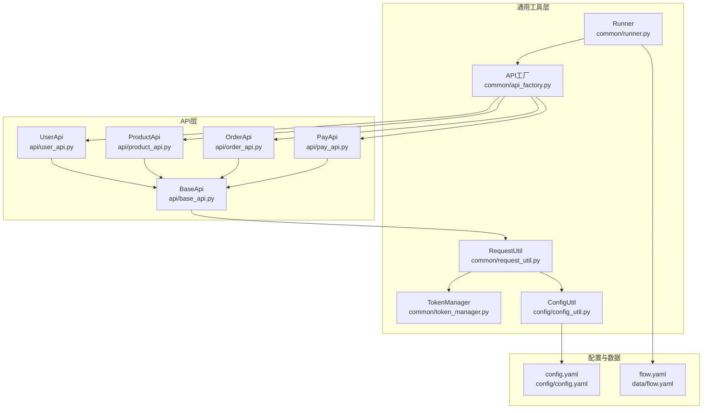
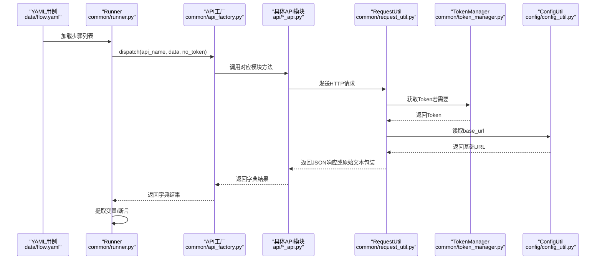
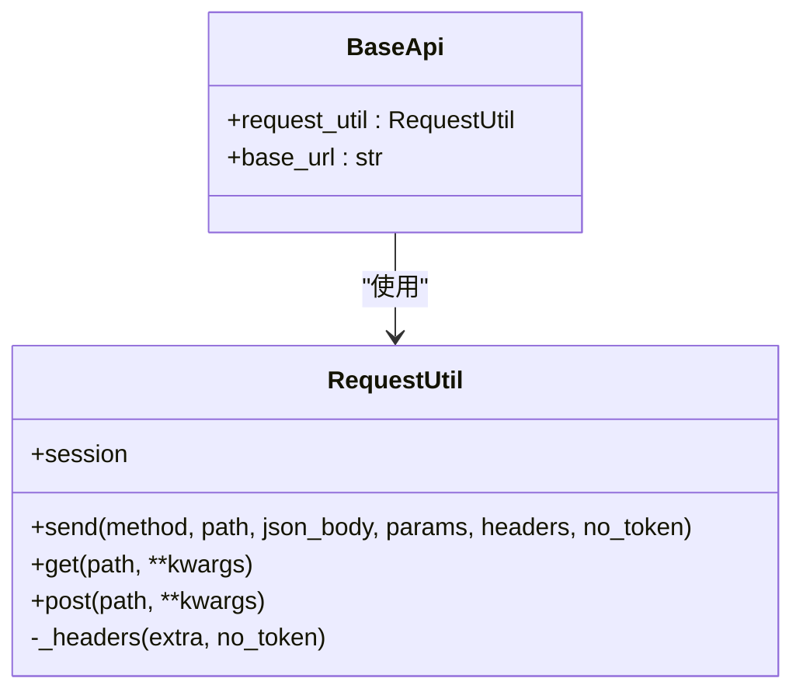
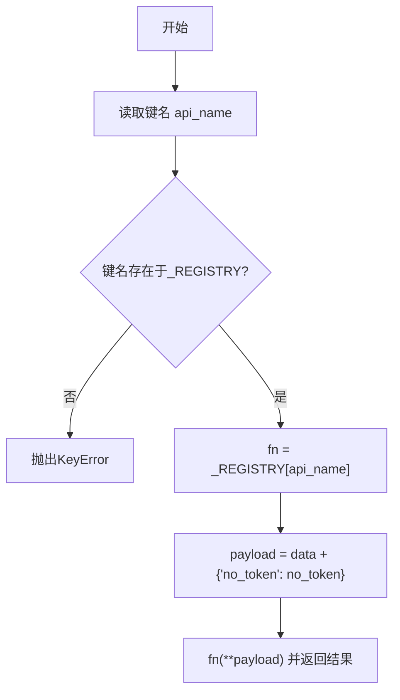
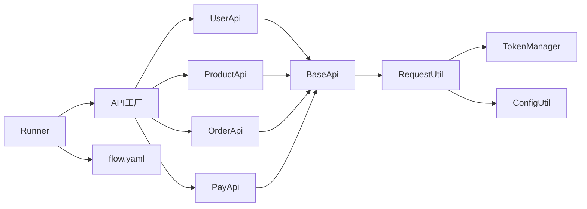

# 新增API模块

<cite>
**本文引用的文件**
- [api/base_api.py](file://api/base_api.py)
- [common/request_util.py](file://common/request_util.py)
- [common/api_factory.py](file://common/api_factory.py)
- [api/user_api.py](file://api/user_api.py)
- [api/product_api.py](file://api/product_api.py)
- [api/order_api.py](file://api/order_api.py)
- [api/pay_api.py](file://api/pay_api.py)
- [common/token_manager.py](file://common/token_manager.py)
- [config/config_util.py](file://config/config_util.py)
- [config/config.yaml](file://config/config.yaml)
- [common/runner.py](file://common/runner.py)
- [data/flow.yaml](file://data/flow.yaml)
- [testcase/test_flow.py](file://testcase/test_flow.py)
- [common/yaml_util.py](file://common/yaml_util.py)
</cite>

## 目录
1. [简介](#简介)
2. [项目结构](#项目结构)
3. [核心组件](#核心组件)
4. [架构总览](#架构总览)
5. [详细组件分析](#详细组件分析)
6. [依赖分析](#依赖分析)
7. [性能考虑](#性能考虑)
8. [故障排查指南](#故障排查指南)
9. [结论](#结论)
10. [附录](#附录)

## 简介
本指南面向需要在现有API自动化框架中新增一个API模块的开发者。内容涵盖：
- 如何继承BaseApi基类创建新的API模块
- 类结构设计、方法命名规范与参数处理
- API工厂注册流程（在APIFactory中注册新模块）
- 完整开发流程示例：从基类继承到最终注册
- HTTP请求发送、响应解析与错误处理
- 最佳实践：异常处理、日志记录（Allure）、测试覆盖
- 新模块与现有系统的集成方式与依赖关系

## 项目结构
该仓库采用按功能分层的组织方式：
- api：各业务API模块（继承BaseApi）
- common：通用工具与调度（API工厂、请求封装、运行器等）
- config：配置加载与环境变量覆盖
- data：测试流程数据（YAML）
- testcase：基于YAML的端到端用例执行
- 其他：提示文档、技能说明等

图表来源
- [api/base_api.py:1-11](file://api/base_api.py#L1-L11)
- [common/request_util.py:1-66](file://common/request_util.py#L1-L66)
- [common/api_factory.py:1-28](file://common/api_factory.py#L1-L28)
- [common/token_manager.py:1-38](file://common/token_manager.py#L1-L38)
- [config/config_util.py:1-50](file://config/config_util.py#L1-L50)
- [config/config.yaml:1-10](file://config/config.yaml#L1-L10)
- [common/runner.py:1-45](file://common/runner.py#L1-L45)
- [data/flow.yaml:1-41](file://data/flow.yaml#L1-L41)

章节来源
- [api/base_api.py:1-11](file://api/base_api.py#L1-L11)
- [common/request_util.py:1-66](file://common/request_util.py#L1-L66)
- [common/api_factory.py:1-28](file://common/api_factory.py#L1-L28)
- [common/runner.py:1-45](file://common/runner.py#L1-L45)
- [config/config_util.py:1-50](file://config/config_util.py#L1-L50)
- [config/config.yaml:1-10](file://config/config.yaml#L1-L10)
- [data/flow.yaml:1-41](file://data/flow.yaml#L1-L41)

## 核心组件
- BaseApi：所有API模块的基类，负责注入RequestUtil与读取基础URL
- RequestUtil：统一HTTP请求封装，支持自动拼接base_url、动态Header（含Token）、Allure请求/响应附件、状态码校验
- API工厂：集中注册可用API映射，通过字符串键名分发调用
- TokenManager：全局Token管理，支持注册登录回调以惰性获取Token
- Runner：测试流程编排，读取YAML步骤，调用API工厂，提取变量，断言结果

章节来源
- [api/base_api.py:1-11](file://api/base_api.py#L1-L11)
- [common/request_util.py:1-66](file://common/request_util.py#L1-L66)
- [common/api_factory.py:1-28](file://common/api_factory.py#L1-L28)
- [common/token_manager.py:1-38](file://common/token_manager.py#L1-L38)
- [common/runner.py:1-45](file://common/runner.py#L1-L45)

## 架构总览
下图展示了从YAML用例到API模块调用的完整链路。

图表来源
- [common/runner.py:15-45](file://common/runner.py#L15-L45)
- [common/api_factory.py:21-28](file://common/api_factory.py#L21-L28)
- [api/user_api.py:8-22](file://api/user_api.py#L8-L22)
- [api/product_api.py:8-15](file://api/product_api.py#L8-L15)
- [api/order_api.py:8-15](file://api/order_api.py#L8-L15)
- [api/pay_api.py:8-15](file://api/pay_api.py#L8-L15)
- [common/request_util.py:13-66](file://common/request_util.py#L13-L66)
- [common/token_manager.py:8-38](file://common/token_manager.py#L8-L38)
- [config/config_util.py:27-31](file://config/config_util.py#L27-L31)

## 详细组件分析

### 基类与请求封装
- BaseApi
  - 注入RequestUtil与base_url（去除末尾斜杠）
  - 子类通过self.request_util完成HTTP交互
- RequestUtil
  - 自动拼接base_url与path
  - 动态生成Header：Content-Type与Authorization（可选）
  - 支持GET/POST快捷方法与通用send方法
  - 统一Allure请求/响应附件
  - 对非JSON响应进行降级处理并抛出HTTP错误

图表来源
- [api/base_api.py:7-11](file://api/base_api.py#L7-L11)
- [common/request_util.py:13-66](file://common/request_util.py#L13-L66)

章节来源
- [api/base_api.py:1-11](file://api/base_api.py#L1-L11)
- [common/request_util.py:1-66](file://common/request_util.py#L1-L66)

### API模块示例与规范
- 已有模块遵循统一模式：
  - 继承BaseApi
  - 方法命名采用动词+名词（如register/login、add_product、create_order、pay_order）
  - 参数类型明确，支持关键字参数no_token控制是否携带Token
  - 使用self.request_util.post/get发送请求，返回字典结果
- 新模块开发建议：
  - 命名：动词+名词，清晰表达意图
  - 参数：尽量显式声明类型；必要时使用关键字参数no_token
  - 返回值：保持一致的字典结构，便于后续断言与抽取
  - 错误处理：交由RequestUtil统一抛出HTTP错误，避免在模块内重复处理

章节来源
- [api/user_api.py:8-22](file://api/user_api.py#L8-L22)
- [api/product_api.py:8-15](file://api/product_api.py#L8-L15)
- [api/order_api.py:8-15](file://api/order_api.py#L8-L15)
- [api/pay_api.py:8-15](file://api/pay_api.py#L8-L15)

### API工厂注册流程
- 注册位置：common/api_factory.py中的_REGISTRY字典
- 注册方式：为每个API键名添加lambda包装的模块方法调用
- 分发逻辑：dispatch根据键名查找函数，合并no_token参数后调用
- 注意事项：
  - 键名需唯一且与YAML中step.api一致
  - 模块方法签名需与传入data匹配
  - 若键名不存在，会抛出KeyError

图表来源
- [common/api_factory.py:12-28](file://common/api_factory.py#L12-L28)

章节来源
- [common/api_factory.py:1-28](file://common/api_factory.py#L1-28)

### 请求、响应与错误处理
- 请求发送
  - RequestUtil自动拼接base_url与path
  - Header默认JSON，可选加入Authorization
  - GET/POST方法分别封装常用场景
- 响应解析
  - 优先尝试JSON解析
  - 非JSON时返回包含原始文本的字典
- 错误处理
  - 使用raise_for_status统一抛出HTTP错误
  - 所有异常向上抛出，由上层捕获或直接失败

章节来源
- [common/request_util.py:13-66](file://common/request_util.py#L13-L66)

### Token与配置
- Token管理
  - TokenManager支持注册登录回调，惰性获取Token
  - Runner在提取到token后写入TokenManager
- 配置加载
  - ConfigUtil从config.yaml读取基础URL，支持环境变量覆盖
  - RequestUtil与BaseApi均依赖此配置

章节来源
- [common/token_manager.py:1-38](file://common/token_manager.py#L1-L38)
- [config/config_util.py:1-50](file://config/config_util.py#L1-L50)
- [config/config.yaml:1-10](file://config/config.yaml#L1-L10)

### 测试与流程编排
- YAML用例
  - data/flow.yaml定义多步流程，每步包含api、data、no_token、assert、extract
- Runner
  - 逐步执行，支持变量替换、提取、断言
  - 通过API工厂分发调用具体模块
- 测试入口
  - testcase/test_flow.py加载YAML并驱动Runner

章节来源
- [data/flow.yaml:1-41](file://data/flow.yaml#L1-L41)
- [common/runner.py:15-45](file://common/runner.py#L15-L45)
- [testcase/test_flow.py:1-17](file://testcase/test_flow.py#L1-L17)
- [common/yaml_util.py:11-15](file://common/yaml_util.py#L11-L15)

## 依赖分析
- 模块间耦合
  - API模块仅依赖BaseApi与RequestUtil
  - API工厂集中注册，Runner仅依赖API工厂
  - RequestUtil依赖TokenManager与ConfigUtil
- 外部依赖
  - requests.Session用于HTTP请求
  - allure用于测试附件
  - yaml用于配置与用例加载

图表来源
- [api/base_api.py:7-11](file://api/base_api.py#L7-L11)
- [common/request_util.py:13-66](file://common/request_util.py#L13-L66)
- [common/api_factory.py:5-18](file://common/api_factory.py#L5-L18)
- [common/token_manager.py:8-38](file://common/token_manager.py#L8-L38)
- [config/config_util.py:27-31](file://config/config_util.py#L27-L31)
- [common/runner.py:15-45](file://common/runner.py#L15-L45)
- [data/flow.yaml:1-41](file://data/flow.yaml#L1-L41)

章节来源
- [common/api_factory.py:1-28](file://common/api_factory.py#L1-L28)
- [common/runner.py:1-45](file://common/runner.py#L1-L45)

## 性能考虑
- 连接复用：RequestUtil使用requests.Session，减少TCP握手开销
- 超时设置：统一超时30秒，避免长时间阻塞
- 日志与追踪：Allure附件记录请求/响应，便于问题定位
- Token缓存：TokenManager线程安全缓存Token，减少重复登录

## 故障排查指南
- 常见错误与定位
  - unknown api step：检查API工厂键名是否与YAML一致
  - HTTP错误：查看Allure响应附件，确认状态码与响应体
  - Token缺失：确认TokenManager已set_token或注册了登录回调
- 排查步骤
  - 在Runner中打印/记录当前步骤与响应
  - 检查ConfigUtil读取的base_url是否正确
  - 确认模块方法签名与传入data字段一致

章节来源
- [common/api_factory.py:21-28](file://common/api_factory.py#L21-L28)
- [common/request_util.py:40-58](file://common/request_util.py#L40-L58)
- [common/token_manager.py:27-38](file://common/token_manager.py#L27-L38)

## 结论
新增API模块的关键在于：
- 正确继承BaseApi并遵循方法命名与参数规范
- 在API工厂中注册模块方法
- 利用RequestUtil统一处理HTTP细节
- 通过YAML与Runner实现端到端流程验证
- 借助Allure与断言工具保障质量与可观测性

## 附录

### 新增API模块完整开发流程（步骤化）
- 创建模块类
  - 在api目录新增模块文件，继承BaseApi
  - 实现方法，使用self.request_util.post/get发送请求
  - 参考路径：[api/user_api.py:8-22](file://api/user_api.py#L8-L22)、[api/product_api.py:8-15](file://api/product_api.py#L8-L15)
- 注册到API工厂
  - 在common/api_factory.py的_REGISTRY中添加键值对
  - 键名为“模块.动作”，值为lambda包装的模块方法调用
  - 参考路径：[common/api_factory.py:12-18](file://common/api_factory.py#L12-L18)
- 编写YAML用例
  - 在data/flow.yaml中添加步骤，指定api键名与data字段
  - 可选配置no_token、assert、extract
  - 参考路径：[data/flow.yaml:1-41](file://data/flow.yaml#L1-L41)
- 运行与验证
  - 使用testcase/test_flow.py作为入口，或直接调用Runner
  - 查看Allure附件与断言结果
  - 参考路径：[testcase/test_flow.py:14-17](file://testcase/test_flow.py#L14-L17)、[common/runner.py:15-45](file://common/runner.py#L15-L45)

### 关键接口与职责速览
- BaseApi：提供request_util与base_url
- RequestUtil：HTTP请求封装、Header生成、Allure附件、错误抛出
- API工厂：键名到模块方法的映射与分发
- Runner：流程编排、变量替换、提取与断言
- TokenManager：Token注册、缓存与获取
- ConfigUtil：基础URL与数据库路径读取

章节来源
- [api/base_api.py:7-11](file://api/base_api.py#L7-L11)
- [common/request_util.py:13-66](file://common/request_util.py#L13-L66)
- [common/api_factory.py:12-28](file://common/api_factory.py#L12-L28)
- [common/runner.py:15-45](file://common/runner.py#L15-L45)
- [common/token_manager.py:8-38](file://common/token_manager.py#L8-L38)
- [config/config_util.py:27-31](file://config/config_util.py#L27-L31)