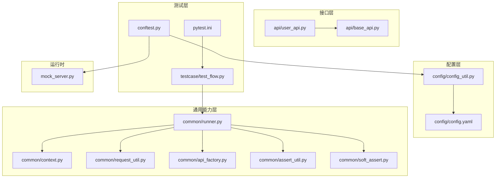
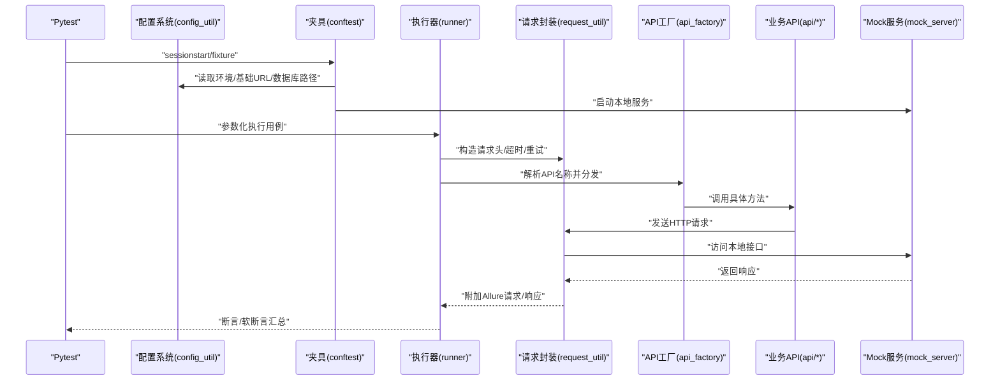
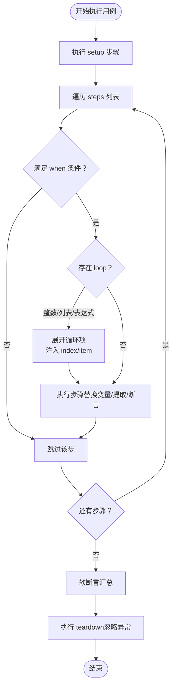
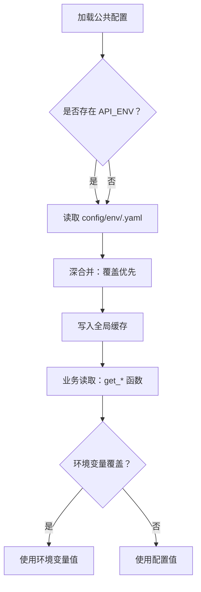
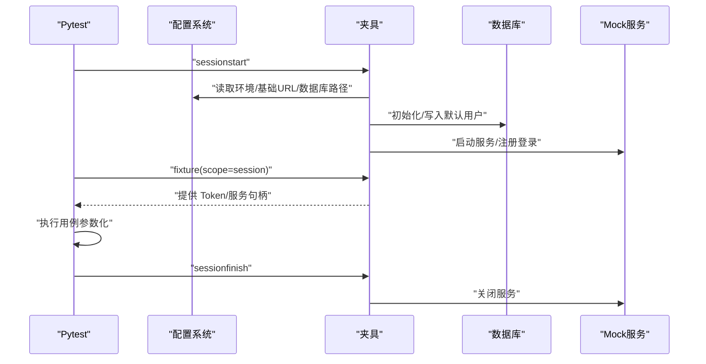
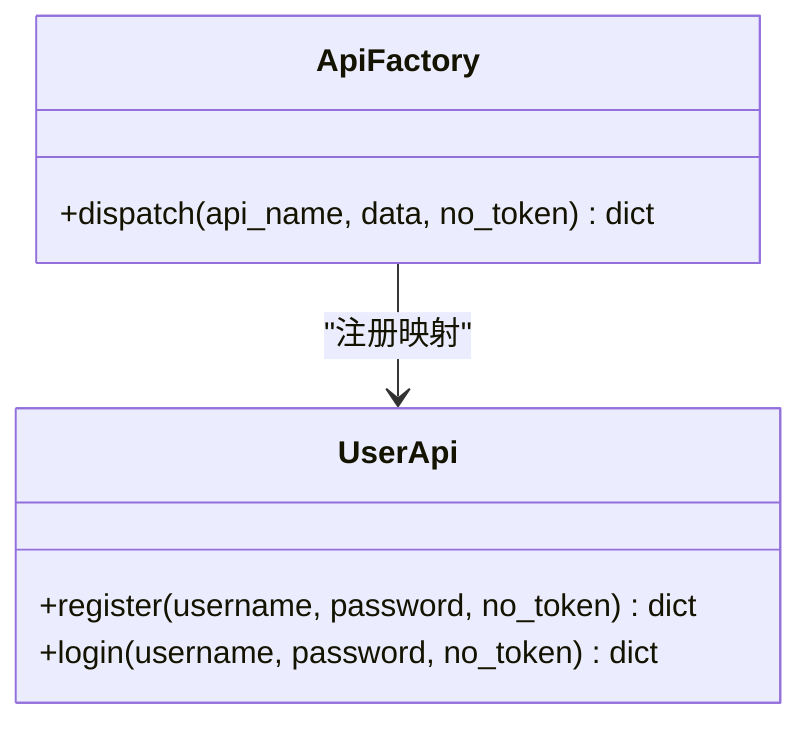
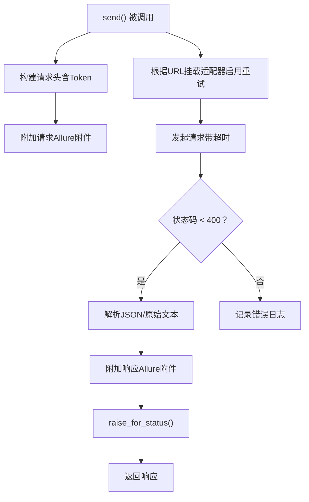
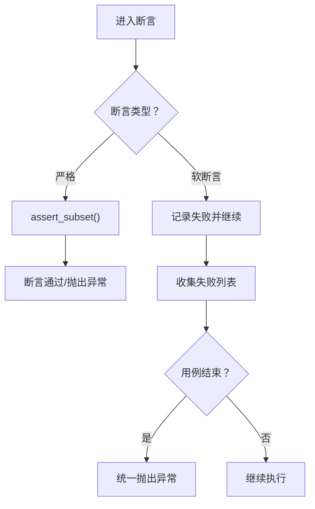
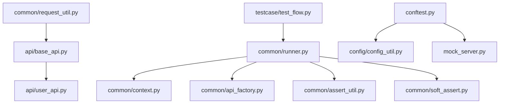

# 框架定制与二次开发

<cite>
**本文引用的文件**
- [conftest.py](file://conftest.py)
- [pytest.ini](file://pytest.ini)
- [config/config.yaml](file://config/config.yaml)
- [config/config_util.py](file://config/config_util.py)
- [common/runner.py](file://common/runner.py)
- [common/assert_util.py](file://common/assert_util.py)
- [common/api_factory.py](file://common/api_factory.py)
- [common/context.py](file://common/context.py)
- [common/request_util.py](file://common/request_util.py)
- [common/soft_assert.py](file://common/soft_assert.py)
- [api/base_api.py](file://api/base_api.py)
- [api/user_api.py](file://api/user_api.py)
- [mock_server.py](file://mock_server.py)
- [testcase/test_flow.py](file://testcase/test_flow.py)
- [requirements.txt](file://requirements.txt)
</cite>

## 目录
1. [简介](#简介)
2. [项目结构](#项目结构)
3. [核心组件](#核心组件)
4. [架构总览](#架构总览)
5. [详细组件分析](#详细组件分析)
6. [依赖分析](#依赖分析)
7. [性能考量](#性能考量)
8. [故障排查指南](#故障排查指南)
9. [结论](#结论)
10. [附录](#附录)

## 简介
本指南面向需要对 APIAuto 框架进行深度定制与二次开发的工程师，围绕以下目标展开：
- 修改测试执行器以支持更灵活的流程控制与并发策略
- 扩展配置系统以支持多环境与动态覆盖
- 优化 Pytest 集成以提升报告与调试体验
- 明确框架扩展点与插件机制，便于接入第三方工具
- 提供定制断言、数据驱动与并发性能优化的实践路径
- 给出版本兼容性与迁移策略建议，以及贡献与长期维护最佳实践

## 项目结构
该仓库采用按功能域分层的组织方式：
- config：集中式配置加载与环境覆盖
- common：运行时核心能力（执行器、上下文、请求封装、断言等）
- api：业务 API 封装（基于统一基类）
- testcase：用例入口与参数化
- mock_server：本地模拟服务，用于端到端验证
- pytest 配置与根依赖声明

图表来源
- [config/config.yaml:1-10](file://config/config.yaml#L1-L10)
- [config/config_util.py:31-52](file://config/config_util.py#L31-L52)
- [common/runner.py:65-117](file://common/runner.py#L65-L117)
- [common/context.py:6-25](file://common/context.py#L6-L25)
- [common/request_util.py:29-117](file://common/request_util.py#L29-L117)
- [common/api_factory.py:21-28](file://common/api_factory.py#L21-L28)
- [common/assert_util.py:6-15](file://common/assert_util.py#L6-L15)
- [common/soft_assert.py:8-27](file://common/soft_assert.py#L8-L27)
- [api/base_api.py:7-11](file://api/base_api.py#L7-L11)
- [api/user_api.py:8-22](file://api/user_api.py#L8-L22)
- [conftest.py:16-54](file://conftest.py#L16-L54)
- [testcase/test_flow.py:10-24](file://testcase/test_flow.py#L10-L24)
- [pytest.ini:1-5](file://pytest.ini#L1-L5)
- [mock_server.py:13-322](file://mock_server.py#L13-L322)

章节来源
- [pytest.ini:1-5](file://pytest.ini#L1-L5)
- [conftest.py:16-54](file://conftest.py#L16-L54)
- [config/config.yaml:1-10](file://config/config.yaml#L1-L10)
- [config/config_util.py:31-52](file://config/config_util.py#L31-L52)

## 核心组件
- 测试执行器：负责解析 YAML 用例、按步骤执行、条件/循环处理、提取变量、断言与软断言汇总
- 上下文管理：在执行过程中保存与传递变量，支持循环索引与项注入
- 请求封装：统一发送 HTTP 请求、自动重试、超时控制、日志与 Allure 附件
- API 工厂：将字符串 API 名称映射到具体方法，便于用例驱动
- 断言体系：内置子集断言与软断言聚合，支持严格与宽松模式
- 配置系统：支持公共配置与环境覆盖、缓存与热重载
- Pytest 集成：通过夹具初始化环境、启动本地 Mock 服务、参数化执行

章节来源
- [common/runner.py:65-117](file://common/runner.py#L65-L117)
- [common/context.py:6-25](file://common/context.py#L6-L25)
- [common/request_util.py:29-117](file://common/request_util.py#L29-L117)
- [common/api_factory.py:21-28](file://common/api_factory.py#L21-L28)
- [common/assert_util.py:6-15](file://common/assert_util.py#L6-L15)
- [common/soft_assert.py:8-27](file://common/soft_assert.py#L8-L27)
- [config/config_util.py:64-112](file://config/config_util.py#L64-L112)

## 架构总览
从“配置 → 执行器 → 请求 → API → 报告”的主链路出发，结合 Pytest 生命周期与 Mock 服务，形成完整的端到端执行闭环。

图表来源
- [conftest.py:16-54](file://conftest.py#L16-L54)
- [config/config_util.py:64-112](file://config/config_util.py#L64-L112)
- [common/runner.py:65-117](file://common/runner.py#L65-L117)
- [common/request_util.py:71-117](file://common/request_util.py#L71-L117)
- [common/api_factory.py:21-28](file://common/api_factory.py#L21-L28)
- [api/user_api.py:8-22](file://api/user_api.py#L8-L22)
- [mock_server.py:13-322](file://mock_server.py#L13-L322)

## 详细组件分析

### 测试执行器定制与扩展
- 执行流程
  - 支持 setup/teardown 阶段
  - 条件执行：when 表达式支持变量替换后求值
  - 循环展开：支持整数、列表或变量表达式作为循环源
  - 变量提取：将响应中的字段映射到上下文，支持自动更新 Token 管理器
  - Schema 校验：可选的响应结构校验
  - 断言：严格断言或软断言模式，最终统一抛出
- 定制点
  - 步骤前/后钩子：可在 _run_step 周围插入自定义逻辑（如统计、埋点）
  - 条件表达式求值：扩展 _eval_when 的语法或安全沙箱
  - 循环上下文：在循环展开时注入 index/item，并允许外部回写 ctx
  - 软断言：可替换为自定义聚合策略或输出格式
- 并发策略
  - 在 run_case 外层引入线程池/进程池，注意共享资源（上下文、Token 管理器）的线程安全
  - 对 Allure 与日志输出进行隔离，避免竞态

图表来源
- [common/runner.py:65-117](file://common/runner.py#L65-L117)

章节来源
- [common/runner.py:18-117](file://common/runner.py#L18-L117)

### 配置系统扩展与多环境支持
- 配置加载顺序
  - 读取公共配置文件
  - 依据环境变量加载对应 env/*.yaml 并与公共配置深合并
  - 支持环境变量覆盖（如 API_BASE_URL、API_REQUEST_TIMEOUT、API_REQUEST_RETRIES、LOG_LEVEL）
  - 缓存与热重载：全局缓存，必要时调用 reload_config 清空缓存以生效新配置
- 扩展建议
  - 新增环境：在 config/env 下新增 *.yaml 文件，键名与公共配置一致即可被覆盖
  - 新增配置项：在公共配置中添加默认值，业务模块通过 config_util.* 方法读取
  - 动态刷新：在运行时检测配置变更并触发 reload_config，随后重新初始化相关组件

图表来源
- [config/config_util.py:31-52](file://config/config_util.py#L31-L52)
- [config/config.yaml:1-10](file://config/config.yaml#L1-L10)

章节来源
- [config/config_util.py:60-112](file://config/config_util.py#L60-L112)
- [config/config.yaml:1-10](file://config/config.yaml#L1-L10)

### Pytest 集成优化
- 夹具职责
  - 初始化数据库、写入默认用户
  - 启动本地 Mock 服务并注册登录、获取 Token
  - 会话结束时关闭服务
- 参数化与报告
  - 通过 pytest.ini 指定 Allure 输出目录与测试路径
  - 用例装饰器标注严重级别与标签，便于筛选与报告
- 优化建议
  - 自定义 Pytest 钩子：在 pytest_runtest_makereport 中注入自定义字段或调整报告内容
  - 插件化：将重复逻辑抽取为插件，减少 conftest 复杂度

图表来源
- [conftest.py:16-54](file://conftest.py#L16-L54)
- [pytest.ini:1-5](file://pytest.ini#L1-L5)

章节来源
- [conftest.py:16-54](file://conftest.py#L16-L54)
- [pytest.ini:1-5](file://pytest.ini#L1-L5)

### API 工厂与扩展点
- 分发机制
  - 字符串 API 名称映射到具体方法，payload 透传并追加 no_token 标记
  - 可通过注册新条目扩展新的业务接口
- 扩展建议
  - 新增 API：在 api/* 中实现具体类与方法，并在工厂注册
  - 包装器：为所有 API 调用增加统一的拦截器（如埋点、限流、鉴权）

图表来源
- [common/api_factory.py:12-28](file://common/api_factory.py#L12-L28)
- [api/user_api.py:8-22](file://api/user_api.py#L8-L22)

章节来源
- [common/api_factory.py:21-28](file://common/api_factory.py#L21-L28)
- [api/user_api.py:8-22](file://api/user_api.py#L8-L22)

### 请求封装与重试/超时
- 关键特性
  - 统一 Session、Base URL、Header 注入（Content-Type、Authorization）
  - 基于 urllib3 Retry 的指数退避重试策略
  - Allure 请求/响应附件
  - 异常包装：将底层错误封装为 ApiRequestError
- 定制点
  - 重试策略：调整次数、状态码列表、允许方法
  - 超时：通过配置项动态设置
  - 日志：增强请求/响应日志级别与字段

图表来源
- [common/request_util.py:35-117](file://common/request_util.py#L35-L117)

章节来源
- [common/request_util.py:29-117](file://common/request_util.py#L29-L117)

### 断言与软断言
- 内置断言
  - 子集断言：递归比较期望与实际，支持嵌套结构
- 软断言
  - 记录失败但不中断，最后统一抛出
- 定制建议
  - 扩展断言类型：如数值范围、正则匹配、JSON Schema
  - 自定义聚合：按用例/步骤维度汇总失败信息

图表来源
- [common/assert_util.py:6-15](file://common/assert_util.py#L6-L15)
- [common/soft_assert.py:8-27](file://common/soft_assert.py#L8-L27)

章节来源
- [common/assert_util.py:6-15](file://common/assert_util.py#L6-L15)
- [common/soft_assert.py:8-27](file://common/soft_assert.py#L8-L27)

### 数据驱动与测试发现
- 当前实现
  - 通过 YAML 加载用例，参数化传入执行器
- 定制建议
  - 自定义测试发现：扩展 pytest 插件，扫描指定目录并生成参数化项
  - 多数据源：支持 CSV/Excel/DB 作为数据源，动态生成参数化
  - 条件与循环：在 YAML 中扩展更多表达式语法，或在加载阶段预处理

章节来源
- [testcase/test_flow.py:10-24](file://testcase/test_flow.py#L10-L24)

### Mock 服务与本地验证
- 能力概览
  - 提供用户注册/登录、商品与订单管理接口
  - 基于 SQLite 存储，支持鉴权与库存校验
- 定制建议
  - 扩展接口：新增业务域接口，保持鉴权与事务一致性
  - 性能：在高并发场景下优化数据库连接与锁粒度

章节来源
- [mock_server.py:13-322](file://mock_server.py#L13-L322)

## 依赖分析
- 运行时依赖
  - pytest、requests、PyYAML、allure-pytest、Flask、python-dotenv、jsonpath-ng、jsonschema、faker
- 模块耦合
  - common/runner.py 依赖 common/context、common/api_factory、common/assert_util、common/soft_assert、common/request_util
  - api/* 依赖 common/request_util 与 config/config_util
  - conftest.py 依赖 config/config_util 与 mock_server

图表来源
- [common/request_util.py:29-117](file://common/request_util.py#L29-L117)
- [api/base_api.py:7-11](file://api/base_api.py#L7-L11)
- [api/user_api.py:8-22](file://api/user_api.py#L8-L22)
- [common/runner.py:65-117](file://common/runner.py#L65-L117)
- [common/context.py:6-25](file://common/context.py#L6-L25)
- [common/api_factory.py:21-28](file://common/api_factory.py#L21-L28)
- [common/assert_util.py:6-15](file://common/assert_util.py#L6-L15)
- [common/soft_assert.py:8-27](file://common/soft_assert.py#L8-L27)
- [conftest.py:16-54](file://conftest.py#L16-L54)
- [config/config_util.py:64-112](file://config/config_util.py#L64-L112)
- [testcase/test_flow.py:10-24](file://testcase/test_flow.py#L10-L24)

章节来源
- [requirements.txt:1-10](file://requirements.txt#L1-L10)
- [common/runner.py:65-117](file://common/runner.py#L65-L117)
- [conftest.py:16-54](file://conftest.py#L16-L54)

## 性能考量
- 并发执行
  - 使用线程池/进程池执行独立用例，避免共享状态冲突
  - 对 Allure 报告与日志输出进行隔离，防止竞争
- 请求优化
  - 合理设置重试次数与超时，避免放大网络抖动
  - 复用 Session，减少连接开销
- 数据库
  - 使用连接池与事务批量提交，降低锁竞争
- Mock 服务
  - 在高负载场景下拆分服务或引入缓存层

## 故障排查指南
- 常见问题定位
  - 配置未生效：检查环境变量覆盖与 config/env/*.yaml 是否正确
  - 请求失败：查看 ApiRequestError 与 Allure 附件中的请求/响应
  - 断言失败：核对期望值与提取变量是否正确
  - 软断言未汇总：确认 run_case 结尾是否调用软断言汇总逻辑
- 调试技巧
  - 在 conftest.py 中打印环境变量与基础 URL
  - 在 request_util 中开启更详细的日志级别
  - 在 runner 中临时加入步骤级日志

章节来源
- [common/request_util.py:18-27](file://common/request_util.py#L18-L27)
- [common/runner.py:105-117](file://common/runner.py#L105-L117)
- [conftest.py:16-19](file://conftest.py#L16-L19)

## 结论
通过对执行器、配置系统、请求封装与断言体系的深入剖析，可以清晰地识别出框架的关键扩展点。建议在保持现有契约不变的前提下，通过工厂注册、钩子与插件机制实现定制化需求；同时关注并发与性能优化，确保在复杂场景下的稳定性与可维护性。

## 附录

### 版本兼容性与迁移策略
- pytest 与 allure
  - 升级 pytest 时关注钩子签名变化，确保 conftest 兼容
  - allure-pytest 版本升级可能影响附件与报告格式，需回归验证
- requests 与 urllib3
  - 重试策略配置项可能随版本调整，需对照文档更新
- Python 版本
  - 若迁移到更高版本，注意类型注解与标准库行为差异

章节来源
- [requirements.txt:1-10](file://requirements.txt#L1-L10)

### 贡献与长期维护建议
- 规范
  - 统一模块命名与导入路径，避免循环依赖
  - 为每个公共函数/类补充类型注解与简要文档
- 可测试性
  - 将可变依赖（如时间、随机数）抽象为可注入的依赖
  - 为关键流程提供单元测试与集成测试
- 可扩展性
  - 通过工厂与注册表扩展新能力，避免硬编码分支
  - 将第三方集成封装为插件，降低耦合度