# 自定义工具类开发

<cite>
**本文引用的文件**
- [common/request_util.py](file://common/request_util.py)
- [common/assert_util.py](file://common/assert_util.py)
- [common/context.py](file://common/context.py)
- [common/extract_util.py](file://common/extract_util.py)
- [common/api_factory.py](file://common/api_factory.py)
- [common/token_manager.py](file://common/token_manager.py)
- [common/db_util.py](file://common/db_util.py)
- [common/db_assert.py](file://common/db_assert.py)
- [common/runner.py](file://common/runner.py)
- [config/config_util.py](file://config/config_util.py)
- [api/base_api.py](file://api/base_api.py)
- [api/user_api.py](file://api/user_api.py)
- [testcase/test_flow.py](file://testcase/test_flow.py)
- [conftest.py](file://conftest.py)
- [requirements.txt](file://requirements.txt)
</cite>

## 目录
1. [简介](#简介)
2. [项目结构](#项目结构)
3. [核心组件](#核心组件)
4. [架构总览](#架构总览)
5. [详细组件分析](#详细组件分析)
6. [依赖分析](#依赖分析)
7. [性能考虑](#性能考虑)
8. [故障排查指南](#故障排查指南)
9. [结论](#结论)
10. [附录：设计原则与编码规范](#附录设计原则与编码规范)

## 简介
本指南面向希望在现有API自动化框架上扩展“自定义工具类”的开发者。内容涵盖：
- 在现有工具类（请求封装、断言工具、上下文管理、数据提取、数据库工具、令牌管理、API分发器）基础上扩展功能的方法
- 设计原则与编码规范（单例/类方法模式、工厂模式）
- 新工具类的创建、集成与单元测试
- 工具类间的依赖关系与调用方式
- 性能优化与错误处理策略
- 测试用例与文档注释编写建议

## 项目结构
该项目采用按职责分层的组织方式：
- config：配置加载与环境变量解析
- common：通用工具与运行编排
- api：业务API封装（继承BaseApi）
- testcase：基于YAML的场景驱动测试
- conftest.py：pytest会话级初始化与Mock服务启动
- requirements.txt：依赖声明

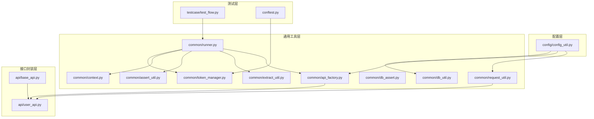

图表来源
- [config/config_util.py:64-102](file://config/config_util.py#L64-L102)
- [common/request_util.py:13-66](file://common/request_util.py#L13-L66)
- [common/context.py:6-25](file://common/context.py#L6-L25)
- [common/extract_util.py:22-28](file://common/extract_util.py#L22-L28)
- [common/assert_util.py:6-15](file://common/assert_util.py#L6-L15)
- [common/db_util.py:9-35](file://common/db_util.py#L9-L35)
- [common/db_assert.py:6-17](file://common/db_assert.py#L6-L17)
- [common/token_manager.py:8-38](file://common/token_manager.py#L8-L38)
- [common/api_factory.py:21-28](file://common/api_factory.py#L21-L28)
- [common/runner.py:15-45](file://common/runner.py#L15-L45)
- [api/base_api.py:7-11](file://api/base_api.py#L7-L11)
- [api/user_api.py:8-22](file://api/user_api.py#L8-L22)
- [testcase/test_flow.py:14-17](file://testcase/test_flow.py#L14-L17)
- [conftest.py:33-48](file://conftest.py#L33-L48)

章节来源
- [config/config_util.py:1-112](file://config/config_util.py#L1-L112)
- [common/request_util.py:1-66](file://common/request_util.py#L1-L66)
- [common/context.py:1-25](file://common/context.py#L1-L25)
- [common/extract_util.py:1-28](file://common/extract_util.py#L1-L28)
- [common/assert_util.py:1-15](file://common/assert_util.py#L1-L15)
- [common/db_util.py:1-35](file://common/db_util.py#L1-L35)
- [common/db_assert.py:1-17](file://common/db_assert.py#L1-L17)
- [common/token_manager.py:1-38](file://common/token_manager.py#L1-L38)
- [common/api_factory.py:1-28](file://common/api_factory.py#L1-L28)
- [common/runner.py:1-45](file://common/runner.py#L1-L45)
- [api/base_api.py:1-11](file://api/base_api.py#L1-L11)
- [api/user_api.py:1-22](file://api/user_api.py#L1-L22)
- [testcase/test_flow.py:1-17](file://testcase/test_flow.py#L1-L17)
- [conftest.py:1-50](file://conftest.py#L1-L50)

## 核心组件
- 请求封装：统一HTTP请求、自动注入Header、超时与Allure附件
- 断言工具：递归断言子集，支持嵌套结构
- 上下文管理：键值存储与共享
- 数据提取：根据路径表达式从响应中抽取字段写入上下文
- API分发器：以字符串映射到具体API函数，集中调度
- 令牌管理：线程安全的Token注册与缓存
- 数据库工具：SQLite查询/执行封装
- 运行器：按步骤执行用例，串联替换、提取、断言与令牌设置

章节来源
- [common/request_util.py:13-66](file://common/request_util.py#L13-L66)
- [common/assert_util.py:6-15](file://common/assert_util.py#L6-L15)
- [common/context.py:6-25](file://common/context.py#L6-L25)
- [common/extract_util.py:8-28](file://common/extract_util.py#L8-L28)
- [common/api_factory.py:12-28](file://common/api_factory.py#L12-L28)
- [common/token_manager.py:8-38](file://common/token_manager.py#L8-L38)
- [common/db_util.py:9-35](file://common/db_util.py#L9-L35)
- [common/runner.py:15-45](file://common/runner.py#L15-L45)

## 架构总览
整体流程：测试用例通过Runner逐步执行，每步先做变量替换，再调用API分发器定位具体API，随后可选提取上下文、设置令牌、最后断言。

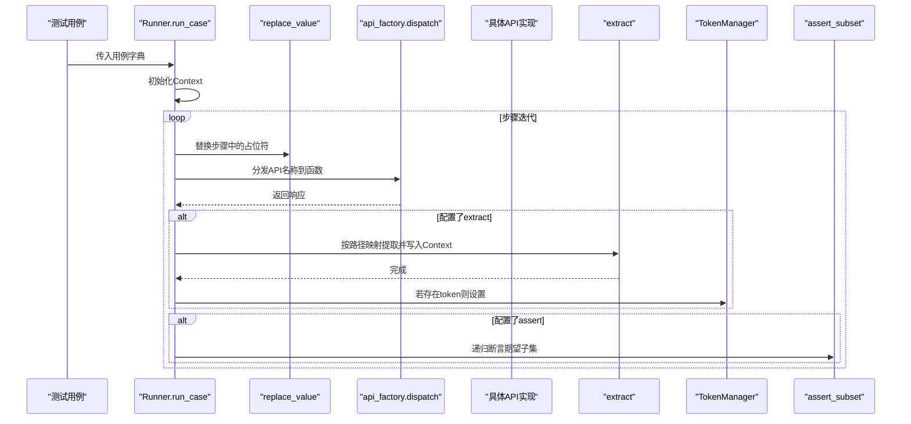

图表来源
- [common/runner.py:15-45](file://common/runner.py#L15-L45)
- [common/api_factory.py:21-28](file://common/api_factory.py#L21-L28)
- [common/extract_util.py:22-28](file://common/extract_util.py#L22-L28)
- [common/assert_util.py:6-15](file://common/assert_util.py#L6-L15)
- [common/token_manager.py:17-37](file://common/token_manager.py#L17-L37)

## 详细组件分析

### 请求封装工具 RequestUtil
- 职责：统一HTTP请求入口，自动拼接URL、注入Content-Type与Authorization头、记录Allure请求/响应附件、异常处理与返回体解析
- 关键点：
  - Session复用，减少连接开销
  - 支持no_token开关，避免对不需要鉴权的接口重复登录
  - 统一超时控制
  - 响应非JSON时回退为原始文本包装
- 扩展建议：
  - 添加重试策略（结合配置中心）
  - 增加日志级别与采样上报
  - 支持多租户/多账号切换的头注入

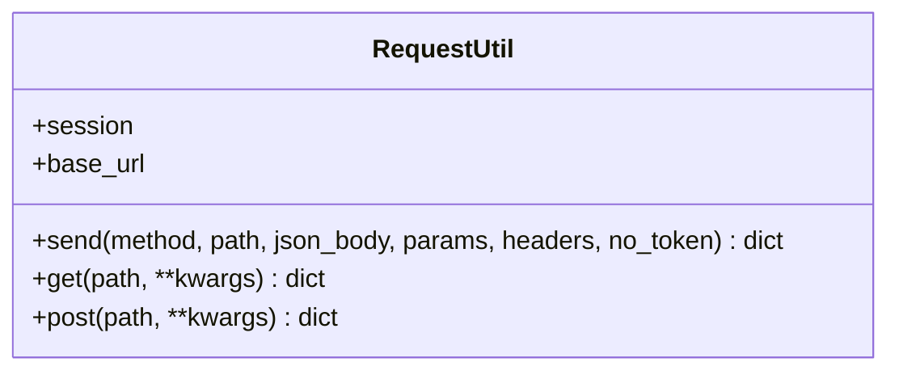

图表来源
- [common/request_util.py:13-66](file://common/request_util.py#L13-L66)

章节来源
- [common/request_util.py:13-66](file://common/request_util.py#L13-L66)
- [config/config_util.py:64-76](file://config/config_util.py#L64-L76)

### 断言工具 assert_subset
- 职责：对实际响应与期望结构进行递归断言，支持嵌套字典
- 关键点：
  - 路径提示便于定位失败字段
  - 类型不匹配直接断言失败
- 扩展建议：
  - 支持类型转换与宽松比较（如数值范围、正则匹配）
  - 提供断言报告汇总

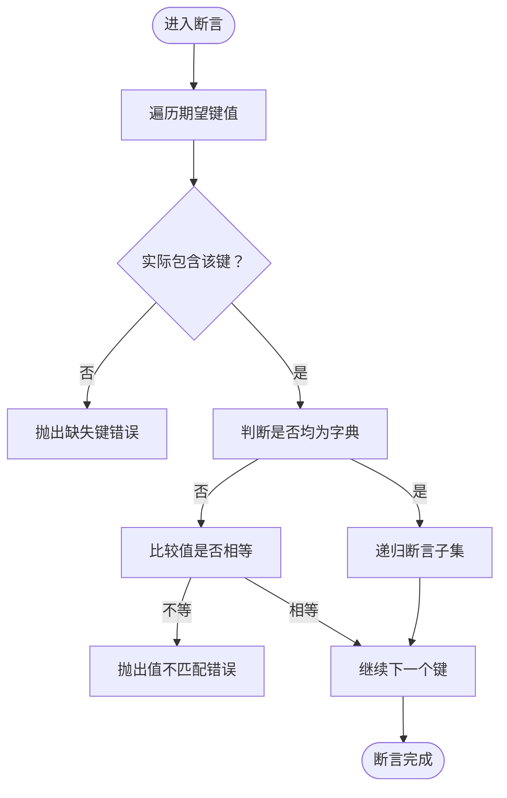

图表来源
- [common/assert_util.py:6-15](file://common/assert_util.py#L6-L15)

章节来源
- [common/assert_util.py:6-15](file://common/assert_util.py#L6-L15)

### 上下文管理 Context
- 职责：提供键值存储，作为跨步骤的数据容器
- 关键点：
  - 线程安全由外部保证；若需要并发安全，可引入锁
  - 提供批量更新与清空能力
- 扩展建议：
  - 增加作用域隔离（如按用例或场景划分）
  - 支持序列化/持久化以便调试

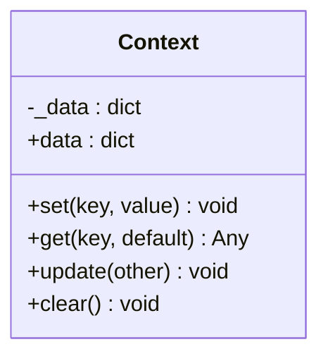

图表来源
- [common/context.py:6-25](file://common/context.py#L6-L25)

章节来源
- [common/context.py:6-25](file://common/context.py#L6-L25)

### 数据提取工具 extract
- 职责：根据“上下文键 -> 响应路径”映射，从响应树中提取字段写入上下文
- 关键点：
  - 路径以点号分隔，支持嵌套访问
  - 对None与非字典类型进行安全处理
- 扩展建议：
  - 支持数组索引与通配路径
  - 提供默认值回退机制

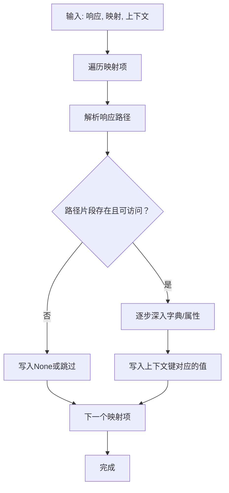

图表来源
- [common/extract_util.py:8-28](file://common/extract_util.py#L8-L28)

章节来源
- [common/extract_util.py:8-28](file://common/extract_util.py#L8-L28)

### API分发器 api_factory
- 职责：将字符串标识映射到具体API函数，统一参数传递（含no_token）
- 关键点：
  - 注册表集中维护，便于扩展新接口
  - 未知标识直接报错，利于早期发现配置问题
- 扩展建议：
  - 支持动态注册与插件化加载
  - 增加路由校验与Schema约束

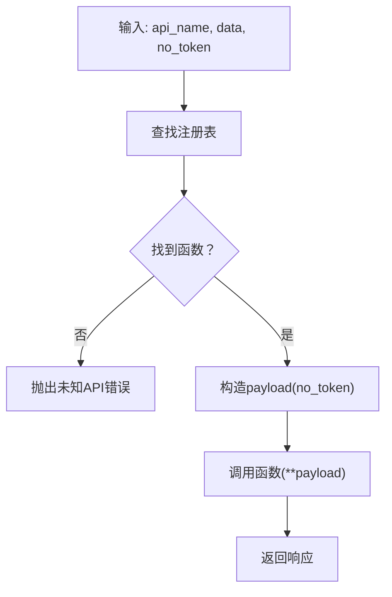

图表来源
- [common/api_factory.py:21-28](file://common/api_factory.py#L21-L28)

章节来源
- [common/api_factory.py:12-28](file://common/api_factory.py#L12-L28)

### 令牌管理 TokenManager
- 职责：集中管理访问令牌，支持注册登录回调、线程安全缓存与清理
- 关键点：
  - 类方法模式，无需实例化
  - 缓存未命中时调用注册的登录函数
- 扩展建议：
  - 支持刷新策略与过期检测
  - 记录最近一次登录时间与来源

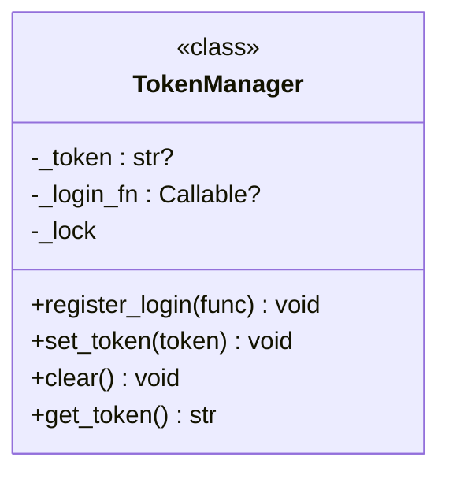

图表来源
- [common/token_manager.py:8-38](file://common/token_manager.py#L8-L38)

章节来源
- [common/token_manager.py:8-38](file://common/token_manager.py#L8-L38)

### 数据库工具 db_util 与断言 db_assert
- 职责：db_util提供SQLite查询/执行封装；db_assert基于查询结果进行断言
- 关键点：
  - 查询后自动关闭连接，避免资源泄漏
  - 断言工具直接依赖db_util
- 扩展建议：
  - 支持连接池与事务
  - 增加SQL模板与参数化查询工具

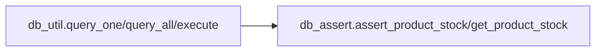

图表来源
- [common/db_util.py:9-35](file://common/db_util.py#L9-L35)
- [common/db_assert.py:6-17](file://common/db_assert.py#L6-L17)

章节来源
- [common/db_util.py:9-35](file://common/db_util.py#L9-L35)
- [common/db_assert.py:6-17](file://common/db_assert.py#L6-L17)

### 运行器 Runner
- 职责：按步骤执行用例，串联替换、提取、断言与令牌设置
- 关键点：
  - 每步可独立配置是否免鉴权
  - 支持Allure步骤标注
- 扩展建议：
  - 支持条件分支与循环
  - 增加失败重试与回滚

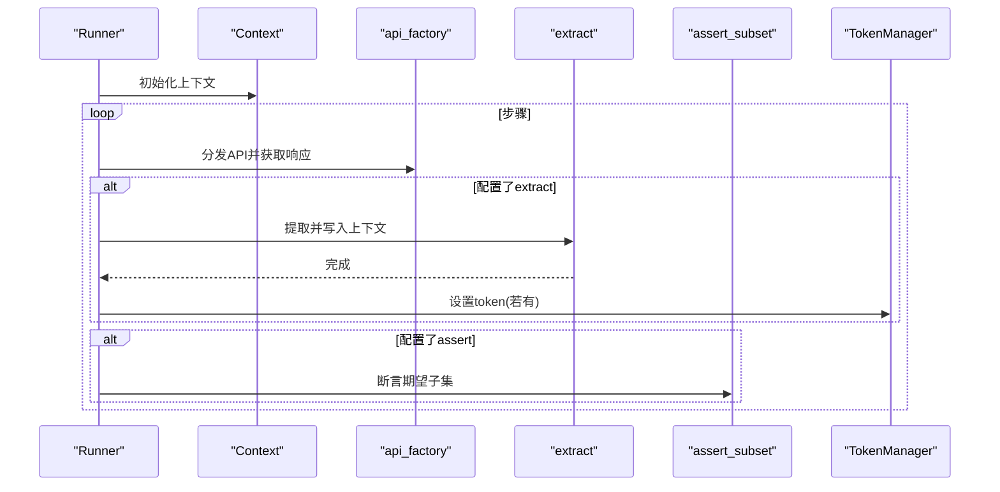

图表来源
- [common/runner.py:15-45](file://common/runner.py#L15-L45)

章节来源
- [common/runner.py:15-45](file://common/runner.py#L15-L45)

## 依赖分析
- Runner依赖：api_factory、assert_util、context、extract_util、replace_util、token_manager
- API层依赖：request_util、config_util
- RequestUtil依赖：token_manager、config_util
- Extract依赖：context
- DB断言依赖：db_util
- Conftest依赖：token_manager、config_util、mock_server

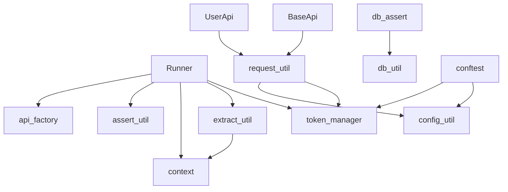

图表来源
- [common/runner.py:7-12](file://common/runner.py#L7-L12)
- [api/user_api.py:8-22](file://api/user_api.py#L8-L22)
- [api/base_api.py:7-11](file://api/base_api.py#L7-L11)
- [common/request_util.py:9-10](file://common/request_util.py#L9-L10)
- [common/extract_util.py](file://common/extract_util.py#L5)
- [common/db_assert.py](file://common/db_assert.py#L3)
- [conftest.py:12-13](file://conftest.py#L12-L13)

章节来源
- [common/runner.py:7-12](file://common/runner.py#L7-L12)
- [api/user_api.py:8-22](file://api/user_api.py#L8-L22)
- [api/base_api.py:7-11](file://api/base_api.py#L7-L11)
- [common/request_util.py:9-10](file://common/request_util.py#L9-L10)
- [common/extract_util.py](file://common/extract_util.py#L5)
- [common/db_assert.py](file://common/db_assert.py#L3)
- [conftest.py:12-13](file://conftest.py#L12-L13)

## 性能考虑
- 复用Session：RequestUtil使用requests.Session减少TCP握手开销
- 超时与重试：通过配置中心统一管理超时与重试次数，避免阻塞
- 轻量断言：assert_subset仅在断言阶段触发，避免不必要的计算
- 上下文写入：extract只在显式配置时执行，减少无谓的字典操作
- 数据库访问：db_util查询后立即关闭连接，避免连接池膨胀
- 并发安全：TokenManager使用线程锁保护令牌缓存，避免竞态

## 故障排查指南
- 未知API标识：检查api_factory注册表是否包含对应键
- 缺失键断言：查看assert_subset输出的路径，确认响应结构或映射是否正确
- 提取失败：核对extract路径表达式与响应结构，注意None与非字典类型
- 令牌未设置：确认Runner中是否存在extract token且后续调用了TokenManager.set_token
- 数据库断言失败：检查产品ID是否存在以及期望最小库存是否合理
- 配置未生效：确认环境变量与config.yaml覆盖顺序，必要时调用reload_config

章节来源
- [common/api_factory.py:22-23](file://common/api_factory.py#L22-L23)
- [common/assert_util.py:9-14](file://common/assert_util.py#L9-L14)
- [common/extract_util.py:8-19](file://common/extract_util.py#L8-L19)
- [common/db_assert.py:7-10](file://common/db_assert.py#L7-L10)
- [config/config_util.py:55-57](file://config/config_util.py#L55-L57)

## 结论
通过遵循现有工具类的设计原则（集中配置、职责单一、可扩展注册），开发者可以快速在本框架上添加新的工具类，并将其无缝集成到Runner与API分发体系中。建议在新增工具类时同步完善测试与文档注释，确保可维护性与可扩展性。

## 附录：设计原则与编码规范
- 单例/类方法模式
  - 使用类方法（如TokenManager）集中管理状态，避免全局变量
  - 适合无状态或少量状态的工具类
- 工厂模式
  - api_factory以字符串映射到函数，便于扩展与替换
  - 建议对外暴露统一的注册接口，隐藏实现细节
- 编码规范
  - 类名使用帕斯卡命名，方法/变量使用驼峰命名
  - 函数签名明确参数类型与默认值，保持向后兼容
  - 错误信息包含上下文（如路径、键名），便于定位
  - 所有外部依赖通过配置中心或构造注入，避免硬编码
- 测试与文档
  - 为每个工具类编写单元测试，覆盖正常/异常路径
  - 使用pytest参数化与fixture提升测试效率
  - 为公共函数补充清晰的文档字符串，说明输入输出与边界条件
- 性能与健壮性
  - 尽量复用连接与对象，减少GC压力
  - 对外部依赖增加超时与重试，避免阻塞
  - 对不可恢复错误抛出明确异常，便于上层捕获与降级