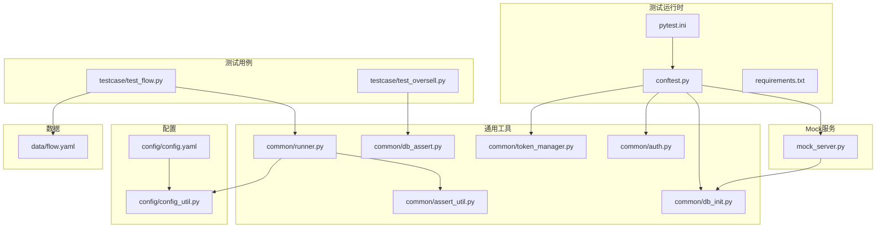
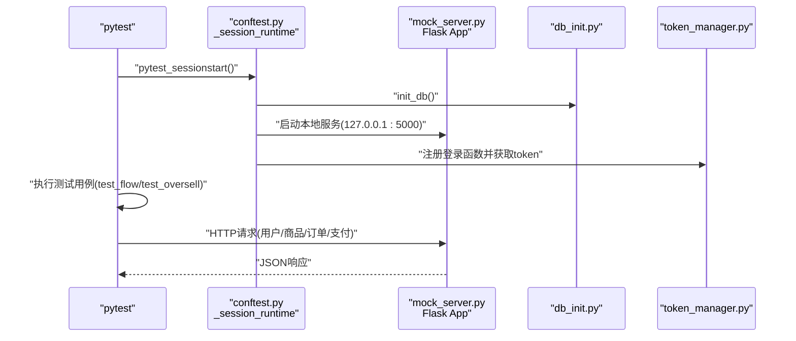
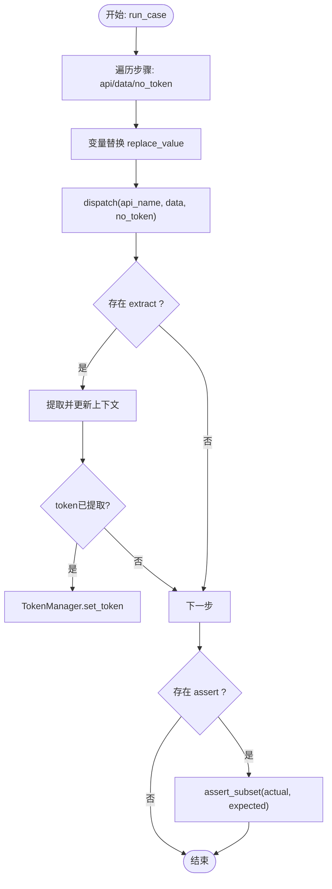
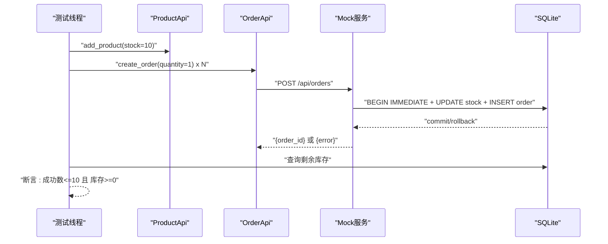
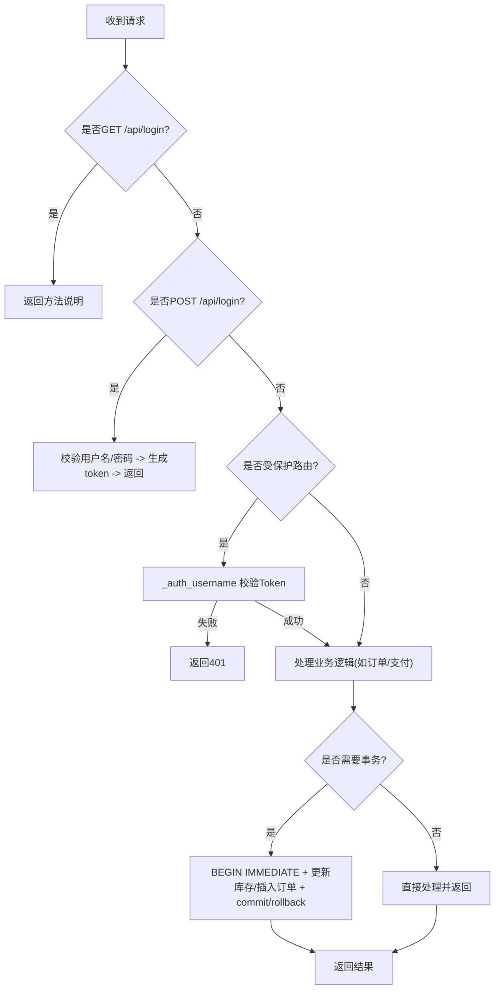
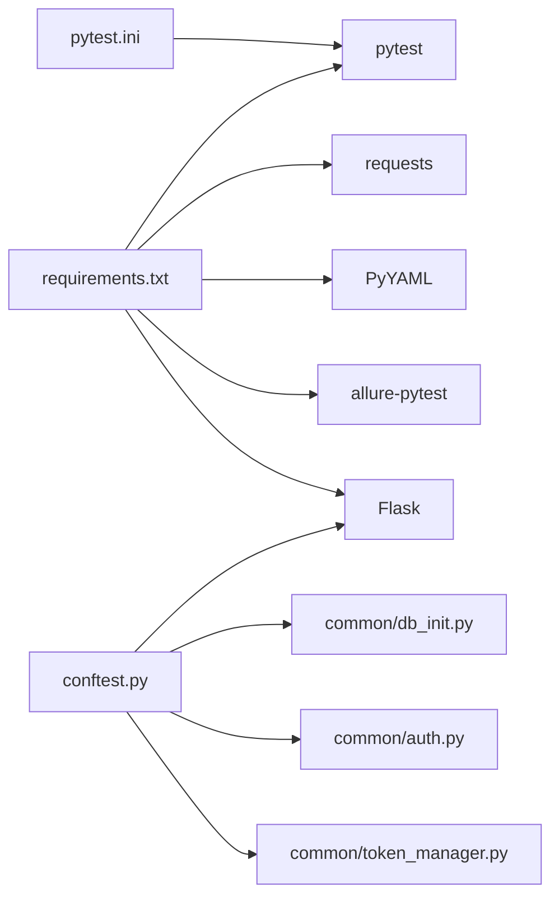

# 故障排除

<cite>
**本文引用的文件**
- [config/config.yaml](file://config/config.yaml)
- [config/config_util.py](file://config/config_util.py)
- [pytest.ini](file://pytest.ini)
- [requirements.txt](file://requirements.txt)
- [conftest.py](file://conftest.py)
- [mock_server.py](file://mock_server.py)
- [common/db_init.py](file://common/db_init.py)
- [common/token_manager.py](file://common/token_manager.py)
- [common/auth.py](file://common/auth.py)
- [common/runner.py](file://common/runner.py)
- [common/assert_util.py](file://common/assert_util.py)
- [common/db_assert.py](file://common/db_assert.py)
- [testcase/test_flow.py](file://testcase/test_flow.py)
- [testcase/test_oversell.py](file://testcase/test_oversell.py)
- [data/flow.yaml](file://data/flow.yaml)
</cite>

## 目录
1. [简介](#简介)
2. [项目结构](#项目结构)
3. [核心组件](#核心组件)
4. [架构总览](#架构总览)
5. [详细组件分析](#详细组件分析)
6. [依赖分析](#依赖分析)
7. [性能考虑](#性能考虑)
8. [故障排除指南](#故障排除指南)
9. [结论](#结论)
10. [附录](#附录)

## 简介
本指南面向开发者与测试工程师，聚焦于该API自动化测试项目的常见问题与系统化排障方法。内容覆盖环境配置、依赖冲突、测试执行失败、网络与数据库连接异常、并发测试冲突、错误码与日志解读、断点与性能分析技巧，并提供可复用的定位策略与实用工具。

## 项目结构
该项目采用“配置-通用工具-接口层-API封装-用例-数据”的分层组织方式，配合pytest与Allure生成测试报告，内置SQLite数据库与本地Mock服务，支持并发场景下的库存一致性验证。

图表来源
- [pytest.ini:1-5](file://pytest.ini#L1-L5)
- [conftest.py:16-50](file://conftest.py#L16-L50)
- [mock_server.py:13-322](file://mock_server.py#L13-L322)
- [common/db_init.py:8-78](file://common/db_init.py#L8-L78)
- [common/token_manager.py:8-38](file://common/token_manager.py#L8-L38)
- [common/auth.py:7-12](file://common/auth.py#L7-L12)
- [common/runner.py:15-45](file://common/runner.py#L15-L45)
- [common/assert_util.py:6-15](file://common/assert_util.py#L6-L15)
- [common/db_assert.py:6-17](file://common/db_assert.py#L6-L17)
- [testcase/test_flow.py:9-17](file://testcase/test_flow.py#L9-L17)
- [testcase/test_oversell.py:13-40](file://testcase/test_oversell.py#L13-L40)
- [data/flow.yaml:1-41](file://data/flow.yaml#L1-L41)

章节来源
- [pytest.ini:1-5](file://pytest.ini#L1-L5)
- [conftest.py:16-50](file://conftest.py#L16-L50)
- [config/config.yaml:1-10](file://config/config.yaml#L1-L10)

## 核心组件
- 配置与路径解析：通过配置文件与工具模块统一管理基础URL、数据库路径与默认用户信息。
- 测试运行器：按步骤执行API流程，支持变量替换、提取、断言与令牌注入。
- 断言工具：递归断言字典子集，便于灵活校验响应结构。
- 数据库初始化与断言：创建表结构、插入演示数据、查询库存状态。
- 并发测试：基于线程池模拟高并发下单，验证库存扣减一致性。
- Mock服务：提供用户注册/登录、商品增删改查、订单创建与支付接口，内置鉴权与事务控制。

章节来源
- [config/config.yaml:1-10](file://config/config.yaml#L1-L10)
- [config/config_util.py](file://config/config_util.py)
- [common/runner.py:15-45](file://common/runner.py#L15-L45)
- [common/assert_util.py:6-15](file://common/assert_util.py#L6-L15)
- [common/db_init.py:8-78](file://common/db_init.py#L8-L78)
- [common/db_assert.py:6-17](file://common/db_assert.py#L6-L17)
- [testcase/test_oversell.py:13-40](file://testcase/test_oversell.py#L13-L40)
- [mock_server.py:132-315](file://mock_server.py#L132-L315)

## 架构总览
下图展示从pytest到Mock服务的关键调用链路，以及数据库初始化与令牌管理在会话阶段的装配过程。

图表来源
- [conftest.py:16-50](file://conftest.py#L16-L50)
- [mock_server.py:318-322](file://mock_server.py#L318-L322)
- [common/db_init.py:8-38](file://common/db_init.py#L8-L38)
- [common/token_manager.py:27-37](file://common/token_manager.py#L27-L37)

## 详细组件分析

### 组件A：测试运行器与流程编排
- 功能要点
  - 读取用例步骤，逐条替换上下文变量，派发到API封装层。
  - 支持提取字段写入上下文并自动设置令牌。
  - 断言期望值，支持嵌套字典对比。
- 关键路径
  - [run_case:15-45](file://common/runner.py#L15-L45)
  - [assert_subset:6-15](file://common/assert_util.py#L6-L15)

图表来源
- [common/runner.py:15-45](file://common/runner.py#L15-L45)
- [common/assert_util.py:6-15](file://common/assert_util.py#L6-L15)

章节来源
- [common/runner.py:15-45](file://common/runner.py#L15-L45)
- [common/assert_util.py:6-15](file://common/assert_util.py#L6-L15)

### 组件B：并发测试与库存一致性
- 场景目标：多线程同时发起下单请求，确保最终库存不超卖。
- 关键点
  - 使用线程池提交任务，捕获HTTP错误避免中断。
  - 基于数据库查询断言最终库存与成功下单数。
- 关键路径
  - [test_concurrent_orders_respect_stock:13-40](file://testcase/test_oversell.py#L13-L40)
  - [get_product_stock:13-17](file://common/db_assert.py#L13-L17)

图表来源
- [testcase/test_oversell.py:13-40](file://testcase/test_oversell.py#L13-L40)
- [mock_server.py:232-289](file://mock_server.py#L232-L289)
- [common/db_assert.py:13-17](file://common/db_assert.py#L13-L17)

章节来源
- [testcase/test_oversell.py:13-40](file://testcase/test_oversell.py#L13-L40)
- [common/db_assert.py:6-17](file://common/db_assert.py#L6-L17)
- [mock_server.py:232-289](file://mock_server.py#L232-L289)

### 组件C：Mock服务与鉴权
- 路由要点
  - GET /: 返回数据库快照与可用接口列表。
  - /api/register: 注册用户（幂等）。
  - /api/login: 登录获取token。
  - /api/products: 查询/新增商品。
  - /api/orders: 查询/创建订单（事务+库存检查）。
  - /api/pay: 支付订单。
- 鉴权机制
  - Bearer Token校验，未授权返回401。
- 关键路径
  - [index:43-129](file://mock_server.py#L43-L129)
  - [_auth_username:21-29](file://mock_server.py#L21-L29)
  - [orders:232-289](file://mock_server.py#L232-L289)

图表来源
- [mock_server.py:132-315](file://mock_server.py#L132-L315)

章节来源
- [mock_server.py:43-129](file://mock_server.py#L43-L129)
- [mock_server.py:21-29](file://mock_server.py#L21-L29)
- [mock_server.py:232-289](file://mock_server.py#L232-L289)

## 依赖分析
- 运行时依赖
  - pytest、requests、PyYAML、allure-pytest、Flask。
- 配置与路径
  - 通过配置文件与工具模块集中管理基础URL、数据库路径与默认用户。
- 启动流程
  - pytest会话开始时初始化数据库、启动Mock服务、注册登录函数并缓存token。

图表来源
- [requirements.txt:1-6](file://requirements.txt#L1-L6)
- [pytest.ini:1-5](file://pytest.ini#L1-L5)
- [conftest.py:16-50](file://conftest.py#L16-L50)
- [common/db_init.py:8-38](file://common/db_init.py#L8-L38)
- [common/auth.py:7-12](file://common/auth.py#L7-L12)
- [common/token_manager.py:8-38](file://common/token_manager.py#L8-L38)

章节来源
- [requirements.txt:1-6](file://requirements.txt#L1-L6)
- [pytest.ini:1-5](file://pytest.ini#L1-L5)
- [conftest.py:16-50](file://conftest.py#L16-L50)

## 性能考虑
- 并发测试
  - 使用线程池并发触发下单，结合数据库事务与行级锁保证一致性。
  - 建议在本地环境适度调整并发度，避免CPU/IO过载。
- 日志与报告
  - 使用Allure生成测试报告，便于回溯步骤与响应体。
- Mock服务
  - 本地端口固定，避免跨进程竞争；线程模式启用以提升吞吐。

## 故障排除指南

### 一、环境配置问题
- 症状
  - 无法连接到本地服务或数据库路径错误。
- 定位步骤
  - 检查基础URL与端口是否匹配：[config/config.yaml:1-10](file://config/config.yaml#L1-L10)、[pytest.ini:1-5](file://pytest.ini#L1-L5)。
  - 确认会话启动时数据库初始化与Mock服务已启动：[conftest.py:16-50](file://conftest.py#L16-L50)。
- 解决方案
  - 若端口被占用，修改端口后重启服务。
  - 清理旧数据库文件并重新初始化：[common/db_init.py:8-38](file://common/db_init.py#L8-L38)。

章节来源
- [config/config.yaml:1-10](file://config/config.yaml#L1-L10)
- [pytest.ini:1-5](file://pytest.ini#L1-L5)
- [conftest.py:16-50](file://conftest.py#L16-L50)
- [common/db_init.py:8-38](file://common/db_init.py#L8-L38)

### 二、依赖冲突与安装失败
- 症状
  - pytest/allure/requests版本不兼容导致导入失败或功能异常。
- 定位步骤
  - 对照依赖清单：[requirements.txt:1-6](file://requirements.txt#L1-L6)。
- 解决方案
  - 使用虚拟环境隔离依赖，锁定兼容版本后重装。
  - 如需升级，请先升级pytest再升级allure-pytest，保持版本对齐。

章节来源
- [requirements.txt:1-6](file://requirements.txt#L1-L6)

### 三、测试执行失败
- 症状
  - 用例参数缺失、断言失败、变量未替换。
- 定位步骤
  - 查看用例数据与步骤：[data/flow.yaml:1-41](file://data/flow.yaml#L1-L41)。
  - 检查运行器流程与断言逻辑：[common/runner.py:15-45](file://common/runner.py#L15-L45)、[common/assert_util.py:6-15](file://common/assert_util.py#L6-L15)。
- 解决方案
  - 补充缺失的api或data字段；确认extract命名与assert键一致。
  - 使用变量占位符时确保上下文已正确填充。

章节来源
- [data/flow.yaml:1-41](file://data/flow.yaml#L1-L41)
- [common/runner.py:15-45](file://common/runner.py#L15-L45)
- [common/assert_util.py:6-15](file://common/assert_util.py#L6-L15)

### 四、网络连接问题
- 症状
  - 请求超时、连接拒绝、端口不可达。
- 定位步骤
  - 确认本地服务监听地址与端口：[conftest.py:37-40](file://conftest.py#L37-L40)、[mock_server.py:318-322](file://mock_server.py#L318-L322)。
  - 使用curl或浏览器访问根路径验证服务可用性：[mock_server.py:43-129](file://mock_server.py#L43-L129)。
- 解决方案
  - 更换端口或关闭占用进程；确保防火墙允许本地回环访问。

章节来源
- [conftest.py:37-40](file://conftest.py#L37-L40)
- [mock_server.py:43-129](file://mock_server.py#L43-L129)
- [mock_server.py:318-322](file://mock_server.py#L318-L322)

### 五、数据库连接异常与一致性问题
- 症状
  - 插入失败、库存不一致、事务回滚。
- 定位步骤
  - 检查表结构与种子数据：[common/db_init.py:8-78](file://common/db_init.py#L8-L78)。
  - 观察订单接口的事务与库存更新逻辑：[mock_server.py:232-289](file://mock_server.py#L232-L289)。
  - 并发测试中的库存断言：[common/db_assert.py:6-17](file://common/db_assert.py#L6-L17)、[testcase/test_oversell.py:13-40](file://testcase/test_oversell.py#L13-L40)。
- 解决方案
  - 在高并发场景下保持事务原子性，避免竞态条件。
  - 使用幂等插入与唯一约束，防止重复数据。

章节来源
- [common/db_init.py:8-78](file://common/db_init.py#L8-L78)
- [mock_server.py:232-289](file://mock_server.py#L232-L289)
- [common/db_assert.py:6-17](file://common/db_assert.py#L6-L17)
- [testcase/test_oversell.py:13-40](file://testcase/test_oversell.py#L13-L40)

### 六、并发测试冲突
- 症状
  - 多线程下单导致超卖或断言失败。
- 定位步骤
  - 分析并发用例与线程池配置：[testcase/test_oversell.py:13-40](file://testcase/test_oversell.py#L13-L40)。
  - 核对Mock服务的库存扣减与事务回滚逻辑：[mock_server.py:232-289](file://mock_server.py#L232-L289)。
- 解决方案
  - 将库存扣减与订单插入置于同一事务内，失败即回滚。
  - 控制并发度，观察断言阈值，逐步扩大压力。

章节来源
- [testcase/test_oversell.py:13-40](file://testcase/test_oversell.py#L13-L40)
- [mock_server.py:232-289](file://mock_server.py#L232-L289)

### 七、错误码与日志解读
- 常见HTTP状态
  - 401 未授权：缺少或无效的Bearer Token。参考：[mock_server.py:21-29](file://mock_server.py#L21-L29)。
  - 400 参数错误：注册/登录请求体缺失字段。参考：[mock_server.py:146-147](file://mock_server.py#L146-L147)。
  - 404 订单不存在：支付接口找不到订单。参考：[mock_server.py:309-312](file://mock_server.py#L309-L312)。
  - 409 库存不足：下单时库存不足触发回滚。参考：[mock_server.py:275-277](file://mock_server.py#L275-L277)。
- 日志与报告
  - 使用Allure报告查看每步请求与响应体，定位失败步骤。参考：[pytest.ini:1-5](file://pytest.ini#L1-L5)、[common/runner.py:17-31](file://common/runner.py#L17-L31)。

章节来源
- [mock_server.py:21-29](file://mock_server.py#L21-L29)
- [mock_server.py:146-147](file://mock_server.py#L146-L147)
- [mock_server.py:309-312](file://mock_server.py#L309-L312)
- [mock_server.py:275-277](file://mock_server.py#L275-L277)
- [pytest.ini:1-5](file://pytest.ini#L1-L5)
- [common/runner.py:17-31](file://common/runner.py#L17-L31)

### 八、系统化调试方法
- 日志分析
  - 启用详细输出与Allure报告，逐步骤比对响应体与断言差异。参考：[pytest.ini:1-5](file://pytest.ini#L1-L5)、[common/runner.py:17-44](file://common/runner.py#L17-L44)。
- 断点调试
  - 在API封装层与Mock服务路由处设置断点，观察请求头、请求体与数据库状态。参考：[common/runner.py:30-31](file://common/runner.py#L30-L31)、[mock_server.py:159-185](file://mock_server.py#L159-L185)。
- 性能分析
  - 使用线程池逐步增加并发度，记录成功率与延迟，定位瓶颈。参考：[testcase/test_oversell.py:31-35](file://testcase/test_oversell.py#L31-L35)。

章节来源
- [pytest.ini:1-5](file://pytest.ini#L1-L5)
- [common/runner.py:17-44](file://common/runner.py#L17-L44)
- [mock_server.py:159-185](file://mock_server.py#L159-L185)
- [testcase/test_oversell.py:31-35](file://testcase/test_oversell.py#L31-L35)

### 九、令牌与鉴权问题
- 症状
  - 401未授权或接口报错。
- 定位步骤
  - 确认会话阶段已注册登录函数并缓存token：[conftest.py:42-44](file://conftest.py#L42-L44)、[common/token_manager.py:27-37](file://common/token_manager.py#L27-L37)。
  - 检查默认用户配置与登录流程：[config/config.yaml:7-10](file://config/config.yaml#L7-L10)、[common/auth.py:7-12](file://common/auth.py#L7-L12)。
- 解决方案
  - 确保在需要token的步骤前完成登录并注入token；必要时手动刷新token。

章节来源
- [conftest.py:42-44](file://conftest.py#L42-L44)
- [common/token_manager.py:27-37](file://common/token_manager.py#L27-L37)
- [config/config.yaml:7-10](file://config/config.yaml#L7-L10)
- [common/auth.py:7-12](file://common/auth.py#L7-L12)

### 十、用例与数据问题
- 症状
  - 变量未替换、提取失败、断言不通过。
- 定位步骤
  - 检查flow.yaml中的变量占位与extract映射：[data/flow.yaml:1-41](file://data/flow.yaml#L1-L41)。
  - 核对运行器的变量替换与提取逻辑：[common/runner.py:27-40](file://common/runner.py#L27-L40)。
- 解决方案
  - 确保变量名一致、作用域正确；断言键与实际响应一致。

章节来源
- [data/flow.yaml:1-41](file://data/flow.yaml#L1-L41)
- [common/runner.py:27-40](file://common/runner.py#L27-L40)

## 结论
通过统一的配置与工具层、严谨的事务与断言机制、以及系统化的并发测试设计，本项目具备良好的可维护性与可排障性。建议在日常开发中坚持以下实践：规范用例编写、严格断言、使用Allure报告、在并发场景下关注事务与锁策略，并在问题出现时按“配置—依赖—网络—数据库—并发—日志”顺序逐层排查。

## 附录
- 快速检查清单
  - 环境：Python虚拟环境、端口可用、数据库文件可写。
  - 依赖：requirements安装完成、版本兼容。
  - 服务：Mock服务已启动、端口监听正常。
  - 用例：flow.yaml语法正确、变量与断言完整。
  - 并发：线程池并发度合理、事务回滚逻辑有效。
- 实用命令
  - 运行测试并生成报告：pytest --alluredir=report
  - 查看报告：allure serve report