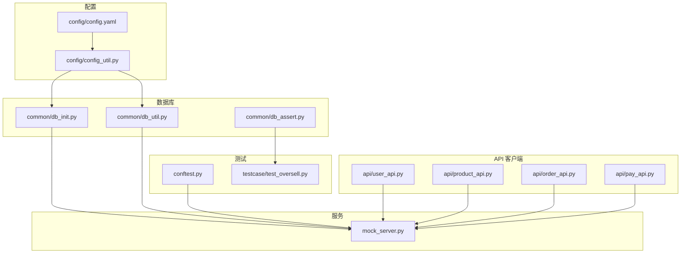
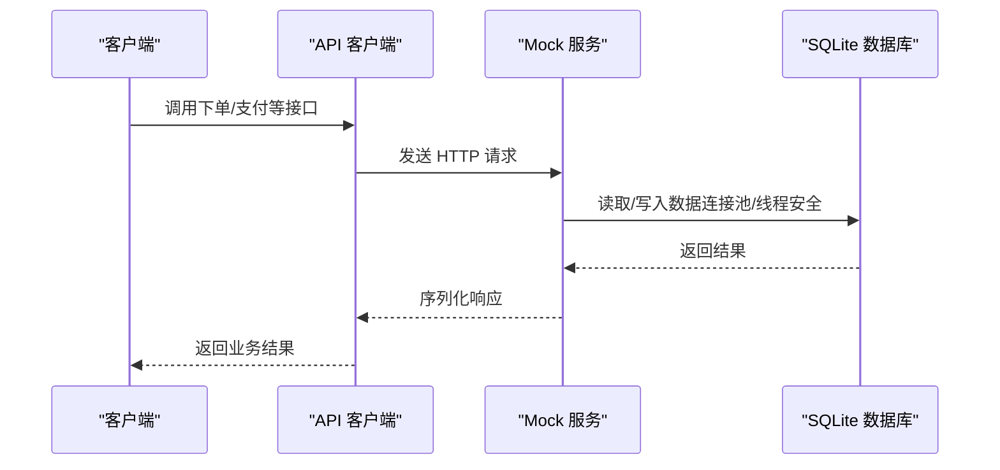
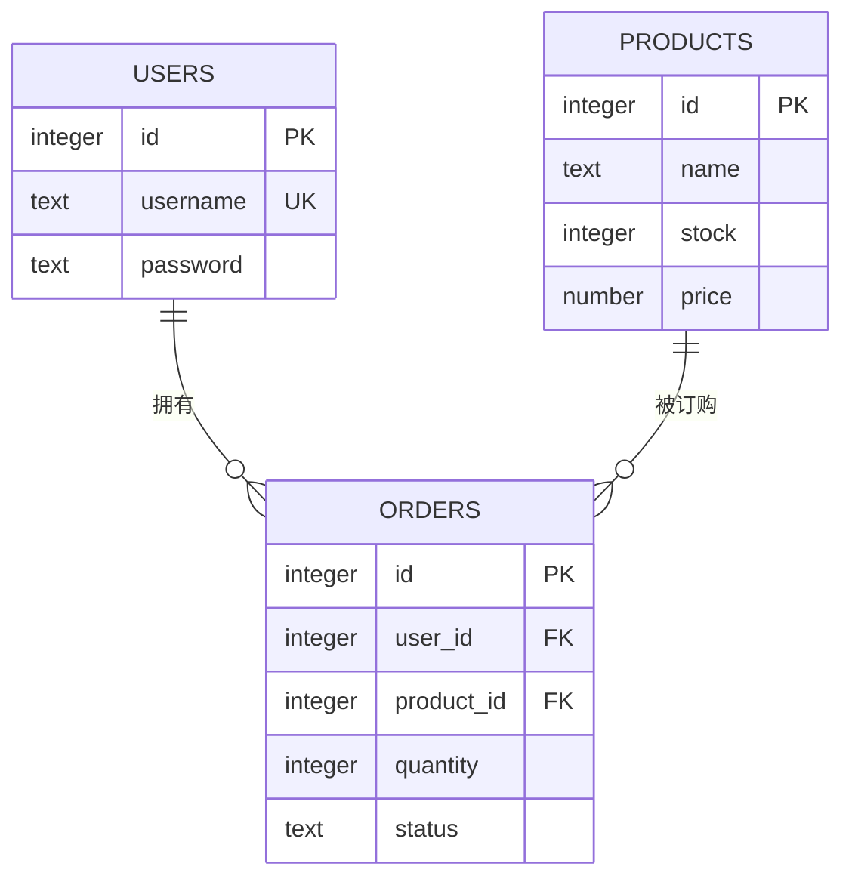
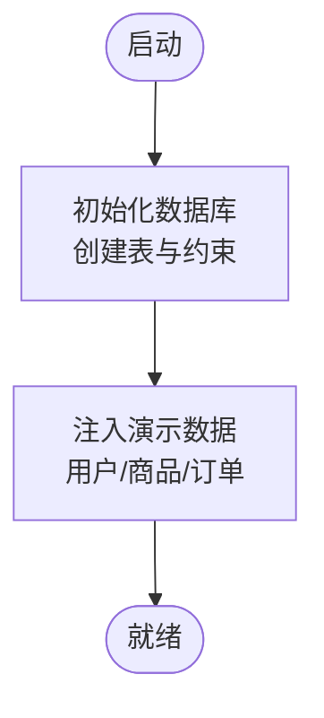
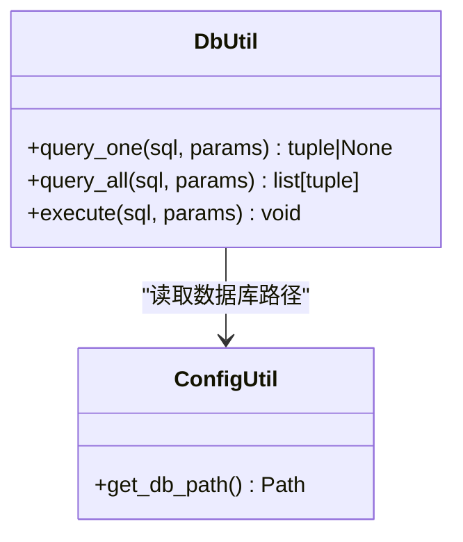
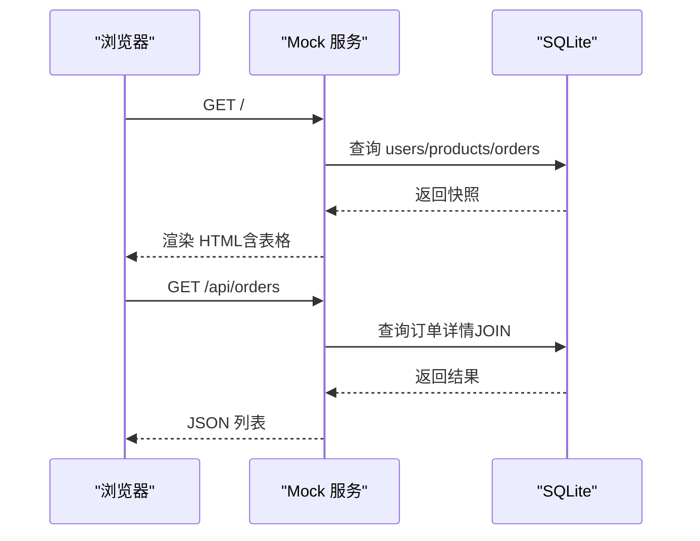
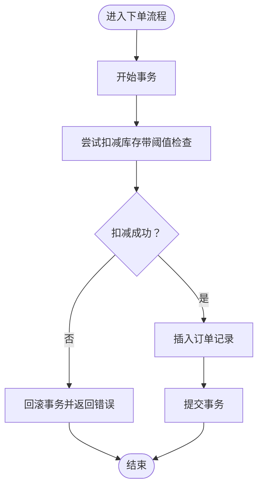
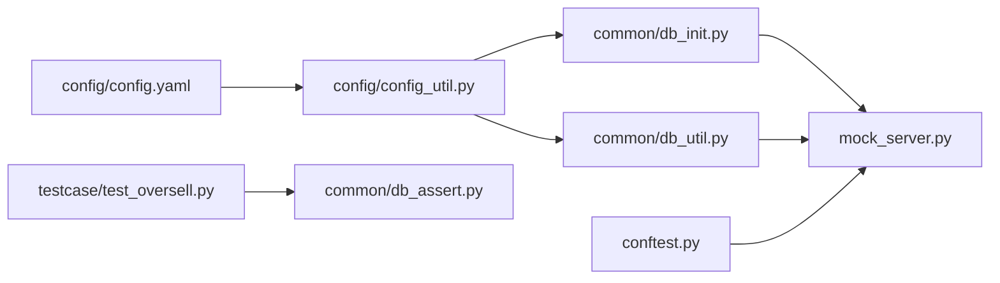

# 数据库设计

<cite>
**本文引用的文件**
- [common/db_init.py](file://common/db_init.py)
- [common/db_util.py](file://common/db_util.py)
- [mock_server.py](file://mock_server.py)
- [config/config.yaml](file://config/config.yaml)
- [config/config_util.py](file://config/config_util.py)
- [common/db_assert.py](file://common/db_assert.py)
- [conftest.py](file://conftest.py)
- [api/user_api.py](file://api/user_api.py)
- [api/product_api.py](file://api/product_api.py)
- [api/order_api.py](file://api/order_api.py)
- [api/pay_api.py](file://api/pay_api.py)
- [testcase/test_oversell.py](file://testcase/test_oversell.py)
</cite>

## 目录
1. [简介](#简介)
2. [项目结构](#项目结构)
3. [核心组件](#核心组件)
4. [架构总览](#架构总览)
5. [详细组件分析](#详细组件分析)
6. [依赖分析](#依赖分析)
7. [性能考虑](#性能考虑)
8. [故障排查指南](#故障排查指南)
9. [结论](#结论)
10. [附录](#附录)

## 简介
本文件系统性梳理了基于 SQLite 的数据库设计方案，覆盖表结构、字段与约束、实体关系、索引策略、初始化与种子数据、数据访问模式、并发一致性保障、以及 Mock 服务器中的数据库集成与实时数据展示机制。目标是帮助开发者快速理解并安全地扩展该数据库模型。

## 项目结构
数据库相关能力主要分布在以下模块：
- 配置层：负责数据库路径解析与默认用户配置
- 初始化与种子：负责建表、约束与演示数据
- 数据访问工具：提供统一的查询与执行入口
- API 层：封装对数据库的业务操作
- Mock 服务：以 Web 服务形式暴露数据库状态与业务接口
- 测试：验证并发场景下的库存一致性

图表来源
- [config/config.yaml:1-10](file://config/config.yaml#L1-L10)
- [config/config_util.py:34-40](file://config/config_util.py#L34-L40)
- [common/db_init.py:8-38](file://common/db_init.py#L8-L38)
- [common/db_util.py:9-35](file://common/db_util.py#L9-L35)
- [mock_server.py:17-322](file://mock_server.py#L17-L322)
- [conftest.py:16-48](file://conftest.py#L16-L48)
- [testcase/test_oversell.py:13-39](file://testcase/test_oversell.py#L13-L39)
- [api/user_api.py:8-22](file://api/user_api.py#L8-L22)
- [api/product_api.py:8-15](file://api/product_api.py#L8-L15)
- [api/order_api.py:8-15](file://api/order_api.py#L8-L15)
- [api/pay_api.py:8-15](file://api/pay_api.py#L8-L15)

章节来源
- [config/config.yaml:1-10](file://config/config.yaml#L1-L10)
- [config/config_util.py:34-40](file://config/config_util.py#L34-L40)
- [common/db_init.py:8-38](file://common/db_init.py#L8-L38)
- [common/db_util.py:9-35](file://common/db_util.py#L9-L35)
- [mock_server.py:17-322](file://mock_server.py#L17-L322)
- [conftest.py:16-48](file://conftest.py#L16-L48)
- [testcase/test_oversell.py:13-39](file://testcase/test_oversell.py#L13-L39)
- [api/user_api.py:8-22](file://api/user_api.py#L8-L22)
- [api/product_api.py:8-15](file://api/product_api.py#L8-L15)
- [api/order_api.py:8-15](file://api/order_api.py#L8-L15)
- [api/pay_api.py:8-15](file://api/pay_api.py#L8-L15)

## 核心组件
- 数据库初始化与约束
  - users 表：自增主键 id，唯一用户名，密码字段
  - products 表：自增主键 id，名称、库存、单价字段，均有非空与默认值约束
  - orders 表：自增主键 id，外键 user_id、product_id，数量与状态字段，状态默认值 created
- 数据访问工具
  - 提供单行查询、全量查询与执行方法，均通过统一数据库路径访问
- Mock 服务
  - 提供用户注册/登录、商品增删查、订单创建与支付等接口，并在页面中实时展示三张表快照
- 并发一致性
  - 订单创建采用显式事务与库存检查，确保超卖防护
- 配置与种子
  - 通过配置文件解析数据库路径，启动时自动初始化并注入演示数据

章节来源
- [common/db_init.py:8-38](file://common/db_init.py#L8-L38)
- [common/db_util.py:9-35](file://common/db_util.py#L9-L35)
- [mock_server.py:17-322](file://mock_server.py#L17-L322)
- [config/config_util.py:34-40](file://config/config_util.py#L34-L40)

## 架构总览
数据库层与服务层的交互如下：

图表来源
- [mock_server.py:17-322](file://mock_server.py#L17-L322)
- [api/user_api.py:8-22](file://api/user_api.py#L8-L22)
- [api/product_api.py:8-15](file://api/product_api.py#L8-L15)
- [api/order_api.py:8-15](file://api/order_api.py#L8-L15)
- [api/pay_api.py:8-15](file://api/pay_api.py#L8-L15)

## 详细组件分析

### 表结构与约束设计
- users 表
  - 字段：id（自增主键）、username（唯一且非空）、password（非空）
  - 约束：UNIQUE(username)，NOT NULL
- products 表
  - 字段：id（自增主键）、name（非空）、stock（整型，非空，默认 0）、price（实数，非空，默认 0）
  - 约束：NOT NULL、DEFAULT
- orders 表
  - 字段：id（自增主键）、user_id（外键可空）、product_id（非空外键）、quantity（非空）、status（非空，默认 created）
  - 约束：NOT NULL、DEFAULT、外键指向 users(id) 与 products(id)

图表来源
- [common/db_init.py:14-33](file://common/db_init.py#L14-L33)

章节来源
- [common/db_init.py:14-33](file://common/db_init.py#L14-L33)

### 实体关系与外键设计
- 关系
  - 一个用户可有多笔订单（一对多）
  - 一种商品可出现在多个订单中（一对多）
- 外键
  - orders.user_id 引用 users.id
  - orders.product_id 引用 products.id
- 设计要点
  - user_id 允许为空，便于匿名或特殊场景；实际业务中可通过登录态保证非空
  - product_id 保持非空，避免悬挂订单

章节来源
- [common/db_init.py:27-33](file://common/db_init.py#L27-L33)

### 索引策略
- 当前未显式创建索引
- 建议
  - 为 orders.user_id 建索引，提升按用户查询订单的性能
  - 为 orders.status 建索引，提升按状态筛选的性能
  - 为 products.name 建索引，提升按名称检索的性能
  - 为 users.username 建索引，提升登录与去重效率（当前为 UNIQUE，但显式索引可进一步优化）

章节来源
- [common/db_init.py:14-33](file://common/db_init.py#L14-L33)

### 数据库初始化与种子数据
- 初始化脚本
  - 启动时自动创建三张表并应用约束
- 种子数据
  - 插入演示用户与商品，仅在数据为空时插入，幂等可重复执行
  - 首次插入订单，绑定 demo 用户与首个商品

图表来源
- [common/db_init.py:8-38](file://common/db_init.py#L8-L38)
- [common/db_init.py:41-78](file://common/db_init.py#L41-L78)
- [conftest.py:16-31](file://conftest.py#L16-L31)

章节来源
- [common/db_init.py:8-38](file://common/db_init.py#L8-L38)
- [common/db_init.py:41-78](file://common/db_init.py#L41-L78)
- [conftest.py:16-31](file://conftest.py#L16-L31)

### 数据访问模式
- 统一访问入口
  - query_one：返回单行或 None
  - query_all：返回全量行
  - execute：执行写操作并提交
- 使用方式
  - 所有访问均通过配置解析的数据库路径建立连接，确保路径一致性

图表来源
- [common/db_util.py:9-35](file://common/db_util.py#L9-L35)
- [config/config_util.py:34-40](file://config/config_util.py#L34-L40)

章节来源
- [common/db_util.py:9-35](file://common/db_util.py#L9-L35)
- [config/config_util.py:34-40](file://config/config_util.py#L34-L40)

### Mock 服务器中的数据库集成与实时数据同步
- 连接与认证
  - 使用 check_same_thread=False 的连接，支持多线程访问
  - 登录后生成 token 并维护内存映射，后续请求通过 Authorization: Bearer 校验
- 实时数据展示
  - 根路径返回 HTML 页面，内嵌三张表的当前快照
  - GET /api/products、/api/orders、/api/users 提供 JSON 输出
- 写操作与一致性
  - POST /api/orders 使用 BEGIN IMMEDIATE + UPDATE + INSERT + COMMIT，失败回滚
  - 库存检查失败时回滚，避免超卖
  - POST /api/pay 更新订单状态，返回支付结果

图表来源
- [mock_server.py:43-129](file://mock_server.py#L43-L129)
- [mock_server.py:232-289](file://mock_server.py#L232-L289)

章节来源
- [mock_server.py:17-322](file://mock_server.py#L17-L322)

### 并发与一致性保障
- 超卖防护
  - 订单创建时先原子性检查并扣减库存，若不满足则回滚
  - 使用显式事务与受影响行数判断，确保并发安全
- 测试验证
  - 多线程并发下单，断言最终剩余库存与成功下单数符合预期

图表来源
- [mock_server.py:269-288](file://mock_server.py#L269-L288)
- [testcase/test_oversell.py:13-39](file://testcase/test_oversell.py#L13-L39)

章节来源
- [mock_server.py:269-288](file://mock_server.py#L269-L288)
- [testcase/test_oversell.py:13-39](file://testcase/test_oversell.py#L13-L39)

### 数据迁移与备份恢复策略
- 迁移
  - 新增字段：ALTER TABLE 添加列，注意默认值与非空约束
  - 新增索引：CREATE INDEX，评估对写入性能的影响
  - 结构变更：建议在维护窗口进行，配合版本号与回滚脚本
- 备份
  - SQLite 文件即数据库，直接复制 test.db 即可备份
  - 生产环境建议定期归档
- 恢复
  - 停止服务后替换数据库文件，重启生效
  - 恢复前校验文件完整性

章节来源
- [config/config.yaml:4-6](file://config/config.yaml#L4-L6)

### 缓存策略
- 当前未实现专用缓存层
- 建议
  - 对热点查询（如商品列表、用户信息）引入进程内缓存或 LRU 缓存
  - 对高频读取的统计指标（如库存）可考虑短期缓存并设置失效时间
  - 注意缓存与数据库的一致性，写操作后主动失效或更新

## 依赖分析
- 配置依赖
  - 数据库路径由配置文件解析，支持绝对/相对路径
- 初始化依赖
  - 启动时依赖配置解析路径，随后创建表与约束
- 服务依赖
  - Mock 服务依赖初始化后的数据库，提供 HTTP 接口
- 测试依赖
  - 测试在会话启动时清理旧数据库并注入默认用户，确保测试隔离

图表来源
- [config/config.yaml:1-10](file://config/config.yaml#L1-L10)
- [config/config_util.py:34-40](file://config/config_util.py#L34-L40)
- [common/db_init.py:8-38](file://common/db_init.py#L8-L38)
- [common/db_util.py:9-35](file://common/db_util.py#L9-L35)
- [mock_server.py:17-322](file://mock_server.py#L17-L322)
- [conftest.py:16-48](file://conftest.py#L16-L48)
- [testcase/test_oversell.py:13-39](file://testcase/test_oversell.py#L13-L39)
- [common/db_assert.py:6-16](file://common/db_assert.py#L6-L16)

章节来源
- [config/config.yaml:1-10](file://config/config.yaml#L1-L10)
- [config/config_util.py:34-40](file://config/config_util.py#L34-L40)
- [common/db_init.py:8-38](file://common/db_init.py#L8-L38)
- [common/db_util.py:9-35](file://common/db_util.py#L9-L35)
- [mock_server.py:17-322](file://mock_server.py#L17-L322)
- [conftest.py:16-48](file://conftest.py#L16-L48)
- [testcase/test_oversell.py:13-39](file://testcase/test_oversell.py#L13-L39)
- [common/db_assert.py:6-16](file://common/db_assert.py#L6-L16)

## 性能考虑
- 查询优化
  - 为高频过滤字段添加索引（如 orders.user_id、orders.status、products.name）
  - 使用 EXPLAIN QUERY PLAN 分析慢查询
- 写入优化
  - 批量插入使用 executemany，减少往返开销
  - 控制事务粒度，避免长事务阻塞
- 连接与并发
  - 使用连接池或复用连接，降低连接开销
  - 在多线程环境中谨慎处理共享连接，必要时为每个线程单独连接
- 存储与备份
  - 定期 VACUUM 与 ANALYZE，保持统计信息准确
  - 重要节点进行备份后再做结构变更

## 故障排查指南
- 常见问题
  - 登录失败：确认用户名与密码是否匹配，检查 token 是否过期
  - 库存不足：下单返回 insufficient stock，检查商品库存与并发下单情况
  - 订单不存在：支付接口返回 not found，确认 order_id 是否正确
- 调试手段
  - 查看 Mock 页面的实时数据快照，核对三表状态
  - 使用 db_assert 工具辅助断言库存与存在性
- 日志与监控
  - 建议在生产环境增加 SQL 执行日志与慢查询告警

章节来源
- [mock_server.py:159-185](file://mock_server.py#L159-L185)
- [mock_server.py:269-288](file://mock_server.py#L269-L288)
- [mock_server.py:307-315](file://mock_server.py#L307-L315)
- [common/db_assert.py:6-16](file://common/db_assert.py#L6-L16)

## 结论
该数据库设计以简洁清晰为核心，通过明确的表结构与约束、统一的数据访问工具、以及 Mock 服务中的实时展示与一致性保障，形成了可测试、可扩展的基础模型。建议在后续迭代中补充索引、缓存与迁移方案，以进一步提升性能与可维护性。

## 附录
- 配置项说明
  - base.url：服务基地址
  - database.path：数据库文件路径（相对或绝对）
  - user.username/password：默认用户凭据
- API 客户端映射
  - 用户：注册、登录
  - 商品：新增商品
  - 订单：创建订单
  - 支付：支付订单

章节来源
- [config/config.yaml:1-10](file://config/config.yaml#L1-L10)
- [api/user_api.py:8-22](file://api/user_api.py#L8-L22)
- [api/product_api.py:8-15](file://api/product_api.py#L8-L15)
- [api/order_api.py:8-15](file://api/order_api.py#L8-L15)
- [api/pay_api.py:8-15](file://api/pay_api.py#L8-L15)