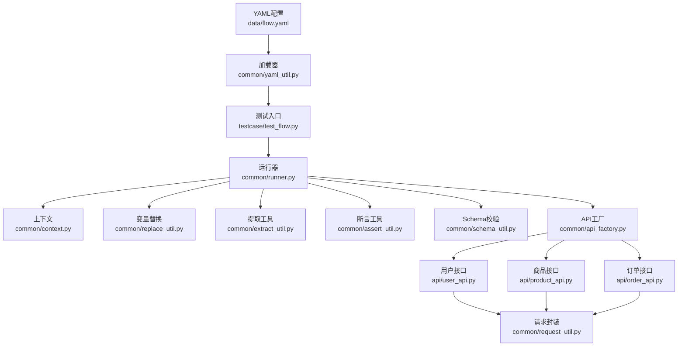
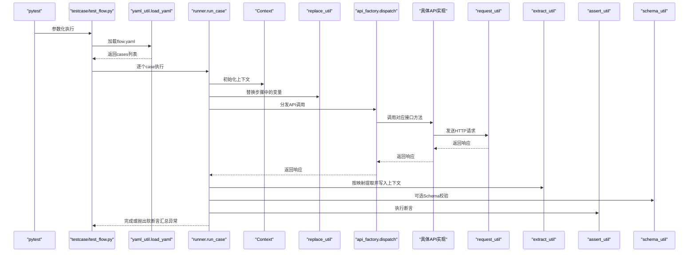
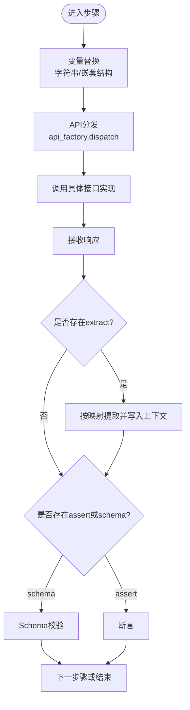
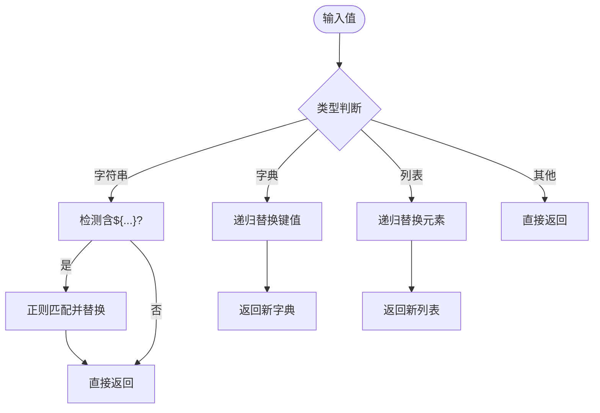
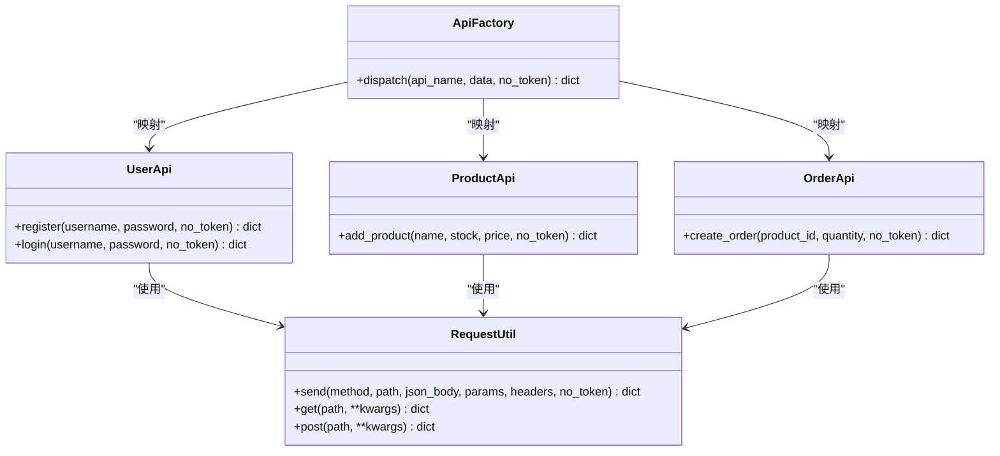
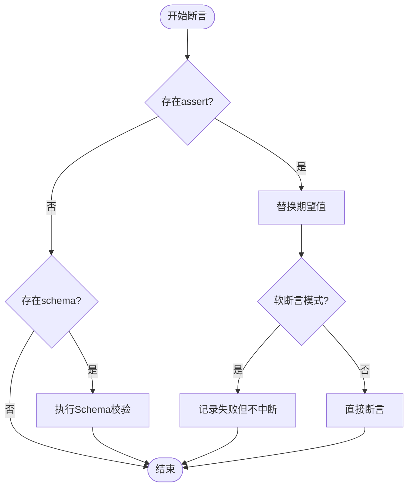
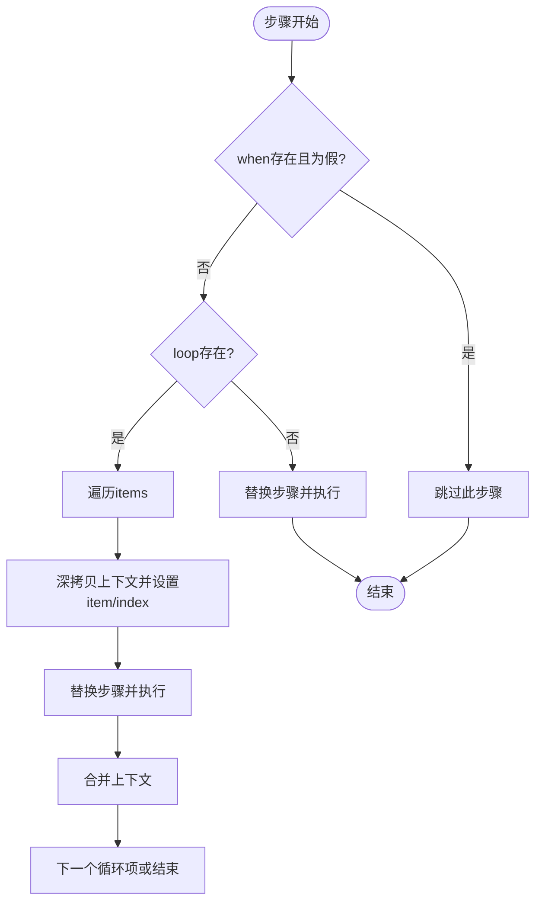
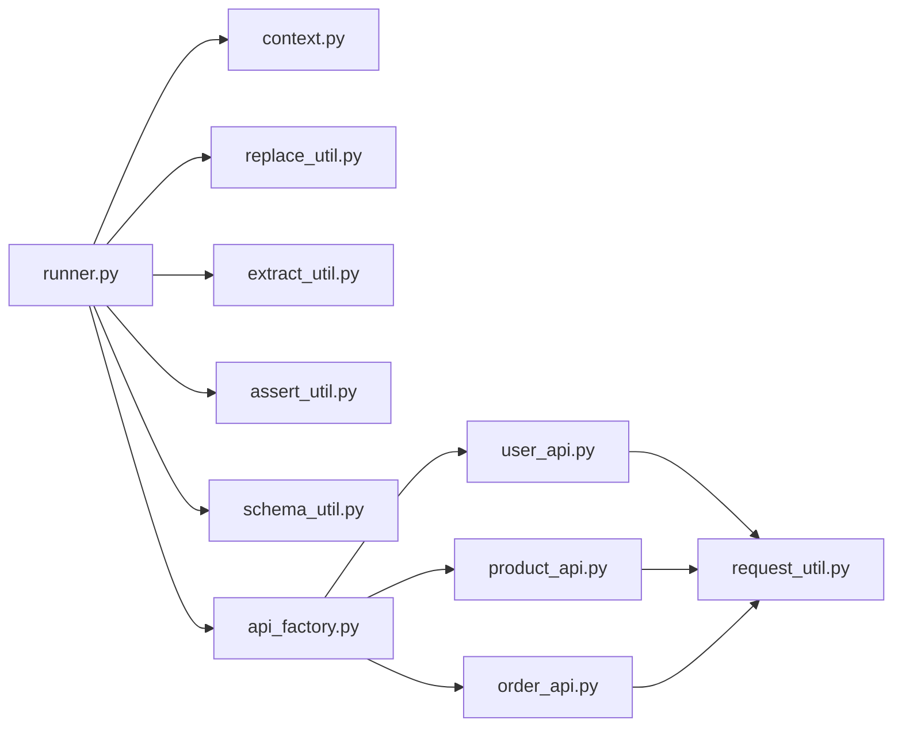

# 数据流分析

<cite>
**本文引用的文件**
- [data/flow.yaml](file://data/flow.yaml)
- [common/yaml_util.py](file://common/yaml_util.py)
- [testcase/test_flow.py](file://testcase/test_flow.py)
- [common/context.py](file://common/context.py)
- [common/runner.py](file://common/runner.py)
- [common/replace_util.py](file://common/replace_util.py)
- [common/extract_util.py](file://common/extract_util.py)
- [common/assert_util.py](file://common/assert_util.py)
- [common/schema_util.py](file://common/schema_util.py)
- [common/api_factory.py](file://common/api_factory.py)
- [common/request_util.py](file://common/request_util.py)
- [common/soft_assert.py](file://common/soft_assert.py)
- [api/user_api.py](file://api/user_api.py)
- [api/product_api.py](file://api/product_api.py)
- [api/order_api.py](file://api/order_api.py)
</cite>

## 目录
1. [引言](#引言)
2. [项目结构](#项目结构)
3. [核心组件](#核心组件)
4. [架构总览](#架构总览)
5. [详细组件分析](#详细组件分析)
6. [依赖分析](#依赖分析)
7. [性能考虑](#性能考虑)
8. [故障排查指南](#故障排查指南)
9. [结论](#结论)
10. [附录](#附录)

## 引言
本文件围绕API自动化测试框架的数据流进行系统化分析，目标是从YAML配置文件到最终测试结果的完整链路，逐层追踪数据在各阶段的转换与传递，包括：YAML配置解析、步骤参数提取、变量替换、API调用执行、结果断言与软断言汇总。同时阐明上下文管理在步骤间传递的机制，以及参数提取与替换如何实现动态数据处理；最后总结数据验证与错误处理在整个流程中的作用。

## 项目结构
该框架采用“配置驱动 + 运行器 + 工具库”的分层组织方式：
- 配置层：YAML文件定义测试场景与步骤
- 解析层：加载YAML并注入到运行器
- 执行层：运行器按步骤顺序执行，贯穿上下文传递、变量替换、提取、断言
- 接口层：通过API工厂映射到具体接口实现
- 工具层：提供上下文、变量替换、提取、断言、软断言、Schema校验等通用能力

图表来源
- [data/flow.yaml:1-41](file://data/flow.yaml#L1-L41)
- [common/yaml_util.py:11-14](file://common/yaml_util.py#L11-L14)
- [testcase/test_flow.py:9-16](file://testcase/test_flow.py#L9-L16)
- [common/runner.py:65-116](file://common/runner.py#L65-L116)
- [common/context.py:6-24](file://common/context.py#L6-L24)
- [common/replace_util.py:45-54](file://common/replace_util.py#L45-L54)
- [common/extract_util.py:43-49](file://common/extract_util.py#L43-L49)
- [common/assert_util.py:6-14](file://common/assert_util.py#L6-L14)
- [common/schema_util.py:24-33](file://common/schema_util.py#L24-L33)
- [common/api_factory.py:21-27](file://common/api_factory.py#L21-L27)
- [api/user_api.py:8-21](file://api/user_api.py#L8-L21)
- [api/product_api.py:8-14](file://api/product_api.py#L8-L14)
- [api/order_api.py:8-14](file://api/order_api.py#L8-L14)
- [common/request_util.py:71-117](file://common/request_util.py#L71-L117)

章节来源
- [data/flow.yaml:1-41](file://data/flow.yaml#L1-L41)
- [common/yaml_util.py:11-14](file://common/yaml_util.py#L11-L14)
- [testcase/test_flow.py:9-16](file://testcase/test_flow.py#L9-L16)

## 核心组件
- YAML配置与加载
  - YAML文件定义测试场景与步骤，包含步骤名称、API标识、请求数据、断言、提取、Schema校验、条件与循环等字段
  - 加载器负责定位并安全解析YAML为字典对象
- 上下文管理
  - Context提供键值存储、更新、清理与读取接口，作为跨步骤的数据容器
- 变量替换
  - 支持字符串内占位符替换与嵌套结构递归替换，支持fake占位生成与上下文键查找
- 提取工具
  - 支持点号路径与JSONPath两种提取方式，将响应片段写入上下文
- 断言与Schema校验
  - 断言工具进行子集断言；Schema校验基于JSONSchema进行结构验证
- API工厂与请求封装
  - 工厂根据API标识分发到具体接口类；接口类通过请求封装发送HTTP请求并返回响应
- 运行器
  - 统一编排：加载配置、初始化上下文、执行步骤（含条件、循环、提取、断言、Schema校验）、软断言汇总与Teardown

章节来源
- [common/context.py:6-24](file://common/context.py#L6-L24)
- [common/replace_util.py:30-54](file://common/replace_util.py#L30-L54)
- [common/extract_util.py:43-49](file://common/extract_util.py#L43-L49)
- [common/assert_util.py:6-14](file://common/assert_util.py#L6-L14)
- [common/schema_util.py:24-33](file://common/schema_util.py#L24-L33)
- [common/api_factory.py:21-27](file://common/api_factory.py#L21-L27)
- [common/request_util.py:71-117](file://common/request_util.py#L71-L117)
- [common/runner.py:65-116](file://common/runner.py#L65-L116)

## 架构总览
下图展示从YAML到最终结果的关键数据流与控制流：

图表来源
- [testcase/test_flow.py:9-16](file://testcase/test_flow.py#L9-L16)
- [common/yaml_util.py:11-14](file://common/yaml_util.py#L11-L14)
- [common/runner.py:65-116](file://common/runner.py#L65-L116)
- [common/context.py:6-24](file://common/context.py#L6-L24)
- [common/replace_util.py:45-54](file://common/replace_util.py#L45-L54)
- [common/api_factory.py:21-27](file://common/api_factory.py#L21-L27)
- [api/user_api.py:8-21](file://api/user_api.py#L8-L21)
- [api/product_api.py:8-14](file://api/product_api.py#L8-L14)
- [api/order_api.py:8-14](file://api/order_api.py#L8-L14)
- [common/request_util.py:71-117](file://common/request_util.py#L71-L117)
- [common/extract_util.py:43-49](file://common/extract_util.py#L43-L49)
- [common/assert_util.py:6-14](file://common/assert_util.py#L6-L14)
- [common/schema_util.py:24-33](file://common/schema_util.py#L24-L33)

## 详细组件分析

### YAML配置解析与注入
- YAML文件以cases数组承载多个测试场景，每个场景包含name与steps等字段
- 测试入口通过加载器读取YAML并将其作为参数化数据源传入运行器
- 关键路径：YAML文件 → 加载器 → 测试入口 → 运行器

章节来源
- [data/flow.yaml:1-41](file://data/flow.yaml#L1-L41)
- [common/yaml_util.py:11-14](file://common/yaml_util.py#L11-L14)
- [testcase/test_flow.py:9-16](file://testcase/test_flow.py#L9-L16)

### 步骤参数提取与上下文传递
- 运行器在执行每个步骤前，先对data、assert、schema等字段进行变量替换
- 提取逻辑将响应中指定路径的值写入上下文，供后续步骤使用
- 上下文在循环展开时会深拷贝，确保每轮迭代独立；循环结束后将最新上下文合并回主上下文

图表来源
- [common/runner.py:29-62](file://common/runner.py#L29-L62)
- [common/replace_util.py:45-54](file://common/replace_util.py#L45-L54)
- [common/extract_util.py:43-49](file://common/extract_util.py#L43-L49)
- [common/schema_util.py:24-33](file://common/schema_util.py#L24-L33)
- [common/assert_util.py:6-14](file://common/assert_util.py#L6-L14)

章节来源
- [common/runner.py:29-62](file://common/runner.py#L29-L62)
- [common/extract_util.py:43-49](file://common/extract_util.py#L43-L49)
- [common/context.py:6-24](file://common/context.py#L6-L24)

### 变量替换与动态数据处理
- 字符串替换支持${key}与fake.xxx占位，分别从上下文与工厂函数解析
- 嵌套结构递归替换，保证复杂数据结构中的占位符被正确解析
- 当上下文缺失所需键时抛出KeyError，确保显式错误提示

图表来源
- [common/replace_util.py:30-54](file://common/replace_util.py#L30-L54)

章节来源
- [common/replace_util.py:30-54](file://common/replace_util.py#L30-L54)

### API调用执行与请求封装
- API工厂根据api字段映射到具体接口类的方法，并将no_token等参数透传
- 接口类通过请求封装发送HTTP请求，自动附加基础URL、超时、重试策略与鉴权头
- 请求与响应通过Allure附件输出，便于调试与审计

图表来源
- [common/api_factory.py:21-27](file://common/api_factory.py#L21-L27)
- [api/user_api.py:8-21](file://api/user_api.py#L8-L21)
- [api/product_api.py:8-14](file://api/product_api.py#L8-L14)
- [api/order_api.py:8-14](file://api/order_api.py#L8-L14)
- [common/request_util.py:71-117](file://common/request_util.py#L71-L117)

章节来源
- [common/api_factory.py:21-27](file://common/api_factory.py#L21-L27)
- [api/user_api.py:8-21](file://api/user_api.py#L8-L21)
- [api/product_api.py:8-14](file://api/product_api.py#L8-L14)
- [api/order_api.py:8-14](file://api/order_api.py#L8-L14)
- [common/request_util.py:71-117](file://common/request_util.py#L71-L117)

### 结果断言与软断言汇总
- 断言工具对期望子集与实际响应进行递归比对，缺失键或值不一致即抛出AssertionError
- 支持软断言模式，收集所有失败并在用例末尾统一抛出
- Schema校验基于JSONSchema，失败时提供路径与消息信息

图表来源
- [common/runner.py:54-62](file://common/runner.py#L54-L62)
- [common/assert_util.py:6-14](file://common/assert_util.py#L6-L14)
- [common/schema_util.py:24-33](file://common/schema_util.py#L24-L33)
- [common/soft_assert.py:8-26](file://common/soft_assert.py#L8-L26)

章节来源
- [common/runner.py:54-62](file://common/runner.py#L54-L62)
- [common/assert_util.py:6-14](file://common/assert_util.py#L6-L14)
- [common/schema_util.py:24-33](file://common/schema_util.py#L24-L33)
- [common/soft_assert.py:8-26](file://common/soft_assert.py#L8-L26)

### 条件与循环控制流
- when表达式在步骤执行前进行求值，支持字符串比较与数值比较
- loop支持整数、列表与可替换的表达式，每轮迭代深拷贝上下文并设置item/index，执行后合并回主上下文

图表来源
- [common/runner.py:78-103](file://common/runner.py#L78-L103)
- [common/replace_util.py:45-54](file://common/replace_util.py#L45-L54)

章节来源
- [common/runner.py:78-103](file://common/runner.py#L78-L103)
- [common/replace_util.py:45-54](file://common/replace_util.py#L45-L54)

## 依赖分析
- 组件耦合与内聚
  - 运行器聚合了上下文、替换、提取、断言、Schema与API工厂，内聚度高但职责明确
  - API工厂与具体接口类解耦，便于扩展新的API
- 外部依赖
  - YAML解析、JSONPath、JSONSchema、requests、allure等
- 潜在循环依赖
  - 未发现直接循环导入；模块间通过函数调用与实例化交互

图表来源
- [common/runner.py:65-116](file://common/runner.py#L65-L116)
- [common/api_factory.py:21-27](file://common/api_factory.py#L21-L27)
- [api/user_api.py:8-21](file://api/user_api.py#L8-L21)
- [api/product_api.py:8-14](file://api/product_api.py#L8-L14)
- [api/order_api.py:8-14](file://api/order_api.py#L8-L14)
- [common/request_util.py:71-117](file://common/request_util.py#L71-L117)

章节来源
- [common/runner.py:65-116](file://common/runner.py#L65-L116)
- [common/api_factory.py:21-27](file://common/api_factory.py#L21-L27)

## 性能考虑
- 变量替换与Schema校验为O(n)操作，建议避免在大对象上重复执行
- JSONPath提取在大数据响应上可能成为瓶颈，建议仅提取必要字段
- 请求重试与超时配置需结合环境调整，避免过度重试导致资源浪费
- Allure附件会增加磁盘与内存开销，建议在CI中按需开启

## 故障排查指南
- YAML加载失败
  - 症状：加载器报错或返回空字典
  - 排查：确认文件路径与编码，检查YAML语法
- API未知标识
  - 症状：分发时抛出KeyError
  - 排查：核对api字段拼写与注册表
- 变量缺失
  - 症状：字符串替换时报KeyError
  - 排查：确认上下文是否已通过extract写入，或使用fake占位
- 断言失败
  - 症状：断言工具抛出AssertionError
  - 排查：查看期望与实际差异，确认路径与类型
- Schema校验失败
  - 症状：Schema校验抛出ValidationError
  - 排查：对照Schema路径定位问题字段
- 软断言汇总
  - 症状：用例结束后统一抛出软断言异常
  - 排查：逐条查看失败列表并修复

章节来源
- [common/yaml_util.py:11-14](file://common/yaml_util.py#L11-L14)
- [common/api_factory.py:21-27](file://common/api_factory.py#L21-L27)
- [common/replace_util.py:30-42](file://common/replace_util.py#L30-L42)
- [common/assert_util.py:6-14](file://common/assert_util.py#L6-L14)
- [common/schema_util.py:24-33](file://common/schema_util.py#L24-L33)
- [common/runner.py:105-116](file://common/runner.py#L105-L116)

## 结论
该框架通过清晰的分层设计与可扩展的工具库，实现了从YAML配置到最终测试结果的完整数据流闭环。上下文作为贯穿全链路的数据载体，配合变量替换与提取机制，使得测试具备强大的动态性与可维护性。断言与Schema校验保障了结果的正确性与结构的稳定性；软断言汇总提升了调试效率。整体架构易于扩展新的API与校验规则，适合持续演进的API自动化测试需求。

## 附录
- 关键数据结构
  - 上下文：键值对存储，支持更新与清理
  - 步骤：包含api、data、assert、extract、schema、when、loop等字段
  - 响应：字典形式，用于断言与提取
- 典型流程示例
  - 用户注册 → 登录（提取token）→ 添加商品（提取id）→ 创建订单（引用id）→ 支付（断言状态）