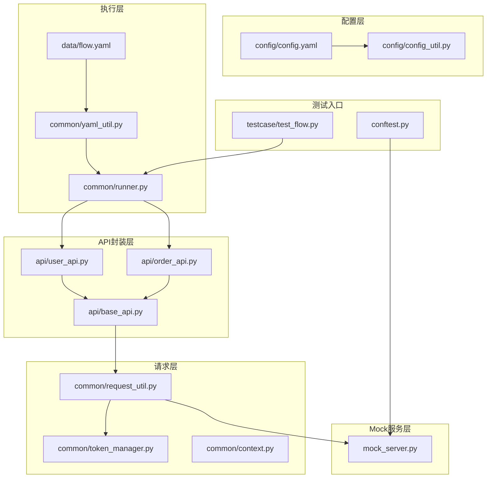
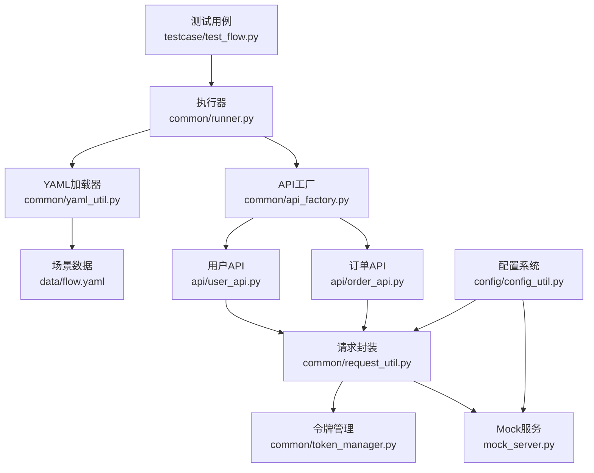
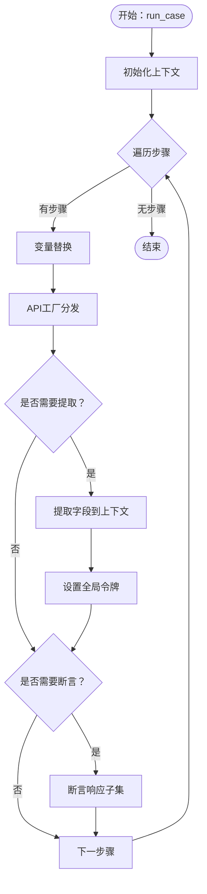
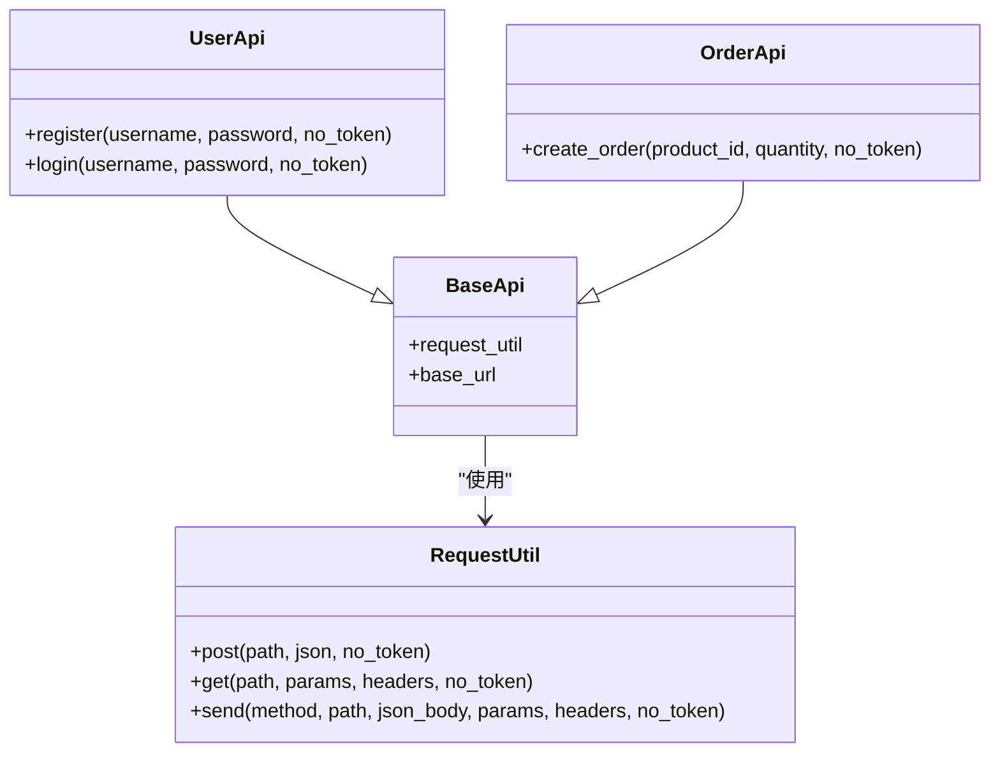
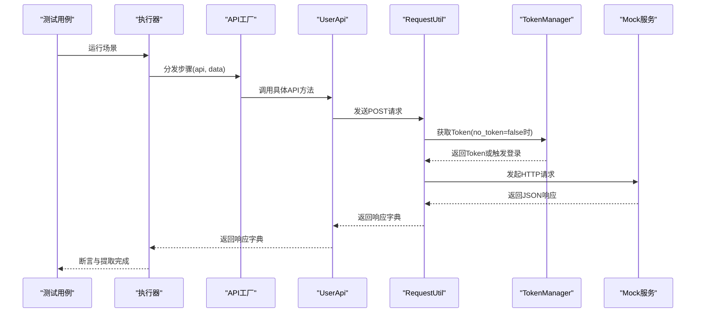
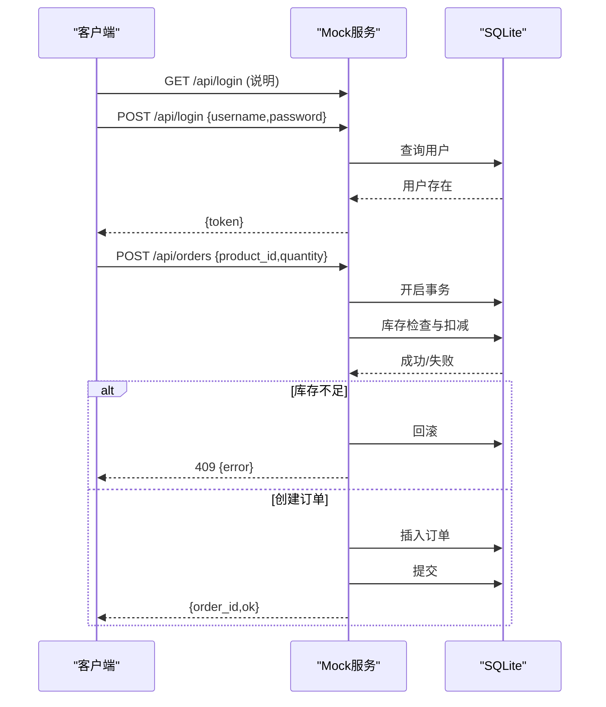
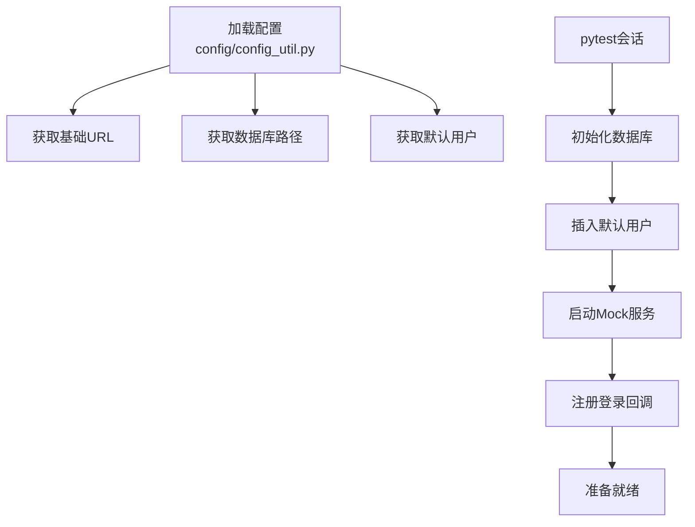
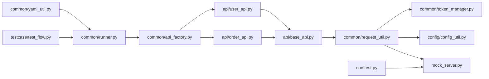

# 架构总览

<cite>
**本文引用的文件**
- [mock_server.py](file://mock_server.py)
- [common/runner.py](file://common/runner.py)
- [common/api_factory.py](file://common/api_factory.py)
- [config/config.yaml](file://config/config.yaml)
- [config/config_util.py](file://config/config_util.py)
- [data/flow.yaml](file://data/flow.yaml)
- [api/base_api.py](file://api/base_api.py)
- [api/user_api.py](file://api/user_api.py)
- [api/order_api.py](file://api/order_api.py)
- [common/request_util.py](file://common/request_util.py)
- [common/yaml_util.py](file://common/yaml_util.py)
- [testcase/test_flow.py](file://testcase/test_flow.py)
- [common/context.py](file://common/context.py)
- [common/token_manager.py](file://common/token_manager.py)
- [conftest.py](file://conftest.py)
</cite>

## 目录
1. [引言](#引言)
2. [项目结构](#项目结构)
3. [核心组件](#核心组件)
4. [架构总览](#架构总览)
5. [详细组件分析](#详细组件分析)
6. [依赖分析](#依赖分析)
7. [性能考虑](#性能考虑)
8. [故障排查指南](#故障排查指南)
9. [结论](#结论)
10. [附录](#附录)

## 引言
本文件面向API自动化测试框架的架构总览与设计说明，目标是帮助初学者快速理解从“客户端请求”到“Mock服务器响应”的完整数据流，同时为高级开发者提供深入的设计思路与模块协作机制。文档覆盖以下要点：
- 整体架构理念：以“配置驱动 + 测试驱动”的方式组织，通过YAML配置描述端到端流程，由测试用例驱动执行器逐步推进。
- 分层架构模式：按“配置层 → 执行层 → API封装层 → 请求层 → Mock服务层”进行职责分离。
- 数据流全链路：YAML解析 → 步骤编排 → API分发 → 请求发送 → 响应断言与提取 → 上下文传递。
- 测试驱动验证：通过断言工具与上下文抽取，确保每一步结果符合预期。

## 项目结构
该项目采用按功能域分层的目录组织方式，核心模块如下：
- config：集中式配置管理，提供基础URL、数据库路径与默认用户信息。
- common：通用能力与基础设施，包括API工厂、请求封装、上下文、令牌管理、YAML加载等。
- api：业务API封装，每个API类负责具体HTTP端点的封装。
- data：测试场景数据，以YAML描述端到端流程。
- testcase：基于pytest的测试用例，驱动流程执行。
- mock_server：本地Mock服务，提供REST接口与SQLite存储。

图表来源
- [config/config.yaml:1-10](file://config/config.yaml#L1-L10)
- [config/config_util.py:1-50](file://config/config_util.py#L1-L50)
- [common/runner.py:1-45](file://common/runner.py#L1-L45)
- [common/yaml_util.py:1-15](file://common/yaml_util.py#L1-L15)
- [data/flow.yaml:1-41](file://data/flow.yaml#L1-L41)
- [api/base_api.py:1-11](file://api/base_api.py#L1-L11)
- [api/user_api.py:1-22](file://api/user_api.py#L1-L22)
- [api/order_api.py:1-15](file://api/order_api.py#L1-L15)
- [common/request_util.py:1-66](file://common/request_util.py#L1-L66)
- [common/token_manager.py:1-38](file://common/token_manager.py#L1-L38)
- [common/context.py:1-25](file://common/context.py#L1-L25)
- [mock_server.py:1-322](file://mock_server.py#L1-L322)
- [testcase/test_flow.py:1-17](file://testcase/test_flow.py#L1-L17)
- [conftest.py:1-50](file://conftest.py#L1-L50)

章节来源
- [config/config.yaml:1-10](file://config/config.yaml#L1-L10)
- [config/config_util.py:1-50](file://config/config_util.py#L1-L50)
- [common/yaml_util.py:1-15](file://common/yaml_util.py#L1-L15)
- [data/flow.yaml:1-41](file://data/flow.yaml#L1-L41)
- [common/runner.py:1-45](file://common/runner.py#L1-L45)
- [api/base_api.py:1-11](file://api/base_api.py#L1-L11)
- [api/user_api.py:1-22](file://api/user_api.py#L1-L22)
- [api/order_api.py:1-15](file://api/order_api.py#L1-L15)
- [common/request_util.py:1-66](file://common/request_util.py#L1-L66)
- [common/token_manager.py:1-38](file://common/token_manager.py#L1-L38)
- [common/context.py:1-25](file://common/context.py#L1-L25)
- [mock_server.py:1-322](file://mock_server.py#L1-L322)
- [testcase/test_flow.py:1-17](file://testcase/test_flow.py#L1-L17)
- [conftest.py:1-50](file://conftest.py#L1-L50)

## 核心组件
- 配置系统：集中管理基础URL、数据库路径与默认用户，支持环境变量覆盖。
- YAML加载器：统一加载data目录下的场景文件，供执行器消费。
- 执行器：按步骤顺序执行，支持变量替换、上下文提取与断言。
- API工厂：将“步骤名”映射到具体API方法，实现解耦与扩展。
- API封装：每个API类封装对应端点的请求细节，复用公共基类。
- 请求封装：统一处理Header、超时、日志与异常，支持自动注入Token。
- 令牌管理：线程安全的Token缓存与登录回调注册。
- 上下文：在多步骤间传递变量，支持提取与替换。
- Mock服务：提供REST接口与SQLite存储，内置认证与业务逻辑。

章节来源
- [config/config_util.py:27-50](file://config/config_util.py#L27-L50)
- [common/yaml_util.py:11-15](file://common/yaml_util.py#L11-L15)
- [common/runner.py:15-45](file://common/runner.py#L15-L45)
- [common/api_factory.py:12-28](file://common/api_factory.py#L12-L28)
- [api/base_api.py:7-11](file://api/base_api.py#L7-L11)
- [common/request_util.py:13-66](file://common/request_util.py#L13-L66)
- [common/token_manager.py:8-38](file://common/token_manager.py#L8-L38)
- [common/context.py:6-25](file://common/context.py#L6-L25)
- [mock_server.py:43-315](file://mock_server.py#L43-L315)

## 架构总览
该框架采用“配置驱动 + 测试驱动”的分层架构：
- 配置层：提供运行期参数与资源路径，避免硬编码。
- 执行层：解析YAML场景，逐步骤调度执行，维护上下文与断言。
- API封装层：面向业务的API对象，屏蔽HTTP细节。
- 请求层：统一网络请求与认证处理，提供可观察性附件。
- Mock服务层：提供真实可用的后端服务，便于离线测试与演示。

图表来源
- [testcase/test_flow.py:9-17](file://testcase/test_flow.py#L9-L17)
- [common/runner.py:15-45](file://common/runner.py#L15-L45)
- [common/yaml_util.py:11-15](file://common/yaml_util.py#L11-L15)
- [data/flow.yaml:1-41](file://data/flow.yaml#L1-L41)
- [common/api_factory.py:12-28](file://common/api_factory.py#L12-L28)
- [api/user_api.py:8-22](file://api/user_api.py#L8-L22)
- [api/order_api.py:8-15](file://api/order_api.py#L8-L15)
- [common/request_util.py:13-66](file://common/request_util.py#L13-L66)
- [common/token_manager.py:8-38](file://common/token_manager.py#L8-L38)
- [mock_server.py:43-315](file://mock_server.py#L43-L315)
- [config/config_util.py:27-50](file://config/config_util.py#L27-L50)

## 详细组件分析

### 组件A：执行器（Runner）
- 职责：遍历步骤，执行API调用，进行变量提取与断言。
- 关键流程：
  - 初始化上下文，合并基础上下文。
  - 对每个步骤：
    - 替换变量占位符。
    - 通过API工厂分发到具体API方法。
    - 可选：提取字段写入上下文并更新令牌。
    - 可选：断言期望值与实际响应的子集匹配。

图表来源
- [common/runner.py:15-45](file://common/runner.py#L15-L45)
- [common/api_factory.py:21-28](file://common/api_factory.py#L21-L28)
- [common/extract_util.py:1-50](file://common/extract_util.py#L1-L50)
- [common/assert_util.py:1-50](file://common/assert_util.py#L1-L50)

章节来源
- [common/runner.py:15-45](file://common/runner.py#L15-L45)

### 组件B：API工厂与API封装
- API工厂：将“步骤名”映射到具体API方法，便于扩展新接口。
- API封装：每个API类继承BaseApi，统一请求构造与基础URL拼接。

图表来源
- [api/base_api.py:7-11](file://api/base_api.py#L7-L11)
- [api/user_api.py:8-22](file://api/user_api.py#L8-L22)
- [api/order_api.py:8-15](file://api/order_api.py#L8-L15)
- [common/request_util.py:13-66](file://common/request_util.py#L13-L66)

章节来源
- [common/api_factory.py:12-28](file://common/api_factory.py#L12-L28)
- [api/base_api.py:7-11](file://api/base_api.py#L7-L11)
- [api/user_api.py:8-22](file://api/user_api.py#L8-L22)
- [api/order_api.py:8-15](file://api/order_api.py#L8-L15)
- [common/request_util.py:13-66](file://common/request_util.py#L13-L66)

### 组件C：请求封装与令牌管理
- 请求封装：统一处理Header、超时、日志与异常，支持自动注入Bearer Token。
- 令牌管理：线程安全的Token缓存，支持注册登录回调以自动获取Token。

图表来源
- [common/runner.py:30-31](file://common/runner.py#L30-L31)
- [common/api_factory.py:21-28](file://common/api_factory.py#L21-L28)
- [api/user_api.py:9-14](file://api/user_api.py#L9-L14)
- [common/request_util.py:27-58](file://common/request_util.py#L27-L58)
- [common/token_manager.py:28-37](file://common/token_manager.py#L28-L37)
- [mock_server.py:159-185](file://mock_server.py#L159-L185)

章节来源
- [common/request_util.py:18-25](file://common/request_util.py#L18-L25)
- [common/token_manager.py:8-38](file://common/token_manager.py#L8-L38)

### 组件D：Mock服务（REST + SQLite）
- 提供用户注册/登录、商品查询/新增、订单创建、支付等接口。
- 内置认证：基于Bearer Token校验，失败返回401。
- 业务一致性：订单创建包含库存检查与事务控制，失败返回409/404。

图表来源
- [mock_server.py:159-185](file://mock_server.py#L159-L185)
- [mock_server.py:232-289](file://mock_server.py#L232-L289)

章节来源
- [mock_server.py:43-315](file://mock_server.py#L43-L315)

### 组件E：配置与环境
- 配置系统：集中管理基础URL、数据库路径与默认用户，支持环境变量覆盖。
- 测试夹具：启动Mock服务，初始化数据库，注册默认登录函数，预置管理员账户。

图表来源
- [config/config_util.py:27-50](file://config/config_util.py#L27-L50)
- [conftest.py:16-50](file://conftest.py#L16-L50)

章节来源
- [config/config_util.py:14-50](file://config/config_util.py#L14-L50)
- [conftest.py:16-50](file://conftest.py#L16-L50)

## 依赖分析
- 低耦合高内聚：API工厂与API封装通过函数签名解耦；请求封装独立于业务API。
- 单一职责：配置系统仅负责参数解析；执行器仅负责流程编排；Mock服务仅负责业务接口。
- 外部依赖：Flask（Mock服务）、requests（HTTP请求）、pytest（测试运行）、allure（报告附件）。

图表来源
- [common/yaml_util.py:11-15](file://common/yaml_util.py#L11-L15)
- [common/runner.py:15-45](file://common/runner.py#L15-L45)
- [common/api_factory.py:12-28](file://common/api_factory.py#L12-L28)
- [api/user_api.py:8-22](file://api/user_api.py#L8-L22)
- [api/order_api.py:8-15](file://api/order_api.py#L8-L15)
- [api/base_api.py:7-11](file://api/base_api.py#L7-L11)
- [common/request_util.py:13-66](file://common/request_util.py#L13-L66)
- [common/token_manager.py:8-38](file://common/token_manager.py#L8-L38)
- [config/config_util.py:27-50](file://config/config_util.py#L27-L50)
- [mock_server.py:43-315](file://mock_server.py#L43-L315)
- [testcase/test_flow.py:9-17](file://testcase/test_flow.py#L9-L17)
- [conftest.py:33-48](file://conftest.py#L33-L48)

章节来源
- [common/api_factory.py:12-28](file://common/api_factory.py#L12-L28)
- [common/request_util.py:13-66](file://common/request_util.py#L13-L66)
- [mock_server.py:43-315](file://mock_server.py#L43-L315)

## 性能考虑
- 线程模型：Mock服务通过多线程启动，适合并发测试场景。
- 请求超时：请求封装设置统一超时，避免阻塞影响测试稳定性。
- 日志与附件：Allure附件记录请求/响应，便于定位问题但可能增加磁盘IO。
- 数据库事务：订单创建使用事务与行级锁，保证一致性与并发安全。
- 缓存策略：配置与Token采用进程内缓存，减少重复开销。

## 故障排查指南
- 无法连接Mock服务
  - 检查基础URL与端口配置，确认环境变量覆盖是否生效。
  - 确认pytest夹具已启动服务且未提前关闭。
- 认证失败（401）
  - 确认已先执行登录步骤并正确提取token。
  - 检查TokenManager是否注册了登录回调。
- 库存不足（409）
  - 检查商品库存与下单数量，确保库存足够。
- 断言失败
  - 使用Allure附件查看请求/响应详情，核对期望值与实际值。
  - 检查上下文变量替换是否正确。

章节来源
- [config/config_util.py:27-31](file://config/config_util.py#L27-L31)
- [conftest.py:33-48](file://conftest.py#L33-L48)
- [common/token_manager.py:28-37](file://common/token_manager.py#L28-L37)
- [mock_server.py:270-286](file://mock_server.py#L270-L286)
- [common/request_util.py:40-58](file://common/request_util.py#L40-L58)

## 结论
该框架通过“配置驱动 + 测试驱动”的设计，实现了从YAML到Mock服务的完整闭环。其分层架构清晰、职责明确，既满足初学者快速上手，也为高级开发者提供了良好的扩展空间。建议在团队内推广使用统一的API封装与断言规范，持续完善场景覆盖与错误处理策略。

## 附录
- 场景文件示例：参考[data/flow.yaml:1-41](file://data/flow.yaml#L1-L41)，描述从注册、登录、新增商品、创建订单到支付的完整流程。
- 测试入口：参考[testcase/test_flow.py:9-17](file://testcase/test_flow.py#L9-L17)，通过pytest参数化加载多个场景。
- 配置文件：参考[config/config.yaml:1-10](file://config/config.yaml#L1-L10)，定义基础URL、数据库路径与默认用户。