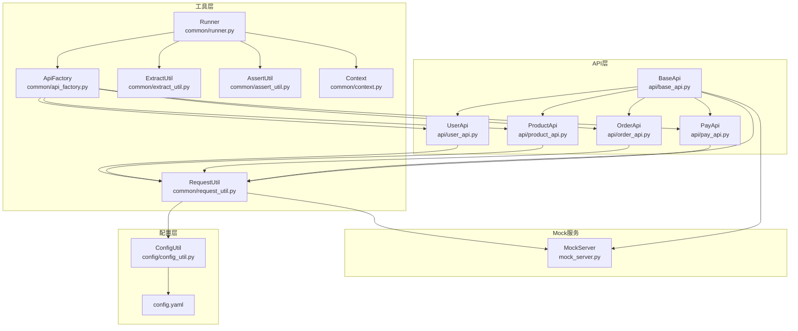
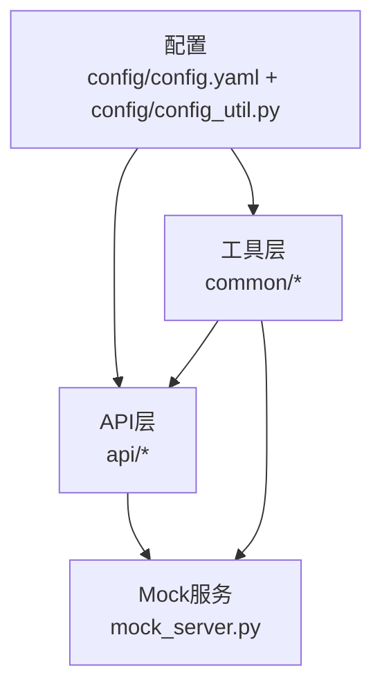
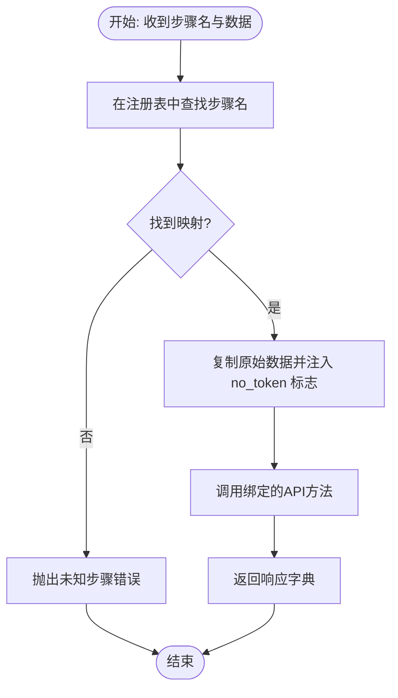
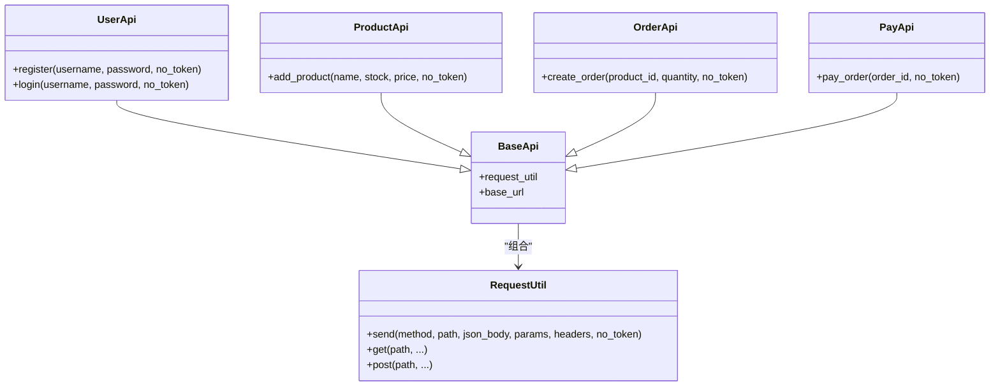
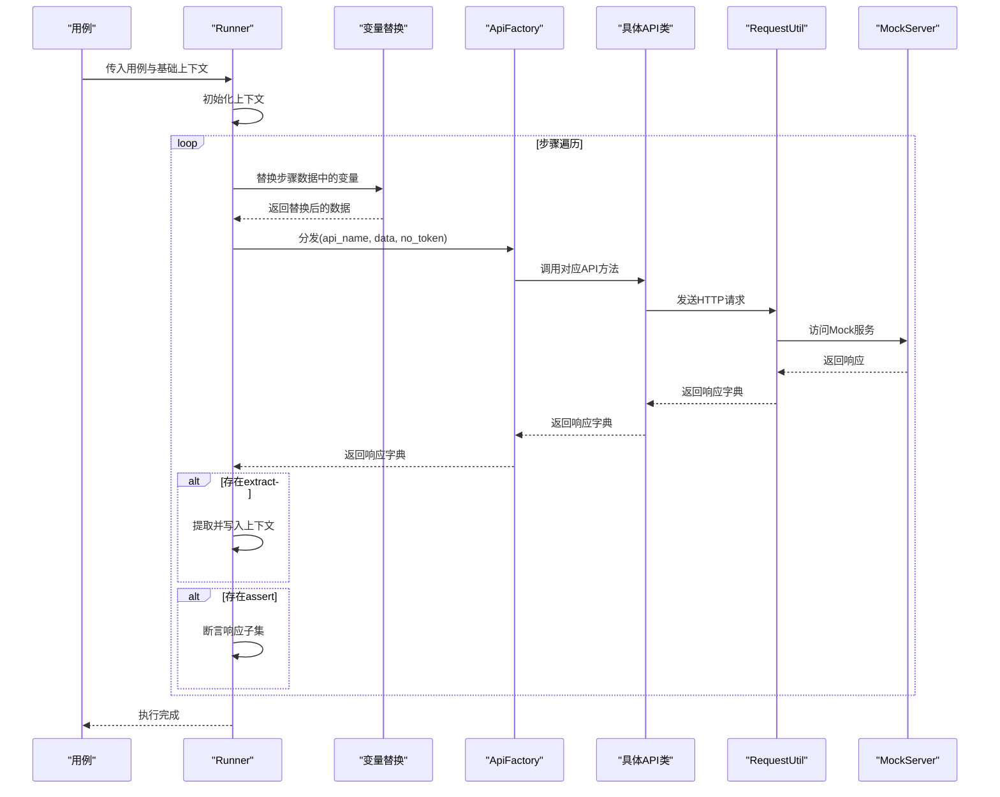
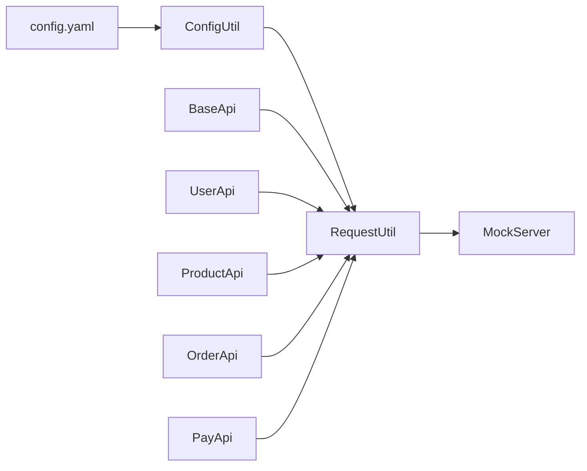
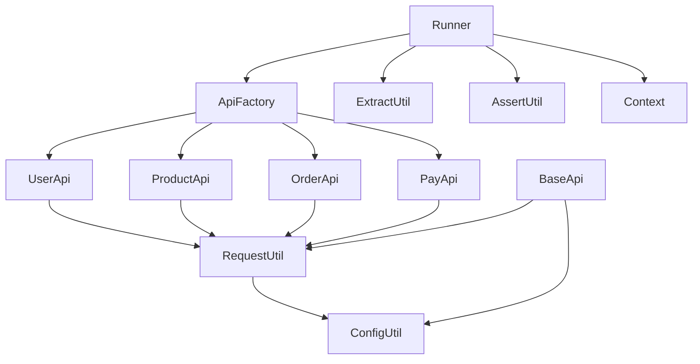

# 核心架构

<cite>
**本文引用的文件**
- [api/base_api.py](file://api/base_api.py)
- [common/api_factory.py](file://common/api_factory.py)
- [common/runner.py](file://common/runner.py)
- [config/config.yaml](file://config/config.yaml)
- [config/config_util.py](file://config/config_util.py)
- [mock_server.py](file://mock_server.py)
- [api/order_api.py](file://api/order_api.py)
- [api/pay_api.py](file://api/pay_api.py)
- [api/product_api.py](file://api/product_api.py)
- [api/user_api.py](file://api/user_api.py)
- [common/context.py](file://common/context.py)
- [common/assert_util.py](file://common/assert_util.py)
- [common/extract_util.py](file://common/extract_util.py)
- [common/request_util.py](file://common/request_util.py)
- [testcase/test_flow.py](file://testcase/test_flow.py)
</cite>

## 目录
1. [引言](#引言)
2. [项目结构](#项目结构)
3. [核心组件](#核心组件)
4. [架构总览](#架构总览)
5. [详细组件分析](#详细组件分析)
6. [依赖分析](#依赖分析)
7. [性能考虑](#性能考虑)
8. [故障排查指南](#故障排查指南)
9. [结论](#结论)
10. [附录](#附录)

## 引言
本文件面向API自动化测试框架的核心架构文档，系统阐述整体设计、设计模式的应用与模块间关系。重点解析：
- 工厂模式在API分发中的应用：通过统一入口根据步骤名选择具体API实现。
- 模板方法模式在基础API类中的体现：由基类定义通用请求封装与URL拼接，子类仅实现业务参数映射。
- 测试执行引擎的工作原理：从YAML用例加载、步骤替换、API调用、提取变量到断言的完整流水线。

同时，文档说明各层职责划分（API层、工具层、配置管理、Mock服务），并提供架构图、组件交互流程与时序图，帮助开发者快速理解框架设计与扩展点。

## 项目结构
项目采用按功能域分层的组织方式：
- api 层：按领域划分的API类，继承自基础类，负责将业务参数映射为HTTP请求。
- common 层：通用工具与执行引擎，包括API分发、请求封装、上下文、断言、变量提取、替换等。
- config 层：集中式配置管理，提供基础URL、数据库路径与默认用户信息。
- mock_server：内置Mock服务，提供用户注册/登录、商品增删改查、订单创建与支付等接口。
- testcase：基于pytest的用例入口，加载YAML用例并驱动执行引擎。

图表来源
- [api/base_api.py:1-11](file://api/base_api.py#L1-L11)
- [api/user_api.py:1-22](file://api/user_api.py#L1-L22)
- [api/product_api.py:1-15](file://api/product_api.py#L1-L15)
- [api/order_api.py:1-15](file://api/order_api.py#L1-L15)
- [api/pay_api.py:1-15](file://api/pay_api.py#L1-L15)
- [common/runner.py:1-45](file://common/runner.py#L1-L45)
- [common/api_factory.py:1-28](file://common/api_factory.py#L1-L28)
- [common/request_util.py:1-66](file://common/request_util.py#L1-L66)
- [common/context.py:1-25](file://common/context.py#L1-L25)
- [common/extract_util.py:1-28](file://common/extract_util.py#L1-L28)
- [common/assert_util.py:1-15](file://common/assert_util.py#L1-L15)
- [config/config.yaml:1-10](file://config/config.yaml#L1-L10)
- [config/config_util.py:1-50](file://config/config_util.py#L1-L50)
- [mock_server.py:1-322](file://mock_server.py#L1-L322)

章节来源
- [api/base_api.py:1-11](file://api/base_api.py#L1-L11)
- [common/runner.py:1-45](file://common/runner.py#L1-L45)
- [common/api_factory.py:1-28](file://common/api_factory.py#L1-L28)
- [common/request_util.py:1-66](file://common/request_util.py#L1-L66)
- [config/config.yaml:1-10](file://config/config.yaml#L1-L10)
- [config/config_util.py:1-50](file://config/config_util.py#L1-L50)
- [mock_server.py:1-322](file://mock_server.py#L1-L322)

## 核心组件
- 基础API类 BaseApi：统一注入请求工具与基础URL，供所有领域API复用。
- 领域API类：UserApi/ProductApi/OrderApi/PayApi，各自封装对应REST端点的请求映射。
- API工厂 ApiFactory：以字符串键映射到具体API方法，实现“名称到实现”的解耦分发。
- 执行引擎 Runner：从用例中逐步执行，完成变量替换、API调用、提取变量、断言校验。
- 请求封装 RequestUtil：统一封装HTTP发送逻辑、鉴权头注入、Allure附件与异常处理。
- 上下文 Context：全局可变状态容器，用于跨步骤传递变量。
- 变量提取 ExtractUtil：支持点号路径提取嵌套字段，写入上下文。
- 断言 AssertUtil：递归断言字典子集，支持嵌套结构。
- 配置 ConfigUtil：集中读取config.yaml，提供基础URL、数据库路径与默认用户。
- Mock服务 MockServer：内置Flask服务，提供用户、商品、订单、支付等接口，配合SQLite存储。

章节来源
- [api/base_api.py:1-11](file://api/base_api.py#L1-L11)
- [api/user_api.py:1-22](file://api/user_api.py#L1-L22)
- [api/product_api.py:1-15](file://api/product_api.py#L1-L15)
- [api/order_api.py:1-15](file://api/order_api.py#L1-L15)
- [api/pay_api.py:1-15](file://api/pay_api.py#L1-L15)
- [common/api_factory.py:1-28](file://common/api_factory.py#L1-L28)
- [common/runner.py:1-45](file://common/runner.py#L1-L45)
- [common/request_util.py:1-66](file://common/request_util.py#L1-L66)
- [common/context.py:1-25](file://common/context.py#L1-L25)
- [common/extract_util.py:1-28](file://common/extract_util.py#L1-L28)
- [common/assert_util.py:1-15](file://common/assert_util.py#L1-L15)
- [config/config_util.py:1-50](file://config/config_util.py#L1-L50)
- [mock_server.py:1-322](file://mock_server.py#L1-L322)

## 架构总览
该框架采用“配置驱动 + 工厂分发 + 执行引擎”的分层架构：
- 配置层：集中管理基础URL、数据库路径与默认用户，支持环境变量覆盖。
- API层：以模板方法模式实现，子类仅负责参数映射，请求细节由基类与请求封装统一处理。
- 工具层：提供API分发、请求发送、上下文、变量提取与断言等通用能力。
- Mock服务：作为后端依赖，提供稳定可控的测试环境，便于离线调试与回归。

图表来源
- [config/config.yaml:1-10](file://config/config.yaml#L1-L10)
- [config/config_util.py:1-50](file://config/config_util.py#L1-L50)
- [api/base_api.py:1-11](file://api/base_api.py#L1-L11)
- [common/request_util.py:1-66](file://common/request_util.py#L1-L66)
- [mock_server.py:1-322](file://mock_server.py#L1-L322)

## 详细组件分析

### 组件一：工厂模式在API分发中的应用
- 设计要点
  - 使用字典注册表维护“步骤名 → API方法”的映射，避免在执行引擎中分散的分支判断。
  - 分发函数接收步骤名、原始数据与是否跳过鉴权标志，统一构造payload并调用目标方法。
  - 通过类型别名约束API函数签名，保证注册项与调用方契约一致。
- 关键流程
  - 执行引擎在每一步骤中调用分发函数，传入步骤名与替换后的数据。
  - 分发函数查找注册表，若未命中则抛出明确错误，确保用例健壮性。
  - 将no_token标志注入payload，交由具体API实现决定是否携带鉴权头。
- 复杂度与扩展性
  - 注册表查找为O(1)，新增API只需在注册表添加一项映射。
  - 与模板方法模式结合，子类无需关心HTTP细节，仅专注参数映射。

图表来源
- [common/api_factory.py:21-28](file://common/api_factory.py#L21-L28)

章节来源
- [common/api_factory.py:1-28](file://common/api_factory.py#L1-L28)

### 组件二：模板方法模式在基础API类中的实现
- 设计要点
  - 基类统一持有请求工具与基础URL，子类仅实现业务方法，将参数映射为HTTP请求。
  - 子类方法签名包含业务参数与no_token标志，便于工厂分发时统一处理。
- 类关系与职责
  - BaseApi：提供请求工具与基础URL，供子类复用。
  - UserApi/ProductApi/OrderApi/PayApi：各自封装对应端点的请求映射。
- 扩展性
  - 新增领域API时，只需继承BaseApi并实现一个方法，即可被工厂识别与执行引擎调用。

图表来源
- [api/base_api.py:1-11](file://api/base_api.py#L1-L11)
- [api/user_api.py:1-22](file://api/user_api.py#L1-L22)
- [api/product_api.py:1-15](file://api/product_api.py#L1-L15)
- [api/order_api.py:1-15](file://api/order_api.py#L1-L15)
- [api/pay_api.py:1-15](file://api/pay_api.py#L1-L15)
- [common/request_util.py:1-66](file://common/request_util.py#L1-L66)

章节来源
- [api/base_api.py:1-11](file://api/base_api.py#L1-L11)
- [api/user_api.py:1-22](file://api/user_api.py#L1-L22)
- [api/product_api.py:1-15](file://api/product_api.py#L1-L15)
- [api/order_api.py:1-15](file://api/order_api.py#L1-L15)
- [api/pay_api.py:1-15](file://api/pay_api.py#L1-L15)
- [common/request_util.py:1-66](file://common/request_util.py#L1-L66)

### 组件三：测试执行引擎工作原理
- 职责划分
  - Runner：从用例中读取步骤序列，逐条执行；负责变量替换、API调用、提取变量与断言。
  - Context：承载跨步骤共享变量，如token、商品ID等。
  - ExtractUtil：支持点号路径提取嵌套字段，写入上下文。
  - AssertUtil：对期望值与实际响应进行递归断言。
- 执行流程
  - 初始化上下文，合并外部传入的基础上下文。
  - 遍历步骤：校验api字段存在性；对data进行变量替换；调用分发函数；根据extract配置提取并写入上下文；根据assert配置进行断言。
  - 若提取到token，更新全局TokenManager，后续请求自动带上鉴权头。

图表来源
- [common/runner.py:15-45](file://common/runner.py#L15-L45)
- [common/api_factory.py:21-28](file://common/api_factory.py#L21-L28)
- [common/extract_util.py:22-28](file://common/extract_util.py#L22-L28)
- [common/assert_util.py:6-15](file://common/assert_util.py#L6-L15)
- [common/request_util.py:27-66](file://common/request_util.py#L27-L66)
- [mock_server.py:132-315](file://mock_server.py#L132-L315)

章节来源
- [common/runner.py:1-45](file://common/runner.py#L1-L45)
- [common/context.py:1-25](file://common/context.py#L1-L25)
- [common/extract_util.py:1-28](file://common/extract_util.py#L1-L28)
- [common/assert_util.py:1-15](file://common/assert_util.py#L1-L15)
- [common/request_util.py:1-66](file://common/request_util.py#L1-L66)
- [mock_server.py:1-322](file://mock_server.py#L1-L322)

### 组件四：配置管理与Mock服务
- 配置管理
  - 通过config.yaml集中管理基础URL、数据库路径与默认用户。
  - config_util提供缓存与环境变量覆盖机制，get_base_url优先使用环境变量。
- Mock服务
  - 内置Flask应用，提供用户注册/登录、商品增删改查、订单创建与支付等接口。
  - 使用SQLite存储，启动时初始化数据库并填充演示数据。
  - 登录成功返回token，后续请求需在Header中携带Authorization: Bearer <token>。

图表来源
- [config/config.yaml:1-10](file://config/config.yaml#L1-L10)
- [config/config_util.py:27-31](file://config/config_util.py#L27-L31)
- [common/request_util.py:14-16](file://common/request_util.py#L14-L16)
- [mock_server.py:132-315](file://mock_server.py#L132-L315)
- [api/base_api.py:8-10](file://api/base_api.py#L8-L10)

章节来源
- [config/config.yaml:1-10](file://config/config.yaml#L1-L10)
- [config/config_util.py:1-50](file://config/config_util.py#L1-L50)
- [mock_server.py:1-322](file://mock_server.py#L1-L322)

## 依赖分析
- 组件内聚与耦合
  - API层高度内聚于业务语义，通过BaseApi与RequestUtil解耦HTTP细节。
  - 工具层提供横切能力，Runner与ApiFactory分别承担执行与分发职责，彼此低耦合。
  - 配置层与工具层弱耦合，仅通过函数调用访问，便于替换实现。
- 外部依赖
  - requests用于HTTP请求，Flask用于Mock服务，yaml用于配置解析。
- 循环依赖
  - 未发现循环导入；API层依赖工具层，工具层不反向依赖API层。

图表来源
- [common/runner.py:1-45](file://common/runner.py#L1-L45)
- [common/api_factory.py:1-28](file://common/api_factory.py#L1-L28)
- [common/extract_util.py:1-28](file://common/extract_util.py#L1-L28)
- [common/assert_util.py:1-15](file://common/assert_util.py#L1-L15)
- [common/request_util.py:1-66](file://common/request_util.py#L1-L66)
- [api/base_api.py:1-11](file://api/base_api.py#L1-L11)
- [config/config_util.py:1-50](file://config/config_util.py#L1-L50)

章节来源
- [common/runner.py:1-45](file://common/runner.py#L1-L45)
- [common/api_factory.py:1-28](file://common/api_factory.py#L1-L28)
- [common/request_util.py:1-66](file://common/request_util.py#L1-L66)
- [api/base_api.py:1-11](file://api/base_api.py#L1-L11)
- [config/config_util.py:1-50](file://config/config_util.py#L1-L50)

## 性能考虑
- 请求会话复用：RequestUtil使用requests.Session，减少TCP握手开销。
- 超时控制：统一设置超时，避免阻塞影响整体执行。
- 配置缓存：ConfigUtil对配置文件进行内存缓存，降低重复IO。
- 数据库连接：Mock服务使用SQLite，启动时一次性初始化，运行期按需连接。
- 建议
  - 对长链路场景可考虑增加重试与指数退避策略。
  - 在高并发用例中，建议拆分测试集并并行执行，注意上下文隔离。

## 故障排查指南
- 常见问题与定位
  - 未知步骤名：检查用例步骤名是否与注册表一致，或是否拼写错误。
  - 缺失api字段：Runner会在步骤缺失时抛出明确错误，检查用例格式。
  - 鉴权失败：确认登录步骤已执行并成功提取token，后续步骤no_token是否误设。
  - 断言失败：核对期望值与响应结构，利用点号路径定位嵌套字段。
- 日志与附件
  - RequestUtil在发送请求与接收响应时自动附加Allure附件，便于回溯。
- Mock服务
  - 启动失败：检查端口占用与数据库路径权限；确保初始化脚本正确执行。
  - 订单库存不足：Mock服务在插入订单前检查库存，不足时返回冲突状态码。

章节来源
- [common/runner.py:22-28](file://common/runner.py#L22-L28)
- [common/assert_util.py:6-15](file://common/assert_util.py#L6-L15)
- [common/request_util.py:40-58](file://common/request_util.py#L40-L58)
- [mock_server.py:270-286](file://mock_server.py#L270-L286)

## 结论
该框架通过清晰的分层与设计模式实现了高内聚、低耦合的API自动化测试体系：
- 工厂模式使API分发解耦，易于扩展新接口。
- 模板方法模式让API实现专注于业务参数映射，提升一致性与可维护性。
- 执行引擎串联变量替换、API调用、提取与断言，形成闭环的测试流水线。
- 配置与Mock服务提供稳定的基础设施，便于离线与回归测试。

## 附录
- 用例加载与执行入口
  - testcase/test_flow.py通过pytest参数化加载YAML用例，并调用Runner执行。
- 配置文件示例
  - config/config.yaml包含基础URL、数据库路径与默认用户信息。

章节来源
- [testcase/test_flow.py:1-17](file://testcase/test_flow.py#L1-L17)
- [config/config.yaml:1-10](file://config/config.yaml#L1-L10)