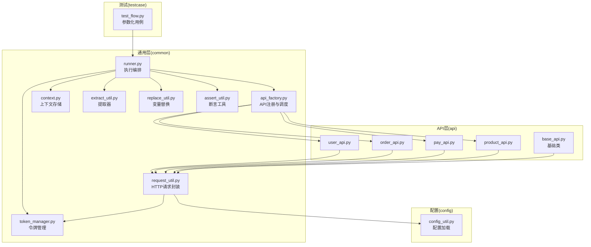
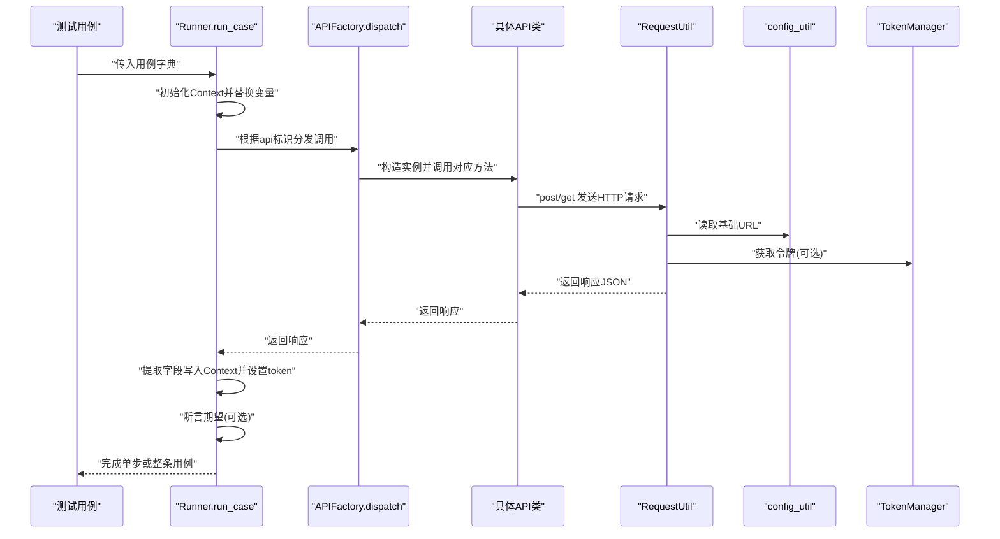
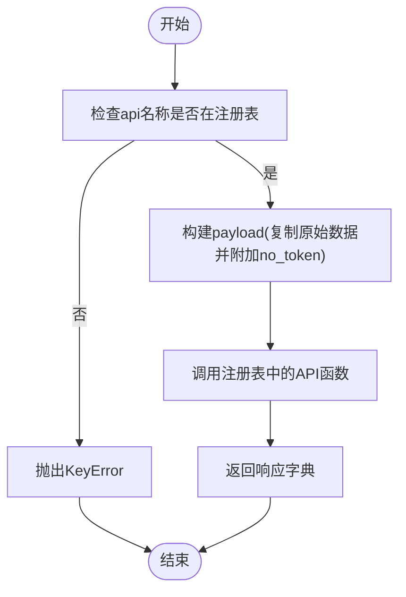
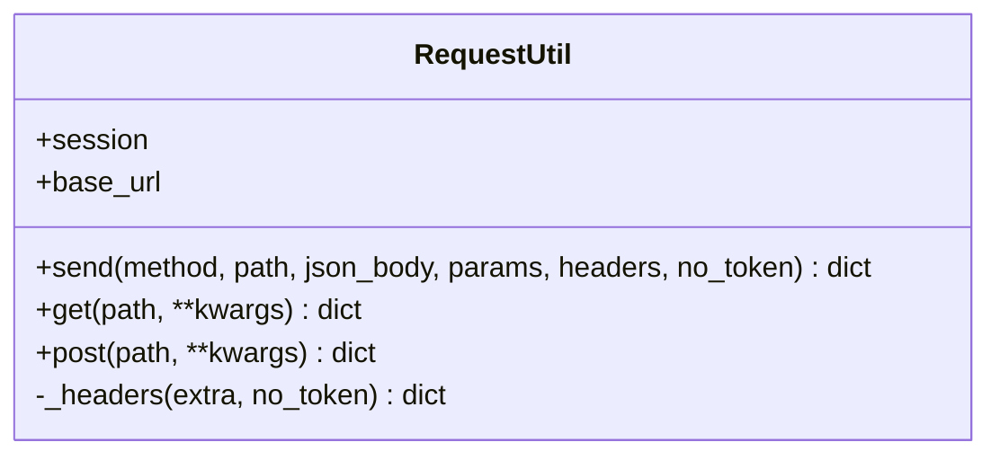
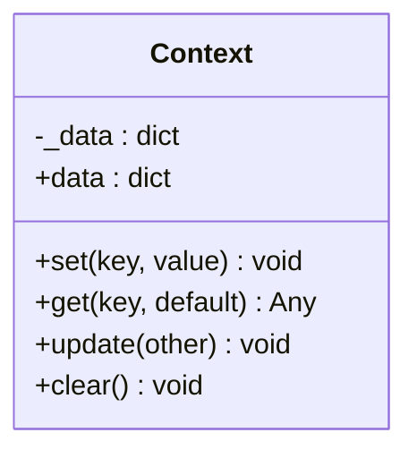
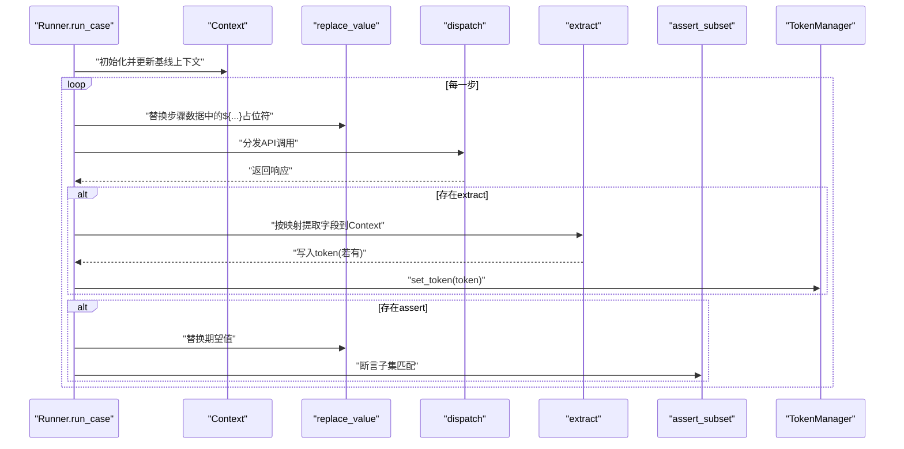
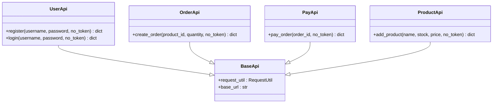
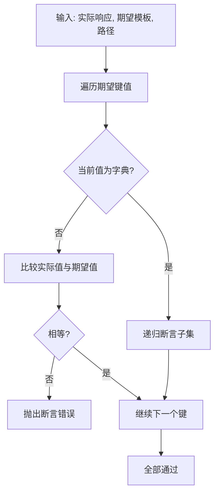
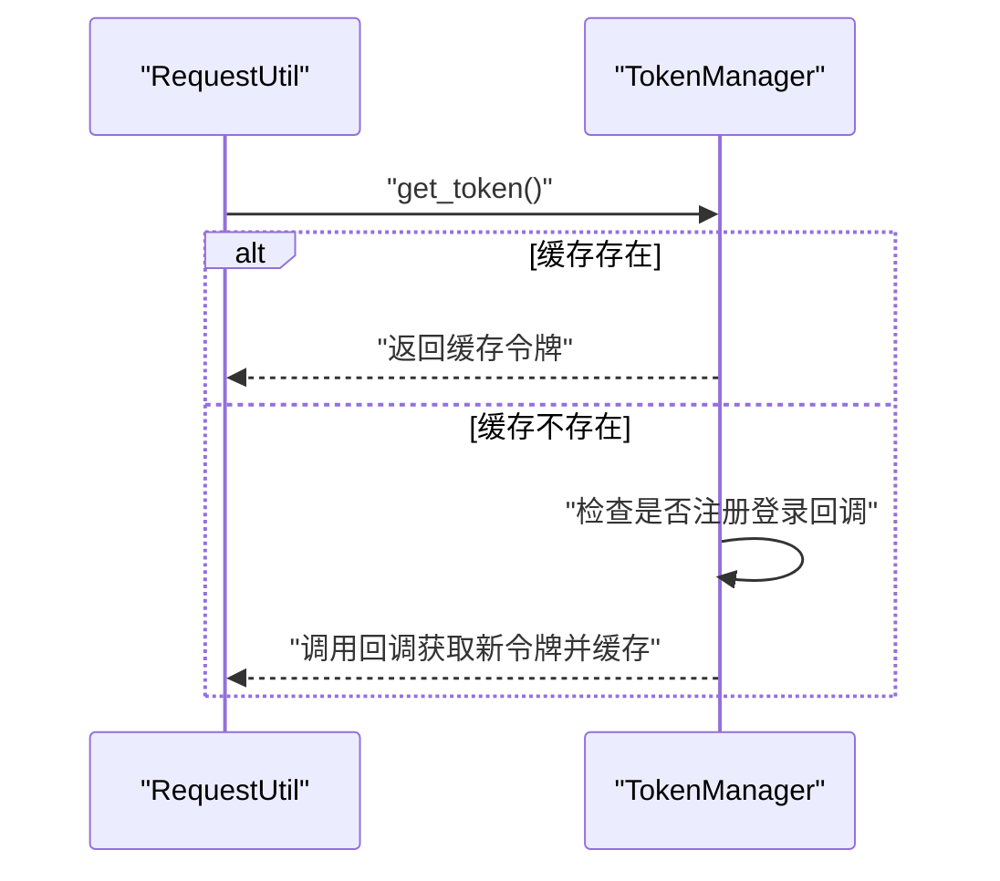
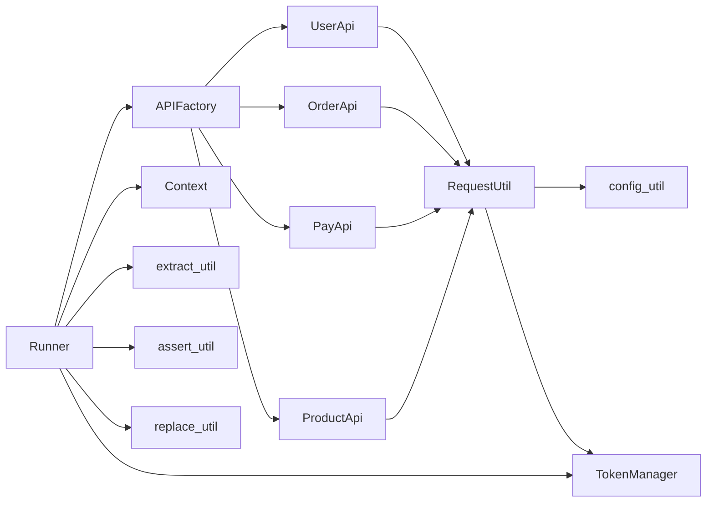

# 组件交互机制

<cite>
**本文引用的文件**
- [common/api_factory.py](file://common/api_factory.py)
- [common/request_util.py](file://common/request_util.py)
- [common/context.py](file://common/context.py)
- [common/runner.py](file://common/runner.py)
- [api/base_api.py](file://api/base_api.py)
- [api/user_api.py](file://api/user_api.py)
- [api/order_api.py](file://api/order_api.py)
- [api/pay_api.py](file://api/pay_api.py)
- [api/product_api.py](file://api/product_api.py)
- [common/assert_util.py](file://common/assert_util.py)
- [common/extract_util.py](file://common/extract_util.py)
- [common/replace_util.py](file://common/replace_util.py)
- [common/token_manager.py](file://common/token_manager.py)
- [config/config_util.py](file://config/config_util.py)
- [testcase/test_flow.py](file://testcase/test_flow.py)
</cite>

## 目录
1. [引言](#引言)
2. [项目结构](#项目结构)
3. [核心组件](#核心组件)
4. [架构总览](#架构总览)
5. [详细组件分析](#详细组件分析)
6. [依赖分析](#依赖分析)
7. [性能考虑](#性能考虑)
8. [故障排查指南](#故障排查指南)
9. [结论](#结论)
10. [附录](#附录)

## 引言
本文件聚焦于API自动化测试框架的“组件交互机制”，系统性阐述以下关键点：
- 各组件之间的通信方式、数据传递与控制流；
- APIFactory如何以注册表模式协调不同API模块的调用；
- RequestUtil如何封装HTTP请求与响应，并统一注入鉴权头；
- Context如何在步骤间传递上下文状态；
- Runner如何驱动测试执行流程，串联替换、提取、断言与令牌更新；
- 异常处理策略与错误传播路径；
- 通过接口抽象与依赖注入实现的模块解耦设计。

## 项目结构
该框架采用按职责分层的组织方式：通用工具（common）负责运行时编排、上下文、请求、断言、变量替换、令牌管理；API模块（api）封装具体业务接口；配置（config）提供环境化配置加载；测试入口（testcase）以YAML驱动用例执行。

图表来源
- [common/runner.py:15-45](file://common/runner.py#L15-L45)
- [common/api_factory.py:21-28](file://common/api_factory.py#L21-L28)
- [common/request_util.py:13-66](file://common/request_util.py#L13-L66)
- [common/context.py:6-25](file://common/context.py#L6-L25)
- [common/extract_util.py:22-28](file://common/extract_util.py#L22-L28)
- [common/replace_util.py:22-32](file://common/replace_util.py#L22-L32)
- [common/assert_util.py:6-15](file://common/assert_util.py#L6-L15)
- [common/token_manager.py:8-38](file://common/token_manager.py#L8-L38)
- [api/base_api.py:7-11](file://api/base_api.py#L7-L11)
- [api/user_api.py:8-22](file://api/user_api.py#L8-L22)
- [api/order_api.py:8-15](file://api/order_api.py#L8-L15)
- [api/pay_api.py:8-15](file://api/pay_api.py#L8-L15)
- [api/product_api.py:8-15](file://api/product_api.py#L8-L15)
- [config/config_util.py:64-68](file://config/config_util.py#L64-L68)
- [testcase/test_flow.py:14-17](file://testcase/test_flow.py#L14-L17)

章节来源
- [common/runner.py:15-45](file://common/runner.py#L15-L45)
- [common/api_factory.py:21-28](file://common/api_factory.py#L21-L28)
- [common/request_util.py:13-66](file://common/request_util.py#L13-L66)
- [common/context.py:6-25](file://common/context.py#L6-L25)
- [common/extract_util.py:22-28](file://common/extract_util.py#L22-L28)
- [common/replace_util.py:22-32](file://common/replace_util.py#L22-L32)
- [common/assert_util.py:6-15](file://common/assert_util.py#L6-L15)
- [common/token_manager.py:8-38](file://common/token_manager.py#L8-L38)
- [api/base_api.py:7-11](file://api/base_api.py#L7-L11)
- [api/user_api.py:8-22](file://api/user_api.py#L8-L22)
- [api/order_api.py:8-15](file://api/order_api.py#L8-L15)
- [api/pay_api.py:8-15](file://api/pay_api.py#L8-L15)
- [api/product_api.py:8-15](file://api/product_api.py#L8-L15)
- [config/config_util.py:64-68](file://config/config_util.py#L64-L68)
- [testcase/test_flow.py:14-17](file://testcase/test_flow.py#L14-L17)

## 核心组件
- APIFactory（注册表+分发器）
  - 通过注册表映射字符串标识到具体API方法，统一由分发函数进行调用，屏蔽具体API类差异。
- RequestUtil（HTTP客户端）
  - 封装会话、URL拼接、鉴权头注入、请求/响应日志与异常处理。
- Context（上下文容器）
  - 提供键值存储、批量更新、清空与只读视图，支撑跨步骤状态传递。
- Runner（执行编排）
  - 解析用例、逐步替换变量、调用APIFactory、提取结果、设置令牌、断言期望。
- API模块（用户、订单、支付、商品）
  - 基于BaseApi，使用RequestUtil发起HTTP请求，返回JSON响应。
- 工具集（断言、提取、变量替换）
  - 断言子集匹配、从响应中提取字段写入Context、对数据结构中的占位符进行替换。
- TokenManager（令牌管理）
  - 线程安全的令牌缓存与登录回调注册，支持自动拉取最新令牌。
- 配置工具（config_util）
  - 支持多环境配置合并、环境变量覆盖、基础URL等配置项读取。

章节来源
- [common/api_factory.py:10-28](file://common/api_factory.py#L10-L28)
- [common/request_util.py:13-66](file://common/request_util.py#L13-L66)
- [common/context.py:6-25](file://common/context.py#L6-L25)
- [common/runner.py:15-45](file://common/runner.py#L15-L45)
- [api/base_api.py:7-11](file://api/base_api.py#L7-L11)
- [api/user_api.py:8-22](file://api/user_api.py#L8-L22)
- [api/order_api.py:8-15](file://api/order_api.py#L8-L15)
- [api/pay_api.py:8-15](file://api/pay_api.py#L8-L15)
- [api/product_api.py:8-15](file://api/product_api.py#L8-L15)
- [common/assert_util.py:6-15](file://common/assert_util.py#L6-L15)
- [common/extract_util.py:22-28](file://common/extract_util.py#L22-L28)
- [common/replace_util.py:22-32](file://common/replace_util.py#L22-L32)
- [common/token_manager.py:8-38](file://common/token_manager.py#L8-L38)
- [config/config_util.py:64-68](file://config/config_util.py#L64-L68)

## 架构总览
下图展示一次典型API调用的端到端交互：Runner解析步骤，Runner调用APIFactory，APIFactory分发到具体API类，API类委托RequestUtil发送HTTP请求，RequestUtil读取配置与令牌，最终返回响应并被Runner用于提取与断言。

图表来源
- [common/runner.py:15-45](file://common/runner.py#L15-L45)
- [common/api_factory.py:21-28](file://common/api_factory.py#L21-L28)
- [api/user_api.py:9-21](file://api/user_api.py#L9-L21)
- [api/order_api.py:9-14](file://api/order_api.py#L9-L14)
- [api/pay_api.py:9-14](file://api/pay_api.py#L9-L14)
- [api/product_api.py:9-14](file://api/product_api.py#L9-L14)
- [common/request_util.py:27-58](file://common/request_util.py#L27-L58)
- [config/config_util.py:64-68](file://config/config_util.py#L64-L68)
- [common/token_manager.py:28-37](file://common/token_manager.py#L28-L37)

## 详细组件分析

### APIFactory：注册表与分发
- 设计要点
  - 使用类型别名定义API函数签名，便于统一注册与调用。
  - 注册表以字符串标识映射到lambda，延迟绑定具体API类实例与方法。
  - 分发函数统一接收数据与no_token标志，向目标API方法传递。
- 数据与控制流
  - 输入：api名称、原始数据、是否跳过令牌标志。
  - 输出：API方法返回的响应字典。
  - 错误：未知api名称抛出KeyError。
- 解耦策略
  - Runner仅依赖字符串标识与分发接口，不关心具体实现类。
  - 新增API只需扩展注册表与对应类，无需修改Runner。

图表来源
- [common/api_factory.py:21-28](file://common/api_factory.py#L21-L28)

章节来源
- [common/api_factory.py:10-28](file://common/api_factory.py#L10-L28)

### RequestUtil：HTTP请求封装
- 设计要点
  - 维护会话与基础URL，支持GET/POST便捷方法与通用send方法。
  - 自动注入Content-Type与Authorization头（可选），支持自定义额外头。
  - 请求/响应通过Allure附件记录，便于测试报告可视化。
  - 对非JSON响应做降级处理，统一返回字典结构。
- 数据与控制流
  - 输入：方法、路径、JSON体、查询参数、头部、是否跳过令牌。
  - 输出：响应JSON字典。
  - 异常：底层HTTP错误通过raise_for_status传播。
- 性能与可靠性
  - 复用Session减少连接开销。
  - 超时固定，便于统一控制。

图表来源
- [common/request_util.py:13-66](file://common/request_util.py#L13-L66)

章节来源
- [common/request_util.py:13-66](file://common/request_util.py#L13-L66)
- [config/config_util.py:64-68](file://config/config_util.py#L64-L68)
- [common/token_manager.py:28-37](file://common/token_manager.py#L28-L37)

### Context：上下文状态管理
- 设计要点
  - 提供set/get/update/clear/data等操作，支持任意类型值。
  - 作为Runner与提取器/断言之间的共享状态容器。
- 数据与控制流
  - Runner在每步执行前创建Context，合并基线上下文。
  - 提取器将响应字段写入Context；当出现token时通知TokenManager。
  - 变量替换器在遍历数据结构时从Context读取值。

图表来源
- [common/context.py:6-25](file://common/context.py#L6-L25)

章节来源
- [common/context.py:6-25](file://common/context.py#L6-L25)
- [common/extract_util.py:22-28](file://common/extract_util.py#L22-L28)
- [common/replace_util.py:22-32](file://common/replace_util.py#L22-L32)
- [common/token_manager.py:18-20](file://common/token_manager.py#L18-L20)

### Runner：测试执行编排
- 设计要点
  - 以用例为单位，逐步执行；支持步骤内变量替换、提取、断言与令牌设置。
  - 步骤必须包含api字段；支持no_token标志影响后续请求。
- 数据与控制流
  - 输入：用例字典（含name与steps）、可选基线上下文。
  - 处理：每步替换变量、分发API、提取字段、设置token、断言。
  - 异常：缺少api字段抛出ValueError；提取映射非字典型态抛出TypeError。
- 执行模型
  - 串行顺序执行，每步独立的Allure步骤块，便于定位问题。

图表来源
- [common/runner.py:15-45](file://common/runner.py#L15-L45)
- [common/replace_util.py:22-32](file://common/replace_util.py#L22-L32)
- [common/api_factory.py:21-28](file://common/api_factory.py#L21-L28)
- [common/extract_util.py:22-28](file://common/extract_util.py#L22-L28)
- [common/assert_util.py:6-15](file://common/assert_util.py#L6-L15)
- [common/token_manager.py:18-20](file://common/token_manager.py#L18-L20)

章节来源
- [common/runner.py:15-45](file://common/runner.py#L15-L45)

### API模块：面向对象封装
- 设计要点
  - 所有API类继承BaseApi，复用RequestUtil与基础URL。
  - 每个API方法负责指定端点与请求体，返回响应字典。
- 关系映射
  - 用户：注册/登录
  - 订单：创建订单
  - 支付：支付订单
  - 商品：新增商品

图表来源
- [api/base_api.py:7-11](file://api/base_api.py#L7-L11)
- [api/user_api.py:8-22](file://api/user_api.py#L8-L22)
- [api/order_api.py:8-15](file://api/order_api.py#L8-L15)
- [api/pay_api.py:8-15](file://api/pay_api.py#L8-L15)
- [api/product_api.py:8-15](file://api/product_api.py#L8-L15)

章节来源
- [api/base_api.py:7-11](file://api/base_api.py#L7-L11)
- [api/user_api.py:8-22](file://api/user_api.py#L8-L22)
- [api/order_api.py:8-15](file://api/order_api.py#L8-L15)
- [api/pay_api.py:8-15](file://api/pay_api.py#L8-L15)
- [api/product_api.py:8-15](file://api/product_api.py#L8-L15)

### 工具集：断言、提取、变量替换
- 断言工具
  - 递归断言期望子集，支持嵌套字典与键缺失检测。
- 提取工具
  - 支持“a.b.c”式路径提取，将结果写入Context。
- 变量替换
  - 递归扫描字符串/字典/列表，将"${key}"替换为Context中的值。

图表来源
- [common/assert_util.py:6-15](file://common/assert_util.py#L6-L15)

章节来源
- [common/assert_util.py:6-15](file://common/assert_util.py#L6-L15)
- [common/extract_util.py:8-28](file://common/extract_util.py#L8-L28)
- [common/replace_util.py:11-32](file://common/replace_util.py#L11-L32)

### TokenManager：令牌生命周期管理
- 设计要点
  - 线程安全的令牌缓存与锁保护。
  - 支持注册登录回调以自动拉取最新令牌。
  - 当未缓存且未注册回调时，抛出运行时错误。
- 与RequestUtil协作
  - RequestUtil在生成请求头时调用TokenManager.get_token。
  - Runner在提取到token后调用TokenManager.set_token。

图表来源
- [common/request_util.py:18-25](file://common/request_util.py#L18-L25)
- [common/token_manager.py:28-37](file://common/token_manager.py#L28-L37)

章节来源
- [common/token_manager.py:8-38](file://common/token_manager.py#L8-L38)
- [common/request_util.py:18-25](file://common/request_util.py#L18-L25)

## 依赖分析
- 组件耦合度
  - Runner对APIFactory、Context、提取器、断言器、变量替换器、TokenManager均有直接依赖，但均通过简单接口与类型约定解耦。
  - APIFactory与具体API类之间通过字符串标识解耦，新增API仅需扩展注册表。
  - RequestUtil与配置、令牌管理通过工具模块解耦，便于替换实现。
- 外部依赖
  - requests会话、allure附件、yaml与dotenv加载。
- 循环依赖
  - 未发现循环导入；APIFactory与API类之间为单向依赖。

图表来源
- [common/runner.py:7-12](file://common/runner.py#L7-L12)
- [common/api_factory.py:5-18](file://common/api_factory.py#L5-L18)
- [api/user_api.py:5-5](file://api/user_api.py#L5-L5)
- [api/order_api.py:5-5](file://api/order_api.py#L5-L5)
- [api/pay_api.py:5-5](file://api/pay_api.py#L5-L5)
- [api/product_api.py:5-5](file://api/product_api.py#L5-L5)
- [common/request_util.py:9-10](file://common/request_util.py#L9-L10)
- [config/config_util.py:64-68](file://config/config_util.py#L64-L68)
- [common/token_manager.py:8-38](file://common/token_manager.py#L8-L38)

章节来源
- [common/runner.py:7-12](file://common/runner.py#L7-L12)
- [common/api_factory.py:5-18](file://common/api_factory.py#L5-L18)
- [common/request_util.py:9-10](file://common/request_util.py#L9-L10)
- [config/config_util.py:64-68](file://config/config_util.py#L64-L68)
- [common/token_manager.py:8-38](file://common/token_manager.py#L8-L38)

## 性能考虑
- 连接复用：RequestUtil使用requests.Session，减少TCP/TLS握手开销。
- 超时与重试：配置工具提供超时与重试参数读取能力，可在RequestUtil扩展中应用。
- 日志与附件：Allure附件会增加内存与I/O开销，建议在调试阶段启用，生产执行可关闭。
- 上下文访问：Context为纯内存字典，读写复杂度O(1)，提取器路径解析为线性遍历，总体开销低。

## 故障排查指南
- 未知API步骤
  - 现象：分发阶段抛出KeyError。
  - 排查：确认步骤api字段与注册表键一致。
  - 参考
    - [common/api_factory.py:22-23](file://common/api_factory.py#L22-L23)
- 步骤缺少api字段
  - 现象：Runner抛出ValueError。
  - 排查：检查用例steps中每个step是否包含api键。
  - 参考
    - [common/runner.py:24-25](file://common/runner.py#L24-L25)
- 提取映射格式错误
  - 现象：Runner抛出TypeError。
  - 排查：确认extract为字典类型。
  - 参考
    - [common/runner.py:35-36](file://common/runner.py#L35-L36)
- 变量替换缺失上下文键
  - 现象：变量替换抛出KeyError。
  - 排查：确认Context中已写入所需键值。
  - 参考
    - [common/replace_util.py:16-17](file://common/replace_util.py#L16-L17)
- 令牌未就绪
  - 现象：TokenManager抛出RuntimeError。
  - 排查：确保已注册登录回调或手动设置token。
  - 参考
    - [common/token_manager.py:32-33](file://common/token_manager.py#L32-L33)
- HTTP错误
  - 现象：raise_for_status触发异常。
  - 排查：查看Allure响应附件与服务端日志。
  - 参考
    - [common/request_util.py:57-57](file://common/request_util.py#L57-L57)

章节来源
- [common/api_factory.py:22-23](file://common/api_factory.py#L22-L23)
- [common/runner.py:24-25](file://common/runner.py#L24-L25)
- [common/runner.py:35-36](file://common/runner.py#L35-L36)
- [common/replace_util.py:16-17](file://common/replace_util.py#L16-L17)
- [common/token_manager.py:32-33](file://common/token_manager.py#L32-L33)
- [common/request_util.py:57-57](file://common/request_util.py#L57-L57)

## 结论
该框架通过“注册表+分发器”的APIFactory实现模块解耦，结合RequestUtil的统一HTTP封装、Context的状态传递、Runner的有序编排，形成清晰的组件交互链路。工具类（断言、提取、变量替换、令牌管理）进一步增强了可维护性与可扩展性。整体设计遵循高内聚、低耦合原则，便于新增API与扩展功能。

## 附录
- 测试入口示例
  - 通过参数化加载YAML用例并交由Runner执行。
  - 参考
    - [testcase/test_flow.py:14-17](file://testcase/test_flow.py#L14-L17)