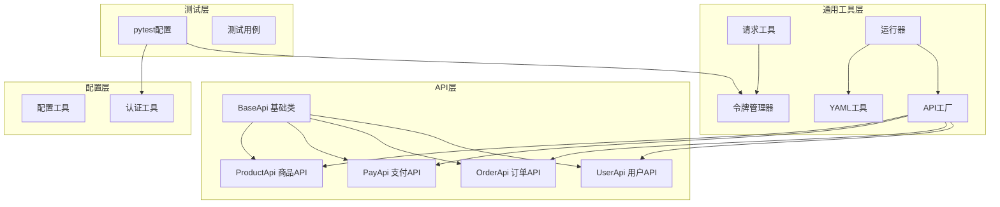
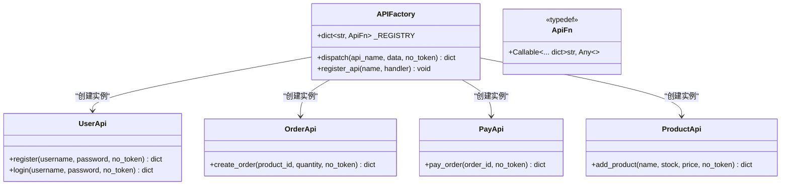
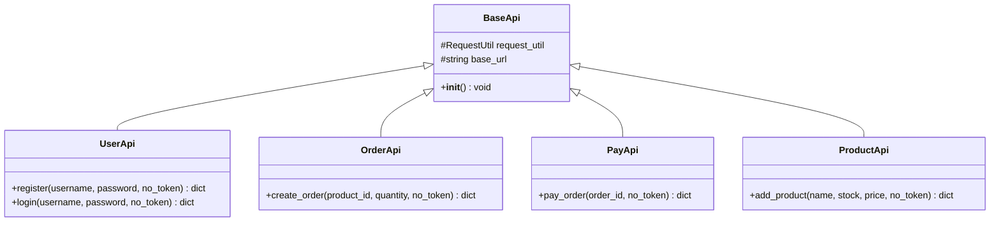
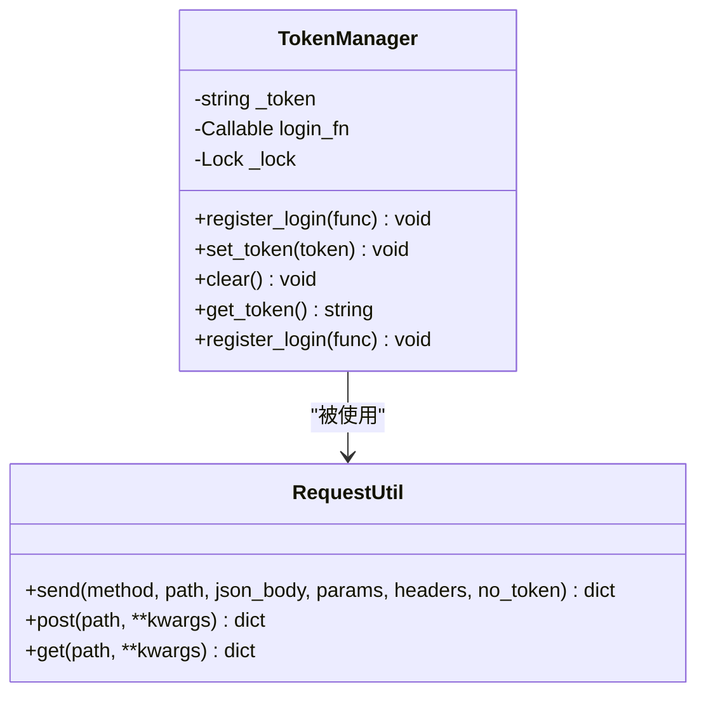
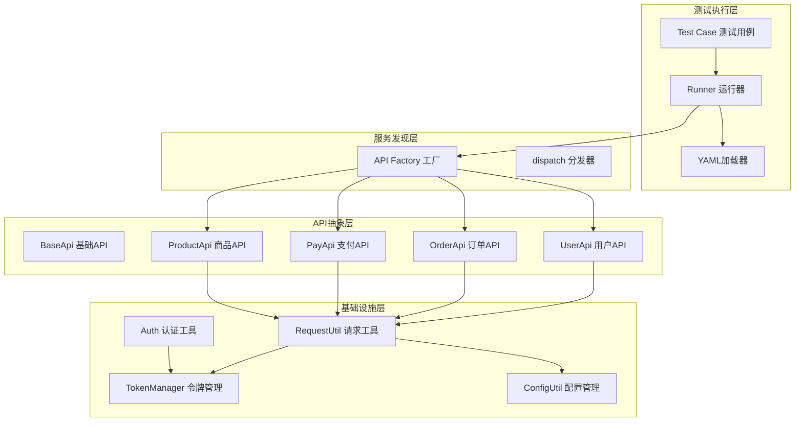
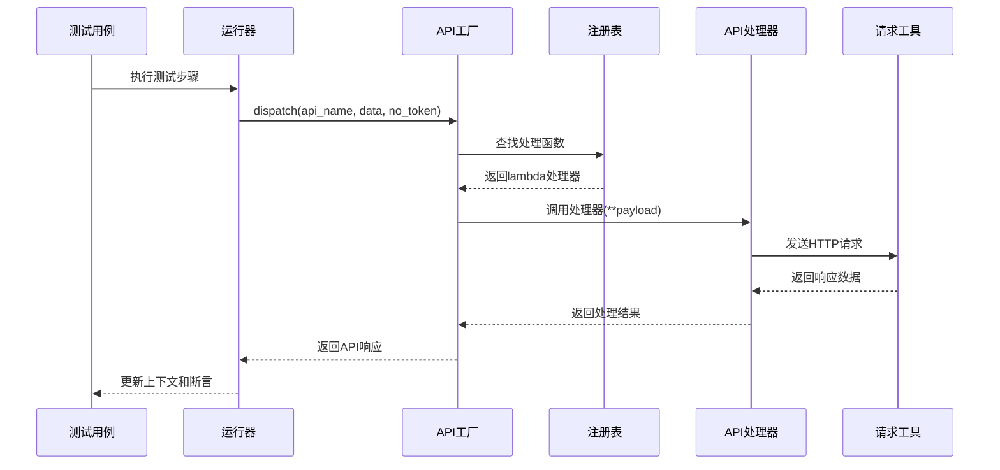
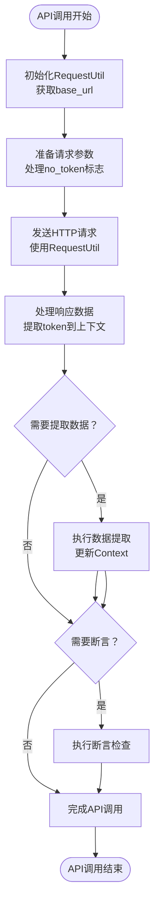
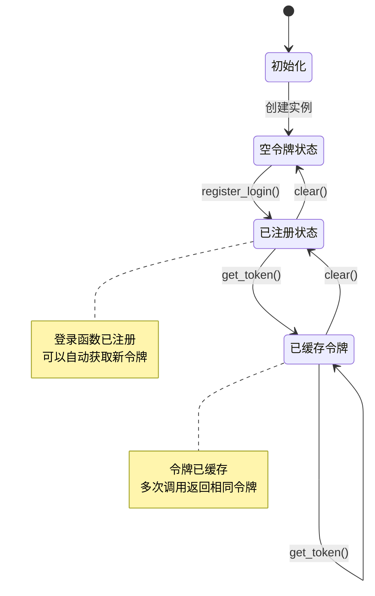
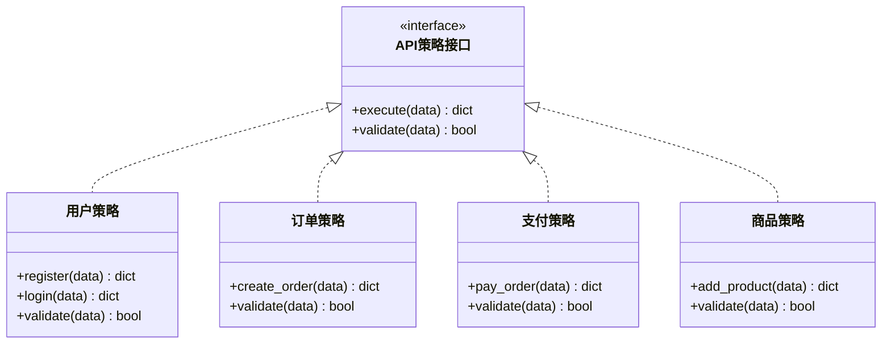
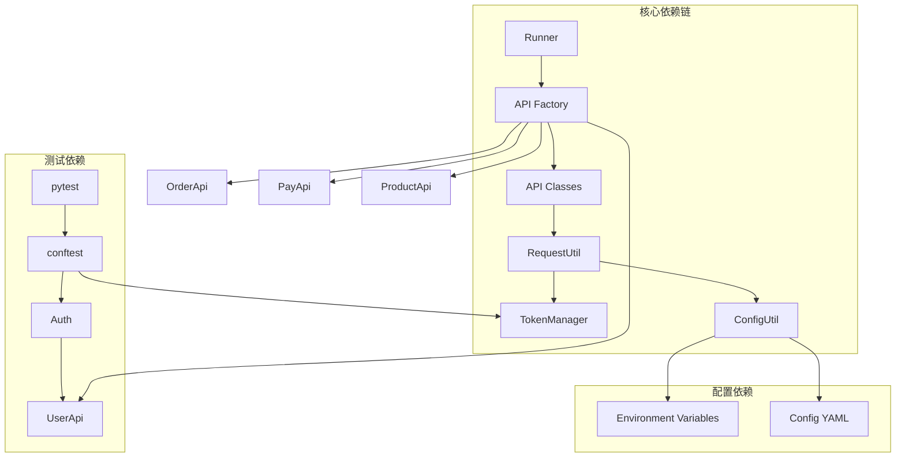

# 设计模式应用

<cite>
**本文档引用的文件**
- [api/base_api.py](file://api/base_api.py)
- [common/api_factory.py](file://common/api_factory.py)
- [common/token_manager.py](file://common/token_manager.py)
- [api/order_api.py](file://api/order_api.py)
- [api/pay_api.py](file://api/pay_api.py)
- [api/product_api.py](file://api/product_api.py)
- [api/user_api.py](file://api/user_api.py)
- [common/request_util.py](file://common/request_util.py)
- [common/runner.py](file://common/runner.py)
- [common/yaml_util.py](file://common/yaml_util.py)
- [config/config_util.py](file://config/config_util.py)
- [common/auth.py](file://common/auth.py)
- [conftest.py](file://conftest.py)
- [testcase/test_flow.py](file://testcase/test_flow.py)
</cite>

## 目录
1. [引言](#引言)
2. [项目结构](#项目结构)
3. [核心组件](#核心组件)
4. [架构概览](#架构概览)
5. [详细组件分析](#详细组件分析)
6. [依赖分析](#依赖分析)
7. [性能考虑](#性能考虑)
8. [故障排除指南](#故障排除指南)
9. [结论](#结论)

## 引言

本文件深入分析API自动化测试框架中设计模式的应用，重点涵盖工厂模式、模板方法模式、单例模式和策略模式。这些设计模式协同工作，构建了一个高度可维护、可扩展且可复用的API测试框架。通过具体代码示例和使用场景分析，展示这些模式如何提升代码质量并简化测试流程。

## 项目结构

框架采用模块化设计，按照功能层次组织代码结构：

**图表来源**
- [api/base_api.py:1-11](file://api/base_api.py#L1-L11)
- [common/api_factory.py:1-28](file://common/api_factory.py#L1-L28)
- [common/token_manager.py:1-38](file://common/token_manager.py#L1-L38)

**章节来源**
- [api/base_api.py:1-11](file://api/base_api.py#L1-L11)
- [common/api_factory.py:1-28](file://common/api_factory.py#L1-L28)
- [common/token_manager.py:1-38](file://common/token_manager.py#L1-L38)

## 核心组件

### 工厂模式组件

API工厂模式实现了动态API方法分发，通过注册表机制管理所有可用的API操作：

**图表来源**
- [common/api_factory.py:10-28](file://common/api_factory.py#L10-L28)
- [api/user_api.py:8-22](file://api/user_api.py#L8-L22)
- [api/order_api.py:8-15](file://api/order_api.py#L8-L15)
- [api/pay_api.py:8-15](file://api/pay_api.py#L8-L15)
- [api/product_api.py:8-15](file://api/product_api.py#L8-L15)

### 模板方法模式组件

基础API类定义了统一的API调用模板，子类只需实现特定的业务逻辑：

**图表来源**
- [api/base_api.py:7-11](file://api/base_api.py#L7-L11)
- [api/user_api.py:8-22](file://api/user_api.py#L8-L22)
- [api/order_api.py:8-15](file://api/order_api.py#L8-L15)
- [api/pay_api.py:8-15](file://api/pay_api.py#L8-L15)
- [api/product_api.py:8-15](file://api/product_api.py#L8-L15)

### 单例模式组件

令牌管理器使用类方法实现线程安全的单例模式：

**图表来源**
- [common/token_manager.py:8-38](file://common/token_manager.py#L8-L38)
- [common/request_util.py:13-66](file://common/request_util.py#L13-L66)

**章节来源**
- [common/api_factory.py:1-28](file://common/api_factory.py#L1-L28)
- [api/base_api.py:1-11](file://api/base_api.py#L1-L11)
- [common/token_manager.py:1-38](file://common/token_manager.py#L1-L38)

## 架构概览

框架采用分层架构，各层职责明确，设计模式贯穿整个系统：

**图表来源**
- [common/runner.py:15-45](file://common/runner.py#L15-L45)
- [common/api_factory.py:21-28](file://common/api_factory.py#L21-L28)
- [common/request_util.py:13-66](file://common/request_util.py#L13-L66)
- [common/token_manager.py:8-38](file://common/token_manager.py#L8-L38)

## 详细组件分析

### 工厂模式：API方法分发

#### 实现原理

API工厂模式通过注册表机制实现动态API方法分发，消除了硬编码的条件判断逻辑：

**图表来源**
- [common/runner.py:30-31](file://common/runner.py#L30-L31)
- [common/api_factory.py:21-28](file://common/api_factory.py#L21-L28)
- [common/request_util.py:27-58](file://common/request_util.py#L27-L58)

#### 使用场景

1. **动态API路由**：根据API名称动态选择对应的处理函数
2. **扩展新API**：通过简单注册即可添加新的API操作
3. **统一错误处理**：集中处理未知API名称的异常情况

#### 优势分析

- **可扩展性**：新增API无需修改现有代码，只需在注册表中添加条目
- **可维护性**：集中管理API映射关系，便于维护和调试
- **运行时灵活性**：支持动态API调用，适应不同的测试场景

**章节来源**
- [common/api_factory.py:12-18](file://common/api_factory.py#L12-L18)
- [common/api_factory.py:21-28](file://common/api_factory.py#L21-L28)

### 模板方法模式：基础API类

#### 实现原理

模板方法模式在BaseApi中定义了API调用的基本流程，子类继承后可以重写特定步骤：

**图表来源**
- [api/base_api.py:7-11](file://api/base_api.py#L7-L11)
- [common/request_util.py:27-58](file://common/request_util.py#L27-L58)
- [common/runner.py:33-44](file://common/runner.py#L33-L44)

#### 使用场景

1. **统一API调用流程**：确保所有API遵循相同的调用模式
2. **共享基础设施**：RequestUtil和base_url在所有API中复用
3. **简化子类实现**：子类只需关注特定的业务逻辑

#### 优势分析

- **代码复用**：避免重复实现相同的HTTP请求逻辑
- **一致性保证**：确保所有API具有统一的行为特征
- **易于扩展**：可以在基类中添加新的通用功能

**章节来源**
- [api/base_api.py:7-11](file://api/base_api.py#L7-L11)
- [api/user_api.py:8-22](file://api/user_api.py#L8-L22)
- [api/order_api.py:8-15](file://api/order_api.py#L8-L15)

### 单例模式：令牌管理

#### 实现原理

令牌管理器使用类方法实现线程安全的单例模式，确保在整个测试会话中只有一个令牌实例：

**图表来源**
- [common/token_manager.py:8-38](file://common/token_manager.py#L8-L38)
- [conftest.py:42-44](file://conftest.py#L42-L44)

#### 使用场景

1. **全局令牌状态管理**：在整个测试过程中维护单一的认证状态
2. **线程安全访问**：支持多线程环境下的并发访问
3. **自动令牌刷新**：当令牌过期时自动重新登录获取新令牌

#### 优势分析

- **内存效率**：避免创建多个令牌管理器实例
- **状态一致性**：确保所有API调用使用相同的认证令牌
- **线程安全**：使用锁机制防止并发访问冲突

**章节来源**
- [common/token_manager.py:8-38](file://common/token_manager.py#L8-L38)
- [conftest.py:42-44](file://conftest.py#L42-L44)

### 策略模式：API模块化

#### 实现原理

策略模式体现在不同API模块的独立实现中，每个API类都封装了特定的业务逻辑：

**图表来源**
- [api/user_api.py:8-22](file://api/user_api.py#L8-L22)
- [api/order_api.py:8-15](file://api/order_api.py#L8-L15)
- [api/pay_api.py:8-15](file://api/pay_api.py#L8-L15)
- [api/product_api.py:8-15](file://api/product_api.py#L8-L15)

#### 使用场景

1. **模块化业务逻辑**：每个API类专注于特定的业务领域
2. **独立测试**：可以单独测试每个API模块的功能
3. **灵活组合**：测试流程可以根据需要组合不同的API策略

#### 优势分析

- **职责分离**：每个API类只负责特定的业务功能
- **可测试性**：独立的API模块便于单元测试和集成测试
- **可维护性**：业务逻辑的修改不会影响其他API模块

**章节来源**
- [api/user_api.py:1-22](file://api/user_api.py#L1-L22)
- [api/order_api.py:1-15](file://api/order_api.py#L1-L15)
- [api/pay_api.py:1-15](file://api/pay_api.py#L1-L15)
- [api/product_api.py:1-15](file://api/product_api.py#L1-L15)

## 依赖分析

框架的依赖关系清晰明确，设计模式相互配合形成完整的测试体系：

**图表来源**
- [common/runner.py:7-12](file://common/runner.py#L7-L12)
- [common/api_factory.py:5-8](file://common/api_factory.py#L5-L8)
- [common/request_util.py:9-10](file://common/request_util.py#L9-L10)
- [common/token_manager.py:8-38](file://common/token_manager.py#L8-L38)

**章节来源**
- [common/runner.py:1-45](file://common/runner.py#L1-L45)
- [common/api_factory.py:1-28](file://common/api_factory.py#L1-L28)
- [common/request_util.py:1-66](file://common/request_util.py#L1-L66)

## 性能考虑

设计模式的应用带来了显著的性能优势：

### 内存优化
- **单例模式**：TokenManager作为单例，避免重复创建实例
- **工厂模式**：注册表在内存中缓存，减少重复解析成本
- **模板方法**：BaseApi实例复用RequestUtil，减少对象创建开销

### 并发安全
- **线程锁保护**：TokenManager使用Lock确保多线程环境下的数据一致性
- **会话复用**：RequestUtil使用requests.Session复用连接

### 执行效率
- **延迟加载**：API处理器通过lambda表达式实现延迟实例化
- **缓存机制**：令牌获取后缓存，避免重复登录操作

## 故障排除指南

### 常见问题及解决方案

#### 工厂模式问题
- **问题**：Unknown API step错误
- **原因**：API名称未在注册表中定义
- **解决**：检查API名称拼写或添加到注册表中

#### 单例模式问题  
- **问题**：令牌获取失败
- **原因**：未正确注册登录函数或令牌已过期
- **解决**：确认TokenManager.register_login()调用和登录流程

#### 模板方法问题
- **问题**：API调用失败但日志不完整
- **原因**：RequestUtil的异常处理机制
- **解决**：检查网络连接和服务器状态

**章节来源**
- [common/api_factory.py:22-23](file://common/api_factory.py#L22-L23)
- [common/token_manager.py:32-33](file://common/token_manager.py#L32-L33)
- [common/request_util.py:47-50](file://common/request_util.py#L47-L50)

## 结论

本API自动化测试框架通过精心应用多种设计模式，成功构建了一个高度模块化、可扩展且易于维护的测试系统。工厂模式提供了灵活的API分发机制，模板方法模式确保了统一的调用流程，单例模式保障了全局状态的一致性，策略模式实现了业务逻辑的模块化。

这些设计模式的协同应用带来了以下显著优势：

1. **可维护性提升**：清晰的职责分离和模块化设计使得代码更易理解和维护
2. **可扩展性增强**：新的API模块和功能可以轻松添加，无需修改现有代码
3. **可复用性优化**：共享的基础设施和通用逻辑在多个场景中复用
4. **测试效率提高**：统一的测试流程和自动化的令牌管理提升了整体测试效率

通过持续遵循这些设计原则，框架能够适应不断变化的测试需求，为API测试提供稳定可靠的技术支撑。