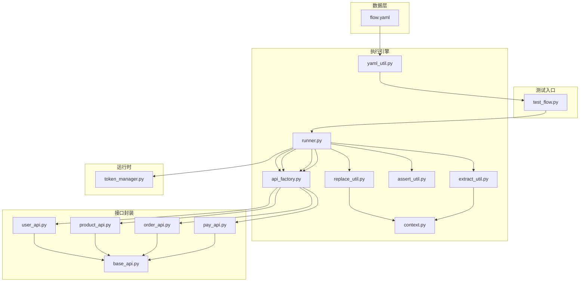
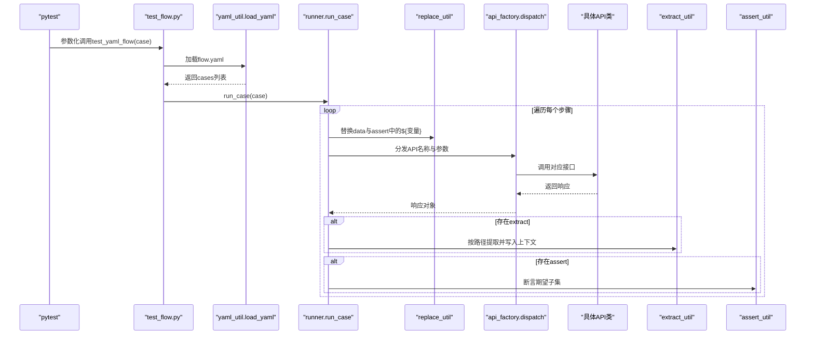
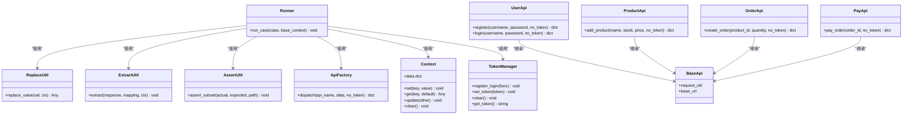
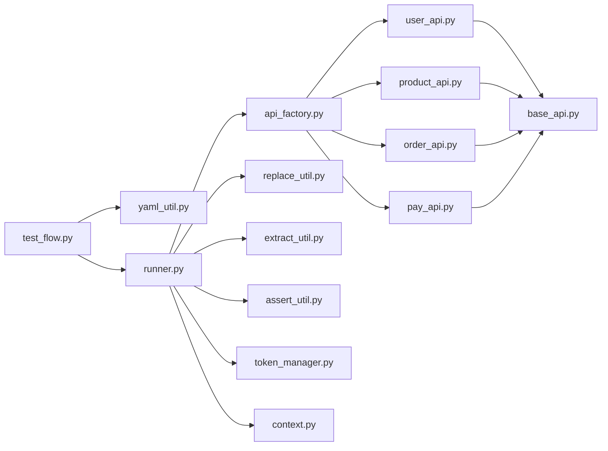

# YAML数据驱动测试

<cite>
**本文档引用的文件**
- [flow.yaml](file://data/flow.yaml)
- [runner.py](file://common/runner.py)
- [yaml_util.py](file://common/yaml_util.py)
- [context.py](file://common/context.py)
- [extract_util.py](file://common/extract_util.py)
- [assert_util.py](file://common/assert_util.py)
- [replace_util.py](file://common/replace_util.py)
- [api_factory.py](file://common/api_factory.py)
- [test_flow.py](file://testcase/test_flow.py)
- [user_api.py](file://api/user_api.py)
- [product_api.py](file://api/product_api.py)
- [order_api.py](file://api/order_api.py)
- [pay_api.py](file://api/pay_api.py)
- [base_api.py](file://api/base_api.py)
- [token_manager.py](file://common/token_manager.py)
</cite>

## 目录
1. [简介](#简介)
2. [项目结构](#项目结构)
3. [核心组件](#核心组件)
4. [架构总览](#架构总览)
5. [详细组件分析](#详细组件分析)
6. [依赖分析](#依赖分析)
7. [性能考虑](#性能考虑)
8. [故障排除指南](#故障排除指南)
9. [结论](#结论)
10. [附录](#附录)

## 简介
本项目实现了基于YAML的数据驱动测试框架，通过在flow.yaml中以声明式方式定义测试场景，由Runner类负责解析YAML配置、执行测试步骤、管理上下文状态、进行变量替换与数据提取，并对响应结果进行断言。该框架支持跨步骤变量传递（如从登录接口提取token并在后续请求中使用），并提供灵活的断言与错误处理策略。

## 项目结构
- 数据层：data/flow.yaml定义测试用例集合，每个用例包含多个步骤。
- 测试入口：testcase/test_flow.py读取YAML并参数化执行。
- 执行引擎：common/runner.py负责逐步骤执行、上下文管理、变量替换、数据提取与断言。
- 工具模块：yaml_util、context、replace_util、extract_util、assert_util、api_factory、token_manager等。
- 接口封装：api/下的各API类封装具体HTTP请求逻辑，统一继承BaseApi。

**图表来源**
- [flow.yaml:1-41](file://data/flow.yaml#L1-L41)
- [test_flow.py:1-17](file://testcase/test_flow.py#L1-L17)
- [runner.py:1-45](file://common/runner.py#L1-L45)
- [yaml_util.py:1-15](file://common/yaml_util.py#L1-L15)
- [context.py:1-25](file://common/context.py#L1-L25)
- [replace_util.py:1-32](file://common/replace_util.py#L1-L32)
- [extract_util.py:1-28](file://common/extract_util.py#L1-L28)
- [assert_util.py:1-15](file://common/assert_util.py#L1-L15)
- [api_factory.py:1-28](file://common/api_factory.py#L1-L28)
- [user_api.py:1-22](file://api/user_api.py#L1-L22)
- [product_api.py:1-15](file://api/product_api.py#L1-L15)
- [order_api.py:1-15](file://api/order_api.py#L1-L15)
- [pay_api.py:1-15](file://api/pay_api.py#L1-L15)
- [base_api.py:1-11](file://api/base_api.py#L1-L11)
- [token_manager.py:1-38](file://common/token_manager.py#L1-L38)

**章节来源**
- [flow.yaml:1-41](file://data/flow.yaml#L1-L41)
- [test_flow.py:1-17](file://testcase/test_flow.py#L1-L17)
- [runner.py:1-45](file://common/runner.py#L1-L45)

## 核心组件
- Runner：解析单个用例，按步骤执行，处理变量替换、数据提取与断言。
- YAML加载器：从data目录安全加载YAML文件。
- 上下文Context：存储跨步骤变量（如token、product_id、order_id）。
- 变量替换：支持${key}占位符在字符串、字典、列表中的递归替换。
- 数据提取：根据路径表达式从响应中提取字段写入上下文。
- 断言工具：递归断言期望子集与实际响应的键值一致性。
- API分发器：将字符串API名映射到具体接口实现。
- 接口封装：各API类统一继承BaseApi，提供标准化请求能力。
- Token管理：集中管理token生命周期与获取策略。

**章节来源**
- [runner.py:15-45](file://common/runner.py#L15-L45)
- [yaml_util.py:11-15](file://common/yaml_util.py#L11-L15)
- [context.py:6-25](file://common/context.py#L6-L25)
- [replace_util.py:22-32](file://common/replace_util.py#L22-L32)
- [extract_util.py:22-28](file://common/extract_util.py#L22-L28)
- [assert_util.py:6-15](file://common/assert_util.py#L6-L15)
- [api_factory.py:21-28](file://common/api_factory.py#L21-L28)
- [base_api.py:7-11](file://api/base_api.py#L7-L11)
- [token_manager.py:8-38](file://common/token_manager.py#L8-L38)

## 架构总览
YAML数据驱动测试的执行流程如下：

**图表来源**
- [test_flow.py:9-16](file://testcase/test_flow.py#L9-L16)
- [yaml_util.py:11-15](file://common/yaml_util.py#L11-L15)
- [runner.py:15-45](file://common/runner.py#L15-L45)
- [replace_util.py:22-32](file://common/replace_util.py#L22-L32)
- [api_factory.py:21-28](file://common/api_factory.py#L21-L28)
- [user_api.py:8-22](file://api/user_api.py#L8-L22)
- [product_api.py:8-15](file://api/product_api.py#L8-L15)
- [order_api.py:8-15](file://api/order_api.py#L8-L15)
- [pay_api.py:8-15](file://api/pay_api.py#L8-L15)
- [extract_util.py:22-28](file://common/extract_util.py#L22-L28)
- [assert_util.py:6-15](file://common/assert_util.py#L6-L15)

## 详细组件分析

### YAML配置文件结构与语法规则
- 顶层结构：cases数组，每个元素为一个测试用例。
- 用例字段：
  - name：用例标识，用于日志与报告。
  - steps：步骤数组，每个步骤包含以下字段：
    - api：API名称（需在api_factory注册）。
    - data：请求参数字典，支持${变量}占位符。
    - no_token：布尔标志，控制是否附加token。
    - extract：可选，字典映射，将响应路径提取到上下文。
    - assert：可选，字典期望值，支持${变量}占位符。
- 路径表达式：使用点号分隔的层级路径（如data.id），从根对象开始解析。
- 占位符语法：${key}，在字符串、字典、列表中递归替换。

参考示例路径：
- [flow.yaml:1-41](file://data/flow.yaml#L1-L41)

**章节来源**
- [flow.yaml:1-41](file://data/flow.yaml#L1-L41)

### Runner类：解析、执行与上下文管理
- 初始化与上下文：
  - 创建Context实例，合并传入的基础上下文。
- 步骤循环：
  - 校验每步必须包含api字段。
  - 对data进行变量替换后调用dispatch。
  - 若存在extract，按映射规则从响应中提取并写入上下文；若提取到token，设置到TokenManager。
  - 若存在assert，先对期望值进行变量替换，再与实际响应进行子集断言。
- 错误处理：
  - 缺失api字段抛出异常。
  - extract必须为字典类型。
  - unknown api step抛出异常。
  - 变量替换时未找到上下文变量抛出KeyError。

参考实现路径：
- [runner.py:15-45](file://common/runner.py#L15-L45)

**章节来源**
- [runner.py:15-45](file://common/runner.py#L15-L45)

### 变量替换与占位符使用
- 支持范围：字符串、字典、列表。
- 规则：仅当字符串包含"${"时才进行替换；递归遍历字典/列表。
- 异常：若上下文中不存在对应key，抛出KeyError。

参考实现路径：
- [replace_util.py:22-32](file://common/replace_util.py#L22-L32)

**章节来源**
- [replace_util.py:11-32](file://common/replace_util.py#L11-L32)

### 数据提取机制
- 提取函数接收响应对象、映射表与上下文。
- 路径解析：逐段按"."分割，支持空段跳过；遇到None或非字典类型返回None。
- 写入上下文：将提取结果以键值形式存入Context。

参考实现路径：
- [extract_util.py:8-28](file://common/extract_util.py#L8-L28)
- [context.py:10-14](file://common/context.py#L10-L14)

**章节来源**
- [extract_util.py:22-28](file://common/extract_util.py#L22-L28)
- [context.py:6-25](file://common/context.py#L6-L25)

### 断言配置与实现
- 断言函数递归比较期望与实际：
  - 若键缺失，直接报错。
  - 若键均为字典，则递归断言。
  - 否则比较值相等性。
- 断言前会先对期望值进行变量替换，确保动态期望可用。

参考实现路径：
- [assert_util.py:6-15](file://common/assert_util.py#L6-L15)
- [runner.py:42-44](file://common/runner.py#L42-L44)

**章节来源**
- [assert_util.py:6-15](file://common/assert_util.py#L6-L15)
- [runner.py:42-44](file://common/runner.py#L42-L44)

### API分发与接口封装
- 分发器将字符串API名映射到具体实现函数，自动注入no_token参数。
- 具体API类统一继承BaseApi，复用RequestUtil与基础URL配置。

参考实现路径：
- [api_factory.py:12-28](file://common/api_factory.py#L12-L28)
- [user_api.py:8-22](file://api/user_api.py#L8-L22)
- [product_api.py:8-15](file://api/product_api.py#L8-L15)
- [order_api.py:8-15](file://api/order_api.py#L8-L15)
- [pay_api.py:8-15](file://api/pay_api.py#L8-L15)
- [base_api.py:7-11](file://api/base_api.py#L7-L11)

**章节来源**
- [api_factory.py:21-28](file://common/api_factory.py#L21-L28)
- [user_api.py:8-22](file://api/user_api.py#L8-L22)
- [product_api.py:8-15](file://api/product_api.py#L8-L15)
- [order_api.py:8-15](file://api/order_api.py#L8-L15)
- [pay_api.py:8-15](file://api/pay_api.py#L8-L15)
- [base_api.py:7-11](file://api/base_api.py#L7-L11)

### Token管理与上下文联动
- 当某步骤提取到token时，Runner将其写入TokenManager，供后续请求使用。
- TokenManager提供线程安全的获取与缓存机制，必要时通过注册的登录函数获取新token。

参考实现路径：
- [runner.py:38-40](file://common/runner.py#L38-L40)
- [token_manager.py:18-38](file://common/token_manager.py#L18-L38)

**章节来源**
- [runner.py:38-40](file://common/runner.py#L38-L40)
- [token_manager.py:8-38](file://common/token_manager.py#L8-L38)

### 完整业务流程测试案例：注册-登录-加商品-下单-支付
- 步骤1：用户注册
  - API：user.register
  - 参数：用户名、密码
  - no_token：true
  - 断言：ok为真
- 步骤2：用户登录
  - API：user.login
  - 参数：用户名、密码
  - no_token：true
  - 提取：token
- 步骤3：添加商品
  - API：product.add_product
  - 参数：名称、库存、价格
  - 提取：product_id
- 步骤4：创建订单
  - API：order.create_order
  - 参数：product_id（来自上下文）、数量
  - 提取：order_id
- 步骤5：支付订单
  - API：pay.pay_order
  - 参数：order_id（来自上下文）
  - 断言：ok为真且状态为paid

参考配置路径：
- [flow.yaml:2-41](file://data/flow.yaml#L2-L41)

**章节来源**
- [flow.yaml:2-41](file://data/flow.yaml#L2-L41)

### 类关系图（代码级）

**图表来源**
- [runner.py:15-45](file://common/runner.py#L15-L45)
- [context.py:6-25](file://common/context.py#L6-L25)
- [replace_util.py:22-32](file://common/replace_util.py#L22-L32)
- [extract_util.py:22-28](file://common/extract_util.py#L22-L28)
- [assert_util.py:6-15](file://common/assert_util.py#L6-L15)
- [api_factory.py:21-28](file://common/api_factory.py#L21-L28)
- [user_api.py:8-22](file://api/user_api.py#L8-L22)
- [product_api.py:8-15](file://api/product_api.py#L8-L15)
- [order_api.py:8-15](file://api/order_api.py#L8-L15)
- [pay_api.py:8-15](file://api/pay_api.py#L8-L15)
- [base_api.py:7-11](file://api/base_api.py#L7-L11)
- [token_manager.py:8-38](file://common/token_manager.py#L8-L38)

## 依赖分析
- Runner依赖：
  - api_factory：将字符串API名映射到具体实现。
  - replace_util：变量替换。
  - extract_util：数据提取。
  - assert_util：断言。
  - token_manager：token管理。
  - context：上下文存储。
- 测试入口依赖：
  - yaml_util：加载YAML。
  - runner：执行用例。

**图表来源**
- [test_flow.py:9-16](file://testcase/test_flow.py#L9-L16)
- [yaml_util.py:11-15](file://common/yaml_util.py#L11-L15)
- [runner.py:15-45](file://common/runner.py#L15-L45)
- [api_factory.py:21-28](file://common/api_factory.py#L21-L28)
- [user_api.py:8-22](file://api/user_api.py#L8-L22)
- [product_api.py:8-15](file://api/product_api.py#L8-L15)
- [order_api.py:8-15](file://api/order_api.py#L8-L15)
- [pay_api.py:8-15](file://api/pay_api.py#L8-L15)
- [base_api.py:7-11](file://api/base_api.py#L7-L11)

**章节来源**
- [test_flow.py:9-16](file://testcase/test_flow.py#L9-L16)
- [runner.py:15-45](file://common/runner.py#L15-L45)
- [api_factory.py:21-28](file://common/api_factory.py#L21-L28)

## 性能考虑
- 变量替换：对字符串进行正则匹配与替换，复杂度与字符串长度和占位符数量相关；建议避免在超大文本中滥用占位符。
- 数据提取：路径解析为线性扫描，深度受限于JSON层级；建议保持响应结构扁平化以提升可读性与性能。
- 断言：递归断言在嵌套结构上可能增加时间开销；建议仅断言关键字段。
- API调用：网络I/O为主要瓶颈，建议在测试环境中使用Mock或本地服务以减少延迟。
- 上下文存储：字典更新与读取为O(1)，整体开销较小。

## 故障排除指南
- 缺少api字段：步骤必须包含api，否则抛出异常。
  - 参考路径：[runner.py:24-25](file://common/runner.py#L24-L25)
- unknown api step：API名称未在注册表中，抛出异常。
  - 参考路径：[api_factory.py:22-23](file://common/api_factory.py#L22-L23)
- extract类型错误：extract必须为字典，否则抛出TypeError。
  - 参考路径：[runner.py:35-36](file://common/runner.py#L35-L36)
- 变量缺失：${key}在上下文中找不到对应值，抛出KeyError。
  - 参考路径：[replace_util.py:15-17](file://common/replace_util.py#L15-L17)
- 断言失败：键缺失或值不相等，断言工具会给出详细路径与期望/实际值。
  - 参考路径：[assert_util.py:9-14](file://common/assert_util.py#L9-L14)
- Token未设置：若提取了token但未正确写入TokenManager，后续请求可能失败。
  - 参考路径：[runner.py:38-40](file://common/runner.py#L38-L40)

**章节来源**
- [runner.py:24-25](file://common/runner.py#L24-L25)
- [api_factory.py:22-23](file://common/api_factory.py#L22-L23)
- [replace_util.py:15-17](file://common/replace_util.py#L15-L17)
- [assert_util.py:9-14](file://common/assert_util.py#L9-L14)

## 结论
本框架通过YAML声明式配置与Runner执行引擎，实现了高可读性与强扩展性的数据驱动测试方案。其核心优势在于：
- 易于维护：测试场景集中在YAML中，便于业务人员参与评审。
- 可复用：通过上下文与变量替换实现跨步骤数据传递。
- 可观测：Allure步骤与断言信息清晰展示执行过程。
- 可扩展：新增API只需在注册表中登记，即可在YAML中直接使用。

## 附录

### YAML配置示例要点
- 用例命名：name字段用于识别与报告。
- 步骤顺序：严格按顺序执行，前一步的输出作为后一步的输入。
- no_token：部分接口无需token（如注册、登录），可在步骤中显式设置。
- extract路径：支持多级路径，如data.id。
- assert期望：支持嵌套字典，递归断言。

参考路径：
- [flow.yaml:1-41](file://data/flow.yaml#L1-L41)

**章节来源**
- [flow.yaml:1-41](file://data/flow.yaml#L1-L41)

### 参数占位符使用方法
- 在data与assert中使用${key}引用上下文变量。
- 支持在字符串、字典、列表中递归替换。
- 若上下文缺少对应key，将抛出KeyError。

参考路径：
- [replace_util.py:22-32](file://common/replace_util.py#L22-L32)

**章节来源**
- [replace_util.py:22-32](file://common/replace_util.py#L22-L32)

### 数据提取机制详解
- mapping格式：上下文键 -> 响应路径（如token -> token, pid -> data.id）。
- 路径解析：逐段按"."访问，遇到None或非字典类型返回None。
- 写入上下文：提取结果直接存入Context，供后续步骤使用。

参考路径：
- [extract_util.py:22-28](file://common/extract_util.py#L22-L28)
- [context.py:10-14](file://common/context.py#L10-L14)

**章节来源**
- [extract_util.py:22-28](file://common/extract_util.py#L22-L28)
- [context.py:6-25](file://common/context.py#L6-L25)

### 断言配置最佳实践
- 优先断言关键字段（如ok、status），避免过度断言导致脆弱。
- 使用嵌套字典精确匹配结构化响应。
- 将期望值也纳入变量替换，支持动态断言。

参考路径：
- [assert_util.py:6-15](file://common/assert_util.py#L6-L15)
- [runner.py:42-44](file://common/runner.py#L42-L44)

**章节来源**
- [assert_util.py:6-15](file://common/assert_util.py#L6-L15)
- [runner.py:42-44](file://common/runner.py#L42-L44)