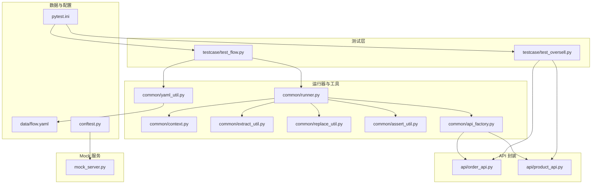
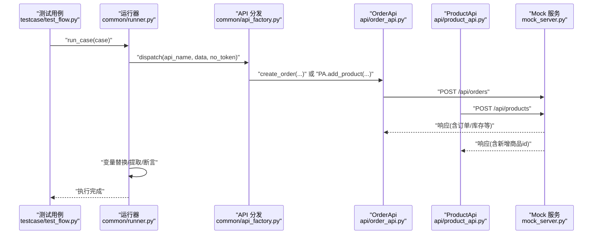
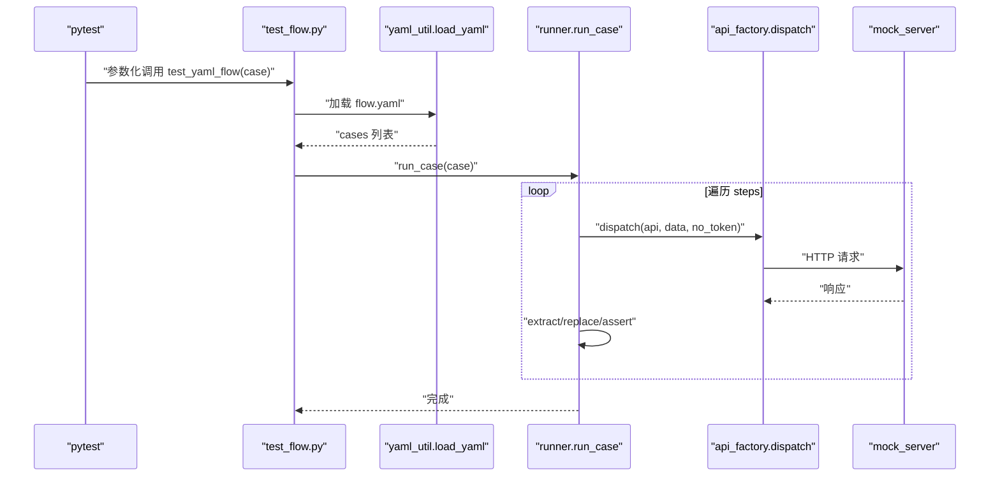
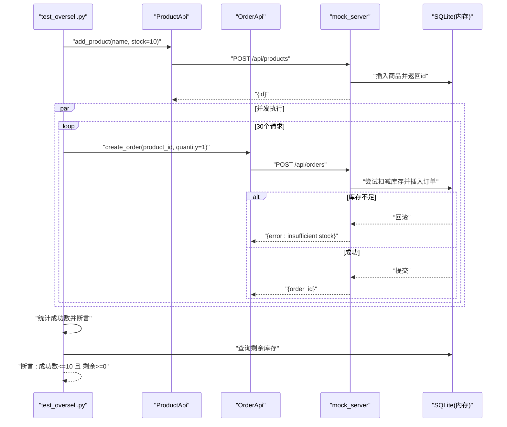
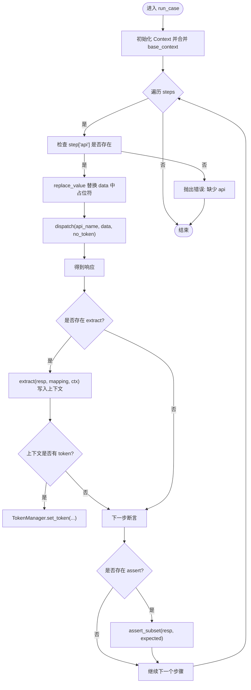
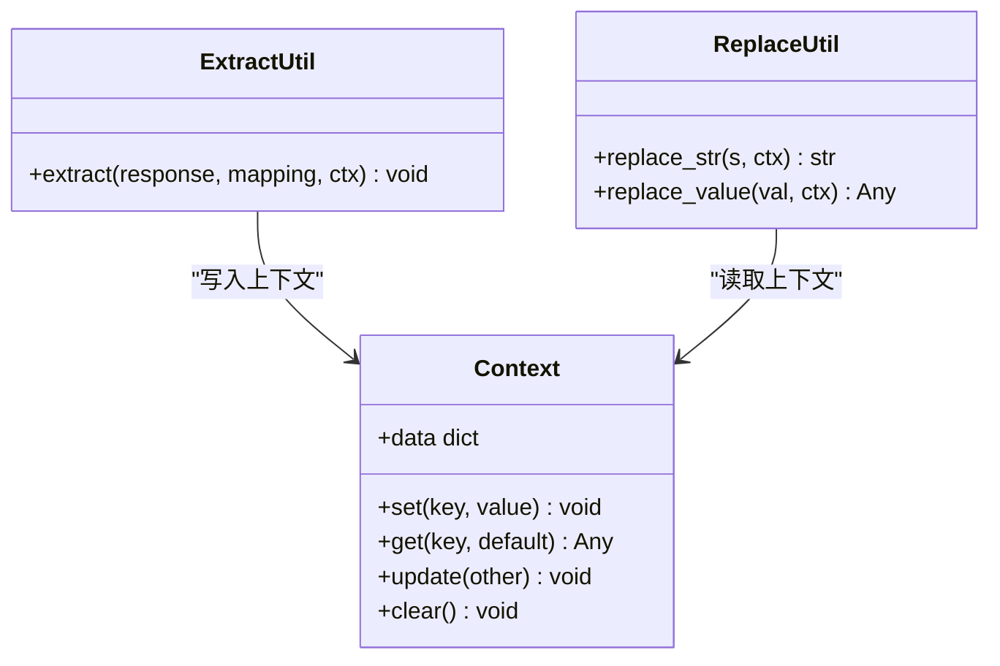
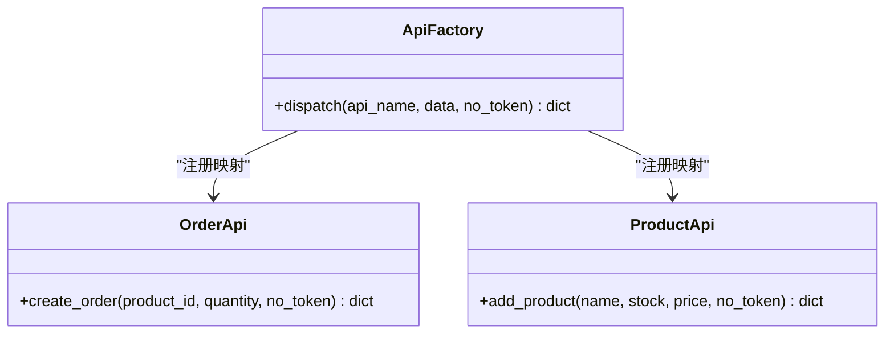
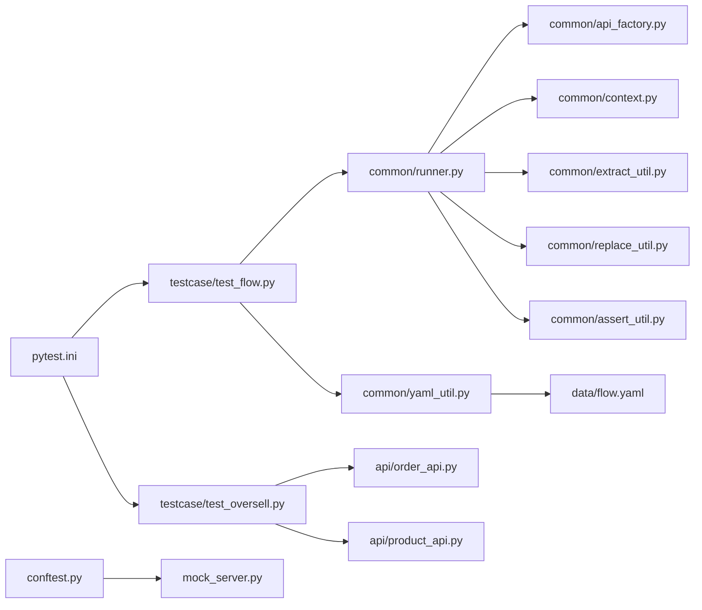

# 代码编排测试

<cite>
**本文引用的文件**
- [testcase/test_flow.py](file://testcase/test_flow.py)
- [testcase/test_oversell.py](file://testcase/test_oversell.py)
- [common/runner.py](file://common/runner.py)
- [common/yaml_util.py](file://common/yaml_util.py)
- [data/flow.yaml](file://data/flow.yaml)
- [conftest.py](file://conftest.py)
- [pytest.ini](file://pytest.ini)
- [common/assert_util.py](file://common/assert_util.py)
- [common/context.py](file://common/context.py)
- [common/extract_util.py](file://common/extract_util.py)
- [common/replace_util.py](file://common/replace_util.py)
- [common/api_factory.py](file://common/api_factory.py)
- [api/order_api.py](file://api/order_api.py)
- [api/product_api.py](file://api/product_api.py)
- [mock_server.py](file://mock_server.py)
</cite>

## 目录
1. [简介](#简介)
2. [项目结构](#项目结构)
3. [核心组件](#核心组件)
4. [架构总览](#架构总览)
5. [详细组件分析](#详细组件分析)
6. [依赖分析](#依赖分析)
7. [性能考虑](#性能考虑)
8. [故障排查指南](#故障排查指南)
9. [结论](#结论)
10. [附录：自定义测试场景编写指南](#附录自定义测试场景编写指南)

## 简介
本文件面向“代码编排测试”的实践与落地，系统性阐述如何通过 Python 编写复杂测试场景，覆盖以下主题：
- 基于 YAML 的流程编排与参数化执行
- 步骤级断言、上下文提取与变量替换
- 并发测试与库存超卖防护验证
- 性能测试场景与边界条件测试
- 结果收集、日志与异常处理机制

文档以 test_flow.py 与 test_oversell.py 两个示例为主线，结合运行时核心模块（runner、api_factory、context、extract_util、replace_util、assert_util），帮助读者快速掌握从“用例设计—执行编排—断言校验—并发与边界测试—结果输出”的完整闭环。

## 项目结构
该项目采用“测试用例 + 运行器 + API 封装 + Mock 服务 + 配置”的分层组织方式：
- 测试用例层：位于 testcase/，包含流程编排与并发/边界测试样例
- 运行器与工具层：位于 common/，提供用例执行、上下文管理、变量替换、提取、断言等通用能力
- API 层：位于 api/，封装具体业务接口调用
- 数据与配置：data/ 存放 YAML 流程数据；pytest.ini 与 conftest.py 提供测试框架与会话初始化
- Mock 服务：mock_server.py 提供本地数据库驱动的接口模拟

图表来源
- [testcase/test_flow.py:1-17](file://testcase/test_flow.py#L1-L17)
- [testcase/test_oversell.py:1-40](file://testcase/test_oversell.py#L1-L40)
- [common/runner.py:15-45](file://common/runner.py#L15-L45)
- [common/yaml_util.py:11-15](file://common/yaml_util.py#L11-L15)
- [data/flow.yaml:1-41](file://data/flow.yaml#L1-L41)
- [common/api_factory.py:21-28](file://common/api_factory.py#L21-L28)
- [api/order_api.py:8-15](file://api/order_api.py#L8-L15)
- [api/product_api.py:8-15](file://api/product_api.py#L8-L15)
- [conftest.py:33-49](file://conftest.py#L33-L49)
- [pytest.ini:1-5](file://pytest.ini#L1-L5)

章节来源
- [pytest.ini:1-5](file://pytest.ini#L1-L5)
- [conftest.py:16-50](file://conftest.py#L16-L50)

## 核心组件
- 流程编排执行器：run_case 负责按步骤执行 API、变量替换、上下文提取与断言
- 上下文管理：Context 提供键值存储与跨步骤传递
- 变量替换：支持 ${key} 占位符在请求体与断言中动态解析
- 提取工具：从响应中抽取字段写入上下文，供后续步骤使用
- 断言工具：递归断言子集，支持嵌套字典
- API 分发：根据字符串映射到具体 API 类方法
- YAML 加载：统一加载 data/flow.yaml 中的用例集合
- 并发与边界：基于线程池并发触发订单创建，验证库存超卖保护

章节来源
- [common/runner.py:15-45](file://common/runner.py#L15-L45)
- [common/context.py:6-25](file://common/context.py#L6-L25)
- [common/replace_util.py:22-32](file://common/replace_util.py#L22-L32)
- [common/extract_util.py:22-28](file://common/extract_util.py#L22-L28)
- [common/assert_util.py:6-15](file://common/assert_util.py#L6-L15)
- [common/api_factory.py:21-28](file://common/api_factory.py#L21-L28)
- [common/yaml_util.py:11-15](file://common/yaml_util.py#L11-L15)

## 架构总览
下图展示从测试用例到 Mock 服务的端到端调用链路，以及运行器内部的步骤编排与断言流程。

图表来源
- [common/runner.py:15-45](file://common/runner.py#L15-L45)
- [common/api_factory.py:21-28](file://common/api_factory.py#L21-L28)
- [api/order_api.py:8-15](file://api/order_api.py#L8-L15)
- [api/product_api.py:8-15](file://api/product_api.py#L8-L15)
- [mock_server.py:232-289](file://mock_server.py#L232-L289)

## 详细组件分析

### 组件一：流程编排测试（test_flow.py）
- 用例来源：从 data/flow.yaml 加载 cases 列表，并通过 pytest.mark.parametrize 参数化执行
- 执行入口：每个 case 作为独立测试项传入 run_case
- 关键点：
  - 使用 no_token 控制是否携带鉴权头
  - 支持 extract 将响应字段写入上下文，供后续步骤使用
  - 支持 assert 对响应进行断言

图表来源
- [testcase/test_flow.py:9-17](file://testcase/test_flow.py#L9-L17)
- [common/yaml_util.py:11-15](file://common/yaml_util.py#L11-L15)
- [common/runner.py:15-45](file://common/runner.py#L15-L45)
- [common/api_factory.py:21-28](file://common/api_factory.py#L21-L28)
- [data/flow.yaml:1-41](file://data/flow.yaml#L1-L41)

章节来源
- [testcase/test_flow.py:9-17](file://testcase/test_flow.py#L9-L17)
- [common/yaml_util.py:11-15](file://common/yaml_util.py#L11-L15)
- [data/flow.yaml:1-41](file://data/flow.yaml#L1-L41)

### 组件二：并发测试与库存超卖防护（test_oversell.py）
- 场景目标：验证高并发下单不会导致库存超卖
- 实现要点：
  - 初始化一个库存为 N 的商品
  - 使用线程池并发提交 M 次下单请求（M > N）
  - 统计成功下单次数，并断言成功数不超过库存上限
  - 最终校验剩余库存非负且满足数学关系

图表来源
- [testcase/test_oversell.py:13-40](file://testcase/test_oversell.py#L13-L40)
- [api/order_api.py:8-15](file://api/order_api.py#L8-L15)
- [api/product_api.py:8-15](file://api/product_api.py#L8-L15)
- [mock_server.py:232-289](file://mock_server.py#L232-L289)

章节来源
- [testcase/test_oversell.py:13-40](file://testcase/test_oversell.py#L13-L40)
- [mock_server.py:268-289](file://mock_server.py#L268-L289)

### 组件三：运行器与步骤编排（common/runner.py）
- 功能职责：
  - 读取用例名称与步骤列表
  - 逐步执行：替换变量、分发 API、提取上下文、断言
  - 使用 Allure 步骤包装，便于报告可视化
- 关键流程：
  - 校验每步必须包含 api 字段
  - replace_value 支持字符串、字典、列表的递归替换
  - extract 将响应路径映射写入 Context
  - assert_subset 递归断言期望子集

图表来源
- [common/runner.py:15-45](file://common/runner.py#L15-L45)
- [common/replace_util.py:22-32](file://common/replace_util.py#L22-L32)
- [common/extract_util.py:22-28](file://common/extract_util.py#L22-L28)
- [common/assert_util.py:6-15](file://common/assert_util.py#L6-L15)

章节来源
- [common/runner.py:15-45](file://common/runner.py#L15-L45)

### 组件四：上下文、提取与变量替换
- Context：提供 set/get/update/clear/data，用于跨步骤传递状态
- extract：支持“点号路径”从响应中取值，如 data.id
- replace_value：支持 ${key} 在字符串、字典、列表中递归替换

图表来源
- [common/context.py:6-25](file://common/context.py#L6-L25)
- [common/extract_util.py:22-28](file://common/extract_util.py#L22-L28)
- [common/replace_util.py:22-32](file://common/replace_util.py#L22-L32)

章节来源
- [common/context.py:6-25](file://common/context.py#L6-L25)
- [common/extract_util.py:22-28](file://common/extract_util.py#L22-L28)
- [common/replace_util.py:22-32](file://common/replace_util.py#L22-L32)

### 组件五：API 分发与封装
- api_factory：将字符串 API 名称映射到具体类方法
- 各 API 类：OrderApi、ProductApi 基于 BaseApi 的 request_util 发起请求

图表来源
- [common/api_factory.py:12-28](file://common/api_factory.py#L12-L28)
- [api/order_api.py:8-15](file://api/order_api.py#L8-L15)
- [api/product_api.py:8-15](file://api/product_api.py#L8-L15)

章节来源
- [common/api_factory.py:12-28](file://common/api_factory.py#L12-L28)
- [api/order_api.py:8-15](file://api/order_api.py#L8-L15)
- [api/product_api.py:8-15](file://api/product_api.py#L8-L15)

## 依赖分析
- 测试用例依赖运行器与 YAML 工具；运行器进一步依赖 API 分发、上下文、提取、替换与断言
- conftest.py 在会话启动时初始化数据库与 Mock 服务，并预登录获取令牌
- pytest.ini 指定测试目录与 Allure 报告输出目录

图表来源
- [testcase/test_flow.py:5-6](file://testcase/test_flow.py#L5-L6)
- [common/runner.py:7-12](file://common/runner.py#L7-L12)
- [common/yaml_util.py:11-15](file://common/yaml_util.py#L11-L15)
- [data/flow.yaml:1-41](file://data/flow.yaml#L1-L41)
- [common/api_factory.py:21-28](file://common/api_factory.py#L21-L28)
- [testcase/test_oversell.py:8-10](file://testcase/test_oversell.py#L8-L10)
- [conftest.py:33-49](file://conftest.py#L33-L49)
- [pytest.ini:2-4](file://pytest.ini#L2-L4)

章节来源
- [pytest.ini:1-5](file://pytest.ini#L1-L5)
- [conftest.py:16-50](file://conftest.py#L16-L50)

## 性能考虑
- 并发模型：使用线程池并发触发大量下单请求，验证数据库层面的库存扣减原子性与回滚逻辑
- 资源竞争：Mock 服务内部使用显式事务 BEGIN IMMEDIATE，确保在高并发下库存更新的隔离性
- 断言策略：通过统计成功数与最终库存，间接评估性能与正确性的平衡

章节来源
- [testcase/test_oversell.py:31-39](file://testcase/test_oversell.py#L31-L39)
- [mock_server.py:268-289](file://mock_server.py#L268-L289)

## 故障排查指南
- 缺失 API 字段：当某一步未提供 api 字段，运行器会抛出明确错误，检查 YAML 步骤配置
- 变量未定义：若 ${key} 在上下文中缺失，变量替换会抛出 KeyError，检查 extract 是否遗漏或命名不一致
- 断言失败：assert_subset 会给出缺失键或值不匹配的提示，核对期望结构与响应结构
- 并发异常：线程池中单次请求可能抛出 HTTP 错误，测试用例已捕获并忽略，不影响整体统计
- 会话初始化：若数据库或令牌未就绪，检查 conftest.py 的会话 fixture 是否正常启动 Mock 服务与登录

章节来源
- [common/runner.py:24-25](file://common/runner.py#L24-L25)
- [common/replace_util.py:15-17](file://common/replace_util.py#L15-L17)
- [common/assert_util.py:9-14](file://common/assert_util.py#L9-L14)
- [testcase/test_oversell.py:24-28](file://testcase/test_oversell.py#L24-L28)
- [conftest.py:16-50](file://conftest.py#L16-L50)

## 结论
本项目通过“YAML 流程编排 + 运行器步骤编排 + 并发与边界测试 + Allure 报告”的组合，构建了可扩展、可维护、可观测的测试体系。test_flow.py 展示了从注册、登录、下单到支付的完整业务流；test_oversell.py 展示了在真实数据库事务约束下的并发与边界验证。配合上下文、变量替换与断言工具，能够高效地组织复杂测试场景并稳定产出测试结果。

## 附录：自定义测试场景编写指南
- 参数化测试
  - 使用 pytest.mark.parametrize 将 YAML 中的多个 case 注册为独立测试项
  - 参考路径：[testcase/test_flow.py:14-16](file://testcase/test_flow.py#L14-L16)
- 条件分支与循环执行
  - 在 YAML 中通过多步骤串联实现条件判断（如先检查库存再下单）
  - 在测试中通过断言与上下文提取实现“成功/失败”分支的差异化处理
  - 参考路径：[common/runner.py:33-44](file://common/runner.py#L33-L44)
- 变量替换与上下文传递
  - 使用 ${key} 在 data 与 assert 中引用上下文值
  - 使用 extract 将响应字段写入上下文，供后续步骤使用
  - 参考路径：[common/replace_util.py:22-32](file://common/replace_util.py#L22-L32)、[common/extract_util.py:22-28](file://common/extract_util.py#L22-L28)
- 断言策略
  - 使用 assert_subset 进行嵌套断言，支持部分字段校验
  - 参考路径：[common/assert_util.py:6-15](file://common/assert_util.py#L6-L15)
- 并发与边界测试
  - 使用线程池并发触发请求，统计成功数并断言边界条件
  - 参考路径：[testcase/test_oversell.py:31-39](file://testcase/test_oversell.py#L31-L39)
- 结果收集与日志
  - 运行器使用 Allure 步骤包装，pytest.ini 指定报告输出目录
  - 参考路径：[common/runner.py:17](file://common/runner.py#L17)、[pytest.ini:2](file://pytest.ini#L2)
- 异常处理
  - 单步请求异常被捕获并忽略，不影响整体统计与断言
  - 参考路径：[testcase/test_oversell.py:24-28](file://testcase/test_oversell.py#L24-L28)