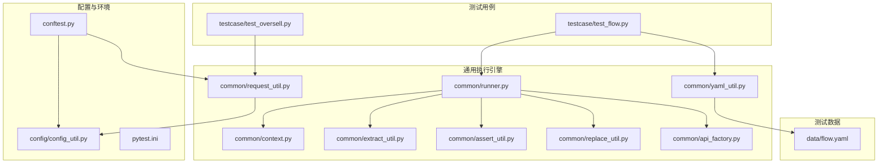
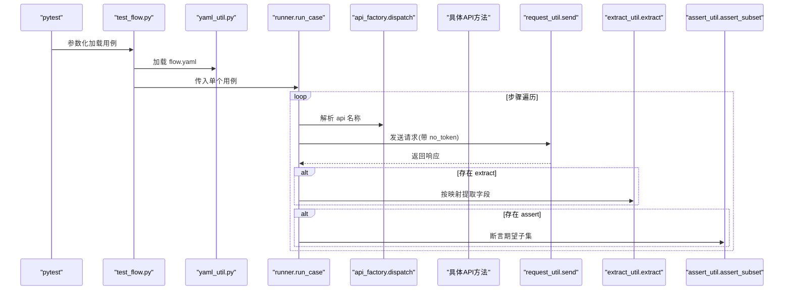
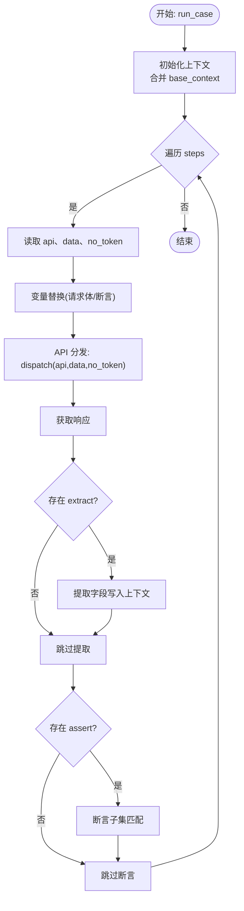
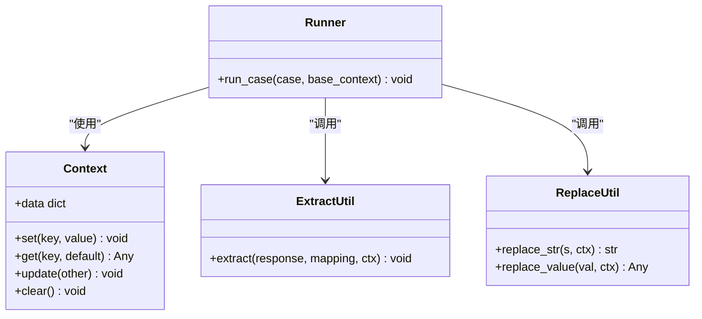
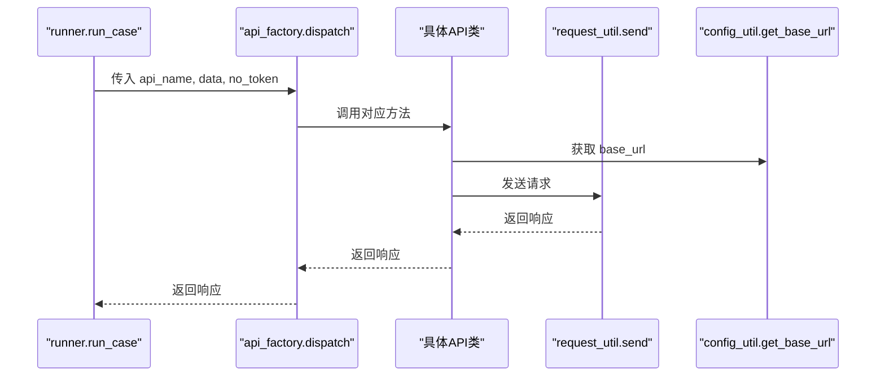
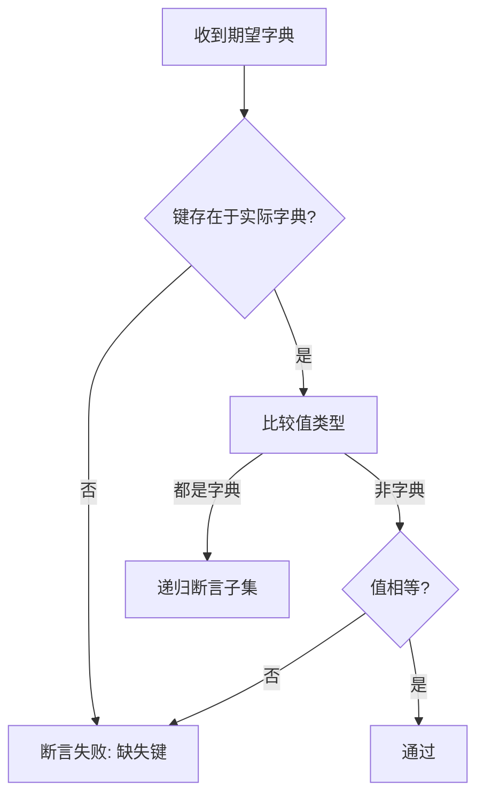
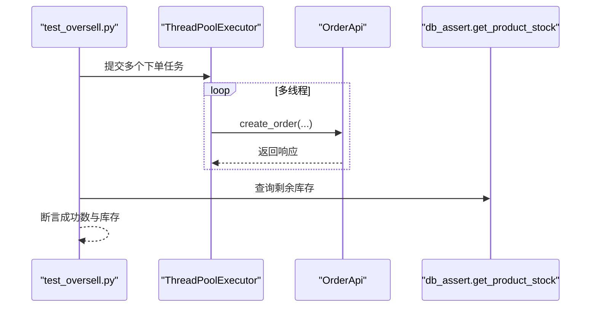
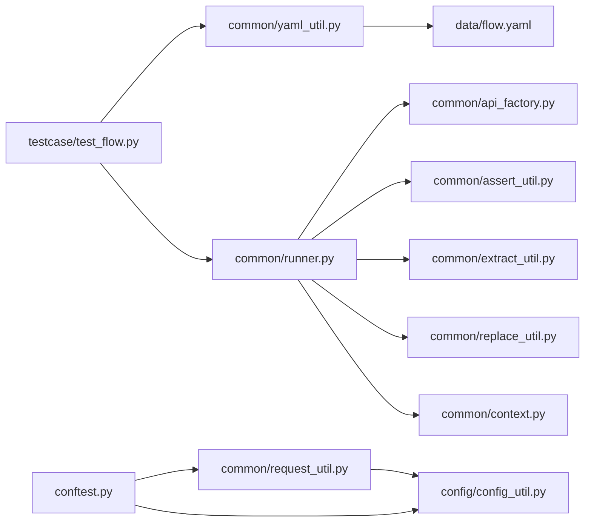

# 测试执行引擎

<cite>
**本文引用的文件**
- [common/runner.py](file://common/runner.py)
- [common/yaml_util.py](file://common/yaml_util.py)
- [testcase/test_flow.py](file://testcase/test_flow.py)
- [testcase/test_oversell.py](file://testcase/test_oversell.py)
- [data/flow.yaml](file://data/flow.yaml)
- [common/context.py](file://common/context.py)
- [common/extract_util.py](file://common/extract_util.py)
- [common/assert_util.py](file://common/assert_util.py)
- [common/replace_util.py](file://common/replace_util.py)
- [common/api_factory.py](file://common/api_factory.py)
- [common/request_util.py](file://common/request_util.py)
- [config/config_util.py](file://config/config_util.py)
- [conftest.py](file://conftest.py)
- [pytest.ini](file://pytest.ini)
</cite>

## 目录
1. [简介](#简介)
2. [项目结构](#项目结构)
3. [核心组件](#核心组件)
4. [架构总览](#架构总览)
5. [详细组件分析](#详细组件分析)
6. [依赖分析](#依赖分析)
7. [性能考虑](#性能考虑)
8. [故障排查指南](#故障排查指南)
9. [结论](#结论)
10. [附录](#附录)

## 简介
本文件面向“测试执行引擎”的使用者与维护者，系统性阐述基于 YAML 的数据驱动测试实现、代码编排测试的执行机制以及并发测试支持能力。重点围绕 Runner 类的工作流程、步骤解析算法与执行控制逻辑展开，同时给出测试用例编写规范、数据流配置格式、执行参数设置、典型测试场景（全业务流程与超卖场景）、结果收集、断言验证与错误处理机制。

## 项目结构
该工程采用按功能域分层的组织方式：通用工具模块位于 common，API 封装位于 api，配置位于 config，测试用例位于 testcase，测试数据位于 data。测试框架使用 pytest，报告输出通过 Allure 集成。

图表来源
- [testcase/test_flow.py:1-17](file://testcase/test_flow.py#L1-L17)
- [testcase/test_oversell.py:1-40](file://testcase/test_oversell.py#L1-L40)
- [common/runner.py:1-45](file://common/runner.py#L1-L45)
- [common/yaml_util.py:1-15](file://common/yaml_util.py#L1-L15)
- [data/flow.yaml:1-41](file://data/flow.yaml#L1-L41)
- [common/context.py:1-25](file://common/context.py#L1-L25)
- [common/extract_util.py:1-28](file://common/extract_util.py#L1-L28)
- [common/assert_util.py:1-15](file://common/assert_util.py#L1-L15)
- [common/replace_util.py:1-32](file://common/replace_util.py#L1-L32)
- [common/api_factory.py:1-28](file://common/api_factory.py#L1-L28)
- [common/request_util.py:1-66](file://common/request_util.py#L1-L66)
- [config/config_util.py:1-50](file://config/config_util.py#L1-L50)
- [conftest.py:1-50](file://conftest.py#L1-L50)
- [pytest.ini:1-5](file://pytest.ini#L1-L5)

章节来源
- [pytest.ini:1-5](file://pytest.ini#L1-L5)
- [conftest.py:1-50](file://conftest.py#L1-L50)

## 核心组件
- Runner 执行器：负责读取单个测试用例，按步骤顺序执行，完成变量替换、提取、断言与上下文传递。
- 数据加载器：从 data 目录加载 YAML 测试用例集合。
- 上下文管理：在步骤间共享状态（如 token、产品 ID、订单 ID）。
- 提取器：从响应中抽取字段写入上下文。
- 断言器：对响应进行子集断言，支持嵌套结构。
- 变量替换器：支持 ${key} 占位符在请求体与断言中的动态替换。
- API 分发器：将字符串 API 名称映射到具体 API 方法。
- 请求封装：统一发送 HTTP 请求、注入鉴权头、记录 Allure 报告。
- 配置工具：提供基础 URL、数据库路径、默认用户等配置项。
- 环境初始化：会话启动时初始化数据库、启动本地 Mock 服务、预登录获取令牌。

章节来源
- [common/runner.py:1-45](file://common/runner.py#L1-L45)
- [common/yaml_util.py:1-15](file://common/yaml_util.py#L1-L15)
- [common/context.py:1-25](file://common/context.py#L1-L25)
- [common/extract_util.py:1-28](file://common/extract_util.py#L1-L28)
- [common/assert_util.py:1-15](file://common/assert_util.py#L1-L15)
- [common/replace_util.py:1-32](file://common/replace_util.py#L1-L32)
- [common/api_factory.py:1-28](file://common/api_factory.py#L1-L28)
- [common/request_util.py:1-66](file://common/request_util.py#L1-L66)
- [config/config_util.py:1-50](file://config/config_util.py#L1-L50)
- [conftest.py:1-50](file://conftest.py#L1-L50)

## 架构总览
下图展示了从 YAML 用例到执行器再到 API 层的整体调用链路与数据流。

图表来源
- [testcase/test_flow.py:1-17](file://testcase/test_flow.py#L1-L17)
- [common/yaml_util.py:1-15](file://common/yaml_util.py#L1-L15)
- [common/runner.py:1-45](file://common/runner.py#L1-L45)
- [common/api_factory.py:1-28](file://common/api_factory.py#L1-L28)
- [common/request_util.py:1-66](file://common/request_util.py#L1-L66)
- [common/extract_util.py:1-28](file://common/extract_util.py#L1-L28)
- [common/assert_util.py:1-15](file://common/assert_util.py#L1-L15)

## 详细组件分析

### Runner 类工作流程与执行控制
Runner 的入口函数接收一个用例字典，逐条执行其 steps。每步的关键控制点包括：
- 步骤校验：必须包含 api 字段；否则抛出异常。
- 变量替换：对 data 与 assert 中的 ${key} 进行上下文替换。
- API 调用：通过分发器选择具体 API 方法，支持 no_token 控制是否携带鉴权头。
- 结果提取：若定义了 extract 映射，则将响应字段写入上下文。
- 断言验证：若定义了 assert，使用断言器进行子集匹配。
- 上下文传播：token 等状态可被后续步骤复用。

图表来源
- [common/runner.py:1-45](file://common/runner.py#L1-L45)
- [common/replace_util.py:1-32](file://common/replace_util.py#L1-L32)
- [common/api_factory.py:1-28](file://common/api_factory.py#L1-L28)
- [common/extract_util.py:1-28](file://common/extract_util.py#L1-L28)
- [common/assert_util.py:1-15](file://common/assert_util.py#L1-L15)

章节来源
- [common/runner.py:1-45](file://common/runner.py#L1-L45)

### 步骤解析算法与上下文传递
- 步骤解析：从用例字典读取每个 step 的 api、data、no_token、extract、assert 字段。
- 变量替换：递归遍历字符串、字典、列表，将 ${key} 替换为上下文中对应的值。
- 上下文：Context 提供键值存取与更新，支持多步之间状态共享。
- 提取算法：支持点号路径（如 data.id）从响应中定位字段并写入上下文。

图表来源
- [common/context.py:1-25](file://common/context.py#L1-L25)
- [common/extract_util.py:1-28](file://common/extract_util.py#L1-L28)
- [common/replace_util.py:1-32](file://common/replace_util.py#L1-L32)
- [common/runner.py:1-45](file://common/runner.py#L1-L45)

章节来源
- [common/context.py:1-25](file://common/context.py#L1-L25)
- [common/extract_util.py:1-28](file://common/extract_util.py#L1-L28)
- [common/replace_util.py:1-32](file://common/replace_util.py#L1-L32)

### API 分发与请求执行
- API 分发：将字符串 API 名称映射到具体 API 方法，支持 no_token 参数透传。
- 请求封装：统一构造请求头（默认 JSON、可选 Authorization），发送请求并记录 Allure 请求/响应附件，最终返回响应字典。
- 基础地址：从配置工具读取 base URL，支持环境变量覆盖。

图表来源
- [common/api_factory.py:1-28](file://common/api_factory.py#L1-L28)
- [common/request_util.py:1-66](file://common/request_util.py#L1-L66)
- [config/config_util.py:1-50](file://config/config_util.py#L1-L50)

章节来源
- [common/api_factory.py:1-28](file://common/api_factory.py#L1-L28)
- [common/request_util.py:1-66](file://common/request_util.py#L1-L66)
- [config/config_util.py:1-50](file://config/config_util.py#L1-L50)

### 断言与错误处理
- 断言策略：断言器对期望字典进行递归子集匹配，缺失键或值不一致即断言失败。
- 错误处理：请求封装在非 2xx 时抛出异常；Runner 在缺少 api 或 extract 类型错误时抛出异常；变量替换在占位符未找到时抛出异常。

图表来源
- [common/assert_util.py:1-15](file://common/assert_util.py#L1-L15)

章节来源
- [common/assert_util.py:1-15](file://common/assert_util.py#L1-L15)
- [common/request_util.py:1-66](file://common/request_util.py#L1-L66)
- [common/runner.py:1-45](file://common/runner.py#L1-L45)
- [common/replace_util.py:1-32](file://common/replace_util.py#L1-L32)

### 并发测试支持
- 代码级并发：测试用例直接使用线程池并发发起下单请求，统计成功数与剩余库存，断言库存正确性。
- 注意事项：并发场景需确保资源隔离与幂等性，避免重复创建相同商品导致断言偏差。

图表来源
- [testcase/test_oversell.py:1-40](file://testcase/test_oversell.py#L1-L40)

章节来源
- [testcase/test_oversell.py:1-40](file://testcase/test_oversell.py#L1-L40)

## 依赖分析
- Runner 依赖：api_factory、assert_util、context、extract_util、replace_util、token_manager（通过分发器间接使用）。
- YAML 用例加载：test_flow.py 依赖 yaml_util 读取 data/flow.yaml。
- 请求与配置：request_util 依赖 config_util 获取 base_url；conftest 初始化数据库与 Mock 服务。
- 断言与提取：assert_util 与 extract_util 作为工具模块被 Runner 直接调用。

图表来源
- [testcase/test_flow.py:1-17](file://testcase/test_flow.py#L1-L17)
- [common/yaml_util.py:1-15](file://common/yaml_util.py#L1-L15)
- [data/flow.yaml:1-41](file://data/flow.yaml#L1-L41)
- [common/runner.py:1-45](file://common/runner.py#L1-L45)
- [common/api_factory.py:1-28](file://common/api_factory.py#L1-L28)
- [common/assert_util.py:1-15](file://common/assert_util.py#L1-L15)
- [common/extract_util.py:1-28](file://common/extract_util.py#L1-L28)
- [common/replace_util.py:1-32](file://common/replace_util.py#L1-L32)
- [common/context.py:1-25](file://common/context.py#L1-L25)
- [common/request_util.py:1-66](file://common/request_util.py#L1-L66)
- [config/config_util.py:1-50](file://config/config_util.py#L1-L50)
- [conftest.py:1-50](file://conftest.py#L1-L50)

章节来源
- [common/runner.py:1-45](file://common/runner.py#L1-L45)
- [common/api_factory.py:1-28](file://common/api_factory.py#L1-L28)
- [common/request_util.py:1-66](file://common/request_util.py#L1-L66)
- [config/config_util.py:1-50](file://config/config_util.py#L1-L50)
- [conftest.py:1-50](file://conftest.py#L1-L50)

## 性能考虑
- 并发模型：使用线程池并发执行下单，建议根据目标系统的吞吐与资源限制调整并发度。
- 请求超时：请求封装设置了统一超时，避免长时间阻塞影响整体测试进度。
- 日志与报告：Allure 报告会记录请求与响应，便于定位问题但也会增加 IO 开销，建议在大规模并发时关注磁盘与内存占用。
- 数据库访问：并发断言库存时建议使用原子操作或加锁，避免竞态条件导致断言不准确。

## 故障排查指南
- 缺少 api 字段：Runner 在步骤中未发现 api 时会抛出异常，检查 YAML 步骤是否遗漏。
- extract 类型错误：extract 必须为字典，否则抛出类型错误；检查映射格式。
- 变量替换失败：当 ${key} 在上下文中不存在时抛出异常；检查前序步骤是否正确提取并写入上下文。
- 请求失败：请求封装在非 2xx 时抛出异常；检查 API 地址、鉴权头与服务端状态。
- 断言失败：断言器会明确指出缺失键或值不一致位置；核对期望结构与响应结构。

章节来源
- [common/runner.py:1-45](file://common/runner.py#L1-L45)
- [common/replace_util.py:1-32](file://common/replace_util.py#L1-L32)
- [common/request_util.py:1-66](file://common/request_util.py#L1-L66)
- [common/assert_util.py:1-15](file://common/assert_util.py#L1-L15)

## 结论
该测试执行引擎以 YAML 驱动为核心，结合上下文、变量替换、提取与断言机制，实现了高可读性的数据驱动测试。Runner 作为执行中枢，串联起 API 分发与请求封装，配合 Allure 报告与 pytest 参数化，能够高效支撑端到端流程测试与并发压力测试。通过规范的用例编写与合理的并发策略，可在保证稳定性的同时提升测试效率。

## 附录

### 测试用例编写规范
- 用例结构：顶层包含 cases 数组，每个用例含 name 与 steps。
- 步骤字段：api（必填）、data（可选）、no_token（布尔）、extract（可选）、assert（可选）。
- 变量引用：在 data 与 assert 中使用 ${key} 引用上下文值。
- 提取映射：extract 为字典，键为目标上下文键，值为响应路径（支持点号路径）。
- 断言格式：assert 为字典，支持嵌套结构，用于子集断言。

章节来源
- [data/flow.yaml:1-41](file://data/flow.yaml#L1-L41)
- [common/runner.py:1-45](file://common/runner.py#L1-L45)
- [common/extract_util.py:1-28](file://common/extract_util.py#L1-L28)
- [common/replace_util.py:1-32](file://common/replace_util.py#L1-L32)

### 数据流配置格式
- 基础地址：通过配置工具读取，支持环境变量覆盖。
- 数据库路径：支持相对路径与绝对路径，自动解析根目录。
- 默认用户：用于初始化数据库与登录。

章节来源
- [config/config_util.py:1-50](file://config/config_util.py#L1-L50)

### 执行参数设置
- pytest 配置：启用 Allure 报告输出目录与测试路径。
- 环境初始化：会话启动时初始化数据库、启动 Mock 服务、预登录并获取令牌。

章节来源
- [pytest.ini:1-5](file://pytest.ini#L1-L5)
- [conftest.py:1-50](file://conftest.py#L1-L50)

### 实际测试场景示例

#### 全业务流程测试（电商完整路径）
- 场景描述：注册用户、登录获取 token、创建商品、下单、支付。
- 关键点：步骤间通过 extract 写入上下文，后续步骤使用 ${token}/${product_id}/${order_id}。
- 断言：每步返回值满足预期结构，最终支付状态为已支付。

章节来源
- [data/flow.yaml:1-41](file://data/flow.yaml#L1-L41)
- [testcase/test_flow.py:1-17](file://testcase/test_flow.py#L1-L17)

#### 超卖场景测试（并发下单）
- 场景描述：初始化商品库存为 10，使用线程池并发提交 30 个下单请求，统计成功数与剩余库存。
- 关键点：并发度与请求数量可调；断言成功数不超过库存上限，剩余库存非负且等于初始库存减去成功数。
- 并发注意：确保商品唯一性与幂等性，避免重复创建导致断言偏差。

章节来源
- [testcase/test_oversell.py:1-40](file://testcase/test_oversell.py#L1-L40)