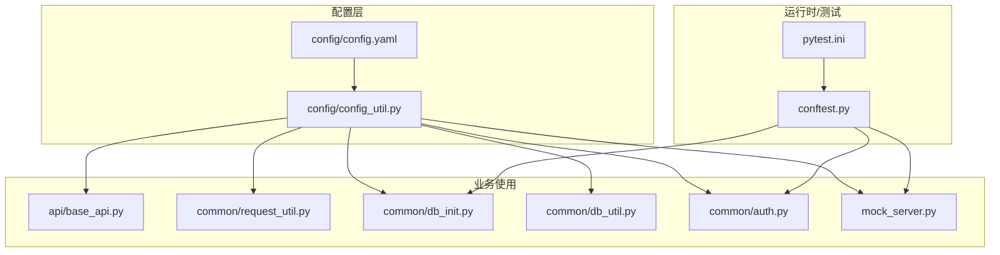
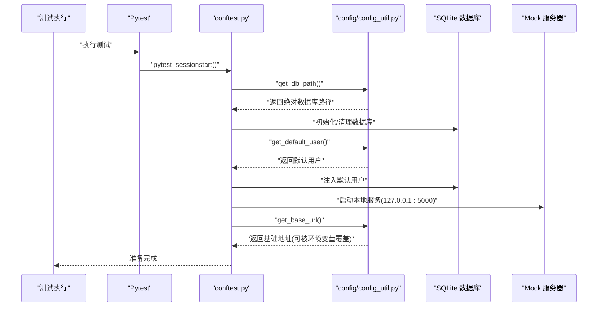
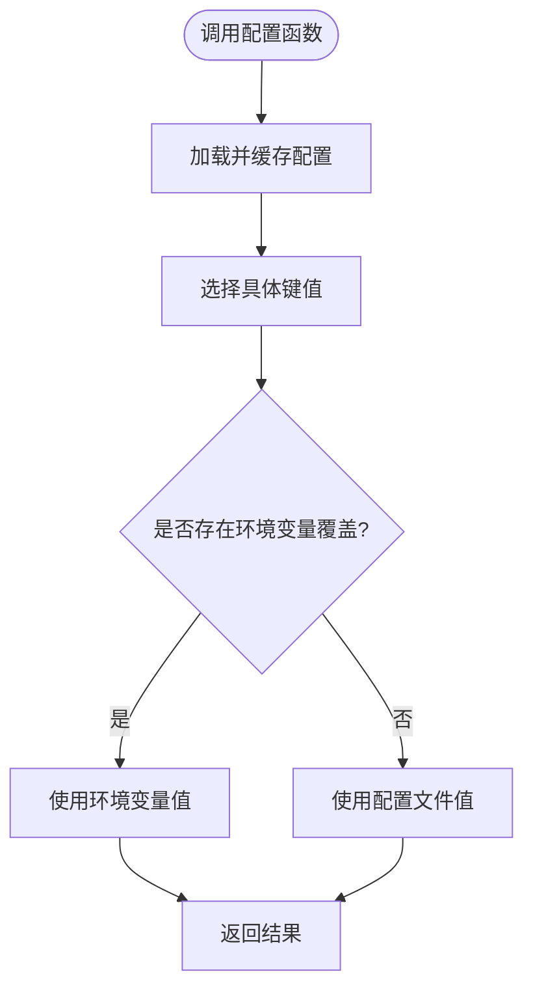
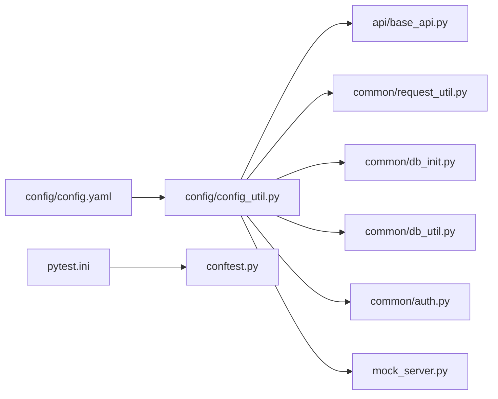

# 配置管理

<cite>
**本文引用的文件**
- [config/config.yaml](file://config/config.yaml)
- [config/config_util.py](file://config/config_util.py)
- [pytest.ini](file://pytest.ini)
- [conftest.py](file://conftest.py)
- [requirements.txt](file://requirements.txt)
- [mock_server.py](file://mock_server.py)
- [common/db_init.py](file://common/db_init.py)
- [common/auth.py](file://common/auth.py)
- [common/request_util.py](file://common/request_util.py)
- [api/base_api.py](file://api/base_api.py)
- [common/db_util.py](file://common/db_util.py)
- [SUGGESTIONS.md](file://SUGGESTIONS.md)
</cite>

## 目录
1. [简介](#简介)
2. [项目结构](#项目结构)
3. [核心组件](#核心组件)
4. [架构总览](#架构总览)
5. [详细组件分析](#详细组件分析)
6. [依赖分析](#依赖分析)
7. [性能考量](#性能考量)
8. [故障排查指南](#故障排查指南)
9. [结论](#结论)
10. [附录](#附录)

## 简介
本文件系统性梳理该仓库的配置管理体系，涵盖基础配置文件结构、配置项作用与修改方式、Pytest 运行时配置、环境变量覆盖机制、加载顺序与优先级、以及在开发/测试/生产环境下的差异化实践建议。文档同时提供最佳实践与安全注意事项，并给出可扩展的配置定制指导。

## 项目结构
配置相关的核心位置与职责如下：
- 配置文件
  - config/config.yaml：基础配置（服务地址、数据库路径、默认用户）
  - config/config_util.py：配置加载、缓存、环境变量覆盖与工具函数
- 运行时配置与测试框架
  - pytest.ini：Pytest 命令行参数、测试路径与输出目录
  - conftest.py：测试会话启动、数据库初始化、默认用户注入、Mock 服务器启动与 Token 获取
- 使用方
  - api/base_api.py、common/request_util.py：通过配置工具函数获取基础地址
  - common/db_init.py、common/db_util.py：通过配置工具函数获取数据库路径
  - common/auth.py：通过配置工具函数获取默认用户凭据
  - mock_server.py：通过配置工具函数获取数据库路径

图表来源
- [config/config.yaml:1-10](file://config/config.yaml#L1-L10)
- [config/config_util.py:14-49](file://config/config_util.py#L14-L49)
- [pytest.ini:1-5](file://pytest.ini#L1-L5)
- [conftest.py:16-49](file://conftest.py#L16-L49)
- [api/base_api.py:7-11](file://api/base_api.py#L7-L11)
- [common/request_util.py:13-16](file://common/request_util.py#L13-L16)
- [common/db_init.py:8-38](file://common/db_init.py#L8-L38)
- [common/db_util.py:9-34](file://common/db_util.py#L9-L34)
- [common/auth.py:7-11](file://common/auth.py#L7-L11)
- [mock_server.py:17-18](file://mock_server.py#L17-L18)

章节来源
- [config/config.yaml:1-10](file://config/config.yaml#L1-L10)
- [config/config_util.py:14-49](file://config/config_util.py#L14-L49)
- [pytest.ini:1-5](file://pytest.ini#L1-L5)
- [conftest.py:16-49](file://conftest.py#L16-L49)

## 核心组件
- 基础配置文件 config/config.yaml
  - 结构要点：包含 base.url、database.path、user.username、user.password 等键
  - 修改方式：直接编辑 YAML 文件；注意缩进与类型一致性
- 配置工具模块 config/config_util.py
  - 加载与缓存：单例缓存避免重复 IO
  - 环境变量覆盖：支持通过环境变量覆盖关键值（例如基础地址）
  - 工具函数：获取基础地址、数据库路径、默认用户信息
- Pytest 运行时配置 pytest.ini
  - 测试路径、输出目录、附加命令行参数
- 测试夹具 conftest.py
  - 会话启动：清理/初始化数据库、注入默认用户
  - Mock 服务器：本地服务启动、线程守护、Token 管理
- 使用方模块
  - API 层与请求层：统一从配置工具读取基础地址
  - 数据层：统一从配置工具读取数据库路径

章节来源
- [config/config.yaml:1-10](file://config/config.yaml#L1-L10)
- [config/config_util.py:14-49](file://config/config_util.py#L14-L49)
- [pytest.ini:1-5](file://pytest.ini#L1-L5)
- [conftest.py:16-49](file://conftest.py#L16-L49)
- [api/base_api.py:7-11](file://api/base_api.py#L7-L11)
- [common/request_util.py:13-16](file://common/request_util.py#L13-L16)
- [common/db_init.py:8-38](file://common/db_init.py#L8-L38)
- [common/db_util.py:9-34](file://common/db_util.py#L9-L34)
- [common/auth.py:7-11](file://common/auth.py#L7-L11)
- [mock_server.py:17-18](file://mock_server.py#L17-L18)

## 架构总览
配置体系采用“文件配置 + 环境变量覆盖”的双层策略，配合 Pytest 夹具实现端到端的运行时配置注入。

图表来源
- [conftest.py:16-49](file://conftest.py#L16-L49)
- [config/config_util.py:27-40](file://config/config_util.py#L27-L40)
- [common/db_init.py:8-38](file://common/db_init.py#L8-L38)
- [mock_server.py:37-44](file://mock_server.py#L37-L44)

## 详细组件分析

### 基础配置文件 config/config.yaml
- 结构与含义
  - base.url：API 基础地址，用于拼接请求路径
  - database.path：数据库文件相对或绝对路径
  - user.username/password：默认用户凭据，供测试与演示使用
- 修改方法
  - 直接编辑 YAML；确保键名与层级正确
  - 如需覆盖，可通过环境变量进行运行时覆盖（见下节）

章节来源
- [config/config.yaml:1-10](file://config/config.yaml#L1-L10)

### 配置工具模块 config/config_util.py
- 加载与缓存
  - 单次加载后缓存于内存，避免重复 IO
  - 提供重载函数以刷新缓存
- 环境变量覆盖
  - 基础地址支持通过环境变量覆盖
- 关键函数
  - get_base_url：返回基础地址（优先环境变量，其次配置文件）
  - get_db_path：返回数据库绝对路径（相对路径基于项目根目录解析）
  - get_default_user：返回默认用户名与密码

图表来源
- [config/config_util.py:14-49](file://config/config_util.py#L14-L49)

章节来源
- [config/config_util.py:14-49](file://config/config_util.py#L14-L49)

### Pytest 配置 pytest.ini
- 主要设置
  - addopts：启用详细输出与 Allure 报告目录
  - pythonpath：将项目根目录加入 Python 路径
  - testpaths：指定测试目录
- 影响范围
  - 控制测试发现、报告生成与日志输出风格

章节来源
- [pytest.ini:1-5](file://pytest.ini#L1-L5)

### 测试夹具 conftest.py
- 会话启动阶段
  - 清理/初始化数据库
  - 注入默认用户
- Mock 服务器
  - 启动本地服务并守护线程
  - 注册默认登录流程，获取并缓存 Token
- 与配置的关系
  - 通过配置工具读取数据库路径与默认用户
  - 通过配置工具读取基础地址，保证测试与 Mock 服务一致

章节来源
- [conftest.py:16-49](file://conftest.py#L16-L49)

### 使用方模块
- API 基类与请求工具
  - 统一从配置工具读取基础地址，避免硬编码
- 数据访问层
  - 统一从配置工具读取数据库路径，确保测试与生产一致行为
- 认证流程
  - 默认登录使用配置中的默认用户凭据

章节来源
- [api/base_api.py:7-11](file://api/base_api.py#L7-L11)
- [common/request_util.py:13-16](file://common/request_util.py#L13-L16)
- [common/db_init.py:8-38](file://common/db_init.py#L8-L38)
- [common/db_util.py:9-34](file://common/db_util.py#L9-L34)
- [common/auth.py:7-11](file://common/auth.py#L7-L11)

## 依赖分析
- 配置文件到工具函数
  - config/config.yaml → config/config_util.py（键映射与默认值）
- 工具函数到使用方
  - config/config_util.py → api/base_api.py、common/request_util.py、common/db_init.py、common/db_util.py、common/auth.py、mock_server.py
- 运行时配置到夹具
  - pytest.ini → conftest.py（测试生命周期与报告）
- 外部依赖
  - requests、PyYAML、allure-pytest、Flask 等

图表来源
- [config/config.yaml:1-10](file://config/config.yaml#L1-L10)
- [config/config_util.py:14-49](file://config/config_util.py#L14-L49)
- [api/base_api.py:7-11](file://api/base_api.py#L7-L11)
- [common/request_util.py:13-16](file://common/request_util.py#L13-L16)
- [common/db_init.py:8-38](file://common/db_init.py#L8-L38)
- [common/db_util.py:9-34](file://common/db_util.py#L9-L34)
- [common/auth.py:7-11](file://common/auth.py#L7-L11)
- [mock_server.py:17-18](file://mock_server.py#L17-L18)
- [pytest.ini:1-5](file://pytest.ini#L1-L5)
- [conftest.py:16-49](file://conftest.py#L16-L49)

章节来源
- [requirements.txt:1-6](file://requirements.txt#L1-L6)

## 性能考量
- 配置缓存
  - 工具函数对配置进行单次加载并缓存，避免重复 IO，提升启动与运行时性能
- 数据库路径解析
  - 相对路径统一基于项目根目录解析，减少路径拼接错误与重复计算
- 请求超时与连接复用
  - 请求工具使用 Session 并设置固定超时，有助于控制资源占用与网络阻塞风险

章节来源
- [config/config_util.py:14-19](file://config/config_util.py#L14-L19)
- [common/request_util.py:13-16](file://common/request_util.py#L13-L16)

## 故障排查指南
- 基础地址不生效
  - 检查是否设置了环境变量覆盖
  - 确认配置文件键名与层级正确
- 数据库路径异常
  - 确认 database.path 是否为有效路径
  - 相对路径会被解析为相对于项目根目录
- 测试无法连接 Mock 服务
  - 确认 conftest.py 已启动本地服务且端口为 5000
  - 确认基础地址与 Mock 服务一致
- 默认用户缺失导致认证失败
  - 确认 user.username 与 user.password 存在
  - 检查 conftest.py 是否已注入默认用户

章节来源
- [config/config_util.py:27-49](file://config/config_util.py#L27-L49)
- [conftest.py:16-49](file://conftest.py#L16-L49)
- [common/db_init.py:8-38](file://common/db_init.py#L8-L38)
- [mock_server.py:37-44](file://mock_server.py#L37-L44)

## 结论
该配置体系以 YAML 文件为基础，结合环境变量覆盖与测试夹具注入，实现了简洁、可维护且可扩展的配置管理。通过统一的工具函数与明确的加载/覆盖规则，确保了开发、测试与生产环境的一致性与可控性。建议在后续迭代中引入多环境配置文件与 dotenv 支持，进一步增强灵活性与安全性。

## 附录

### 配置项说明与修改方法
- base.url
  - 作用：拼接 API 请求的基础地址
  - 修改：直接编辑 YAML；或通过环境变量覆盖
- database.path
  - 作用：数据库文件路径（相对/绝对）
  - 修改：直接编辑 YAML；相对路径基于项目根目录解析
- user.username/password
  - 作用：默认用户凭据，用于测试与演示
  - 修改：直接编辑 YAML

章节来源
- [config/config.yaml:1-10](file://config/config.yaml#L1-L10)
- [config/config_util.py:27-49](file://config/config_util.py#L27-L49)

### 环境变量与覆盖机制
- 环境变量覆盖优先级
  - 运行时通过环境变量覆盖关键配置（如基础地址）
  - 未设置时回退到配置文件值
- 典型场景
  - 开发：本地 Mock 服务地址
  - 测试：临时切换到预发布环境
  - 生产：通过环境变量注入真实服务地址

章节来源
- [config/config_util.py:27-31](file://config/config_util.py#L27-L31)

### 加载顺序与优先级
- 配置加载顺序
  - 初始化时读取 YAML 文件并缓存
  - 运行时优先检查环境变量，再回退到配置文件
- 优先级规则
  - 环境变量 > 配置文件 > 默认值

章节来源
- [config/config_util.py:14-19](file://config/config_util.py#L14-L19)
- [config/config_util.py:27-49](file://config/config_util.py#L27-L49)

### 不同环境下的配置示例与差异
- 开发环境
  - 基础地址指向本地 Mock 服务
  - 数据库路径为本地文件
  - 默认用户用于快速登录
- 测试环境
  - 基础地址指向预发布或测试服务
  - 数据库路径可独立隔离
  - 可通过环境变量覆盖敏感参数
- 生产环境
  - 基础地址指向线上服务
  - 数据库路径指向持久化存储
  - 避免在配置文件中存放真实密钥

[本节为概念性说明，无需列出具体文件来源]

### 最佳实践与安全考虑
- 最佳实践
  - 将敏感信息放入环境变量，不在 YAML 中明文保存
  - 使用统一的环境变量前缀与命名规范
  - 分环境维护独立配置文件，最小化变更面
  - 对关键配置提供默认值与校验
- 安全考虑
  - 避免在版本控制中提交真实密钥
  - 限制配置文件权限
  - 在 CI/CD 中通过受控渠道注入环境变量

[本节为通用指导，无需列出具体文件来源]

### 可扩展建议（来自仓库建议文件）
- 引入多环境配置
  - 新建 config/env/ 下的 dev.yaml、test.yaml、prod.yaml
  - 通过环境变量选择当前环境
- 引入 dotenv 支持
  - 在启动时加载 .env
  - 统一环境变量前缀
- 增强配置项
  - 暴露更多运行时配置（如超时、重试、日志级别等）

章节来源
- [SUGGESTIONS.md:114-138](file://SUGGESTIONS.md#L114-L138)