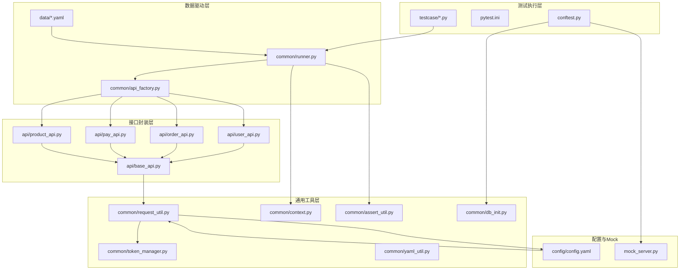
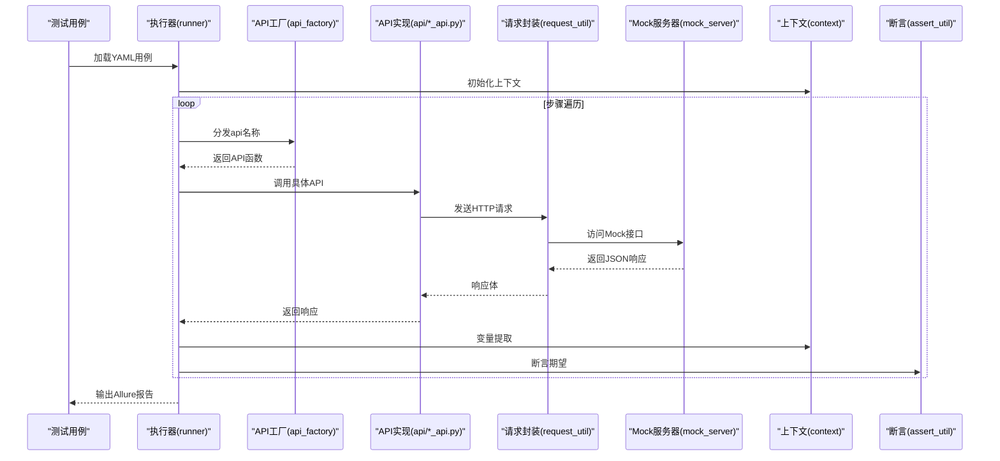
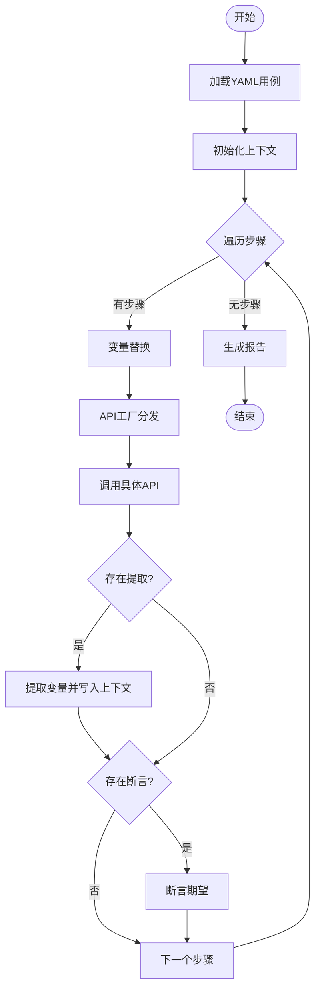
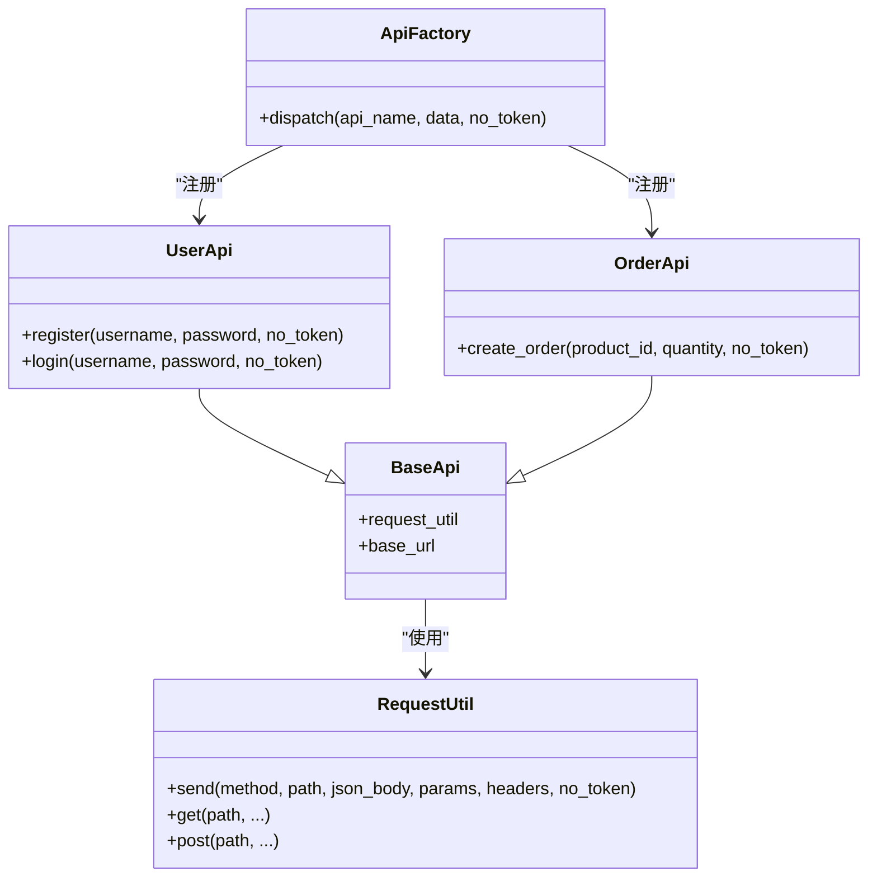
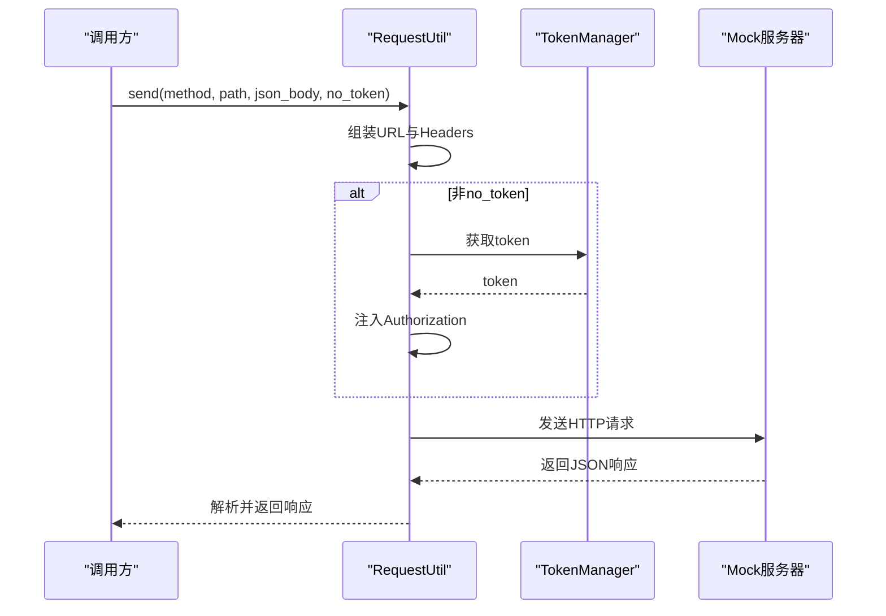
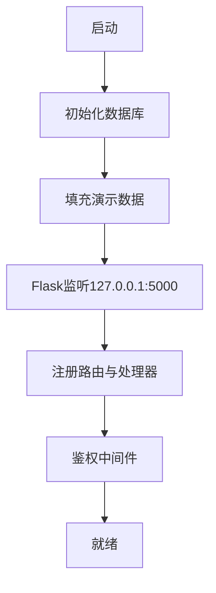
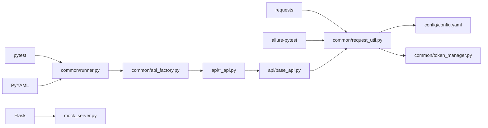

# 项目概述

<cite>
**本文引用的文件**
- [requirements.txt](file://requirements.txt)
- [pytest.ini](file://pytest.ini)
- [config/config.yaml](file://config/config.yaml)
- [mock_server.py](file://mock_server.py)
- [conftest.py](file://conftest.py)
- [common/api_factory.py](file://common/api_factory.py)
- [common/runner.py](file://common/runner.py)
- [common/request_util.py](file://common/request_util.py)
- [common/assert_util.py](file://common/assert_util.py)
- [common/context.py](file://common/context.py)
- [common/token_manager.py](file://common/token_manager.py)
- [common/db_init.py](file://common/db_init.py)
- [common/yaml_util.py](file://common/yaml_util.py)
- [api/base_api.py](file://api/base_api.py)
- [api/user_api.py](file://api/user_api.py)
- [api/order_api.py](file://api/order_api.py)
- [api/pay_api.py](file://api/pay_api.py)
- [api/product_api.py](file://api/product_api.py)
- [data/flow.yaml](file://data/flow.yaml)
- [testcase/test_flow.py](file://testcase/test_flow.py)
- [testcase/test_oversell.py](file://testcase/test_oversell.py)
</cite>

## 目录
1. [引言](#引言)
2. [项目结构](#项目结构)
3. [核心组件](#核心组件)
4. [架构总览](#架构总览)
5. [详细组件分析](#详细组件分析)
6. [依赖关系分析](#依赖关系分析)
7. [性能考虑](#性能考虑)
8. [故障排查指南](#故障排查指南)
9. [结论](#结论)
10. [附录](#附录)

## 引言
本项目是一个面向电商系统的API自动化测试框架，提供从接口调用、参数替换、提取断言到报告生成的完整链路能力。其核心目标是通过YAML数据驱动的方式，将业务流程编排为可维护、可扩展的测试用例，结合内置Mock服务器与并发执行支持，帮助团队快速搭建稳定可靠的API测试体系。

框架的主要特性包括：
- YAML数据驱动：以声明式方式组织测试步骤与期望结果，降低维护成本
- 内置Mock服务器：基于Flask实现的电商相关接口，覆盖用户注册/登录、商品管理、下单与支付等核心流程
- 请求封装与Token管理：统一HTTP请求发送、自动注入认证头、支持上下文变量传递
- 断言与提取：支持嵌套字典断言与变量提取，便于跨步骤传递状态
- 报告集成：集成Allure，输出可读性强的测试报告
- 并发执行：通过pytest插件机制与会话级资源管理，支持多线程并发运行

## 项目结构
项目采用按功能域分层的组织方式，核心目录与职责如下：
- api：各业务模块的API封装，如用户、订单、支付、商品等
- common：通用工具与基础设施，如请求封装、断言、上下文、变量替换、Token管理、数据库初始化等
- config：配置中心，包含基础URL、数据库路径、默认用户等
- data：数据驱动的测试流定义，以YAML形式描述端到端流程
- testcase：pytest测试用例入口，负责加载数据并执行
- mock_server.py：本地Mock服务，提供电商相关REST接口与数据库快照页面
- pytest.ini：pytest运行配置，启用Allure报告输出
- conftest.py：pytest会话级fixture，启动Mock服务、初始化数据库、预置默认用户与Token

图表来源
- [pytest.ini:1-5](file://pytest.ini#L1-L5)
- [conftest.py:1-50](file://conftest.py#L1-L50)
- [common/runner.py:1-45](file://common/runner.py#L1-L45)
- [common/api_factory.py:1-28](file://common/api_factory.py#L1-L28)
- [api/base_api.py:1-11](file://api/base_api.py#L1-L11)
- [api/user_api.py:1-22](file://api/user_api.py#L1-L22)
- [api/order_api.py:1-15](file://api/order_api.py#L1-L15)
- [common/request_util.py:1-66](file://common/request_util.py#L1-L66)
- [common/context.py:1-25](file://common/context.py#L1-L25)
- [common/assert_util.py:1-15](file://common/assert_util.py#L1-L15)
- [common/token_manager.py](file://common/token_manager.py)
- [common/db_init.py](file://common/db_init.py)
- [config/config.yaml:1-10](file://config/config.yaml#L1-L10)
- [mock_server.py:1-322](file://mock_server.py#L1-L322)

章节来源
- [pytest.ini:1-5](file://pytest.ini#L1-L5)
- [conftest.py:1-50](file://conftest.py#L1-L50)
- [config/config.yaml:1-10](file://config/config.yaml#L1-L10)

## 核心组件
- 数据驱动执行器：解析YAML中的用例与步骤，按序执行并处理变量提取与断言
- API工厂：集中注册与分发具体API方法，屏蔽调用细节
- 请求封装：统一HTTP请求发送、超时控制、Allure附件、错误处理
- 上下文管理：在用例内传递变量，支持跨步骤引用
- 断言工具：支持嵌套字典断言，提升断言表达力
- Token管理：自动注入Authorization头，支持登录态切换
- 配置中心：集中管理基础URL、数据库路径、默认用户等
- Mock服务器：提供电商核心接口与数据库快照页面，便于离线调试与回归

章节来源
- [common/runner.py:1-45](file://common/runner.py#L1-L45)
- [common/api_factory.py:1-28](file://common/api_factory.py#L1-L28)
- [common/request_util.py:1-66](file://common/request_util.py#L1-L66)
- [common/context.py:1-25](file://common/context.py#L1-L25)
- [common/assert_util.py:1-15](file://common/assert_util.py#L1-L15)
- [common/token_manager.py](file://common/token_manager.py)
- [config/config.yaml:1-10](file://config/config.yaml#L1-L10)
- [mock_server.py:1-322](file://mock_server.py#L1-L322)

## 架构总览
整体架构围绕“数据驱动 + 接口封装 + 通用工具”的三层设计展开。测试用例通过YAML描述，由执行器逐条解析，借助API工厂定位到具体的API实现，再经由请求封装完成HTTP交互，期间通过上下文与Token管理维持状态，最终由断言工具进行结果校验，并通过Allure生成报告。

图表来源
- [common/runner.py:15-45](file://common/runner.py#L15-L45)
- [common/api_factory.py:21-28](file://common/api_factory.py#L21-L28)
- [api/user_api.py:8-22](file://api/user_api.py#L8-L22)
- [api/order_api.py:8-15](file://api/order_api.py#L8-L15)
- [common/request_util.py:27-66](file://common/request_util.py#L27-L66)
- [mock_server.py:132-316](file://mock_server.py#L132-L316)
- [common/context.py:6-25](file://common/context.py#L6-L25)
- [common/assert_util.py:6-15](file://common/assert_util.py#L6-L15)

## 详细组件分析

### 执行器与数据驱动
- 作用：读取YAML用例，逐步骤执行，支持变量替换、提取与断言
- 关键点：步骤必须包含api字段；支持no_token开关；断言与提取均支持上下文变量替换
- 典型流程：初始化上下文 → 遍历步骤 → 变量替换 → 分发API → 提取变量 → 断言

图表来源
- [common/runner.py:15-45](file://common/runner.py#L15-L45)
- [common/context.py:6-25](file://common/context.py#L6-L25)
- [common/assert_util.py:6-15](file://common/assert_util.py#L6-L15)

章节来源
- [common/runner.py:1-45](file://common/runner.py#L1-L45)
- [data/flow.yaml:1-41](file://data/flow.yaml#L1-L41)

### API工厂与接口封装
- API工厂：集中注册常用API名称到具体函数，支持动态分发
- 接口封装：每个业务API继承BaseApi，复用统一的请求工具与基础URL
- 设计要点：避免重复逻辑，统一错误处理与日志附件

图表来源
- [api/base_api.py:7-11](file://api/base_api.py#L7-L11)
- [api/user_api.py:8-22](file://api/user_api.py#L8-L22)
- [api/order_api.py:8-15](file://api/order_api.py#L8-L15)
- [common/request_util.py:13-66](file://common/request_util.py#L13-L66)
- [common/api_factory.py:21-28](file://common/api_factory.py#L21-L28)

章节来源
- [common/api_factory.py:1-28](file://common/api_factory.py#L1-L28)
- [api/base_api.py:1-11](file://api/base_api.py#L1-L11)
- [api/user_api.py:1-22](file://api/user_api.py#L1-L22)
- [api/order_api.py:1-15](file://api/order_api.py#L1-L15)

### 请求封装与认证
- 统一请求入口：支持GET/POST等方法，自动拼接基础URL，注入Content-Type
- 认证头注入：非no_token模式下自动附加Authorization: Bearer <token>
- Allure集成：自动附加请求与响应JSON到报告
- 错误处理：非2xx抛出异常，确保失败用例及时中断

图表来源
- [common/request_util.py:27-66](file://common/request_util.py#L27-L66)
- [common/token_manager.py](file://common/token_manager.py)
- [mock_server.py:132-316](file://mock_server.py#L132-L316)

章节来源
- [common/request_util.py:1-66](file://common/request_util.py#L1-L66)
- [common/token_manager.py](file://common/token_manager.py)

### Mock服务器与数据库
- 服务职责：提供电商相关REST接口与数据库快照页面，便于调试与回归
- 认证机制：基于Bearer Token的简单鉴权，未通过则401
- 数据一致性：启动时初始化SQLite数据库并填充演示数据
- 接口覆盖：注册、登录、商品查询/新增、订单查询/创建、支付等

图表来源
- [mock_server.py:318-322](file://mock_server.py#L318-L322)
- [common/db_init.py](file://common/db_init.py)
- [conftest.py:33-49](file://conftest.py#L33-L49)

章节来源
- [mock_server.py:1-322](file://mock_server.py#L1-L322)
- [conftest.py:1-50](file://conftest.py#L1-L50)
- [common/db_init.py](file://common/db_init.py)

### 配置与环境准备
- 配置项：基础URL、数据库路径、默认用户
- 环境准备：pytest会话启动时清理旧数据库、初始化新库、插入默认用户，预热Token
- 运行配置：pytest.ini启用Allure输出目录与测试路径

章节来源
- [config/config.yaml:1-10](file://config/config.yaml#L1-L10)
- [conftest.py:16-49](file://conftest.py#L16-L49)
- [pytest.ini:1-5](file://pytest.ini#L1-L5)

## 依赖关系分析
- 测试运行依赖：pytest、requests、PyYAML、allure-pytest、Flask
- 运行时依赖：sqlite3（内置）、requests（HTTP客户端）、Flask（Mock服务）
- 依赖耦合：执行器依赖工厂与工具模块；API封装依赖请求工具；请求工具依赖配置与Token管理

图表来源
- [requirements.txt:1-6](file://requirements.txt#L1-L6)
- [common/runner.py:1-45](file://common/runner.py#L1-L45)
- [common/request_util.py:1-66](file://common/request_util.py#L1-L66)
- [mock_server.py:1-322](file://mock_server.py#L1-L322)
- [common/api_factory.py:1-28](file://common/api_factory.py#L1-L28)
- [api/base_api.py:1-11](file://api/base_api.py#L1-L11)
- [config/config.yaml:1-10](file://config/config.yaml#L1-L10)
- [common/token_manager.py](file://common/token_manager.py)

章节来源
- [requirements.txt:1-6](file://requirements.txt#L1-L6)

## 性能考虑
- 并发执行：通过pytest会话级fixture与线程化服务器，可在多线程环境下并发运行测试
- 请求优化：统一Session复用连接，减少握手开销；合理设置超时时间
- 数据库：SQLite单机部署，适合中小规模回归；如需高并发建议迁移至外部数据库
- 报告生成：Allure异步写入，避免阻塞测试主流程

## 故障排查指南
- 401未授权：检查是否正确登录并获取token；确认请求头Authorization是否注入
- 400/404错误：核对请求路径与JSON参数；查看Allure请求/响应附件
- 断言失败：检查期望值与实际值差异；确认变量提取是否生效
- 数据库问题：确认会话启动时数据库已初始化且默认用户存在
- Mock服务不可用：确认端口未被占用，Flask应用已启动

章节来源
- [common/request_util.py:40-58](file://common/request_util.py#L40-L58)
- [common/assert_util.py:6-15](file://common/assert_util.py#L6-L15)
- [conftest.py:33-49](file://conftest.py#L33-L49)
- [mock_server.py:21-29](file://mock_server.py#L21-L29)

## 结论
本框架通过“数据驱动 + 接口封装 + 通用工具”的架构，为电商系统提供了可维护、可扩展、可报告的API测试解决方案。配合内置Mock服务器与并发执行能力，能够高效支撑日常回归与冒烟测试，满足从入门到进阶的多样化需求。

## 附录
- 使用场景示例
  - 端到端流程：注册 → 登录 → 新增商品 → 下单 → 支付，全部通过YAML编排，步骤间变量自动传递
  - 并发回归：利用会话级fixture与多线程能力，批量执行相同流程，验证系统稳定性
  - 失败定位：Allure报告自动记录请求与响应，结合断言错误信息快速定位问题
- 最佳实践
  - 将公共参数抽取到上下文，减少重复配置
  - 对关键流程添加断言，确保业务语义正确
  - 合理拆分用例，避免单个用例过长导致维护困难