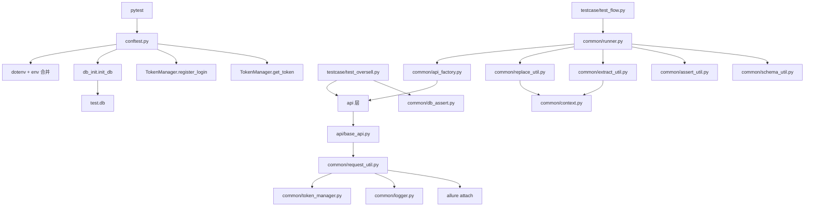
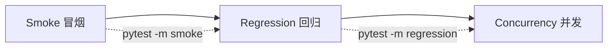

# APIAuto - 电商接口自动化测试框架

[](https://www.python.org/)
[](https://docs.pytest.org/)
[](https://docs.qameta.io/allure/)
[](LICENSE)

> 基于 **pytest + requests + allure + YAML + SQLite** 的企业级 API 自动化测试框架，以电商业务为场景，覆盖数据驱动流程测试、并发防超卖验证、数据库状态断言。

---

## 核心特性

- ✅ **YAML 数据驱动**：业务链步骤通过 YAML 定义，与代码解耦
- ✅ **统一请求层**：自动 Token 注入、重试退避、日志掩码、Allure 附件
- ✅ **多环境配置**：dotenv + env 分层，一套代码切换 dev/test/prod
- ✅ **数据库断言**：SQLite 自动初始化 + 后置状态校验（库存/订单）
- ✅ **并发测试**：线程池模拟高并发下单，验证库存安全
- ✅ **JSONSchema 契约**：关键接口响应自动校验
- ✅ **分层标记**：smoke / regression / concurrency，CI 分阶段执行
- ✅ **Faker 数据工厂**：避免测试数据冲突，支持随机唯一数据
- ✅ **统一日志**：文件轮转 + 级别控制 + 敏感字段掩码
- ✅ **CI/CD**：GitHub Actions 自动 lint + test + allure 报告

---

## 技术栈

| 组件 | 版本 | 用途 |
|------|------|------|
| Python | 3.9+ | 运行环境 |
| pytest | 7.0+ | 测试框架 |
| requests | 2.28+ | HTTP 客户端 |
| allure-pytest | 2.13+ | 报告生成 |
| PyYAML | 6.0+ | 流程与数据定义 |
| jsonpath-ng | 1.6+ | 响应提取 |
| jsonschema | 4.0+ | 契约校验 |
| Faker | latest | 测试数据工厂 |
| Flask | 3.0+ | 本地 Mock 服务 |
| SQLite | 内置 | 状态初始化与断言 |

---

## 架构概览

### 核心调用链



### 测试分层



---

## 目录结构

```text
APIAuto/
├── api/                    # 业务 API 封装层（资源分类）
│   ├── base_api.py
│   ├── user_api.py
│   ├── product_api.py
│   ├── order_api.py
│   └── pay_api.py
├── common/                 # 公共工具与基础设施
│   ├── request_util.py     # 统一请求入口（重试/日志/掩码）
│   ├── token_manager.py    # Token 缓存与自动登录
│   ├── auth.py             # 默认登录实现
│   ├── runner.py           # YAML 流程执行器
│   ├── api_factory.py      # API 注册与分发
│   ├── context.py          # 跨步骤上下文
│   ├── extract_util.py     # 响应提取（支持 JSONPath）
│   ├── replace_util.py     # ${var} 变量替换
│   ├── assert_util.py      # 子集断言
│   ├── schema_util.py      # JSONSchema 校验
│   ├── soft_assert.py      # 软断言收集器
│   ├── factory.py          # Faker 数据工厂
│   ├── logger.py           # 统一日志
│   ├── db_init.py          # SQLite 建表
│   ├── db_util.py          # 数据库查询
│   ├── db_assert.py        # 数据库断言
│   └── yaml_util.py        # YAML 加载
├── config/                 # 配置管理
│   ├── config.yaml         # 公共默认配置
│   ├── config_util.py      # 配置读取 + env 合并
│   ├── env/                # 环境覆盖配置
│   │   ├── dev.yaml
│   │   ├── test.yaml
│   │   └── prod.yaml
│   └── schemas/            # JSONSchema 定义
│       ├── login.json
│       ├── order_create.json
│       └── pay.json
├── data/                   # YAML 数据驱动用例
│   └── flow.yaml
├── testcase/               # 测试用例
│   ├── test_flow.py        # YAML 流程测试
│   └── test_oversell.py    # 并发超卖测试
├── mocks/                  # Mock 服务（资源路由拆分）
│   ├── server.py
│   └── routes/
│       ├── users.py
│       ├── products.py
│       ├── orders.py
│       └── pay.py
├── SKILL/                  # Agent 技能（自动化执行指引）
├── prompt/                 # Agent 提示词
├── docs/                   # 项目文档
├── conftest.py             # pytest 会话级初始化
├── pytest.ini              # pytest 配置
├── pyproject.toml          # 项目元数据 + 工具配置
├── requirements.txt        # 运行时依赖
├── requirements-dev.txt    # 开发工具依赖
├── Makefile                # 一键命令
├── .env.example            # 环境变量示例
├── .gitignore              # Git 忽略规则
└── SUGGESTIONS.md          # 优化建议清单
```

---

## 快速开始

### 1. 环境准备

```bash
# 克隆仓库
git clone <your-repo-url> && cd APIAuto

# 创建虚拟环境
python3 -m venv .venv && source .venv/bin/activate

# 安装依赖
make install   # 或: pip install -e ".[dev]"
```

### 2. 运行测试

```bash
# 全量测试
make test       # 等价于: pytest

# 仅冒烟测试
make test-smoke # 等价于: pytest -m smoke

# 查看 Allure 报告
make allure     # 等价于: pytest && allure serve report
```

### 3. 独立启动 Mock 服务（调试用）

```bash
make mock       # 等价于: python3 -m mock_server
```

> 默认监听 `http://127.0.0.1:5000`，可通过 `API_BASE_URL` 环境变量覆盖。

---

## 环境切换

| 方式 | 说明 | 示例 |
|------|------|------|
| `.env` 文件 | 复制 `.env.example` 为 `.env`，修改后自动加载 | `API_ENV=test` |
| 环境变量 | 直接导出，优先级最高 | `export API_ENV=prod` |
| config/env/*.yaml | 环境专属覆盖 | `config/env/test.yaml` |

优先级：环境变量 > env/<env>.yaml > config.yaml

---

## 编写新用例

### YAML 数据驱动（推荐业务流程）

在 `data/flow.yaml` 追加：

```yaml
cases:
  - name: my_new_flow
    steps:
      - api: user.login
        data:
          username: ${fake.username}
          password: Test@123
        no_token: true
        extract:
          token: token
```

### Python 代码编排（推荐并发/复杂场景）

```python
import pytest
import allure
from api.product_api import ProductApi
from common.factory import fake_product

@allure.epic("电商接口自动化")
@allure.feature("商品管理")
@allure.severity(allure.severity_level.NORMAL)
class TestProduct:
    @allure.story("新增商品")
    def test_add_product(self):
        product = fake_product()
        api = ProductApi()
        resp = api.add_product(**product)
        assert "id" in resp
```

详见 [SKILL/case-authoring.md](SKILL/case-authoring.md)。

---

## Allure 报告

### 生成报告

```bash
# 步骤1：运行测试（生成 report/ 目录）
pytest

# 步骤2：查看 HTML 报告（需安装 allure CLI）
allure serve report
```

### 安装 Allure CLI

```bash
# macOS
brew install allure

# Ubuntu/Debian
sudo apt-get install allure

# 验证
allure --version
```

---

## 测试标记（Markers）

| Marker | 用途 | 示例命令 |
|--------|------|----------|
| `@pytest.mark.smoke` | 冒烟测试 | `pytest -m smoke` |
| `@pytest.mark.regression` | 回归测试 | `pytest -m regression` |
| `@pytest.mark.concurrency` | 并发测试 | `pytest -m concurrency` |
| `@pytest.mark.integration` | 集成测试 | `pytest -m integration` |

---

## 常见问题

| 现象 | 排查 |
|------|------|
| `Connection refused` | Mock 未启动或 `base.url` 错误 |
| `401/403` | 检查 `no_token` 设置与 Bearer 格式 |
| `Address already in use` | 5000 端口被占用，改 `API_BASE_URL` |
| `${var}` 报错 | 上一步是否 `extract` 了对应变量 |
| `allure: command not found` | 未安装 Allure CLI，macOS: `brew install allure` |

---

## CI/CD

本项目使用 GitHub Actions 自动运行 CI：

- **PR 阶段**：lint + smoke 测试
- **Merge 阶段**：lint + 全量回归 + allure 报告上传

状态徽章可在仓库首页查看。

---

## 相关文档

- 📖 [项目说明与用例编写指南](docs/项目说明与用例编写指南.md)
- 🤖 [Agent 提示词](prompt/prompt.md)
- 🧠 [项目总览](prompt/overview.md)
- 🛠️ [SKILL 目录](SKILL/SKILL.md)
- 📋 [优化建议清单](SUGGESTIONS.md)

---

## 许可证

MIT License
