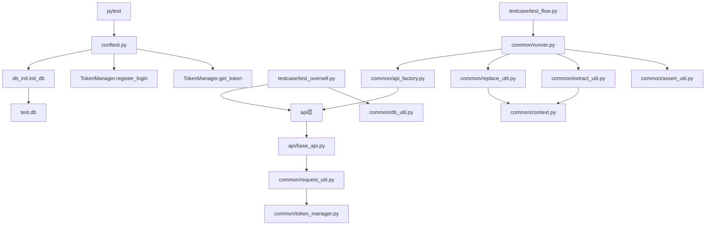

# APIAuto Project Overview

## 项目定位
`APIAuto` 是一个基于 `pytest + requests + allure + yaml + sqlite` 的 **企业级** Python 接口测试项目，目标是验证一个本地运行的电商接口服务。当前项目同时包含两类测试方式：

- YAML 数据驱动流程测试：通过 `data/flow.yaml` 描述业务步骤，再由测试入口执行。
- 代码编排测试：直接在 Python 用例中调用 API 类，覆盖并发、库存等更灵活的场景。

## 目录结构
```text
APIAuto/
├── api/                      # 业务 API 封装层
│   ├── base_api.py
│   ├── user_api.py
│   ├── product_api.py
│   ├── order_api.py
│   └── pay_api.py
├── common/                   # 公共工具与基础设施
│   ├── request_util.py       # 统一请求入口（重试/日志/掩码）
│   ├── token_manager.py      # Token 缓存与自动登录
│   ├── auth.py               # 默认登录实现
│   ├── runner.py             # YAML 流程执行器（增强版）
│   ├── api_factory.py        # API 注册与分发
│   ├── context.py            # 跨步骤上下文
│   ├── extract_util.py       # 响应提取（支持 JSONPath）
│   ├── replace_util.py       # ${var} / ${fake.xxx} 变量替换
│   ├── assert_util.py        # 子集断言
│   ├── schema_util.py        # JSONSchema 校验
│   ├── soft_assert.py        # 软断言收集器
│   ├── factory.py            # Faker 数据工厂
│   ├── logger.py             # 统一日志
│   ├── db_init.py            # SQLite 建表
│   ├── db_util.py            # 数据库查询
│   ├── db_assert.py          # 数据库断言
│   └── yaml_util.py          # YAML 加载
├── config/                   # 配置管理
│   ├── config.yaml           # 公共默认配置
│   ├── config_util.py        # 配置读取 + env 合并
│   ├── env/                  # 环境覆盖配置
│   │   ├── dev.yaml
│   │   ├── test.yaml
│   │   └── prod.yaml
│   └── schemas/              # JSONSchema 定义
│       ├── login.json
│       ├── order_create.json
│       └── pay.json
├── data/                     # YAML 数据驱动用例
│   └── flow.yaml
├── testcase/                 # 测试用例
│   ├── test_flow.py          # YAML 流程测试
│   └── test_oversell.py      # 并发超卖测试
├── mocks/                    # Mock 服务（资源路由拆分）
│   ├── server.py
│   └── routes/
│       ├── users.py
│       ├── products.py
│       ├── orders.py
│       └── pay.py
├── SKILL/                    # Agent 技能
├── prompt/                   # Agent 提示词
├── docs/                     # 项目文档
├── conftest.py               # pytest 会话级初始化
├── pytest.ini                # pytest 配置
├── pyproject.toml            # 项目元数据 + 工具配置
├── requirements.txt          # 运行时依赖
├── requirements-dev.txt      # 开发工具依赖
├── Makefile                  # 一键命令
├── .env.example              # 环境变量示例
├── .gitignore                # Git 忽略规则
└── SUGGESTIONS.md            # 优化建议清单
```

## 模块职责

### `api/`
- `base_api.py`：API 基类，统一拼接 URL，并将请求委托给 `RequestUtil`。
- `user_api.py`：用户注册、登录接口。
- `product_api.py`：商品新增接口。
- `order_api.py`：订单创建接口。
- `pay_api.py`：支付接口。

### `common/`
- `request_util.py`：统一请求入口，持有 `requests.Session`，默认自动注入 token，支持超时/重试，挂接 Allure 附件与日志。
- `token_manager.py`：token 缓存与登录函数注册中心。
- `auth.py`：封装默认登录动作，供 `TokenManager.register_login()` 使用。
- `context.py`：跨步骤共享上下文变量。
- `extract_util.py`：从响应中提取字段并写入 `Context`（支持点号与 JSONPath）。
- `replace_util.py`：将 `${var}` 和 `${fake.xxx}` 替换为上下文值或 Faker 数据。
- `assert_util.py`：递归断言响应结构和值。
- `api_factory.py`：集中实例化各 API 类，供流程执行器调用。
- `runner.py`：流程执行器入口，负责解释 YAML 用例并调度 API，支持 setup/teardown/loop/when/soft_assert/schema。
- `db_init.py` / `db_util.py` / `db_assert.py`：初始化 sqlite 表结构、执行数据库查询与断言。
- `yaml_util.py`：基于项目根目录读取 YAML 文件。
- `logger.py`：统一日志（文件轮转 + 级别控制 + token 掩码）。
- `factory.py`：Faker 数据工厂（唯一用户名/商品）。
- `schema_util.py`：JSONSchema 契约校验。
- `soft_assert.py`：软断言收集器。

### `config/`
- `config.yaml`：存储 base URL、默认用户、超时、重试、日志级别。
- `config_util.py`：配置读取工具类，支持 dotenv + env 合并。
- `env/*.yaml`：环境覆盖配置（dev/test/prod）。
- `schemas/*.json`：JSONSchema 定义。

### `data/`
- `flow.yaml`：数据驱动流程用例定义。

### `testcase/`
- `test_flow.py`：参数化读取 YAML 流程用例。
- `test_oversell.py`：使用线程模拟并发下单，验证库存不超卖。

### `mocks/`
- `server.py`：Flask 应用工厂。
- `routes/*.py`：按资源拆分的路由（users/products/orders/pay）。

## 核心运行链路


## 初始化与运行机制

### 1. `pytest` 启动
`pytest.ini` / `pyproject.toml` 负责基础配置：
- `addopts = -s --alluredir=report --strict-markers --strict-config -ra --tb=short`
- `pythonpath = .`
- `testpaths = testcase`
- markers：smoke / regression / concurrency / integration

### 2. `conftest.py` 会话初始化
在 `pytest_sessionstart()` 中：
- 打印当前环境（`API_ENV` / `base_url`）
- 调用 `init_db()` 自动建表
- 注册默认登录函数到 `TokenManager`
- 在 session 级 fixture 中预先获取 token

这意味着：大多数接口默认不需要手动登录，除非显式设置 `no_token=True`。

### 3. 请求发送
所有标准 API 请求都经由 `RequestUtil.send()` 发出：
- 构建/复用 `requests.Session`
- 若未设置 `no_token=True`，则自动读取 `TokenManager` 中的 token
- 注入 `Authorization` 请求头
- 将请求和响应内容附加到 Allure
- 记录日志（token 掩码）
- 支持超时与重试（指数退避）

### 4. 数据驱动流程
`data/flow.yaml` 通过 `steps` 描述一条完整业务链，例如：
- 登录
- 新增商品
- 下单
- 支付

`runner.py` 根据 `api`、`data`、`extract`、`assert` 字段解释执行整条流程，并支持：
- `setup` / `teardown` 步骤
- `when` 条件跳过
- `loop` 循环展开
- `soft_assert` 软断言
- `schema` JSONSchema 校验
- `${var}` 变量替换
- `${fake.xxx}` Faker 数据

### 5. 并发场景
`test_oversell.py` 直接调用 `ProductApi` 和 `OrderApi`，并结合 sqlite 查询库存，验证：
- 成功下单数不超过库存
- 库存不会小于 0

## 当前工程能力
- ✅ 基础 API 分层结构
- ✅ token 自动登录与自动注入
- ✅ Allure 附件能力
- ✅ YAML 文件加载能力
- ✅ 上下文提取/替换工具
- ✅ sqlite 初始化与数据库断言能力
- ✅ 并发测试入口
- ✅ 多环境配置（dotenv + env 分层）
- ✅ 统一日志（文件轮转 + token 掩码）
- ✅ 请求增强（超时/重试/异常）
- ✅ Runner 增强（setup/teardown/loop/when/soft_assert/schema）
- ✅ JSONPath 提取
- ✅ Faker 数据工厂
- ✅ JSONSchema 契约校验
- ✅ 测试分层（smoke/regression/concurrency）
- ✅ CI/CD（GitHub Actions）
- ✅ Mock 目录化
- ✅ 工程化（pyproject.toml/Makefile/Dockerfile/pre-commit）

## 已知限制与后续优化方向

### 1. sqlite 仅覆盖测试侧状态验证
当前数据库工具主要用于本地 `test.db` 校验，适合轻量接口测试项目；若后续项目接入真实服务或远端数据库，需要重新定义初始化、清理和断言策略。

### 2. 鉴权格式需以服务端为准
`RequestUtil` 默认使用 `Bearer {token}` 注入头部；如果后端接口要求的是裸 token 或其他格式，所有 API 的默认行为都要一起调整，避免出现“部分接口可用、部分接口 403”的情况。

## 建议的阅读顺序
首次接手项目时，推荐按以下顺序阅读：

1. `pytest.ini`
2. `conftest.py`
3. `common/request_util.py`
4. `common/token_manager.py`
5. `api/base_api.py`
6. `api/*.py`
7. `common/context.py` / `extract_util.py` / `replace_util.py`
8. `data/flow.yaml`
9. `testcase/*.py`
10. `common/db_init.py` / `db_util.py` / `db_assert.py`

## 如何扩展一个新接口
以“新增查询订单详情接口”为例，建议步骤如下：

1. 在 `api/` 中新增或扩展对应 API 类方法。
2. 若要参与 YAML 流程执行，将方法注册到 `common/api_factory.py` 与 `common/runner.py` 映射中。
3. 如果流程中需要变量传递，使用 `${var}` 占位并在上一步响应里配置 `extract`。
4. 若需要数据库校验，在 `common/db_assert.py` 增加对应断言或直接编写 SQL 检查。
5. 新增 `pytest` 用例：
   - 简单功能验证可写成直接调用 API 的 Python 测试
   - 标准业务链建议补充到 YAML 流程中

## 推荐运行方式
在项目根目录执行：

```bash
# 全量测试
pytest

# 仅冒烟测试
pytest -m smoke

# 查看 Allure 报告
allure serve report

# 或使用 Makefile
make test
make allure
```

## 对其他 agent 的复现建议
如果要让其他 agent 快速复现该项目，应明确告诉它：
- 这是一个本地电商接口测试项目，不是纯 SDK
- 必须优先实现 token、请求封装、API 分层、YAML 执行器、上下文替换/提取、DB 校验
- 不能只搭目录骨架，必须保证 `pytest` 可执行、Allure 有结果、并发测试可运行
- 项目已具备企业级特性：多环境配置、统一日志、请求重试、Runner 增强、测试分层、CI/CD
- 参考 `SUGGESTIONS.md` 中的任务清单了解完整优化历程